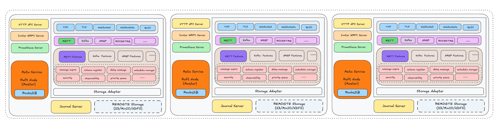
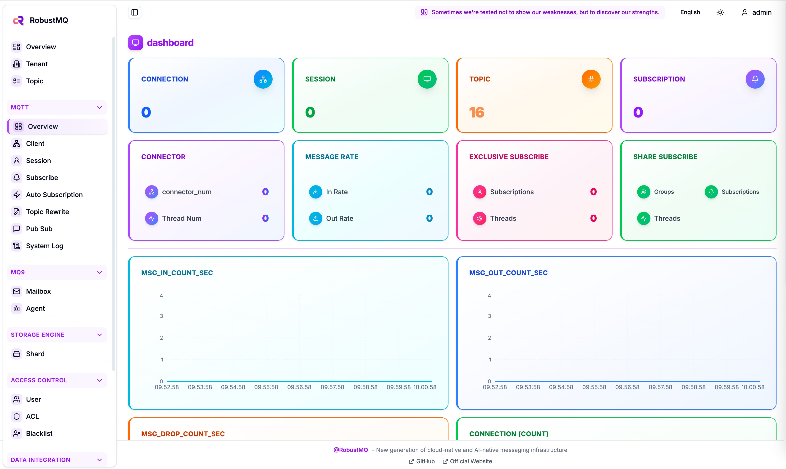
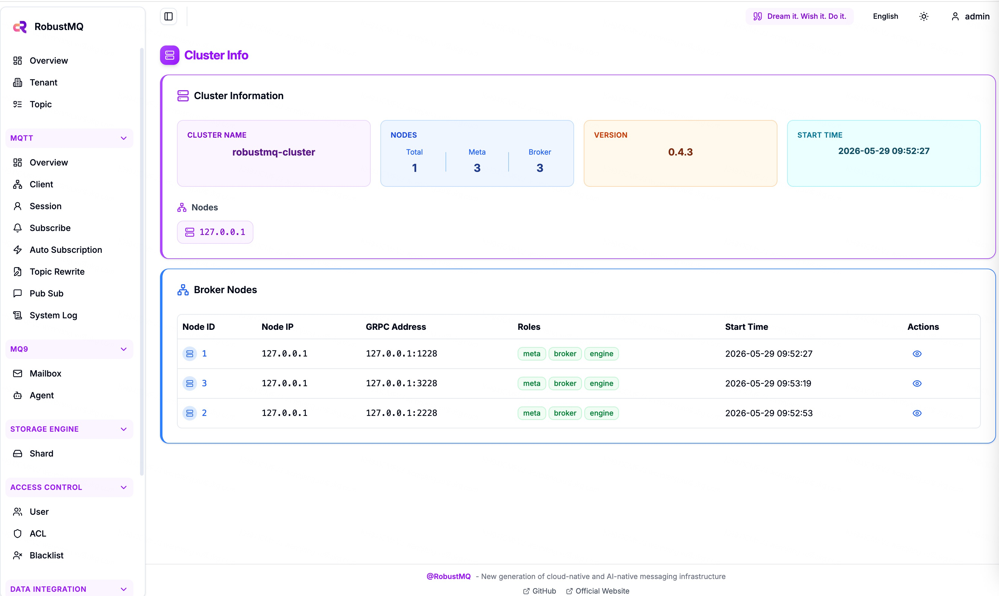

<p align="center">
  <picture>
    
  </picture>
</p>

<p align="center">
  <a href="https://deepwiki.com/robustmq/robustmq"></a>
  <a href="https://zread.ai/robustmq/robustmq" target="_blank"></a>
  
  
  
  
  <a href="https://codecov.io/gh/robustmq/robustmq">
    
  </a>
  
  
</p>

<h3 align="center">
    Communication infrastructure for the AI era — one binary, one broker, one storage layer, any protocol
</h3>

<p align="center">
  <a href="#-what-is-robustmq">What is RobustMQ</a> •
  <a href="#-mq9--agent-mailbox-for-ai">mq9</a> •
  <a href="#-features">Features</a> •
  <a href="#%EF%B8%8F-roadmap">Roadmap</a> •
  <a href="#-quick-start">Quick Start</a> •
  <a href="#-documentation">Documentation</a> •
  <a href="#-contributing">Contributing</a> •
  <a href="#-community">Community</a>
</p>

---

> **⚠️ Development Status**
> RobustMQ is in early development and **not yet production-ready**. MQTT core is stable and continuing to mature. Kafka, NATS, and AMQP are under active development. Production readiness is targeted for 0.4.0.

---

## 🌟 What is RobustMQ

RobustMQ is a unified messaging engine built with Rust. One binary, one broker, no external dependencies — deployable from edge devices to cloud clusters. It natively supports MQTT, Kafka, NATS, AMQP, and **mq9** on a **shared storage layer**: one message written once, consumed by any protocol.



```
MQTT publish  →  RobustMQ unified storage  →  Kafka consume
                                           →  NATS subscribe
                                           →  AMQP consume
                                           →  mq9 Agent mailbox
```

**Five protocols, one system:**

| Protocol | Best for |
|----------|---------|
| **MQTT** | IoT devices, edge sensors |
| **Kafka** | Streaming data pipelines, analytics |
| **NATS** | Ultra-low-latency pub/sub |
| **AMQP** | Enterprise messaging, RabbitMQ migration |
| **mq9** | AI Agent async communication |

## 🤖 mq9 — Communication Infrastructure for Multi-Agent Systems

**mq9** is the infrastructure layer for multi-agent systems, built as RobustMQ's fifth native protocol. It solves the two foundational problems every multi-agent system faces: how Agents find each other, and how they communicate reliably and asynchronously.

Unlike general-purpose registries (etcd, Consul) combined with general-purpose queues (Kafka, NATS), mq9 is designed specifically for Agent communication. It provides an AgentCard data model, capability-based semantic discovery, per-Agent persistent mailboxes, N-to-N Agent topology, and long-task state retention — all in a single broker with shared runtime, storage, network, and cluster coordination.

mq9 natively supports the **A2A (Agent-to-Agent)** protocol via the `mq9.a2a` SDK facade, wrapping the official a2a-sdk so developers can build a fully compliant A2A Agent in 15 lines of code. Native protocol access and forward compatibility with MCP and ANP are also supported.

**Two problems, one broker:**

| Problem | mq9's answer |
|---------|-------------|
| How do Agents find each other? | Built-in registry: `AGENT.REGISTER` + `AGENT.DISCOVER` with full-text and semantic vector search |
| How do Agents communicate reliably? | Persistent mailbox per Agent: messages wait until the recipient comes online, with 3-tier priority (critical / urgent / normal) and FETCH+ACK pull consumption |

**Multiple integration paths:** the `mq9.a2a` SDK facade for A2A-standard Agents; native NATS client for any language; Python / Go / TypeScript / Java / Rust SDKs; `langchain-mq9` toolkit for LangChain and LangGraph; MCP Server for JSON-RPC 2.0 access.

Deploy one RobustMQ instance — mq9 is ready. Designed to scale to millions of Agents.

> 📖 [mq9.robustmq.com](https://mq9.robustmq.com) · [GitHub](https://github.com/robustmq/mq9)

---

## ✨ Features

<div align="center">
  <video src="https://robustmq.com/assets/demo.zRXM786t.mp4" controls width="100%"></video>
</div>

- 🤖 **mq9 — Multi-Agent infrastructure**: Agent registry with full-text and semantic discovery, per-Agent persistent mailbox, 3-tier priority (critical / urgent / normal), FETCH+ACK pull consumption — registry and reliable async messaging in one broker, native A2A protocol support
- 🦀 **Rust-native**: No GC, stable and predictable memory footprint, no periodic spikes — consistent from edge devices to cloud clusters
- 🗄️ **Unified storage layer**: All protocols share one storage engine — data written once, consumed by any protocol, no duplication
- 🔌 **Native multi-protocol**: MQTT 3.1/3.1.1/5.0, Kafka, NATS, AMQP, mq9 — natively implemented, full protocol semantics
- 🏢 **Native multi-tenancy**: Unified across all protocols — full data isolation and independent permission management per tenant
- 🌐 **Edge-to-cloud**: Single binary, zero dependencies, offline buffering with auto-sync — same runtime from edge gateways to cloud clusters
- ⚡ **Ultra-low-latency dispatch**: NATS pure in-memory routing — no disk writes, millisecond to sub-millisecond latency
- 💾 **Multi-mode storage**: Memory / RocksDB / File, per-topic configuration, automatic cold data tiering to S3
- 🔄 **Shared subscription**: Break the "concurrency = partition count" limit — consumers scale elastically at any time
- 🛠️ **Minimal operations**: Single binary, zero external dependencies, built-in Raft consensus, ready out of the box

## 🗺️ Roadmap

```
Phase 1 — MQTT (current)
  MQTT core production-ready, continuously refined to be the best MQTT Broker available
  Architecture and infrastructure hardened in parallel

Phase 2 — NATS + mq9 AI Agent (in progress)
  NATS protocol compatibility + mq9 Agent mailbox with priority & public discovery
  Native Agent async communication layer

Phase 3 — Kafka (in progress)
  Full Kafka protocol compatibility
  Complete the IoT-to-streaming data path, edge-to-cloud data flow

Phase 4 — AMQP (planned)
  Full AMQP protocol compatibility
  Traditional enterprise messaging migration path
```

| Feature | Status |
|---------|--------|
| MQTT 3.x / 5.0 core | ✅ Available |
| Session persistence and recovery | ✅ Available |
| Shared subscription | ✅ Available |
| Authentication and ACL | ✅ Available |
| Grafana + Prometheus monitoring | ✅ Available |
| Web management console | ✅ Available |
| Kafka protocol | 🚧 In development |
| NATS protocol | 🔬 Demo validated, in development |
| AMQP protocol | 🔬 Demo validated, in development |
| mq9 — AI Agent mailbox | 🔬 Demo validated, in development |

## 🏗️ Architecture

RobustMQ has three components with fixed, clean boundaries:

- **Meta Service** — metadata management, Raft-based consensus
- **Broker** — protocol parsing and routing (MQTT / Kafka / NATS / AMQP / mq9)
- **Storage Engine** — unified data storage with pluggable backends

Adding a new protocol means implementing only the Broker parsing layer. Adding a new storage backend means implementing only the Storage Engine interface. The core architecture does not change.

## 🚀 Quick Start

### One-Line Installation

```bash
curl -fsSL https://raw.githubusercontent.com/robustmq/robustmq/main/scripts/install.sh | bash
broker-server start
```

### Multi-Protocol in Action

```bash
# Publish via MQTT
mqttx pub -h localhost -p 1883 -t "robustmq.multi.protocol" -m "Hello RobustMQ!"

# Consume the same message via Kafka
kafka-console-consumer.sh --bootstrap-server localhost:9092 \
  --topic robustmq.multi.protocol --from-beginning

# Consume the same message via NATS
nats sub "robustmq.multi.protocol"
```

### mq9 — Agent Communication in Action

```bash
# Register an Agent with capability description
nats request '$mq9.AI.AGENT.REGISTER' \
  '{"name":"agent.translator","mailbox":"agent.translator","payload":"Multilingual translation; EN/ZH/JA/KO"}'

# Discover Agents by semantic intent
nats request '$mq9.AI.AGENT.DISCOVER' '{"semantic":"translate Chinese to English","limit":5}'

# Create a mailbox (Agent's persistent address)
nats request '$mq9.AI.MAILBOX.CREATE' '{"name":"agent.translator","ttl":3600}'

# Send a message — persists even if recipient is offline
nats request '$mq9.AI.MSG.SEND.agent.translator' \
  --header 'mq9-priority:critical' \
  '{"task":"translate","text":"Hello world","lang":"zh"}'

# FETCH messages in priority order (critical → urgent → normal)
nats request '$mq9.AI.MSG.FETCH.agent.translator' \
  '{"group_name":"workers","deliver":"earliest"}'

# ACK to advance consumer group offset
nats request '$mq9.AI.MSG.ACK.agent.translator' \
  '{"group_name":"workers","mail_address":"agent.translator","msg_id":1}'
```

### Web Dashboard

Access `http://localhost:8080` for cluster monitoring and management.

<div align="center">
  
  
</div>

### Try Online Demo

- **MQTT Server**: `117.72.92.117:1883` (admin/robustmq)
- **Web Dashboard**: http://demo.robustmq.com:8080

📚 **Full installation and usage guide: [Documentation](https://robustmq.com/)**

## 🔧 Development

```bash
git clone https://github.com/robustmq/robustmq.git
cd robustmq
cargo run --package cmd --bin broker-server

make build           # Basic build
make build-full      # With frontend
```

📚 **[Build Guide](https://robustmq.com/QuickGuide/Build-and-Package.html)**

## 📚 Documentation

- **📖 [Official Documentation](https://robustmq.com/)** — Comprehensive guides and API references
- **🤖 [mq9 Overview](https://robustmq.com/en/mq9/Overview.html)** — Design rationale and core concepts
- **⚡ [mq9 Quick Start](https://robustmq.com/en/mq9/QuickStart.html)** — CLI walkthrough in 10 minutes
- **🔌 [mq9 SDK Integration](https://robustmq.com/en/mq9/SDK.html)** — Python, Go, JavaScript, Java, Rust, C#
- **🧩 [mq9 NATS Client Usage](https://robustmq.com/en/mq9/NatsClient.html)** — Use any NATS client directly
- **🔗 [mq9 LangChain Integration](https://robustmq.com/en/mq9/LangChain.html)** — LangChain & LangGraph toolkit
- **🗺️ [mq9 Roadmap](https://robustmq.com/en/mq9/Roadmap.html)** — Semantic routing, intent policy, context awareness
- **🚀 [Quick Start Guide](https://robustmq.com/QuickGuide/Overview.html)** — Get up and running in minutes
- **🔧 [MQTT Documentation](https://robustmq.com/RobustMQ-MQTT/Overview.html)** — MQTT-specific features and configuration
- **💻 [Command Reference](https://robustmq.com/RobustMQ-Command/Mqtt-Broker.html)** — CLI commands and usage
- **🎛️ [Web Console](https://github.com/robustmq/robustmq-copilot)** — Management interface

### mq9 SDK

Install the mq9 SDK for your language:

```bash
# Python
pip install robustmq

# JavaScript / TypeScript
npm install @robustmq/sdk

# Rust
cargo add robustmq

# Go
go get github.com/robustmq/robustmq-sdk/go

# Java (Maven)
# <dependency><groupId>com.robustmq</groupId><artifactId>robustmq</artifactId><version>0.3.5</version></dependency>

# C# (.NET)
dotnet add package RobustMQ
```

Or use any NATS client library directly — no SDK required.

## 🤝 Contributing

We welcome contributions. See our [Contribution Guide](https://robustmq.com/en/ContributionGuide/GitHub-Contribution-Guide.html) and [Good First Issues](https://github.com/robustmq/robustmq/labels/good%20first%20issue).

## 🌐 Community

- **🎮 [Discord](https://discord.gg/sygeGRh5)** — Real-time chat and collaboration
- **🐛 [GitHub Issues](https://github.com/robustmq/robustmq/issues)** — Bug reports and feature requests
- **💡 [GitHub Discussions](https://github.com/robustmq/robustmq/discussions)** — General discussions

### 🇨🇳 Chinese Community

- **微信群**: Join our WeChat group for Chinese-speaking users

  <div align="center">
    
  </div>

- **开发者微信**: If the group QR code has expired, follow our official WeChat account

  <div align="center">
    
  </div>

## License

RobustMQ is licensed under the [Apache License 2.0](LICENSE). See [LICENSING.md](LICENSING.md) for details.

---

<div align="center">
  <sub>Built with ❤️ by the RobustMQ team and <a href="https://github.com/robustmq/robustmq/graphs/contributors">contributors</a>.</sub>
</div>
