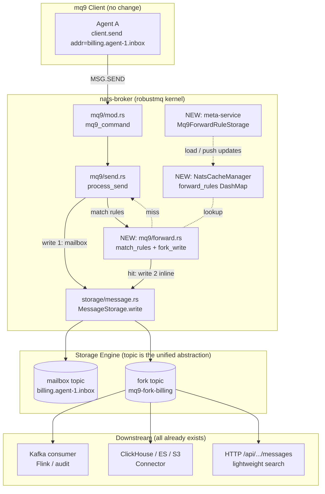

# mq9 Message Fork — Design Doc

> **Background**: route certain agent-to-agent messages, by rule, into a dedicated topic so that downstream systems (Kafka consumers, Flink, security audit, search) can consume or query them.
>
> **Key insight**: RobustMQ already ships a multi-protocol kernel (mq9, MQTT, Kafka, NATS, AMQP) plus a Connector + ETL rule-engine that can forward any topic to 17 external sinks. This feature needs **zero new sink code** — only a thin "fork-write" hook on the mq9 ingestion path.
>
> **Scope**: ~500 lines added to the `robustmq` kernel; **mq9 client SDKs require no changes**.

---

## 1. Requirements

From the original feature request:

> Allow configuring rules so that agent messages matching a given prefix are also written into a dedicated topic.
> - Users can consume that topic directly via the Kafka protocol (Flink / big-data integration, security audit pipelines).
> - Users can also query messages in that topic directly (lightweight search).

Decomposed into three capabilities:

| ID  | Capability | Effort |
|-----|-----------|--------|
| R1  | **Rule matching** — filter by `mail_address` prefix (plus tags / priority / sender) | New |
| R2  | **Fork write** — duplicate matched messages into a configured topic (mailbox copy is untouched) | New |
| R3  | **Downstream consumption / query** — read via Kafka protocol, ingest via Connectors, query via HTTP | **Already exists — zero code** |

R3 is free because every topic in RobustMQ is simultaneously addressable by mq9 `MSG.FETCH`, by Kafka consumers (via `kafka-broker`), and by any of the 17 existing connectors. That multi-protocol property is what makes this feature small.

---

## 2. Current State (the existing Lego bricks)

### 2.1 mq9 write path

Send pipeline:

```
mq9 client.send(addr, payload)
   │
   ▼  NATS request:  $mq9.AI.MSG.SEND.<addr>
nats-broker/src/mq9/mod.rs            mq9_command()  ─ subject dispatch
   │
   ▼
nats-broker/src/mq9/send.rs           process_send() ─ header parse, tag build, AdapterWriteRecord
   │
   ▼
nats-broker/src/storage/message.rs    MessageStorage.write(tenant, mail_address, [record])
   │
   ▼
storage-adapter (persistence)
```

Reference code:

- Dispatch entry: [src/nats-broker/src/mq9/mod.rs](robustmq/src/nats-broker/src/mq9/mod.rs#L24-L37)
- Current write impl: [src/nats-broker/src/mq9/send.rs](robustmq/src/nats-broker/src/mq9/send.rs#L108-L200)
- Storage abstraction: [src/nats-broker/src/storage/message.rs](robustmq/src/nats-broker/src/storage/message.rs#L25-L48)

`process_send()` already does header parsing, tag composition, TTL/delay/key handling, and `AdapterWriteRecord` construction. **This is the natural hook point for fork logic** — the record is fully formed but not yet persisted.

### 2.2 Existing ETL rule engine

[`crates/rule-engine`](robustmq/src/rule-engine/src/lib.rs#L34) provides **payload transform**:

```rust
pub async fn apply_rule_engine(etl_rule: &ETLRule, data: &Bytes) -> Result<Bytes, CommonError>;
```

Operators: `Decode / Extract / Rename / KeepOnly / Set / Delete / Encode` ([src/rule-engine/src/operator/](robustmq/src/rule-engine/src/operator/mod.rs)).

⚠️ **Gap**: this engine handles "how does the payload mutate", not "should we route it / where to". Our feature needs a **routing rule** (prefix matcher + destination topic) — a sibling concern, not a replacement.

### 2.3 Existing Connector layer (downstream consumption infra)

[`src/connector`](robustmq/src/connector/) already moves data from a topic into external systems:

- Generic loop: [src/connector/src/loops.rs](robustmq/src/connector/src/loops.rs#L75-L160) `run_connector_loop()` — `GroupConsumer` reads source topic → `sink.send_batch()` → external system.
- 17 sinks: [src/connector/src/](robustmq/src/connector/src/) `kafka / mqtt_bridge / elasticsearch / clickhouse / postgres / mysql / redis / s3 / webhook / pulsar / rabbitmq / mongodb / cassandra / opentsdb / influxdb / greptimedb / file`.
- Connector metadata: [src/common/metadata-struct/src/connector/mod.rs](robustmq/src/common/metadata-struct/src/connector/mod.rs#L43-L54) `MQTTConnector { topic_name, etl_rule, ... }`.
- Admin API: [src/admin-server/src/cluster/connector.rs](robustmq/src/admin-server/src/cluster/connector.rs#L321) `connector_create()` + `/cluster/connector/create`.

🎯 **Conclusion**: as long as the mq9 fork target is a normal storage topic in RobustMQ, the user can simply create a Connector with `topic_name = mq9-fork-billing` and any of the 17 sinks works **without touching a single line of connector code**.

---

## 3. Design

### 3.1 Architecture



### 3.2 Core data structure

Introduce `Mq9ForwardRule` (separate from `MQTTConnector` and `ETLRule` — it owns **routing only**):

```rust
// src/common/metadata-struct/src/mq9/forward_rule.rs (NEW)

#[derive(Serialize, Deserialize, Default, Clone, Debug, PartialEq)]
pub struct Mq9ForwardRule {
    pub tenant: String,
    pub rule_name: String,                 // unique id within tenant
    pub matcher: Mq9ForwardMatcher,        // selection criteria
    pub target: Mq9ForwardTarget,          // destination
    pub etl_rule: Option<ETLRule>,         // optional: reuse existing ETL for payload transform
    pub enabled: bool,
    pub create_time: u64,
    pub update_time: u64,
}

#[derive(Serialize, Deserialize, Default, Clone, Debug, PartialEq)]
pub struct Mq9ForwardMatcher {
    /// mail_address prefixes, e.g. ["billing.", "audit."]; empty = no filter.
    pub mail_address_prefixes: Vec<String>,
    /// Any-of tag match; empty = no filter.
    pub any_tags: Vec<String>,
    /// Priority allow-list; empty = no filter.
    pub priorities: Vec<Priority>,
    /// Optional sender prefix (from reply_to / header).
    pub sender_prefixes: Vec<String>,
}

#[derive(Serialize, Deserialize, Default, Clone, Debug, PartialEq)]
pub struct Mq9ForwardTarget {
    /// Destination topic name in the same storage adapter.
    pub topic_name: String,
    /// Preserve original mq9 headers in the forked record.
    pub keep_headers: bool,
    /// What to do if the fork write fails.
    pub on_failure: ForkFailureStrategy,
}

#[derive(Serialize, Deserialize, Default, Clone, Debug, PartialEq)]
pub enum ForkFailureStrategy {
    /// Default: log + bump metric, return success to client. The mailbox write
    /// already succeeded, so the sender is told success; downstream observers
    /// detect loss via `mq9_forward_write_failure_total`.
    #[default]
    DropAndLog,
    /// Return an error to the client. NOTE: the mailbox write has already
    /// committed, so on retry the client will write a duplicate message
    /// to the mailbox. Use only when you understand this trade-off.
    FailSend,
}
```

> ✅ Why not reuse `MQTTConnector`: `MQTTConnector` models "topic → external"; this rule models "mq9 ingestion → internal topic". They are orthogonal — collapsing them muddles admin UX and permission scopes.

### 3.3 Code change checklist

By file, with ➕ new / ✏️ modify / ⬆️ route registration.

| Path | Change | Notes |
|------|--------|------|
| `src/common/metadata-struct/src/mq9/forward_rule.rs` | ➕ | Data types from §3.2 |
| `src/nats-broker/src/mq9/forward.rs` | ➕ | `match_rules()`, `fork_write()` |
| `src/nats-broker/src/core/cache.rs` | ✏️ | Add `forward_rules: DashMap<tenant, Vec<Mq9ForwardRule>>`, mirroring the existing mail/tenant caches |
| `src/nats-broker/src/mq9/send.rs` | ✏️ | `process_send()` calls `fork_write()` after the mailbox write succeeds (see §3.4) |
| `src/nats-broker/src/mq9/mod.rs` | ✏️ | `pub mod forward;` |
| `src/meta-service/src/storage/mq9/forward_rule.rs` | ➕ | RocksDB CRUD, copy [`mqtt/connector.rs`](robustmq/src/meta-service/src/storage/mqtt/connector.rs#L30-L80) pattern |
| `src/admin-server/src/cluster/mq9_forward.rs` | ➕ | HTTP handlers: list / create / update / delete / detail |
| `src/admin-server/src/server.rs` | ⬆️ | Register 5 routes |
| `src/admin-server/src/path.rs` | ✏️ | 5 path constants |
| `src/admin-server/src/client.rs` | ✏️ | Client methods for `robust-ctl` |
| `src/cli-command/src/...` | ✏️ | `robust-ctl mq9 forward-rule {create,list,...}` subcommands |
| `src/nats-broker/src/handler/...` | ✏️ | Load rules at startup, subscribe to meta change events for cache refresh |
| `src/common/metadata-struct/src/mq9/mod.rs` | ✏️ | `pub mod forward_rule;` |

**Estimated size**: ~500 lines of Rust (most of which is admin/meta CRUD boilerplate).

### 3.4 `process_send()` change (the core patch)

[Current tail of `process_send`](robustmq/src/nats-broker/src/mq9/send.rs#L188-L200):

```rust
    let offsets = MessageStorage::new(ctx.storage_driver_manager.clone())
        .write(&tenant, mail_address, vec![record])
        .await?;

    let offset = offsets.into_iter().next().ok_or_else(|| { ... })?;
    Ok(MsgSendReply { error: String::new(), msg_id: offset as i64 })
}
```

After the change — **direct inline fork write, no channels, no background workers**:

```rust
    let storage = MessageStorage::new(ctx.storage_driver_manager.clone());

    let offsets = storage
        .write(&tenant, mail_address, vec![record.clone()])  // clone for fork reuse
        .await?;

    let offset = offsets.into_iter().next().ok_or_else(|| { ... })?;

    // === NEW: fork write ===
    // The mailbox write has already succeeded. Fork is a second write to a
    // normal storage topic; storage performance is sufficient that an inline
    // write is fine here.
    if let Some(rules) = ctx.cache_manager.match_forward_rules(
        &tenant, mail_address, &mq9_headers, &priority,
    ) {
        crate::mq9::forward::fork_write(
            &storage,
            &tenant,
            mail_address,
            offset,
            &record,
            &rules,
        )
        .await?;   // error policy honoured inside fork_write (see §3.5)
    }

    Ok(MsgSendReply { error: String::new(), msg_id: offset as i64 })
}
```

🔑 **Design points**:

1. **No async channel, no worker pool**. The fork is just a second `MessageStorage.write()` call against another topic — the same code path the mailbox write uses. Storage throughput is the same on both ends, and the added complexity of a channel/worker layer (back-pressure, drop accounting, lifecycle, shutdown) is not justified by any measured pain.
2. **Mailbox write always commits first**. Fork failure cannot poison the mailbox.
3. **`match_forward_rules` is an in-memory O(rules × prefixes) scan**. For rule counts < 100 (typical) the overhead is sub-microsecond; for larger fleets a trie or Aho-Corasick index can be swapped in transparently.
4. **Latency cost is real but bounded**: a fork-matched send pays one extra storage write. This is an intentional trade-off — see §4.

### 3.5 `forward.rs` (compact)

New file `src/nats-broker/src/mq9/forward.rs`:

```rust
use crate::core::error::NatsBrokerError;
use crate::storage::message::MessageStorage;
use metadata_struct::adapter::adapter_record::AdapterWriteRecord;
use metadata_struct::mq9::forward_rule::{ForkFailureStrategy, Mq9ForwardRule};
use rule_engine::apply_rule_engine;
use tracing::warn;

pub async fn fork_write(
    storage: &MessageStorage,
    tenant: &str,
    source_addr: &str,
    source_offset: u64,
    record: &AdapterWriteRecord,
    rules: &[Mq9ForwardRule],
) -> Result<(), NatsBrokerError> {
    for rule in rules {
        match fork_one(storage, tenant, source_addr, source_offset, record, rule).await {
            Ok(()) => record_fork_success(&rule.rule_name),
            Err(e) => {
                record_fork_failure(&rule.rule_name, &e);
                warn!(
                    "mq9 fork rule={} from={} -> {}: {}",
                    rule.rule_name, source_addr, rule.target.topic_name, e
                );
                if matches!(rule.target.on_failure, ForkFailureStrategy::FailSend) {
                    return Err(e);
                }
                // DropAndLog: continue with the next rule.
            }
        }
    }
    Ok(())
}

async fn fork_one(
    storage: &MessageStorage,
    tenant: &str,
    source_addr: &str,
    source_offset: u64,
    record: &AdapterWriteRecord,
    rule: &Mq9ForwardRule,
) -> Result<(), NatsBrokerError> {
    // 1) Optional payload transform.
    let payload = if let Some(etl) = &rule.etl_rule {
        apply_rule_engine(etl, &record.payload).await?
    } else {
        record.payload.clone()
    };

    // 2) Provenance tags so downstream consumers can trace back to the mailbox.
    let mut forked = record.clone();
    forked.payload = payload;
    forked.tags.push(format!("mq9-source/{}", source_addr));
    forked.tags.push(format!("mq9-source-offset/{}", source_offset));
    if !rule.target.keep_headers {
        if let Some(pd) = &mut forked.protocol_data {
            if let Some(mq9) = &mut pd.mq9 {
                mq9.header = None;
            }
        }
    }

    // 3) Write to the fork topic — same MessageStorage as the mailbox write.
    storage
        .write(tenant, &rule.target.topic_name, vec![forked])
        .await?;
    Ok(())
}
```

### 3.6 Admin API

Mirrors the connector API exactly:

```
POST   /mq9/forward-rule/create     -> create
POST   /mq9/forward-rule/update     -> update (incl. enable/disable)
POST   /mq9/forward-rule/delete     -> delete
GET    /mq9/forward-rule/list       -> list
GET    /mq9/forward-rule/detail     -> detail
```

Request example:

```jsonc
POST /mq9/forward-rule/create
{
  "tenant": "default",
  "rule_name": "billing-to-clickhouse",
  "matcher": {
    "mail_address_prefixes": ["billing."],
    "any_tags": ["audit"],
    "priorities": []
  },
  "target": {
    "topic_name": "mq9-fork-billing",
    "keep_headers": true,
    "on_failure": "DropAndLog"
  },
  "etl_rule": null,
  "enabled": true
}
```

`robust-ctl` subcommands:

```bash
robust-ctl mq9 forward-rule create --rule-name billing-to-clickhouse \
    --prefix billing. --tag audit --target mq9-fork-billing
robust-ctl mq9 forward-rule list
robust-ctl mq9 forward-rule disable billing-to-clickhouse
```

### 3.7 Downstream consumption (R3 — zero code)

**A. Consume via the Kafka protocol** (most common — Flink, Spark, audit)

```bash
# RobustMQ's kafka-broker exposes every storage topic as a Kafka topic.
# Once the fork write commits, any Kafka client can read it.
kafka-console-consumer --bootstrap-server localhost:9092 \
    --topic default-mq9-fork-billing --from-beginning
```

> Topic-name convention `<tenant>-<fork-topic-name>` avoids cross-tenant leaks; this is the kafka-broker's existing routing rule.

**B. Bridge to other systems via Connector** (configure once, sync forever)

```bash
robust-ctl connector create --connector-name fork-to-clickhouse \
    --connector-type ClickHouse \
    --topic-name mq9-fork-billing \
    --config '{"url":"http://ch:8123","table":"agent_messages"}'
```

→ this hooks into the existing [17 sinks](robustmq/src/connector/src/manager.rs#L20-L30).

**C. HTTP query** (lightweight search)

Use the existing `MSG.QUERY.<topic>` (or a thin `GET /topics/{name}/messages?key=&since=&limit=` wrapper on `process_query`).

---

## 4. What we deliberately do NOT do

| Anti-pattern | Why we avoid it |
|--------------|-----------------|
| Add an async channel + worker pool between `process_send` and the fork write | Both writes hit the same storage layer with the same performance profile. A channel only adds back-pressure, drop accounting, lifecycle, and shutdown complexity, with no measured gain. **Drop it.** |
| Reuse `MQTTConnector` to model mq9 routing rules | Different semantics (ingestion routing vs egress sync). Conflating them muddies admin UX and permission scopes. |
| Put fork logic in mq9 client SDKs | Clients are untrusted; configuration would be scattered; rule changes would require redeploys. |
| Cold-mirror every mq9 mailbox | Storage waste — the requirement is explicitly "by configured prefix". |
| Hand-roll a ClickHouse / Kafka writer in nats-broker | 17 sinks already exist in the connector layer — pure reinvention. |
| Extend `apply_rule_engine` to do routing | Single responsibility: transform and route must stay decoupled. |

---

## 5. Compatibility / observability / testing

### Compatibility

- Existing clients and mailbox behaviour are **unchanged**. With an empty rule set, `match_forward_rules` returns `None` immediately; the hot path adds one DashMap lookup, no allocations.
- Deployments with the feature unused write nothing new to meta-service RocksDB — upgrades and rollbacks are clean.

### Observability (required for ship)

- `mq9_forward_match_total{rule,tenant}` — rule-match count.
- `mq9_forward_write_success_total{rule}` — fork writes committed.
- `mq9_forward_write_failure_total{rule,reason}` — fork writes failed (this is the SRE alert).
- `mq9_forward_write_duration_seconds{rule}` (histogram) — fork write latency; if this grows, the storage layer is the bottleneck, not mq9.
- `mq9_send_duration_seconds{forked}` — labelled by whether the send triggered a fork; tells you the latency tax of forking.

### Tests

| Layer | Cases |
|-------|-------|
| Unit | `Mq9ForwardMatcher` per-dimension combinations; ETL + routing composed |
| Integration | `tests/mq9_forward.rs`: define rule → send matching → fetch from both mailbox and fork topic |
| Integration | Non-matching send leaves the fork topic untouched |
| Integration | Fork-write failure with `DropAndLog` returns success to client; with `FailSend` returns error |
| E2E | A Kafka client successfully consumes from the fork topic (validates R3-A) |
| E2E | A ClickHouse Connector pointed at the fork topic lands rows in ClickHouse (validates R3-B) |
| Perf | With 1000 always-miss rules, `process_send` p99 regresses < 5% |
| Perf | With 1 always-hit rule, `process_send` p99 regresses < ~1× (one extra storage write) — sanity check |

---

## 6. Rollout (recommended PR split)

| PR | Content | Risk | Lines |
|----|---------|------|-------|
| 1  | `Mq9ForwardRule` types + meta-service RocksDB CRUD + cache | Low | ~200 |
| 2  | `process_send` integration + `forward.rs` + metrics | Medium (hot path) | ~150 |
| 3  | Admin HTTP API + `robust-ctl` subcommands | Low | ~150 |
| 4  | Integration + E2E tests + user-facing docs | Low | ~200 |

Order matters: PR 1 is the foundation; PR 2 is the runtime behaviour; PR 3 and PR 4 can land in parallel.

---

## 7. How an mq9 client uses this (SDK unchanged — operator guide only)

Agent code is untouched:

```java
// Agent A — sender is unaware of any fork
client.send("billing.agent-1.inbox", payload, SendOptions.builder()
    .tags(List.of("audit", "invoice"))
    .priority(Priority.URGENT)
    .build());
```

One-time admin setup:

```bash
# 1) Define the fork rule: messages with prefix billing.* AND tag audit
#    are duplicated into the topic mq9-fork-billing.
robust-ctl mq9 forward-rule create --rule-name audit \
    --prefix billing. --tag audit --target mq9-fork-billing

# 2) Persist that topic to ClickHouse for long-term retention.
robust-ctl connector create --connector-name audit-ch \
    --connector-type ClickHouse --topic-name mq9-fork-billing \
    --config '{"url":"http://ch:8123","table":"agent_messages"}'

# 3) Flink reads it as a normal Kafka topic via RobustMQ's kafka-broker.
flink-sql> CREATE TABLE audit_stream (...) WITH (
  'connector' = 'kafka',
  'topic'     = 'default-mq9-fork-billing',
  'properties.bootstrap.servers' = 'robustmq:9092',
  ...
);
```

> **The leverage in this design comes from RobustMQ's existing multi-protocol kernel**: all the "how do downstream systems consume this" questions are answered by code that already exists; mq9 only adds a thin "write to a second topic" switch on the ingestion side.

---

## 8. TL;DR

- Add an **mq9 ingestion routing rule** (prefix + tags + priority → destination topic).
- After the mailbox write succeeds, `process_send` performs an **inline second write** to the fork topic — no channels, no workers.
- The fork topic is a normal storage topic, so it is **automatically consumable by RobustMQ's existing Kafka protocol layer and 17 connectors**.
- mq9 client SDKs: **zero changes**.
- Kernel additions: ~500 lines of Rust, shipped across 4 PRs.
