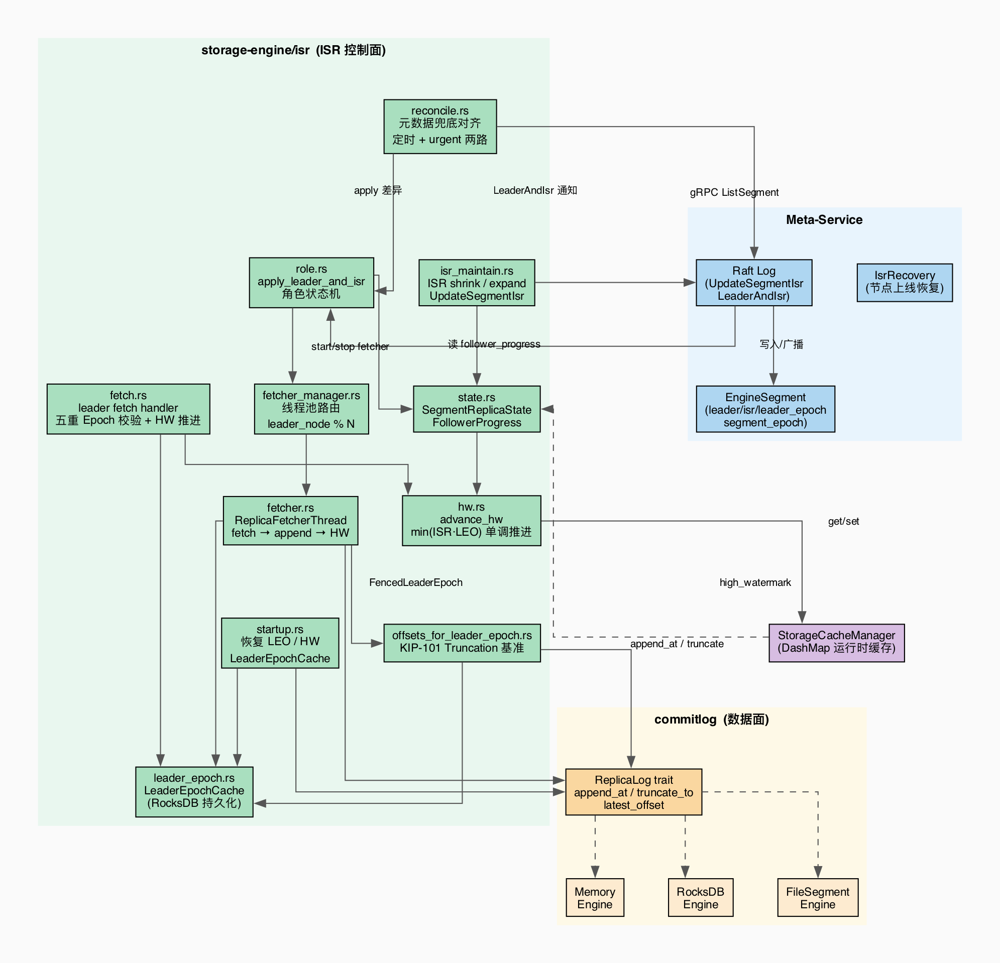
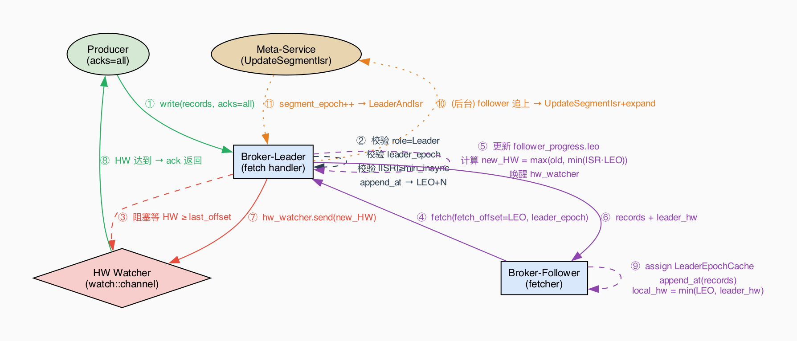
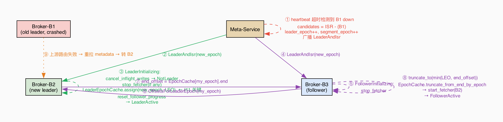
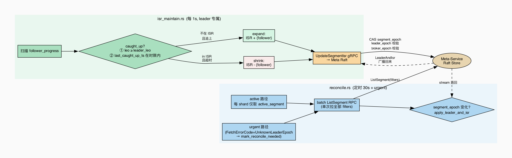

# Storage Engine ISR 概览

> **一句话**：给 storage-engine 的三种引擎（memory / rocksdb / filesegment）加一套副本同步协议，让已 ack 的数据在节点故障时不丢失，故障切换在秒级完成。协议形态对齐 Kafka KIP-101+ 稳定版本。

---

## 1. 核心模块



| 模块 | 职责 |
|---|---|
| `role.rs` | 角色状态机：接收 LeaderAndIsr 通知，驱动本节点在 Leader / Follower / Initializing 之间切换 |
| `state.rs` | 运行时状态：`SegmentReplicaState`（角色、epoch）、`FollowerProgress`（LEO、追上时间戳） |
| `fetch.rs` | Leader 端 fetch handler：五重 epoch 校验 + 更新 follower_progress + 推进 HW |
| `fetcher.rs` | Follower 端拉取线程：按 leader 批量 fetch → append → 更新 local HW |
| `fetcher_manager.rs` | 线程池管理：`leader_node % N` 路由，负责 start / stop fetcher |
| `leader_epoch.rs` | `LeaderEpochCache`：`epoch → start_offset` 映射，持久化到 RocksDB，truncation 的基准 |
| `offsets_for_leader_epoch.rs` | KIP-101 truncation RPC 处理端：返回某 epoch 在本地的 end_offset |
| `hw.rs` | HW 推进：`min(ISR·LEO)` 取最小，强制单调 `max(old, new)` |
| `isr_maintain.rs` | ISR 维护后台任务：每秒扫 follower_progress，shrink 超时副本，expand 追上副本 |
| `reconcile.rs` | 元数据兜底：定时 + urgent 两路，批量拉 meta 对比 segment_epoch，补齐本地遗漏的 LeaderAndIsr |
| `startup.rs` | 启动恢复：扫描真实 LEO、修正 HW checkpoint、修剪 LeaderEpochCache |
| `log.rs` | `ReplicaLog` trait：三引擎共享的本地存储抽象（append / truncate / latest_offset） |

---

## 2. 核心设计

### 2.1 三层 Epoch — 防止 Zombie 写入

ISR 协议围绕三个独立的计数器运转，每类请求必须携带对应 epoch，接收方校验：

| Epoch | 递增时机 | 作用 |
|---|---|---|
| `leader_epoch` | leader 切换 | KIP-101 truncation 基准；follower 对齐日志用 |
| `segment_epoch` | ISR / leader / replicas 任一变化 | UpdateSegmentIsr 的 CAS 防止并发覆盖 |
| `broker_epoch` | broker 进程注册 | Fence 同 node_id 的旧进程残留请求 |

### 2.2 High Watermark — 定义"已提交"

```
HW = max(old_HW,  min(LEO  for each node in ISR))
```

- `offset < HW` 的数据**永不丢失**，`acks=all` 写入阻塞等 HW 越过 `last_offset`
- HW 推进**只发生在 fetch handler**，写入路径只更新 LEO
- HW 计算**只计入 `last_known_leader_epoch == current_leader_epoch` 的 follower**，防止旧 follower 拉低 HW
- **单调性**：外套 `max(old, new)`，扩 ISR 时新成员 LEO 低也不会让 HW 倒退

### 2.3 KIP-101 Truncation — 日志对齐

**禁止用本地 HW 截断**（Kafka 2017 前经典丢数据 bug）。唯一合法路径：

1. Follower 拿本地 LeaderEpochCache 的最新 epoch
2. 向新 leader 请求：`OffsetsForLeaderEpoch(my_epoch)` → 返回 `end_offset`
3. Follower `truncate_to(min(local_LEO, end_offset))`，修剪本地 cache
4. 从 `end_offset` 开始正常 fetch

`LeaderEpochCache` 必须**持久化**（RocksDB），每次 leader 上任前同步写入新 epoch 条目，才转 LeaderActive。

---

## 3. 主要链路

### 3.1 写入 + 副本同步



关键约束：epoch 校验、`append_at`、LEO 更新必须在**同一把锁**内完成，不允许锁中间让出。

### 3.2 Leader 切换



新 leader 上任**必须先持久化 LeaderEpochCache（同步写）才转 LeaderActive**；follower 必须先走 OffsetsForLeaderEpoch 对齐日志，再开始 fetch。

### 3.3 ISR 维护 + Reconcile 兜底



- **isr_maintain**（1s 间隔，仅 leader）：follower 超时 → shrink；追上 `leo ≥ leader_leo` → expand
- **reconcile**（30s 间隔 + urgent 触发）：每 shard 只比对 active segment，批量一次 RPC，segment_epoch 变化才 apply，把遗漏的 LeaderAndIsr 通知补齐

---

## 4. 边界场景

| 场景 | 处理方式 |
|---|---|
| **ISR 缩为空**（所有副本全挂） | segment 标为 `Unavailable`，停止写入；节点上线后 `IsrRecovery` 按 LEO 择优恢复 |
| **Follower 日志比 leader 多**（旧 leader 遗留写） | fetch 返回 `OffsetOutOfRange` → 触发 `OffsetsForLeaderEpoch` + truncate，裁掉多余尾部 |
| **Leader 收到旧 leader_epoch 的 fetch** | 返回 `FencedLeaderEpoch`，follower 触发 truncation 流程 |
| **acks=all 等待超时** | 写入**保留**在 leader 日志，返回 `RequestTimedOut`；数据靠正常 fetch 流程自然消化，不丢失 |
| **LeaderAndIsr 通知丢失** | reconcile 定时兜底：每 30s 批量拉 meta active segment，发现 segment_epoch 变化则补做角色切换 |
| **同一节点进程重启（broker_epoch 变化）** | meta UpdateSegmentIsr 校验 broker_epoch，拒绝旧进程残留的 ISR 变更请求 |
| **扩 ISR 时新成员 LEO 低于 HW** | HW 外套 `max(old, new)` 保证单调，新成员不会拉低已提交水位 |
| **Memory 引擎重启** | LeaderEpochCache 不持久化，等价全新副本；从 leader `log_start_offset` 开始全量重拉 |

---

## 5. 三引擎差异（控制面无感知）

| | Memory | RocksDB | FileSegment |
|---|---|---|---|
| segment 数 | 恒为 1 | 恒为 1 | 写满后递增 |
| LeaderEpochCache | **不持久化**，重启即丢 | RocksDB key 前缀 | sidecar 文件 |
| 重启等价语义 | 全新副本，全量重拉 | EpochCache truncation 对齐 | 同 RocksDB |

协议代码与引擎解耦：ISR 控制面只调 `ReplicaLog` trait，引擎差异封闭在 trait 实现内。

---

## 6. 相关文档

- [isr.md](./isr.md) — 协议精确规格（16 条不变式 + 完整边界场景）
- [isr-roadmap.md](./isr-roadmap.md) — 开发里程碑与 task 拆分
