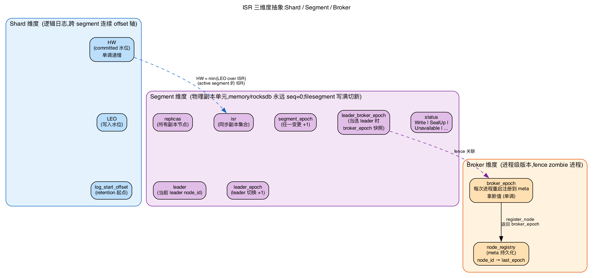
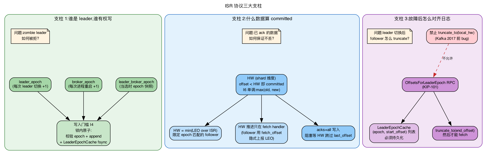
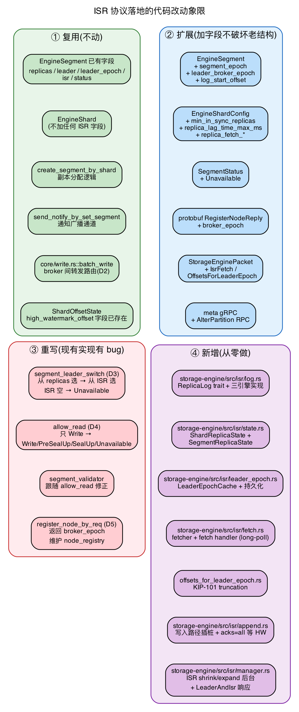
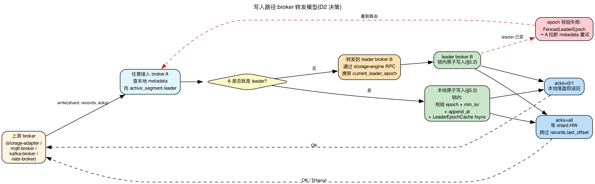

# Storage Engine ISR — 核心设计概览

> 本文是 ISR 协议的**鸟瞰文档**,目标读者:第一次接触本协议、需要理解全局的工程师。
> 详细规格见 [isr.md](./isr.md),任务拆分见 [isr-roadmap.md](./isr-roadmap.md)。
>
> **一句话**:从 Kafka 十余年踩坑后的最终形态中提炼一套稳定 ISR 副本协议,作为 RobustMQ storage-engine 的基线。

---

## 1. 设计目标

实现一套副本同步协议,使 memory / rocksdb / filesegment 三种存储引擎都能提供:

- **故障自动切换**:节点挂了,数据不可用窗口在秒级
- **强一致性可选**:`acks=all` + `min_in_sync_replicas` ≥ 2 → 已 ack 数据不会丢
- **最终一致性默认**:`acks=1` 时性能优先,容忍极少数边缘场景丢数据(用户自选)
- **不破坏现有引擎结构**:三引擎各自的写入路径、retention、segment 切分逻辑保持

---

## 2. 模型抽象(三个核心维度)



| 维度 | 持有 | 说明 |
|---|---|---|
| **Shard** | 逻辑日志 + **HW** + **LEO** + log_start_offset | 一根连续 offset 轴。HW(committed 水位)/LEO(写入水位)在此维度,跨 segment 连续 |
| **Segment** | **副本身份**(leader / isr / replicas / leader_epoch / segment_epoch) | 物理副本单元。memory/rocksdb 永远只有 segment 0;filesegment 写满切新 segment |
| **Broker** | **broker_epoch**(进程级版本) | 每次进程重启注册到 meta 拿新值。用于 fence zombie 进程的残留请求 |

**关键决定**:HW 在 shard 维度(对齐 Kafka partition-level HW + 代码现状 `ShardOffsetState`),副本身份在 segment 维度(对齐 RobustMQ 已有的 `EngineSegment`)。

---

## 3. 协议三大支柱



ISR 协议的所有复杂度都围绕三件事:

### 3.1 谁是 leader,谁有权写?

- **Leader Epoch**:每次 leader 切换 +1,持久化于 meta-service raft
- **Broker Epoch**:每次 broker 进程重启 +1,持久化于 meta-service raft
- **Leader Broker Epoch**:某 segment 当选 leader 时,该 broker 的 broker_epoch 快照,存在 segment 上

**写入门槛**(I4):leader 写入时,在同一 segment 锁内原子完成"校验 epoch + append + 更新 LeaderEpochCache",**禁止中途让出锁**。这是 zombie leader fence 的根本机制。

### 3.2 什么数据是 committed?

- **HW(High Watermark)**:`HW = min(LEO over ISR of active segment)`
- 一条记录 `offset < HW` 即 committed,**永不丢失**(I8)
- **HW 单调**(I6):`new_HW = max(old_HW, min(...))`,扩 ISR 时 HW 不倒退
- **HW 推进只在 fetch handler 中**(I7):follower fetch_offset 隐式上报 LEO,leader 据此推进 HW
- `acks=all` 写入阻塞等待 HW 跨过 records.last_offset

### 3.3 故障后怎么对齐日志?

**唯一允许的截断路径**(I9):`OffsetsForLeaderEpoch` RPC(KIP-101)。

```text
follower 启动/leader 切换/收到 FencedLeaderEpoch 时:
  1. 拿本地 LeaderEpochCache 最新 epoch
  2. 问 leader:"该 epoch 在你这边的 end_offset?"
  3. leader 查自己的 LeaderEpochCache 给答案
  4. follower truncate_to(end_offset),修剪本地 cache
  5. 然后才能 fetch
```

**禁止用本地 HW 做截断**——这是 Kafka 2017 年前的 bug,会丢已 committed 数据。

---

## 4. 关键不变式(协议正确性边界)

| ID | 不变式 | 违反代价 |
|---|---|---|
| I3 | ISR 变更必须经多重 fence:`leader_epoch + broker_epoch + segment_epoch(CAS)` | zombie broker / leader / 并发请求覆盖 |
| I6 | HW 单调递增 | 已读数据"消失" |
| I8 | Committed(`offset < HW`)数据永不丢 | 丢已 ack 数据 |
| I9 | Truncation 必须基于 Leader Epoch,禁止本地 HW | KIP-101 经典丢数据 |
| I11 | Leader 上任必须先 fsync LeaderEpochCache 才转 Active | 上任未完成即崩溃 → 日志分歧 |
| I14 | 不做 unclean leader election:ISR 空 → segment 标 Unavailable | 从滞后副本选 leader → 丢数据 |

完整 16 条不变式见 [isr.md §0](./isr.md#0-协议总纲不变式)。

---

## 5. 与 Kafka 的对应关系

| Kafka | 本协议 | 备注 |
|---|---|---|
| Topic Partition | `EngineShard` | HW / LEO 维度 |
| Log Segment | `EngineSegment` | 副本身份维度 |
| ISR / Leader Epoch | 已存在 | `EngineSegment.isr / leader_epoch` |
| KIP-101 `OffsetsForLeaderEpoch` | 新增 | I9 |
| KIP-380 / 497 broker epoch | 新增 | I2 / I3 |
| KIP-320 partition epoch | `segment_epoch` | 我们 segment 维度 |
| KIP-679 ISR 扩展条件 | `leo >= leader.leo` | I12 |
| KIP-227 incremental fetch | 不实现,字段预留 | 协议外优化 |
| KIP-392 consumer 读 follower | 不实现 | consumer 只读 leader |
| KIP-966 ELR | 不实现 | ISR 空直接 Unavailable |

---

## 6. 与现有代码的关系(改动点速览)



### 6.1 复用(不动)

- `EngineSegment` 现有字段 `replicas / leader / leader_epoch / isr / status`
- `EngineShard` 全部不动(ISR 元数据全在 segment 上)
- `core/segment.rs::create_segment_by_shard` 选副本逻辑(仅初始化时多填几个字段)
- `core/notify.rs::send_notify_by_set_segment` 广播通道
- `core/write.rs::batch_write` 的 broker 间转发路由
- `commitlog::offset::ShardOffsetState` 已含 high_watermark_offset 字段

### 6.2 扩展(加字段不破坏老结构)

| 改动 | 文件 | 内容 |
|---|---|---|
| `EngineSegment` 加字段 | `metadata-struct/src/storage/segment.rs` | `segment_epoch / leader_broker_epoch / log_start_offset` |
| `EngineShardConfig` 加 ISR 配置 | `metadata-struct/src/storage/shard.rs` | `min_in_sync_replicas / replica_lag_time_max_ms / replica_fetch_*` |
| `SegmentStatus` 加状态 | `metadata-struct/src/storage/segment.rs` | `Unavailable`(ISR 空时使用) |
| `RegisterNodeReply` 加字段 | `protocol/src/meta/common.proto` | `broker_epoch` |
| `StorageEnginePacket` 加变体 | `protocol/src/storage/codec.rs` | `IsrFetchReq/Resp` + `OffsetsForLeaderEpochReq/Resp` |
| meta gRPC 新增 RPC | `protocol/src/meta/storage.proto` | `AlterPartition` |

### 6.3 重写(现有实现有 bug)

| 改动 | 文件 | 重写原因 |
|---|---|---|
| `segment_leader_switch` | `meta-service/src/core/leader_switch.rs` | **现有从 replicas 选 leader 是 unclean,会丢数据**。改为从 ISR 选,ISR 空标 Unavailable |
| `EngineSegment::allow_read` | `metadata-struct/src/storage/segment.rs` | **现有只允许 Write,SealUp 后完全不能读**。改为允许 Write/PreSealUp/SealUp/Unavailable |
| `segment_validator` | `storage-engine/src/core/segment.rs` | 跟随 allow_read 修正 |
| `register_node_by_req` | `meta-service/src/core/cluster.rs` | 返回 broker_epoch + 维护 node_registry |

### 6.4 新增模块

```text
storage-engine/src/isr/
├── log.rs           # ReplicaLog trait + 三引擎实现
├── state.rs         # ShardReplicaState + SegmentReplicaState + FollowerProgress
├── leader_epoch.rs  # KIP-101 LeaderEpochCache + 持久化
├── fetch.rs         # follower fetcher + leader fetch handler (long-poll)
├── offsets_for_leader_epoch.rs  # KIP-101 truncation RPC
├── append.rs        # 写入路径 epoch 校验 + acks=all 等 HW
└── manager.rs       # ISR shrink/expand 后台 + LeaderAndIsr 响应
```

---

## 7. 写入路径(broker 转发模型)



本协议的"client"是 broker(主要来自 storage-adapter / mqtt-broker 等),不是面向终端的接口。写入路径采用 **broker 转发**:

```text
storage-adapter ──> 任意 broker (从 metadata 缓存找路由)
                    │
                    ├── 我是 active_segment.leader:走 §5.2 原子写入
                    └── 我不是:转发到 leader broker(通过 storage-engine RPC)
```

**fence 关键**:转发方也用本地 metadata 缓存的 leader_epoch 做请求携带,leader 端校验,过期则拒。等价于 Kafka 的"client 重试"模型,只是重试逻辑跑在 broker 内部。

---

## 8. 数据流概览

### 8.1 写入与复制

```text
producer/上层 broker
       │ write(shard, records, acks=all)
       v
broker A (active_segment.leader,假设是 B):
   route → B
       │
       v
broker B (leader, 锁内原子):
   ├── 校验 epoch + min_isr + role
   ├── ReplicaLog::append_at → 本地落盘
   ├── 若新 epoch 首批:LeaderEpochCache.assign + fsync
   └── shard.local_leo += N

       │  (锁外)
       v
   等 shard.local_hw 跨过 records.last_offset
       │  (HW 推进由 fetch handler 触发,见下)
       v
   ack 给上游

并行: follower C / D 持续 long-poll fetch:
   C → B: fetch(shard, offset=local_leo, epoch=E)
       │
       v
   B (锁内):
     校验 epoch + broker_epoch
     更新 follower_progress[C].leo = req.fetch_offset
     new_hw = min(B.local_leo, min(p.leo for p in ISR with epoch=E))
     B.shard.local_hw = max(B.shard.local_hw, new_hw)
     若推进 → hw_watcher.send(new_hw) 唤醒等 acks=all 的写入
   B → C: records + leader_hw + leader_leo + leader_epoch
   C: append_at + 更新 C.shard.local_hw
```

### 8.2 Leader 切换

```text
heartbeat_check 发现 B1 down
       │
       v
meta-service: segment_leader_switch(failed=B1)
   对每个 leader==B1 的 segment:
     candidates = isr - {B1}
     if candidates empty:
        segment.status = Unavailable    (I14: 不做 unclean)
     else:
        new_leader = candidates.next()
        leader_epoch += 1
        segment_epoch += 1
        leader_broker_epoch = node_registry[new_leader]
        isr -= {B1}
   raft 写 + 广播 SegmentLeaderAndIsr

       │
       v
新 leader broker B2:
   role = LeaderInitializing  (拒写)
   LeaderEpochCache.assign(new_epoch, current_leo) + fsync
   role = LeaderActive

follower B3:
   role = FollowerInitializing  (停 fetcher)
   OffsetsForLeaderEpoch(my_epoch=E) → B2 答 end_offset
   truncate_to(end_offset) + 修剪 LeaderEpochCache + fsync
   start_fetcher(target=B2, fetch_offset=end_offset)
   role = FollowerActive

producer 重试 write → 老路由仍到 B1,B1 epoch 校验失败返回 Fenced
   → broker 拉新 metadata → 转给 B2 → 正常 ack
```

---

## 9. 实施路径

详见 [isr-roadmap.md](./isr-roadmap.md)。关键路径里程碑:

- **M1 元数据就位**:T1 + T2 = `EngineSegment` 扩字段 + raft `UpdateSegmentIsr` op
- **M2 本地存储就位**:T4+T5+T6+T7 = `ReplicaLog` trait + memory/rocksdb 实现 + LeaderEpochCache 持久化
- **M3 副本同步跑通**:M1 + M2 + T3 + T8 + T9 + T13a + T13b
- **M4 协议闭环**:M3 + T10 + T11(全) + T12 + T13c **(到此为止协议完整可用)**
- **M5 故障演练通过**:M4 + T14
- **M6 全引擎接入**:M5 + T15 filesegment

---

## 10. 不实现的事项

| 项 | 备注 |
|---|---|
| Unclean leader election | I14:协议禁用,ISR 空直接 Unavailable |
| Reassign replicas | segment 创建后副本拓扑固定;memory/rocksdb 等价于 shard 创建后固定 |
| Idempotent / Exactly-once producer | 接口层预留 hook (§18.1),实现不做 |
| Tiered Storage / Observer / ELR | KIP-405/392/966,不在范围 |
| Consumer 从 follower 读 | KIP-392,简化协议边界,consumer 只读 leader |
| Incremental Fetch | KIP-227,字段预留(`session_id=0` 表示 full),实现不做 |

完整不实现清单见 [isr.md §16](./isr.md#16-不实现的事项本方案明确划出)。

---

## 11. 相关文档导航

- **[isr.md](./isr.md)** — 详细协议规格(16 条不变式 + 各路径精确流程)
- **[isr-roadmap.md](./isr-roadmap.md)** — 15 个开发 task 拆分 + 原子合并组
- **[diagrams/](./diagrams/)** — 架构图、写入时序、fetch 流程、leader 切换时序

---

## 12. 给实现者的提醒

**最容易写错的 5 个点**(都是 Kafka 早期踩过的坑):

1. **`truncate_to(local_hw)` 是 bug**:一定要走 `OffsetsForLeaderEpoch`。任何"以后再加 epoch"的妥协都是回到 Kafka 2017 前 bug。
2. **HW 一定要 `max(old, new)`**:`min(LEO over ISR)` 不是 final 值,要套一层 max 保证单调。
3. **Leader 上任要 fsync 才能接写**:LeaderInitializing 状态期间所有写都拒。
4. **ISR 扩展条件是 `leo >= leader.leo`,不是 `>= hw`**(KIP-679)。
5. **写入路径的 epoch 校验和 append 必须在同一把锁内**:否则 LeaderAndIsr 通知插进来会让 zombie leader 漏网。
