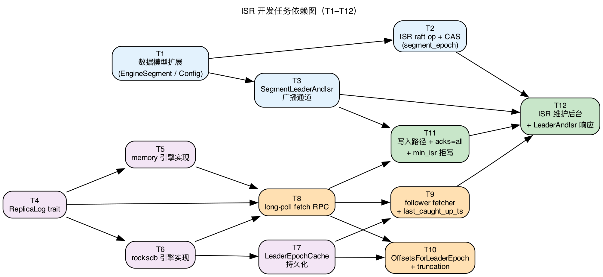

# Storage Engine ISR — 开发任务拆分

> 配套文档:[isr.md](./isr.md)。本文把 ISR 协议拆成**独立可交付的小单元**,每个单元有自己的代码、单测、验收标准,**不依赖后续任务才能上线**。
>
> 原则:
> - 每个 task 是一个 PR 的体量(几百到 ~1500 行代码 + 测试)
> - Task 之间只有"前置依赖",没有"必须一起合"的强耦合
> - **每个 task 合并后,isr.md §0 的 16 条不变式必须全部成立**;不允许"先上 task X 做半截,等 task Y 来补"
> - 若某 task 单独上线会违反不变式,必须等组合 task 一起合(见 §"原子合并组")
>
> ⚠️ Task 编号(T1, T2, ...)是依赖关系排序,不是版本号。多个 task 可并行做。

## 实现进度快照(当前分支)

> 按实际代码盘点。已实现部分与原设计的偏差见各 task 的"实现偏差"小节,关键全局偏差汇总在本节末。

| Task | 状态 | 说明 |
|---|---|---|
| T1 元数据 + broker_epoch | ✅ 完成 | broker_epoch 复用 `ClusterAddNode` op 经响应值返回(非新 `NodeRegistryUpdate` op);存 rocksdb key `clusters/node_epoch/{node_id}` |
| T2 UpdateSegmentIsr + 五重 fence | ✅ 完成 | apply **永不返业务 Err**,结果编码进 `IsrUpdateOutcome` 响应值;fence 拆 server 预检(leader 身份/ISR 合法性)+ raft apply 原子(leader_epoch/broker_epoch/segment_epoch CAS) |
| T0 启动恢复 | ✅ 完成 | `recover_local_segments`：启动时遍历本地 memory/rocksdb segment，持 state_lock 恢复 LeaderEpochCache(截断超过 leo 的虚假 epoch)+ 钳 HW。role 入口由 T13a 的 meta 推 + reconcile 补。通知缓存队列/register 重试仍缺 |
| T3 SegmentLeaderAndIsr 广播 | ✅ 完成 | meta 广播(复用 `send_notify_by_set_segment`)+ broker 端 segment_epoch **及 leader_epoch** 过滤;broker 端 role 状态机已接(T13a `apply_leader_and_isr` 挂在 `parse_segment`) |
| T4 ReplicaLog trait | ✅ 完成 | 持久化契约改为副本冗余 + 后台刷盘(**无 per-write fsync**) |
| T5 memory ReplicaLog | ✅ 完成 | 复用 `ShardState.data`,不另开存储 |
| T6 rocksdb ReplicaLog | ✅ 完成 | record key 统一 `record/{shard}/{seg:010}/{offset:020}`;LEO key 兄弟前缀 `record-leo/...`;无 `set_sync` |
| T7 LeaderEpochCache | ✅ 完成 | **无 `fsync()` 方法**;`end_offset_for -> Option<u64>`(None=latest 由调用方补 LEO) |
| T8a fetch RPC 库逻辑 + 五重 fence | ✅ 完成 | **批量跨 shard**(`Vec<FetchShardReq>`,per-shard error_code);apply 永不返业务 Err;long-poll 暂为 sleep+重收(append 唤醒留 T11) |
| T8b fetch handler 接 router | ✅ 完成 | `handle_fetch` 挂 storage RPC dispatch(`ApiKey::Fetch`),leader 端应答远程 fetch;`command.rs` 组 `FetchEngines` 调用 |
| T9 follower fetcher 库逻辑 | ✅ 完成 | **固定线程池** `ReplicaFetcherThread`(配置 `num_replica_fetchers`,`leader_node % N` 路由,每线程多 segment 按 leader 批量),非 per-segment 任务;`add/remove_segment`、`run` select-loop;broker_epoch/fetch 参数运行时从 broker cache 动态读 |
| T13b′ Fetcher Manager 装配 | ✅ 完成 | `ReplicaFetcherManager`:固定 N 线程,**每线程独立 stop + JoinHandle**(`stop_thread`/`restart_thread`)+ `assign/remove_segment` 路由 + 真实 packet `FetchTransport`(复用 `read_send`);`EngineReplicaLog` 按 shard `storage_type` 动态路由 memory/rocksdb;manager 存装箱 `Arc<dyn FetchTransport/ReplicaLog>`,engine.rs `new` 进 params、lib.rs `start()` spawn |
| T10 OffsetsForLeaderEpoch + truncation | ✅ 完成 | `OffsetsForLeaderEpoch` RPC(`ApiKey` + codec)+ leader handler + follower `truncate_after_fence`(Fenced/OutOfOrder → 查 end_offset → truncate_to + truncate_from_end_by_epoch);resp 携带 `current_leader_epoch`，截断后更新 fetcher state 防死循环。**集成测试未做** |
| T11+T13a 写入闭环 + role 状态机 | ✅ 完成 | HW 推进(`advance_hw`=min(leader LEO, 已知 ISR follower LEO)，无 progress 记录的成员跳过)+ acks(0/1/all)+ role 状态机(`apply_leader_and_isr`：stale 检查扩展为 leader_epoch+segment_epoch 字典序；只在 leader_epoch 真正变化时 reset_follower_progress；失败回滚 role)+ fetcher 随 role 自动 assign/remove。manager 经调用链传参(cache 不存 manager)。**LeaderDemoting 主动唤醒 acks=all 等待者未实现（当前靠超时）** |
| T13c follower truncation 闭环 | ✅ 完成 | fetcher 收到 `FencedLeaderEpoch` 或 `append_at` 返 `OutOfOrder`→ `truncate_after_fence`:发 OffsetsForLeaderEpoch → `truncate_to(end_offset-1)` + `truncate_from_end_by_epoch` + 更新 `current_leader_epoch`;`end_offset_epoch<0` 全量 clear |
| T12 ISR shrink/expand | ✅ 完成 | `isr_maintain.rs` 周期 5s 遍历本节点 LeaderActive segment → `compute_new_isr`(按时间 lag 判定) → `update_segment_isr` grpc 提议。配置 `replica_lag_time_max_ms` (默认 10s) |
| T16 reconcile 兜底 | ✅ 完成 | meta 只读 `ReconcileSegmentMetadata` grpc + `reconcile.rs` 周期 30s 遍历所有 segment 比对 segment_epoch → 拉到更新 → apply_leader_and_isr(幂等) |
| T17 空 ISR 恢复 | ✅ 完成 | `elect_recovery_leader`+`on_node_online` 协调器(节点 register 触发；心跳超时→remove_node→leader_switch 标 Unavailable，节点重启重新 register 触发 on_node_online)；per-segment async mutex 防并发双选举；`QueryReplicaLeo` grpc 反向调用查 LEO；SetSegment 恢复 Write。集成测试未做 |

**已实现部分的全局偏差**(三文档凡描述这些处均按此为准):
1. **无 per-write fsync**:append/truncate/clear、LeaderEpochCache.assign 都不 fsync;持久性靠副本冗余 + 引擎后台刷盘。`LeaderEpochCache` 无 `fsync()` 方法。
2. **命名**:gRPC/raft op 是 `UpdateSegmentIsr`(`StorageDataType::StorageEngineUpdateSegmentIsr`),**不是**原设计的 `AlterPartition` / `EngineDataType`。
3. **broker_epoch**:`NodeStorage::{next,get}_broker_epoch`(rocksdb key),**无** 内存 `NodeRegistry` HashMap / `NodeRegistryUpdate` op。
4. **fetch 批量 + 线程池**:`FetchReqBody{...,shards:Vec<FetchShardReq>}` / `FetchRespBody{shards}`,per-shard error_code;fetcher 是固定 `ReplicaFetcherThread` 池。
5. **isr/ 实际模块**:`fetch.rs, fetcher.rs, fetcher_manager.rs, hw.rs, isr_maintain.rs, isr_recovery.rs, leader_epoch.rs, log.rs, offsets_for_leader_epoch.rs, reconcile.rs, role.rs, startup.rs, state.rs`(全部已存在)。
6. **state.rs 结构**:`SegmentReplicaState` 用 `RwLock<role>` + `AtomicU32` epochs + `state_lock`(tokio `AsyncMutex`,串行化 role 转换)+ `committable_hw`(无 progress 记录的 ISR 成员跳过,不约束 HW)/`reset_follower_progress`,**无** `isr_cache`;HW 推进经 `hw.rs::advance_hw`(已生效),`hw_watchers` 由 acks=all 的 `wait_for_hw` 订阅。stale 检查扩展为 `(leader_epoch,segment_epoch)` 字典序；只在 `leader_epoch_changed` 时 reset follower progress。
7. **fence 3 弱化**:UpdateSegmentIsr 只校验 `req.broker_epoch == node_registry[node]`,未校验 `leader_broker_epoch == segment.leader_broker_epoch`(需 proto 加字段,留后续)。

## 原子合并组

下列 task 集合**必须一次合并**,因为单独合任一会破坏不变式:

| 原子组 | 包含 task | 一起合的理由 |
|---|---|---|
| 元数据基础 | T1 + T2 | T1 单独合后 segment_epoch 字段在但 raft 不校验 → I3 不成立 |
| 写入闭环 + 控制面 | T3 + T11 + T13a + T13b | broker 端不响应 LeaderAndIsr 等于不感知 leader 切换 → I4 不成立;HW 推进与 role 状态机互相依赖(HW 推进要判 leader 身份,role 切换要唤醒 acks=all 等待者),拆开任一都不成立。**功能完整性优先,这一组作为一个完整闭环交付** |
| KIP-101 闭环 | T7 + T10 + T13c | 单独有 LeaderEpochCache 但没有 OffsetsForLeaderEpoch 流程,follower 重启走错 truncate 路径 → I9 不成立 |
| 启动恢复闭环 | T0 + T13a | T0 单独合后 broker 永远停在 Initializing(没人转 role);T13a 单独合后 cache/log 一致性 gap 没修补 |

**可独立合并的接线 task**(不破坏任何不变式,因为它们只是把已完成的库代码接进进程,不改变协议语义):

| task | 内容 | 为什么能独立合 |
|---|---|---|
| T8b | `handle_fetch` 接 RPC router | leader 应答 fetch 用现有 role 字段判断;没有 follower 真去拉之前,这只是多挂一个只读 handler,不影响任何写入/不变式 |
| T13b′ | `ReplicaFetcherManager` 装配(手动 assign) | fetcher 池起来但只有手动 assign 的 segment 才拉;未接 role 自动切换前,不会有"误拉"——assign 由测试/启动显式触发 |

单个 task 仍可独立开发、独立 review。**接线 task(T8b/T13b′)可独立合**;其余 task 合并到主分支必须按原子组一起合。

> **拆分原则更新**:功能完整性优先。原"每 task ~几百到 1500 行"是参考上限,不是硬约束——若拆分会割裂一个功能闭环(如写入路径与 HW 推进、role 切换与 acks 唤醒),则宁可作为一个较大的完整 task 交付,也不为压体量而留半截状态。

---

## 依赖图概览

> 注:图为 T1-T12 旧版本,具体任务列表以下方文字版为准(已扩展到 T15 + 拆 T11/T13)。

**分组**:
- **跨组基础设施**:T0 — broker 启动序列 + cache/log 一致性恢复(横跨控制面 + 数据面)
- **A 组(元数据控制面)**:T1, T2, T3 — 改 meta-service,不碰数据面
- **B 组(本地存储抽象)**:T4, T5, T6, T7 — 改 storage-engine 本地,不联网
- **C 组(数据面 RPC + 复制)**:T8, T9, T10 — 副本同步真正跑起来
- **D 组(写入闭环)**:T11a, T11b, T11c — acks 语义 + HW 推进 + min_isr 拒写
- **E 组(控制面响应)**:T12, T13a, T13b, T13c — broker 端响应 LeaderAndIsr 并做 truncation

A 组和 B 组可完全并行。C 组需要 B 组先有 trait,可以与 A 组并行。T0 在 B 组完成后即可开始,**必须在 C/D/E 组之前完成**(它们都依赖 T0 提供的 Initializing 状态机入口)。D 组与 E 组的部分子项可并行,最终收口在 T13c(KIP-101 truncation 全流程)。

> 上面是**功能分组**(回答"每块属于哪个子系统")。下面的**实际开发顺序**回答"先写哪个文件",二者不同——分组按子系统聚类,开发顺序按"能否独立落地 + 依赖是否已满足"排。

### 实际开发顺序(当前推进路线)

A 组(T1-T3)、B 组(T4-T7)、T0、T8a、T9 库逻辑均已完成。原 roadmap 把"接线"塞进 T13a/T13b,而 T13a 又依赖 T11、T11 又依赖 T13a 的 role/HW → 循环依赖,已完成的 T8/T9 代码无法独立跑起来。重排后路线:

| 序 | task | 内容 | 依赖(均已满足) | 状态 |
|---|---|---|---|---|
| 1 | **T8b** | `handle_fetch` 挂 storage RPC router(`ApiKey::Fetch`),leader 端真能应答 fetch。读现有 role 字段判断,不碰 role 转换 | T8a | ✅ 完成 |
| 2 | **T13b′** | `ReplicaFetcherManager`:固定 N 线程池(每线程独立 stop/restart)+ `assign/remove_segment` + 真实 packet `FetchTransport`;`EngineReplicaLog` 按 shard `storage_type` 动态路由 memory/rocksdb。手动 assign | T9 | ✅ 完成 |
| 3 | **T11 + T13a**(合并) | 写入闭环(HW 推进 + acks 0/1/all 语义)与 role 状态机(`apply_leader_and_isr` 六态转换 + leader_epoch 单调防回退 + 失败回滚 role + fetcher 随 role 自动 assign/remove)一起做。与 T3 原子合并 | T8b, T13b′, T3 | ✅ 完成 |
| 4 | **T10 + T13c** | KIP-101 truncation 全流程(OffsetsForLeaderEpoch RPC + follower 截断 + memory 全量重拉)。与 T7 原子合并 | T11+T13a | ✅ 完成(库) |
| 5 | **T12** | ISR shrink/expand:broker 发起方(检测落后 follower→提议踢出/追上→提议加回,经 raft `UpdateSegmentIsr`) | T11+T13a | ✅ 完成 |
| 6 | T0/T16/T17 | 启动全量扫描(持 state_lock)、ReconcileSegmentMetadata 兜底、空 ISR 恢复(QueryReplicaLeo + 选举协调器) | T11+T13a | ✅ 完成(T17 心跳触发集成测试待补) |

打破循环的关键:把"接线"从 T13a/T13b 剥成 **T8b / T13b′** 两个不依赖 T11 的小 task(步骤 1、2),让已完成的库代码先在进程里跑通;role↔fetcher 的**自动**协作(role 切换时自动 assign/remove)与写入闭环一起放到步骤 3。

---

## 跨组基础设施

### T0:broker 启动序列 + LeaderEpochCache 与 log 一致性恢复

**目标**:实现 §8.-1 的 broker 启动序列骨架,确保进程拉起到对外服务之间所有 segment 处于 `Initializing` 状态;并实现 LeaderEpochCache 与 ReplicaLog 的崩溃后一致性修复。

**前置**:T1、T6、T7(需要 EngineSegment 字段、ReplicaLog 实现、LeaderEpochCache)

**为什么单独立 task**:启动恢复路径横跨控制面 + 数据面,如果分散到各 task 写,容易遗漏一致性修复 → 一旦崩溃在 cache.assign / log.append 之间(或 log.truncate / cache.truncate 之间),重启后 OffsetsForLeaderEpoch 答错 → 丢数据。

**改动**:
- 新建 `storage-engine/src/isr/startup.rs`(或 manager 一部分):
  1. **加载阶段**:从本地 commitlog 扫描所有 (shard, segment_seq),从 `ReplicaLog::latest_offset` 拿真实 LEO(**不信** checkpoint 中的 local_leo)
  2. **HW 校正**:从 commitlog checkpoint 读 `shard.local_hw`,若 `hw > leo` 修正为 `hw = leo`
  3. **LeaderEpochCache 一致性修复**(关键,对应 §6.3 / §9.2 中崩溃窗口):
     - 删除 cache 中 `entry.start_offset > local_leo` 的条目(虚假声明的未来 epoch)
     - 删除 cache 中 `entry.start_offset < log_start_offset` 的条目(已被 retention 的旧 epoch)
     - 修复完立即 `fsync`
  4. **进入 Initializing 状态**:所有 segment 标 `Initializing`,拒绝外部 read/write/fetch/OffsetsForLeaderEpoch
  5. **缓存 LeaderAndIsr 通知**:register_node 完成前若有通知到达,缓存到内存队列(§12.17 broker 启动竞态)
  6. **register_node**:取 broker_epoch,失败无限重试(指数退避,cap 30s)
  7. register 成功后:从队列取出缓存通知按 (segment_id, segment_epoch) 分组,只应用最高 segment_epoch 的,按 §8.1 三个 case 处理
- broker 入口(`broker-server` 或对应启动模块)在 storage-engine 初始化后调用上述序列

**不做**:
- 不实现 §8.1 case 1/2/3 的具体角色转换(留 T13a,只提供入口和 Initializing 占位)
- 不做 ISR 维护(留 T12)

**验收**:
- 单测:LeaderEpochCache 含 `start_offset > local_leo` 条目时,启动后被删除
- 单测:LeaderEpochCache 含 `start_offset < log_start_offset` 条目时,启动后被删除
- 单测:`persisted_hw > local_leo` 启动后修正为 `local_hw = local_leo`
- 单测:register 期间到达的 LeaderAndIsr 通知被缓存,register 后被应用
- 单测:同一 segment 多个缓存通知,只应用最高 segment_epoch
- 集成测试:模拟 cache.assign 后崩溃(log 未写) → 重启 → cache 被修剪 → OffsetsForLeaderEpoch 答案正确

**预估**:中(~450 行)

---

## A 组:元数据控制面

### T1:`EngineSegment` 扩字段 + `EngineShardConfig` 扩 ISR 配置 + broker_epoch 注册

**目标**:为 ISR 协议提供元数据载体。**纯结构扩展 + 节点注册返回 broker_epoch**。

**前置**:无

**改动**:
- `metadata-struct/src/storage/segment.rs::EngineSegment`:
  - 新增 `segment_epoch: u32`
  - 新增 `leader_broker_epoch: u64`(当前 leader 上任时的 broker_epoch 快照)
  - 新增 `log_start_offset: u64`
  - 所有新字段加 `#[serde(default)]`
- `metadata-struct/src/storage/shard.rs::EngineShardConfig`:
  - 新增 `min_in_sync_replicas: u32`(默认 1)
  - 新增 `replica_lag_time_max_ms: u64`(默认 30_000,同 Kafka)
  - 新增 `replica_fetch_max_bytes: u64`(默认 1 MiB)
  - 新增 `replica_fetch_wait_max_ms: u64`(默认 500)
  - 新增 `replica_fetch_min_bytes: u64`(默认 1)
  - 新增 `replica_hw_checkpoint_interval_ms: u64`(默认 5000,对齐 Kafka `replica.high.watermark.checkpoint.interval.ms`)
  - 新增 `unclean_leader_election_enable: bool`(协议要求 false,字段保留供运维报错)
- meta-service 节点注册(实现):
  - `RegisterNodeReply` 新增 `broker_epoch: u64`
  - **复用 `ClusterAddNode` raft op**:apply 时 `NodeStorage::next_broker_epoch(node_id)` 在 rocksdb key `clusters/node_epoch/{node_id}` 上 +1,经 raft 响应值(8 LE bytes)返回 — **无** 内存 `node_registry` HashMap,**无** 新 `NodeRegistryUpdate` op
- broker 进程:启动时缓存自己的 `broker_epoch`,供 §3.5 用

**不做**:
- 不改 ISR / leader 切换 raft op(留 T2)
- 不在创建 segment 时填新字段(留 T2 顺手做)
- broker 端缓存的 `broker_epoch` 暂时不被任何 RPC 使用(留 T2、T11 用)

**验收**:
- 老编码反序列化为带默认新字段的对象;新字段序列化往返一致
- 单测:同一 broker 二次 register 拿到的 broker_epoch 严格递增
- 单测:broker_epoch 跨 node 独立、节点删除后再注册仍递增(fence 残留)

**预估**:中(~350 行,含 raft op + 测试)

---

### T2:meta-service raft op `UpdateSegmentIsr` + 五重 fence(I3)

**目标**:让 meta-service 状态机支持 ISR 变更,严格按 §7.3 的五重 fence 校验(其中三重是 epoch fence,两重是业务合法性)。

**前置**:T1

**与 T1 一起原子合并**。单独合 T1 后字段在但无逻辑,反而误导。

**改动**(实现):
- 协议:`protocol` 新增 `UpdateSegmentIsrRequest/Reply`(engine.proto);raft op `StorageDataType::StorageEngineUpdateSegmentIsr`(**非** `EngineDataType`)
- **五重 fence 拆两层**:
  - **server 层预检**(`update_segment_isr_by_req`,可提前快速失败):segment 存在、`requester == leader`、ISR 合法性(非空/含 leader/⊆ replicas)
  - **raft apply 原子**(`DataRouteJournal::update_segment_isr`):leader_epoch 匹配、broker_epoch 匹配(`NodeStorage::get_broker_epoch`)、segment_epoch CAS — 这三个必须与写入原子,故在 apply 内
  - apply **永不返业务 Err**:拒绝/成功都编码进 `IsrUpdateOutcome` 响应值(openraft 把 apply Err 当致命错,会停集群);发起端 `sync_update_segment_isr` 解码
  - 全过:`current.isr = new_isr`,`segment_epoch += 1`,返回新 segment_epoch
- `meta-service/src/core/segment.rs::build_segment`:新 segment `leader_broker_epoch = NodeStorage::get_broker_epoch(leader)`,其余 ISR 字段默认 0
- `meta-service/src/core/leader_switch.rs::segment_leader_switch` **重写**(D3,纯函数 `compute_segment_after_leader_failure`):
  - **从 ISR 选 leader**(不是从 replicas) — 修复 unclean leader election bug
  - ISR 空 → segment 标 `Unavailable` + 存 `last_known_isr`,不选 leader,等运维
  - 选中:`leader_epoch += 1`、`segment_epoch += 1`、`leader_broker_epoch = NodeStorage::get_broker_epoch(new_leader)`
- `metadata-struct/src/storage/segment.rs::SegmentStatus` 新增 `Unavailable` 枚举值
- `metadata-struct/src/storage/segment.rs::EngineSegment` 同时新增方法:
  - `allow_read()`:`Write | PreSealUp | SealUp | Unavailable` — 修复 SealUp 不能读 bug(D4)
  - `allow_write()`:`Write | PreSealUp`(新增)
- `storage-engine/src/core/segment.rs::segment_validator` 跟随 allow_read 修正(D4)

**不做**:
- 不广播变更(留 T3)
- 不接受 broker 端真正发的请求(broker 端 ISR 触发在 T12)
- 此时 ISR 永远等于 replicas(因为没人发 shrink/expand)

**验收**:
- 单测:陈旧 leader_epoch 拒绝
- 单测:陈旧 broker_epoch 拒绝(zombie broker fence,§12.14)
- 单测:`segment_leader_switch` 在 ISR 空时不选 leader 而是标 Unavailable
- 单测:`segment_leader_switch` 从 ISR 选 leader 后 ISR 不含故障节点
- 单测:SealUp 状态的 segment `allow_read()=true` `allow_write()=false`
- 单测:陈旧 segment_epoch CAS 拒绝
- 单测:非 leader 节点的 ISR 变更请求拒绝
- 单测:并发两个 ISR 变更,只有 expected_segment_epoch 匹配的能成功
- 单测:`new_isr` 不含 leader / 不是 replicas 子集 / 为空 → `InvalidIsr`
- segment create / leader switch 后所有三个 epoch 正确

**预估**:中(~500 行)

---

### T3:`SegmentLeaderAndIsr` 广播 + broker 端 epoch 缓存更新

**目标**:meta-service 在 segment leader / ISR 变更后推送通知给相关 broker。**broker 端必须真正处理通知**(更新 epoch 缓存 + 切换 role),否则违反 I4(zombie leader 写入 fence 失效)。

**前置**:T1

**与 T13a (角色切换) 一起原子合并**。本 task 单独上线会让 broker 收到通知不切换 role → 旧 leader 继续接写 → 违反 I4。

**改动**:
- `meta-service/src/core/notify.rs`:
  - 新增 `send_notify_by_segment_isr_change(call_manager, segment) -> ...`
  - 复用 / 扩展现有 leader 切换通知路径
- 广播 payload 包含完整 `EngineSegment`(broker 端用 `segment_epoch` 判定是否为最新)
- broker 端 handler 必须实现:
  - 校验 `notification.segment_epoch > local.segment_epoch`,否则丢弃
  - 更新 `SegmentReplicaState.leader_epoch / segment_epoch / isr_cache / role`
  - role 状态机基本骨架(完整角色切换逻辑见 T13a)

**不做**:
- 不实现完整的 LeaderInitializing / FollowerInitializing 状态转换(留 T13a)
- 不实现 OffsetsForLeaderEpoch truncation(留 T10/T13c)
- 不实现 ISR 自动 shrink/expand(留 T12)

**验收**:
- meta-service 测试:模拟 ISR 变更,验证通知发出
- broker 测试:能解析通知并更新本地缓存的 `(leader_epoch, segment_epoch, isr_cache)`
- 通知乱序到达时,旧 segment_epoch 通知被丢弃
- broker 收到自己变成 follower 的通知,停止接受 producer 写入

**预估**:中(~450 行)

---

## B 组:本地存储抽象

### T4:`ReplicaLog` trait 定义

**目标**:抽出三引擎统一接口。**只定义,不实现**。

**前置**:无(纯新代码)

**改动**:
- 新建 `storage-engine/src/isr/log.rs`:
  - `pub trait ReplicaLog`(签名见 isr.md §4),必须包含:
    - `append_at`(必须 fsync 后返回)
    - `read_from`
    - `latest_offset`
    - `truncate_to`(必须 fsync 后返回)
    - `clear`(必须 fsync 后返回;用于 retention 后全量重拉)
    - `log_start_offset`
- 新建 `storage-engine/src/isr/mod.rs` 注册子模块(`log` 暴露,其他模块占位)
- 错误类型补全 `StorageEngineError`:`OutOfOrder`、`OffsetOutOfRange`、`SegmentSealedUp` 等

**关键 invariant**(写入 trait doc):
- `append_at` 返回后,数据**必须**已落盘(LEO 一旦推进就不许回退)
- `truncate_to` / `clear` 返回后,本地 log 状态**必须**与 LeaderEpochCache 一致(否则 OffsetsForLeaderEpoch 答错 → 丢数据)

**不做**:
- 不实现任何引擎的 trait
- 不接 RPC

**验收**:
- `cargo check -p storage-engine` 通过
- trait 文档注释完整,所有方法标注持久化要求

**预估**:小(~120 行)

---

### T5:memory 引擎实现 `ReplicaLog`

**目标**:memory commitlog 实现 trait,作为最小工作模型。

**前置**:T4

**改动**:
- `storage-engine/src/commitlog/memory/`:
  - `impl ReplicaLog for MemoryStorageEngine`:
    - `append_at`:校验 base_offset == latest_offset,落 DashMap,更新 `latest_offset`
    - `read_from`:DashMap range scan,受 max_bytes 限制
    - `latest_offset`:已存在
    - `truncate_to`:DashMap retain offset <= target
    - `clear`:DashMap::clear,latest_offset 重置 0
    - `log_start_offset`:memory 简单返回 0(无 retention 推进)

**不做**:
- 不实现 LeaderEpochCache(memory 无持久化,见 isr.md §9.5,留 T9/T10 时按"全量重拉"处理)

**验收**:
- 单元测试:append → read 往返
- 单元测试:append 不连续 offset 报错
- 单元测试:truncate_to 后 latest_offset 正确
- 单元测试:clear 后 latest_offset = 0,read 返回空

**预估**:小(~250 行,含测试)

---

### T6:rocksdb 引擎实现 `ReplicaLog`

**目标**:rocksdb commitlog 实现 trait。

**前置**:T4

**改动**:
- `storage-engine/src/commitlog/rocksdb/`:
  - key 编码改为 `/record/{namespace}/{shard}/{segment_seq:08}/record/{offset:20}`
    - 兼容:`segment_seq` 不存在时按 0 处理(旧数据自动识别为 segment_seq=0)
  - `impl ReplicaLog for RocksDBStorageEngine`:
    - `append_at`:批量 put + WriteOptions::set_sync(true) 保证 WAL fsync
    - `read_from`:prefix scan
    - `truncate_to`:range delete `(shard, segment_seq, target+1..)` + sync_wal
    - `clear`:range delete 整个 segment_seq 前缀 + sync_wal
    - `log_start_offset`:维护单独元数据 key,retention 推进时更新

**不做**:
- 不实现 LeaderEpochCache 持久化(留 T7)

**验收**:
- 单元测试同 T5(含 clear)
- 兼容性测试:用 segment_seq=0 写入,旧 key 路径仍可读
- 性能基准:append_at 同步 WAL 的吞吐能力(评估是否需要 batch)

**预估**:中(~400 行)

---

### T7:`LeaderEpochCache` 数据结构 + rocksdb 持久化

**目标**:实现 KIP-101 的 epoch 缓存,这是后续 truncation 协议的基础。

**前置**:T6(需要 rocksdb 接口)

**改动**:
- 新建 `storage-engine/src/isr/leader_epoch.rs`:
  - `pub struct LeaderEpochCache { entries: Vec<LeaderEpochEntry> }`
  - 完整方法集(对应 isr.md §3.2):
    - `assign(epoch, start_offset)` — 仅 leader 上任 / follower 收到跨 epoch records 时调用
    - `latest_epoch() -> u32` — 本地已知最大 epoch
    - `end_offset_for(my_epoch) -> u64` — KIP-101 询问端点
    - `truncate_from_end(end_offset)` — 删 offset > end_offset 的条目
    - `truncate_from_end_by_epoch(target_epoch, end_offset)` — §9.2 精确修剪(响应 OffsetsForLeaderEpoch)
    - `truncate_from_start(start_offset)` — retention 推进
    - `clear()` — 整段清空(retention 强制重建)
    - `fsync()` — 强制刷盘
- rocksdb 持久化:
  - key 前缀 `/leader_epoch/{shard}/{segment_seq}/`
  - 每个 entry 一个 key:`/leader_epoch/{shard}/{segment_seq}/{epoch:10}` → value=start_offset
  - 启动时全量加载到内存,运行时双写(内存 + 落盘)
  - `fsync` 调用 rocksdb sync_wal()

**不做**:
- 不接 filesegment(留待 filesegment 接入时,sidecar 文件实现)
- 不接 memory(memory 不持久化,follower 重启全量重拉)
- 不被 fetch/truncation 流程调用(留 T9/T10)

**验收**:
- 数据结构单测覆盖 KIP-101 文档里的所有 case
- 重启重建测试
- `truncate_from_end_by_epoch`:删除指定 epoch 之后的所有条目,保留 target_epoch 本身
- `clear` 后 `latest_epoch() == 0`,`end_offset_for(*)` 返回 0
- 写性能基准:append 每条消息能否承受同步更新 leader_epoch(预期是 append batch 才触发更新,不是每条)

**预估**:中(~550 行,含测试)

---

## C 组:数据面 RPC + 复制

### T8a:fetch RPC 库逻辑 + 完整 epoch 校验(I15)✅ 完成

**目标**:实现 follower → leader 的 fetch 协议库逻辑,**严格按 §6.2 顺序做完整校验**,不允许"暂时不校验 epoch"。本 task 只做纯库逻辑 + 单测,不接 broker router(接线见 T8b)。

**前置**:T3、T4、T5/T6

**已实现**(`storage-engine/src/isr/fetch.rs`):
- `fetch_one_shard(cache_manager, log, replica_id, broker_epoch, req)` 按 §6.2 五重校验顺序:
  1. role == LeaderActive(否则 NotLeaderForPartition)
  2. leader_epoch 三态校验(Fenced / Unknown / 通过)
  3. fetch_offset 范围校验(`OffsetOutOfRange` 带 `leader_log_start + leader_leo`)
  4. broker_epoch 校验(经 `update_follower_progress` 返 false → StaleBrokerEpoch)
  5. 读 records
- `handle_fetch(engines, cache_manager, req)`:**批量跨 shard**(`Vec<FetchShardReq>` → `Vec<FetchShardResp>`,per-shard error_code),long-poll 暂为 sleep + 重收
- protocol:`FetchReqBody{...,shards}` / `FetchRespBody{shards}` / `FetchErrorCode` / `ApiKey::Fetch` + codec

**实现偏差**:apply 永不返业务 Err(per-shard error_code);long-poll 是 sleep 而非 append 唤醒(`Notify`/`watch` 唤醒留 T11);`last_caught_up_ts` 精确语义已在 `update_follower_progress` 实现(T9 并入)。

---

### T8b:fetch handler 接 RPC router ✅ 完成

**目标**:把已完成的 `handle_fetch` 挂到 storage RPC dispatch,leader 端真能应答远程 follower 的 fetch 请求。

**前置**:T8a(已完成)

**改动**:
- storage RPC command dispatch(`handler/command.rs` 的 `Command::apply`)新增 `ApiKey::Fetch` 分支 → 调 `handle_fetch`
- 装配 `FetchEngines{memory, rocksdb}`(从已有引擎实例取)传入 handler
- client 侧 `packet.rs`:`build_fetch_req` / fetch 响应解析(供 T13b′ 的 `FetchTransport` 复用)

**不做**:
- 不碰 role 转换:leader 身份用现有 `SegmentReplicaState.role()` 字段判断(由谁设置留 T11+T13a)
- 不起 fetcher(T13b′)

**验收**:
- 单测/集成:构造一个 LeaderActive segment,远程发 `FetchReq` packet,收到带 records 的 `FetchResp`
- 非 leader segment 发 fetch 收到 `NotLeaderForPartition`

**预估**:中(功能完整性优先,不约束体量)

---

### T9:follower fetcher 循环(库逻辑)+ `last_caught_up_ts` 维护 ✅ 完成

**目标**:follower 自动拉取数据,leader 维护 follower 进度。本 task 只做库逻辑(线程实现 + 路由函数),由 Manager spawn 接线见 T13b′。

**前置**:T7, T8a

**已实现**(`storage-engine/src/isr/state.rs` + `fetcher.rs`):
- `state.rs`:`SegmentReplicaState`(`RwLock<role>` + `AtomicU32` epochs + `DashMap` follower_progress)、`FollowerProgress`、`ReplicaRole` 六态。`update_follower_progress` 含 `last_caught_up_ts` 精确语义
- `fetcher.rs`:
  - **固定数量 fetcher 线程** `ReplicaFetcherThread<T: FetchTransport, L: ReplicaLog>`,每线程持一批 `(shard, segment_seq)`,segment 按 `leader_node_id % N` 分配(`fetcher_index`)。**非 per-segment 任务**
  - `fetch_round`:按 leader 分组 → 每组一个批量 `FetchReq` → 分发 resp,每 segment `latest_offset → fetch → append_at → assign LeaderEpochCache`
  - `run(stop)`:select-loop,无进度时按配置退避;`add_segment / remove_segment / segment_count`
  - broker_epoch / min_bytes / max_wait_ms / backoff 运行时从 broker cache 动态读(重新注册后 epoch 自动刷新)

**实现偏差**:
- `state.rs` 的 `SegmentReplicaState` 存进 `StorageCacheManager.segment_replica_states`(`DashMap<(shard,seg), Arc<_>>`),**无独立 `ReplicaStateRegistry`**;`hw_watchers` 已建但 HW 推进 no-op(T11)
- 错误分支:`FencedEpoch` / `OffsetOutOfRange` 暂时只退避或(retention 落后时)clear 重拉;truncation 留 T10
- leader 端 `follower_progress` / `last_caught_up_ts` 更新在 T8a 的 `fetch_one_shard` 内完成

---

### T10:`OffsetsForLeaderEpoch` RPC + truncation 协议

**目标**:实现 KIP-101 truncation 完整流程。这是协议正确性的关键。

**前置**:T7, T8, T9

**改动**:
- protobuf:`OffsetsForLeaderEpochRequest / Response`(见 isr.md §9.3)
- broker RPC router:挂载 `handle_offsets_for_leader_epoch`
- leader 端 handler:
  - 查 `LeaderEpochCache::end_offset_for(req.follower_leader_epoch)`
  - 校验 `current_leader_epoch`
- follower 端 truncation 流程:
  - fetcher 启动前 / 收到 `FencedLeaderEpoch` 后,先发 `OffsetsForLeaderEpoch`
  - 拿到 `end_offset_of_epoch` 后 `replica_log.truncate_to`
  - 同步 `LeaderEpochCache.truncate_from_end`
- memory 引擎特殊路径(isr.md §9.5):无本地 epoch,从 leader_log_start 全量重拉

**不做**:
- 不依赖 §12 异常场景全部覆盖(那是 §12.x 的回归用例,T11/T12 完成后再做)

**验收**:
- 单测:模拟 isr.md §9.2 的两个 KIP-101 经典 case
- 集成测试:三 broker,kill leader,新 leader 起来,旧 leader 重启,验证 truncate 正确(**§12.2 回归用例**)
- memory 引擎的全量重拉路径

**预估**:大(~900 行,含集成测试)

---

## D 组:写入闭环

> **开发重排**:D 组三个子项 **T11a + T11b + T11c 与 T13a(role 状态机)+ T3 合并为一个完整闭环 task** 一起开发交付(见顶部"原子合并组"的"写入闭环 + 控制面"组)。原因:HW 推进要判 leader 身份、role 切换要唤醒 acks=all 等待者,写入与 role 互相依赖,拆开任一都留半截或违反 I4/I6。下面 T11a/b/c 的拆分仍用于**组织实现内容**,不再是独立合并单元。

### T11a:写入路径完整 epoch 校验 + 原子性(I4)

**目标**:写入路径按 §5.2 严格执行,所有校验和 append + LEO 推进在同一锁内原子完成。
**注意**:LeaderEpochCache 的 `assign` 不在写入路径做,**只在 leader 上任时做一次**(T13a 负责)。写入路径只对 cache 做**兜底校验**。

**前置**:T3、T6(或 T5)、T7

**改动**:
- `ShardReplicaState` 加 `write_lock`(`tokio::sync::Mutex`)— shard 级,因为 active_segment_seq 是 shard 上的状态
- 写入路径(`storage-engine/src/handler/adapter.rs` 等)严格按 §5.2 顺序,**在 write_lock 内**:
  1. 路由:取 `shard.active_segment_seq`,定位 active_segment
  2. role 校验:
     - LeaderActive → 通过
     - LeaderInitializing / LeaderDemoting → NotReady
     - FollowerActive/Initializing → NotLeaderForPartition
  3. self.leader_epoch == meta.leader_epoch 校验,失败 FencedLeaderEpoch
  4. req.current_leader_epoch(若携带)校验:`<` Fenced,`>` UnknownLeaderEpoch
  5. acks=all 时:`|ISR| >= min_in_sync_replicas` 校验,失败 NotEnoughReplicas
  6. `ReplicaLog::append_at` 落本地(trait 保证 fsync)
  7. **兜底校验**(不 assign):`LeaderEpochCache.latest_epoch() == self.leader_epoch`,失败 InternalError(代表 T13a 上任流程出 bug,正常路径下永不触发)
  8. `shard.local_leo += records.len()`
  上述 2-8 在同一 write_lock 内
- ProduceRequest protobuf 加 `optional current_leader_epoch`

**关键不同于早期方案**:
- 写入路径**不**调 `LeaderEpochCache.assign`,因为新 epoch 的起点在 leader 上任时就已确定(T13a 负责),写入只是按已确定的 epoch 推进 LEO
- 这避免了"写入路径上做 fsync 影响吞吐"和"assign 失败后是否回滚 append"等复杂问题

**不做**:
- 不做 HW 推进 / acks=all 等待(留 T11b)
- 不做 NotEnoughReplicas 之外的 ISR 状态变化响应(留 T12)
- 不做 LeaderEpochCache assign(留 T13a)

**验收**:
- 单测:role=Follower 时写入返回 NotLeaderForPartition
- 单测:role=LeaderInitializing 时写入返回 NotReady
- 单测:producer 旧 epoch 写入返回 FencedLeaderEpoch
- 单测:|ISR|<min_isr 且 acks=all 返回 NotEnoughReplicas
- 单测:append 期间收到 LeaderAndIsr 通知不会插入到 append 中间(write_lock → state_lock 顺序避免)
- 单测:LeaderEpochCache 兜底校验失败时拒绝写入

**预估**:大(~850 行)

---

### T11b:HW 推进(单调 I6)+ acks=all 等待

**目标**:fetch handler 推进 HW,acks=all producer 阻塞等待 HW 跨过其 last_offset。

**前置**:T11a

**改动**:
- `ShardReplicaState`:
  - `local_hw: AtomicU64`(单调)
  - `hw_watcher: tokio::sync::watch::Sender<u64>`
- leader fetch handler(T8 已挖钩子)— **完整 HW 推进逻辑**:
  - 只算 `last_known_leader_epoch == self.leader_epoch` 的 follower(防陈旧 follower 拉低 HW)
  - leader 自己不在 follower_progress 中,LEO 直接用 `shard.local_leo`
  - **边缘 case**:
    - `|ISR| == 1`(只有 leader):`new_hw = shard.local_leo`
    - `|ISR| > 1` 但 ISR 中除 leader 外所有 follower 都 epoch 陈旧:`new_hw = current_hw`(**不推进**)— 避免 leader 自己 LEO 把还没复制完的数据假装成 committed
    - 正常:`new_hw = min(shard.local_leo, min(p.leo for eligible))`
  - **强制单调**:`local_hw = max(local_hw, new_hw_candidate)`
  - 若推进:`hw_watcher.send(local_hw)`
- 写入路径锁外段:
  - acks=all 监听 `hw_watcher.subscribe()`,直到 `hw >= records.last_offset`
  - 带 `req.timeout_ms` 超时,返回 RequestTimedOut(数据不回滚,语义见 isr.md §5.2)

**不做**:
- 不做 ISR shrink/expand(留 T12),所以 |ISR|=replicas 时 follower 必须全员追上 HW 才推进
- 不做角色切换 fix(留 T13a):若过程中 self 不再是 leader,acks=all 请求由 T13a 取消并返 NotLeaderForPartition
- 不做 HW 持久化(留 T11c)

**验收**:
- 集成测试:三 broker,所有 follower 都健康追上 → acks=all 写入成功
- 单测:HW 单调性(扩 ISR 场景):
  - ISR={A,B},LEO 都 100,HW=100
  - C 追到 99 加入 ISR → HW 仍 100(不倒退)→ 验证 I6
- 单测:epoch 过滤:
  - leader epoch 升到 E+1,follower B 还在用 E fetch → B 不计入 HW 推进
- 单测:边缘 case:
  - ISR={A,B,C} 但 B/C 都 epoch 陈旧 → HW 不推进
- 单测:|ISR|=replicas 全员未追上 → acks=all 阻塞至 timeout 返 RequestTimedOut

**预估**:中(~600 行)

---

### T11c:HW 异步 checkpoint(对齐 Kafka,KIP-101 兜底允许 HW 滞后)

**目标**:`local_hw` 异步周期持久化。**HW 滞后是协议允许的**(由 KIP-101 OffsetsForLeaderEpoch 路径兜底,数据本身不丢)。

**前置**:T11b

**关键认知**:
- HW **不能**每次推进都 fsync(性能不可接受)
- HW 异步 checkpoint(默认 5 秒,对齐 Kafka `replica.high.watermark.checkpoint.interval.ms`)是允许的
- 崩溃后 HW 最多回退一个 checkpoint interval,但**已 committed 数据不丢**:
  - 若重启后变 leader:本地 HW 比真实 HW 低,但 log 完整,会随 fetch 自然推进到正确值
  - 若变 follower:走 §9 OffsetsForLeaderEpoch truncate,与本地 HW 无关
- 这正是 KIP-101 的核心价值 — 让 HW 持久化可以异步

**改动**:
- broker 后台调度器每 `replica_hw_checkpoint_interval_ms`(默认 5000)把所有 shard 的 `local_hw` 批量写到 `replication-offset-checkpoint`
- broker 启动恢复(§8.-1):
  - 从 checkpoint 加载 `local_hw`(不存在则起为 0)
  - **修正不变式**:若读到 `persisted_hw > local_leo`(checkpoint 写完但 ReplicaLog 没写完崩了),修正 `local_hw = local_leo`
- broker 收到 LeaderAndIsr 时:`local_hw = max(local_hw, persisted)`
- rocksdb / filesegment 各自实现 checkpoint 文件存储

**不做**:
- memory 引擎不实现(memory 数据本身不持久,follower 重启等价于全新副本)
- **不**做同步 fsync 路径(明确拒绝过度设计)

**验收**:
- 集成测试:三 broker,HW 推到 100 → kill follower → **等 6 秒** → 重启 → 本地 HW 仍是 100
- 边缘测试:HW 推到 100 后**立即** kill(未到 checkpoint)→ 重启后 HW 可能是上次 checkpoint 值(允许),但通过 fetch 能很快重新涨到 100
- 单测:`persisted_hw > local_leo` 启动恢复修正
- 单测:`local_hw <= local_leo` 不变式恒成立

**预估**:中(~350 行)

---

## E 组:控制面响应

> E 组中 **T12 + T13a + T13b + T13c 是关键路径**。T13a 与 T3 必须一起合并(原子组,见顶部说明)。

### T12:ISR 维护后台(shrink/expand 触发)

**目标**:leader 后台周期检查 follower_progress,触发 ISR shrink/expand。

**前置**:T2、T9、T11b

**改动**:
- 新建 `storage-engine/src/isr/alter_partition.rs`(或 `manager.rs`):
  - leader 后台扫 `follower_progress`,按 §7.1 / §7.2 判定:
    - shrink:`lag_ms > replica_lag_time_max_ms` → 调 `UpdateSegmentIsr(new_isr = isr - {node_id})`
    - expand:满足 §7.2 全部条件(`leo >= leader.leo` + `last_known_leader_epoch == leader_epoch` + `broker_epoch` 未 fence + flapping 抑制) → 调 `UpdateSegmentIsr(new_isr = isr + {node_id})`
  - 调用时携带 `leader_epoch / requester_broker_epoch / expected_segment_epoch`
- **UpdateSegmentIsr 重试策略**(isr.md §11.2):

  | error | 重试动作 |
  |---|---|
  | `0`(成功) | 用返回的 `new_segment_epoch` 更新本地 `segment_epoch` |
  | `FencedLeaderEpoch` | **停止重试**,自己已不是 leader,丢弃 inflight |
  | `StaleBrokerEpoch` | **停止重试并自杀**,触发进程重启拿新 broker_epoch |
  | `InvalidUpdateVersion` | 先从 meta 拉最新 ISR + segment_epoch,基于新值重新判定是否仍需变更 |
  | `NotLeaderForPartition` | 退避 50ms 重试最多 3 次,仍失败等 LeaderAndIsr |
  | 网络超时 | **不立刻重试**(可能已成功),主动读 meta 当前 ISR,若已是目标值视为成功 |

- **节流**:单 segment 同时只一个 in-flight UpdateSegmentIsr,新请求合并到 pending;500ms 内最多一次(避免 flap)
- T9 的 `last_caught_up_ts` 必须严格按 §6.4 维护(本 task 顺手补强)
- ISR 变更后 hw_watcher 触发(因为 ISR 缩小后 HW 可能能推进)

**不做**:
- broker 端 LeaderAndIsr 响应只更新 isr_cache(由 T3 的 broker handler 处理),不切 role(留 T13a)

**验收**:
- 集成测试:杀 follower → 30s 后(`replica_lag_time_max_ms`)被踢出 ISR
- 集成测试:follower 恢复 → 追上后自动 expand 回 ISR
- 单测:并发的 shrink + expand 通过 segment_epoch CAS 串行化,不丢请求
- 单测:各 error_code 重试路径行为符合上表
- 单测:网络超时后主动读 meta 当前 ISR,不重复发请求
- 单测:节流:500ms 内多次触发只发一次

**预估**:中(~600 行)

---

### T13a:数据面响应 LeaderAndIsr(role 状态机 + 并发串行化)✅ 完成

> **开发重排**:T13a 与 **T11(写入闭环)合并为一个 task** 一起开发交付。理由:HW 推进(T11b)要判 leader 身份、role 切换(T13a)要唤醒 acks=all 等待者(T11a 的等待队列),二者循环依赖,拆开任一都留半截。功能完整性优先,作为一个完整闭环交付,并与 T3 原子合并。fetcher 的**自动** assign/remove(role 切换驱动)也在此 task 接上 T13b′ 的 Manager。
>
> **实现偏差(已落地)**:`apply_leader_and_isr`(`isr/role.rs`)在 `state_lock` 内做转换;成为 leader 时**转 LeaderActive 前** `LeaderEpochCache.assign`(失败回滚 role 到 prev,不卡 LeaderInitializing 中间态);入口加 `leader_epoch < state.leader_epoch()` 单调守卫防回退;成为 follower 时 load epoch cache 成功后才转 FollowerActive 并 `assign_segment`。`LeaderDemoting` 态与 acks=all 等待者的"切 leader 时主动唤醒返 NotLeaderForPartition"尚未实现(当前 acks=all 仅靠 `wait_for_hw` 超时返错);通知缓存队列、§8.1 中 LeaderDemoting 排空 in-flight 写 也未做。stale 通知过滤(`dynamic_cache.rs`)按 `(segment_epoch, leader_epoch)` 字典序。

**目标**:broker 端实现完整的 Initializing / LeaderInitializing / LeaderActive / LeaderDemoting / FollowerInitializing / FollowerActive 状态转换(§8.1),含 fetcher/通知/写入的并发协调。

**前置**:T3、T7、T8b、T13b′(Manager 已可被 role 驱动)、与 T11 同 task

**与 T3 + T11 一起原子合并**(否则 T3 上线后 broker 不切 role,违反 I4;HW 推进与 role 互依赖)。

**改动**:
- `SegmentReplicaState` 加 `state_lock: AsyncMutex<()>`,**segment 级**;`ShardReplicaState.write_lock` 已在 T11a 加(shard 级)
- **锁顺序固定**:任何路径都先 `write_lock` 再 `state_lock`(避免死锁)
- LeaderAndIsr handler 在 `state_lock` 内完整实现 §8.1 三个 case + 一致性校验:
  - **通知合法性**:`notification.segment_epoch <= local.segment_epoch` 丢弃
  - **case 1**(成为 leader):
    1. role = LeaderInitializing(此时拒所有写入返 NotReady)
    2. cancel_inflight_producer_requests:逐个返 NotLeaderForPartition(若之前是 leader),走 LeaderDemoting → FollowerInitializing 模式
    3. stop_fetcher_if_any(改 role,fetcher 下一轮自己退,不强制取消网络请求)
    4. `current_leo = ReplicaLog::latest_offset`
    5. `LeaderEpochCache.assign(new_epoch, current_leo) + fsync` ← I11 关键
    6. 更新 isr_cache / leader_epoch / segment_epoch / leader_broker_epoch
    7. `shard.local_hw = max(local_hw, persisted_hw)`(不要设成 LEO)
    8. reset_follower_progress
    9. role = LeaderActive
  - **case 2**(成为/继续 follower):
    1. role = FollowerInitializing(若之前是 leader,先经 LeaderDemoting:`cancel_inflight_producer_requests` → 唤醒所有 acks=all 等待者返 NotLeaderForPartition)
    2. stop_fetcher_if_any
    3. 更新 isr_cache / leader_epoch / segment_epoch
    4. **预留 truncation 钩子**(具体实现 T13c)
    5. start_fetcher(target=新 leader, fetch_offset 由 T13c 决定)
    6. role = FollowerActive
  - **case 3**(从 replicas 移除):stop_fetcher / cancel_inflight / unregister_replica_state
- **acks=all 等待者唤醒路径**(关键,对齐 Kafka `completeDelayedOperationsWhenNotPartitionLeader`):
  - 在 LeaderDemoting 状态下,遍历 pending_acks_all waiters,逐个返 NotLeaderForPartition
  - 已 append 的数据**不回滚**(LEO 不动),后续通过 §9 truncate 自然消化
  - **不返 RequestTimedOut**:此时明确知道当前不是 leader,应直接告知上游切换目标
- **fetcher 与 LeaderAndIsr 的并发协调**(对齐 Kafka `partitionMapLock`):
  - fetcher loop:在 state_lock 内取 snapshot(target / leader_epoch / local_leo) → 锁外发 fetch RPC → 锁外等 response → 拿 lock 二次校验 role/epoch,不匹配则 discard,不写本地
  - stop_fetcher 只改 role,**不取消** in-flight 网络请求(让它自然返回 + 被 discard,代价一次 RTT 浪费)

**不做**:
- 真正的 OffsetsForLeaderEpoch truncation 在 T13c
- 暂时:case 2 用占位的"truncate 到 0 后全量重拉"路径(明确标 TODO,T13c 替换)

**验收**:
- 集成测试:杀 leader → 新 leader 走完 LeaderInitializing 才接写
- 集成测试:role 反复切换 L→F→L→F,fetcher 不泄漏不僵死
- 单测:`LeaderEpochCache.fsync` 失败时不转 LeaderActive
- 单测:case 2 占位路径:follower 切换到新 leader 后能继续工作
- 单测:LeaderDemoting 时 acks=all 等待者收到 NotLeaderForPartition(不是 RequestTimedOut)
- 单测:fetcher 在 fetch RPC 期间收到 LeaderAndIsr,response 回来后被 discard,不写本地
- 单测:乱序通知(旧 segment_epoch)被丢弃

**预估**:大(~900 行)

---

### T13b′:Fetcher Manager 装配(手动 assign)✅ 完成

> **开发重排**:从原 T13b 剥出"不依赖 role 状态机"的装配部分**提前**做。这样 T9 的线程实现能先在进程里跑起来(手动 assign 即可拉数据),不必等 T11+T13a。role 驱动的**自动** assign/remove 留在 T13a(与 T11 同 task)。

**目标**:实例化 fetcher 线程池,提供 `assign/remove_segment` 路由,接真实网络 transport。手动 assign 触发即可拉数据。

**前置**:T9、T8b(需要 `build_fetch_req` + client 发包路径)

**改动**:
- 新建 `storage-engine/src/isr/fetcher_manager.rs`:
  - `ReplicaFetcherManager`:实例化固定 N 个 `ReplicaFetcherThread`(N=`num_replica_fetchers`),每线程 spawn 一个 `run` 任务,持 stop 句柄
  - `assign_segment(shard, seg, leader_node, ...)` 按 `fetcher_index(leader, N)` 路由到某线程 `add_segment`;`remove_segment` 同理
  - **混合引擎**:新建 `EngineReplicaLog` enum { `Memory(Arc<MemoryStorageEngine>)`, `RocksDB(Arc<RocksDBStorageEngine>)` } 实现 `ReplicaLog`,按 shard `storage_type` 选;线程 `L = EngineReplicaLog`,一个线程可混服两种引擎
  - 真实 packet `FetchTransport`:实现 `fetch(leader_node, req)`,复用 `ClientConnectionManager::read_send(node_id, packet)` 发到目标 broker,解包 `FetchResp`

**不做**:
- **不**接 role 自动切换(role → Follower 自动 assign / role → Leader 自动 remove 留 T13a);本 task 的 assign 由测试或启动显式调用
- 跨 segment seal 时的 fetcher 切换(留 T15)

**验收**:
- 单测:segment 数远大于线程数时 task 数 == N(不随 shard 爆炸)
- 集成测试:手动 assign 一个 follower segment,Manager 自动拉到 leader 全部数据
- `EngineReplicaLog` 两种变体都能被 fetcher append

**预估**:中(功能完整性优先,核心 thread 已在 T9)

---

### T13b(剩余):Fetcher 与角色切换的自动协作

> 并入 **T13a + T11** 同 task。T13b′ 的 Manager 已可手动 assign;此处只补 role 切换驱动的自动 assign/remove。

**改动**:
- role → Follower(FollowerInitializing→Active):`manager.assign_segment(target=新 leader)`
- role → Leader / 移出 replicas:`manager.remove_segment`
- 与 T13a 的并发协调:fetcher loop 在 state_lock 内取 snapshot(target/epoch/leo)→ 锁外发 RPC → 锁外等 resp → 拿 lock 二次校验 role/epoch,不匹配则 discard;`stop` 只改 role 不取消 in-flight

**验收**:
- 集成测试:role 反复切换(L→F→L→F),fetcher 不泄漏不僵死
- 单测:fetcher 在 fetch RPC 期间收到 LeaderAndIsr,response 回来后被 discard,不写本地

---

### T13c:OffsetsForLeaderEpoch 替换占位 truncation(I9 完整闭环)

**目标**:把 T13a case 2 里的占位 truncation 替换为真正的 KIP-101 协议。

**前置**:T10、T13a、T13b

**改动**:
- T13a case 2 的 truncation 钩子调用 §9.2 完整流程:
  - 发 OffsetsForLeaderEpoch 给新 leader
  - 处理所有 5 种情况(§9.2 step 3)
  - truncate + 修剪 LeaderEpochCache + fsync
  - 然后启动 fetcher

**不做**:
- 仍不实现 KIP-227 incremental fetch / KIP-219 throttling
- 仍不实现 unclean leader

**验收**:
- **§12.2 KIP-101 经典丢数据场景回归用例**:三 broker,leader 切换 + 旧 leader 重启,验证旧 leader 的脏数据被正确 truncate,**不会污染新 leader 的日志**
- §12.13 新 leader 上任未完成持久化即崩溃:重启后 fence
- §12.14 zombie broker:新进程发出 ISR 请求,旧进程的请求被 StaleBrokerEpoch 拒
- §12.12 HW 倒退场景(I6 单调性)

**预估**:大(~700 行,含演练)

---

### T16:metadata reconcile 兜底(防广播丢失死循环,§12.18)

**目标**:关闭"LeaderAndIsr 广播 best-effort 丢失 → leader 永久停在旧 epoch → follower 永远 UnknownLeaderEpoch 退避"的死循环窗口。meta push 为低延迟主路径,broker pull reconcile 为正确性兜底。

**前置**:T3(LeaderAndIsr 处理)、T8(fetch handler 拿得到 `req.current_leader_epoch`)、T13a(角色状态机)

**改动**:
- meta-service 新增只读 grpc `ReconcileSegmentMetadata(ReconcileRequest) -> ReconcileReply`(见 isr.md §11.2):
  - 入参带 broker 本地 `known_segment_epoch`;meta 直接读状态机当前值,仅当 `meta.segment_epoch > known` 才返回完整 `EngineSegment`(`has_update=true`)
  - **不走 raft 写**(只读对账)
- broker 端两条触发路径:
  - **被动**:fetch handler(T8)收到 `req.current_leader_epoch > self.leader_epoch` → 触发本 segment reconcile,带去重 + `reconcile_min_interval_ms`(默认 1000)限频
  - **主动**:后台周期任务每 `metadata_reconcile_interval_ms`(默认 30_000)对本地所有 segment 比对 segment_epoch
- reconcile 拿到 `has_update=true` 后,按 §8.1 三个 case 处理(**复用 T13a 的状态机入口**),幂等:`segment_epoch <= local` 丢弃
- 新增配置 `metadata_reconcile_interval_ms / reconcile_min_interval_ms`(T1 已在 EngineShardConfig 预留)

**不做**:
- 不改 meta push 主路径(广播仍是 best-effort,reconcile 只补正确性)

**验收**:
- 集成测试(**§12.18 回归**):人为丢弃一次 leader_epoch 升级的 LeaderAndIsr 广播 → 验证 leader 通过 reconcile 在 `metadata_reconcile_interval_ms` 内追上,follower 不再 UnknownLeaderEpoch
- 单测:被动 reconcile 限频(高频 fetch 不打爆 reconcile)
- 单测:reconcile 幂等(`segment_epoch <= local` 不触发状态机重入)

**预估**:中(~450 行)

---

### T17:空 ISR(Unavailable)半自动恢复(§12.19)

**目标**:把"空 ISR → 永久 Unavailable → 等运维瞎猜"升级为"数据安全可证明的半自动恢复"。**不引入完整 ELR**。

**前置**:T2(leader switch / Unavailable 标记)、T9(LEO 维护)、T13a

**改动**:
- T2 的 `segment_leader_switch` None 分支:进入 Unavailable 时把"去掉 failed 之前的 ISR"写入 `EngineSegment.last_known_isr`(T1 字段已预留)
- 数据面新增 `QueryReplicaState` RPC(meta → broker,走 storage-engine 通道,见 isr.md §11.1):返回该副本本地 `(segment_leo, latest_leader_epoch, log_start_offset, available)`
- meta-service 新增**恢复协调器**:
  - 心跳模块感知 `last_known_isr` 成员上线 → 把 segment 加入"待恢复"队列(不立即选)
  - 对每个待恢复 segment:向已上线的 `last_known_isr` 成员发 `QueryReplicaState`,等待至多 `unavailable_recovery_wait_ms`(默认 30_000)
  - 选 LEO 最大(并列时 latest_leader_epoch 最大)且 `available=true` 的成员为新 leader:
    `leader_epoch += 1 / segment_epoch += 1 / isr = {new_leader} / status = Write / 清空 last_known_isr`,广播 LeaderAndIsr
  - 其余成员作为 follower 走 T13c KIP-101 truncation 对齐
- 运维 API(**显式人工 unclean**):当 `last_known_isr` 全部永久丢失时,运维确认后可强制指定非 ISR 副本上任,**强制审计日志**

**不做**:
- 不引入持续维护的 ELR 集合(§18.7,仅用缩空时的一次性快照)
- 不自动从非 `last_known_isr` 副本选 leader(那是 unclean,必须人工)

**验收**:
- 集成测试(**§12.19 回归**):3 副本全挂 → segment Unavailable + last_known_isr 记录正确 → 成员陆续恢复 → 验证选中 LEO 最大者、不丢已 committed 数据
- 单测:多成员先后恢复,先回来的 LEO 较小 → 不被选中(等窗口内 LEO 更大者)
- 单测:`last_known_isr` 全失联 → 不自动选 leader,需人工 API
- 单测:恢复后 isr={new_leader},其余 follower 通过 truncation 对齐

**预估**:中大(~650 行)

---

### T14:故障演练用例集

**目标**:把 isr.md §12 的全部场景写成自动化回归测试。

**前置**:T11c, T13c, T16, T17

**改动**:
- `tests/isr/` 新建:
  - 每个场景一个测试文件,模拟触发 + 验证避免机制有效
  - 用 `tokio::time` mock 时间,网络分区用 mocked transport
- 覆盖 §12.1 ~ §12.19 全部 19 个场景(含 §12.17 启动竞态、§12.18 广播丢失死循环、§12.19 空 ISR 恢复)

**预估**:大(~1500 行测试代码)

---

### T15(可选):filesegment 引擎接入

**目标**:filesegment 引擎实现 ReplicaLog + LeaderEpochCache 持久化(sidecar 文件)。

**前置**:T10 完成后,memory/rocksdb 全协议跑通

**改动**:
- `impl ReplicaLog for FileSegment`
- LeaderEpochCache 用 `*.leader-epoch-checkpoint` 文件(对齐 Kafka)
- 跨 segment seal 时 fetcher 切换逻辑(§12.16)
- segment seal up 原子提案(meta-service)

**预估**:大(~1200 行)

---

## 任务总览表

| Task | 名称 | 组 | 前置 | 预估 | 原子合并组 |
|---|---|---|---|---|---|
| T0 | broker 启动序列 + LeaderEpochCache 一致性修复 | — | T1, T6, T7 | 中 | — |
| T1 | EngineSegment / Config 字段扩展 + broker_epoch 注册 | A | — | 中 | T1+T2 |
| T2 | raft op `UpdateSegmentIsr` + 五重 fence(I3) | A | T1 | 中 | T1+T2 |
| T3 | SegmentLeaderAndIsr 广播 + broker epoch 缓存 | A | T1 | 中 | T3+T13a |
| T4 | ReplicaLog trait(含 clear/log_start/fsync 语义) | B | — | 小 | — |
| T5 | memory ReplicaLog 实现 | B | T4 | 小 | — |
| T6 | rocksdb ReplicaLog 实现 | B | T4 | 中 | — |
| T7 | LeaderEpochCache 持久化(完整接口) | B | T6 | 中 | T7+T10+T13c |
| T8 | long-poll fetch RPC + 完整 epoch 校验(I15) | C | T3, T4, T5/T6 | 大 | — |
| T9 | follower fetcher 循环 + last_caught_up_ts(§6.4) | C | T7, T8 | 中大 | — |
| T10 | OffsetsForLeaderEpoch RPC + handler | C | T7, T8 | 大 | T7+T10+T13c |
| T11a | 写入路径 epoch 校验 + 原子性(I4,不含 cache.assign) | D | T3, T6, T7 | 大 | T11a+b+c |
| T11b | HW 推进(I6 单调,含 epoch 过滤 + 边缘 case) + acks=all 等待 | D | T11a | 中 | T11a+b+c |
| T11c | HW 异步 checkpoint(5s,KIP-101 兜底) | D | T11b | 中 | T11a+b+c |
| T12 | ISR 维护后台(shrink/expand + UpdateSegmentIsr 重试) | E | T2, T9, T11b | 中 | — |
| T13a | LeaderAndIsr role 状态机(§8.1) + 并发串行化 + acks=all 售后 | E | T0, T3, T7, T11a | 大 | T3+T13a |
| T13b | Fetcher 管理与 role 切换协作 | E | T9, T13a | 中 | — |
| T13c | OffsetsForLeaderEpoch 替换占位 truncation(I9 闭环) | E | T10, T13a, T13b | 大 | T7+T10+T13c |
| T16 | metadata reconcile 兜底(防广播丢失死循环,§12.18) | E | T3, T8, T13a | 中 | — |
| T17 | 空 ISR(Unavailable)半自动恢复(§12.19) | E | T2, T9, T13a | 中大 | — |
| T14 | §12 全场景故障演练用例集 | — | T11c, T13c, T16, T17 | 大 | — |
| T15 | filesegment 引擎接入(可选) | — | T10, T13c | 大 | — |

### 里程碑

| 里程碑 | 完成 Task | 能做什么 | 还不能做什么 |
|---|---|---|---|
| M1:元数据就位 | T1+T2 | meta-service 已能接受 ISR 变更请求(虽然还没人发) | 数据面什么都做不了 |
| M2:本地存储就位 | T4+T5+T6+T7+T0 | 单进程能读写本地副本日志 + 持久化 LeaderEpochCache + 启动恢复闭环 | 没有跨节点复制 |
| M3:首次能见副本同步 | M1+M2+T3+T8+T9+T13a+T13b | 三节点 follower 能追上 leader,leader 切换 role 切换正确,启动恢复正确 | 没 truncation(脏日志会停留),没 acks=all,ISR 永远=replicas |
| M4:协议正确性闭环 | M3+T10+T11(全)+T12+T13c+T16+T17 | **完整协议**:KIP-101 truncation、acks=all、ISR 自动收缩、segment_epoch CAS、UpdateSegmentIsr 重试、广播丢失 reconcile 兜底(§12.18)、空 ISR 半自动恢复(§12.19) 全部生效 | 没 §12 全套故障演练验证 |
| M5:production-ready | M4+T14 | §12.x 19 个异常场景全部回归通过 | filesegment 未接入 |
| M6:全引擎 | M5+T15 | filesegment 也走 ISR 协议 | — |

**关键路径**(决定最早能跑到 M4 的依赖链):
- 基础设施:T1 → T6 → T7 → **T0**(启动恢复必须在数据面跑起来前到位)
- 控制面链:T1 → T2 → T12
- 数据面链:T4 → T6 → T7 → T8 → T9 → T10 → T13c
- 收口:T0 + T3+T13a → T11a → T11b/c → T13c → T16/T17(健壮性兜底,可与 T13c 并行)

> T16/T17 不在最长依赖链上(可与 D 组/T13c 并行开发),但**必须进 M4** —— 缺 T16 则广播丢失会死循环,缺 T17 则空 ISR 永久不可用,这两个都是生产环境真实会遇到的,不是可选项。

**最强建议**:
- **T0 必须早做**(在 M2 内完成)。如果 T13a 实现完后才发现启动恢复有 gap,会被迫返工 cache 修复逻辑分散在两处。
- **M3 → M4 不要试图"部分上线"**。M3 在测试环境跑得通是因为 ISR 永远=replicas,没人故障;一旦上生产 ISR 收缩或 leader 切换发生 → 立刻进入未定义行为。M3 → M4 必须一次性切到 M4。
- **T11a/b/c 必须一起合**(原子组)。单独合 T11a 后 acks=all 永远 timeout;单独合 T11a+b 后崩溃 HW 回退超出 §6.4 允许范围(注:此处"允许"= 一个 checkpoint interval,不是无界)。

---

## 不在本拆分中的事项

下列内容**不在 task 拆分中**,因为它们不是协议本身,或属于协议明确不实现:

- filesegment 引擎接入(协议外的引擎适配,可独立做,等 T4-T10 跑通后单独立项)
- Tiered Storage、Observer、ELR 等(isr.md §16 划出)
- 监控指标 / 告警 / 运维工具(独立工作流,不在 ISR 协议范围)
- producer 端幂等性 / exactly-once(isr.md §16 划出)
- consumer 从 follower 读(isr.md §16 划出)
