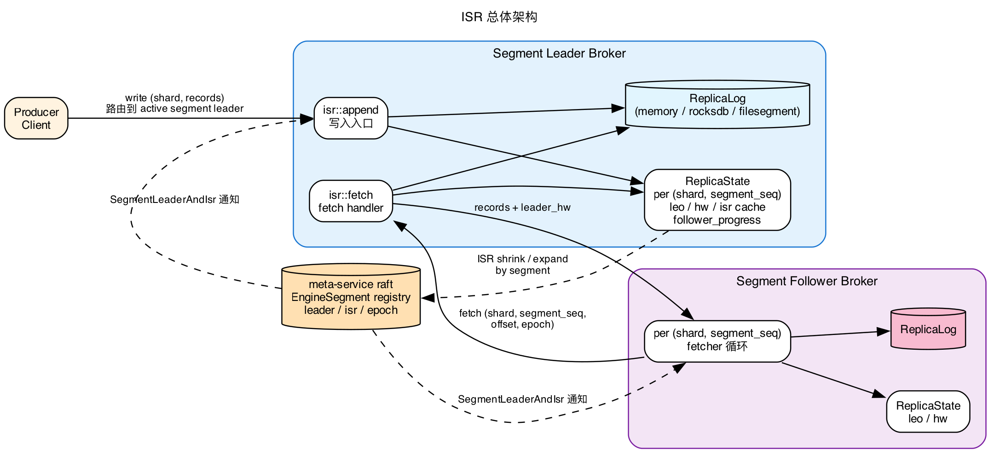
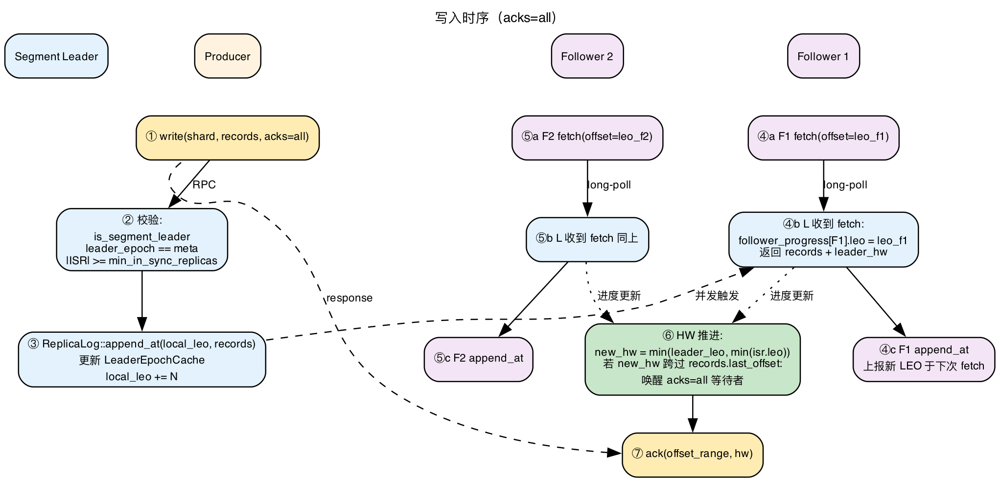
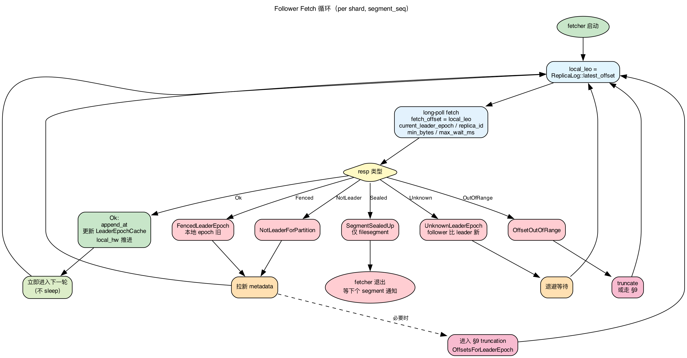
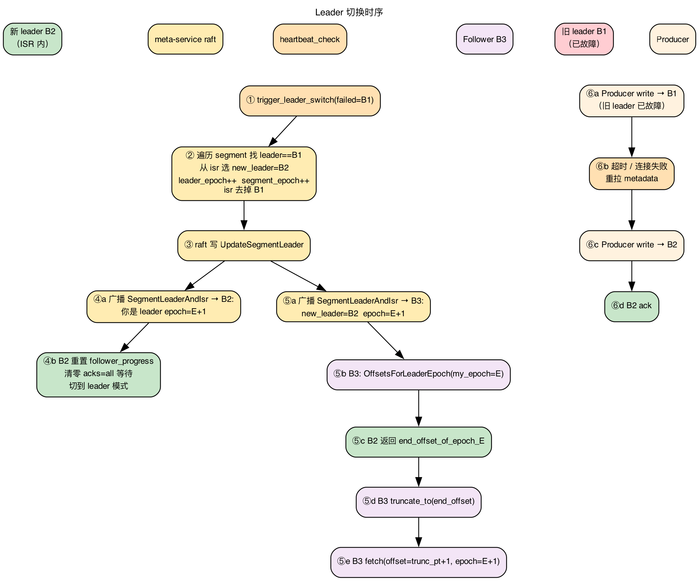

# Storage Engine ISR (In-Sync Replica)

> **目标**:一套**稳定的 ISR 副本协议**,从 Kafka 十余年踩坑后的最终形态中提炼,直接作为 RobustMQ 的协议基线。**不背 Kafka 历史包袱**(早期 fetch 协议、ZK Controller、unclean 默认开等),**不留妥协路径**(没有"先 HW truncate,以后换 epoch"这种过渡状态)。
>
> 适用范围:`commitlog/memory`、`commitlog/rocksdb`、`filesegment` 三种存储引擎。
>
> **核心原则**:ISR 在 `EngineSegment` 维度实现,三引擎共享同一份 ISR 控制面,差异仅在 `ReplicaLog` trait 的本地存储实现。memory / rocksdb 的 `segment_seq` 恒为 0;filesegment 按大小自动切 segment——这是引擎特性,对 ISR 协议透明。

---

## 0. 协议总纲(不变式)

本协议的**正确性建立在以下 16 条不变式上**,任何实现都不得违反。后续章节是这些不变式的展开。

### 元数据权威与版本

- **(I1) 唯一权威**:`(shard, segment_seq)` 的 `leader / isr / leader_epoch / segment_epoch / replicas` 唯一权威值在 meta-service raft 状态机;broker 本地缓存仅作性能优化。
- **(I2) 三类 epoch 单调**:
  - `leader_epoch` 仅在 leader 切换时递增
  - `segment_epoch` 在 leader / isr / replicas 任一变化时递增
  - `broker_epoch` 在 broker 进程重启注册时递增(区分同一 broker_id 的不同进程实例,见 §3.5)
  - 三者一旦递增不可回退
  - **持久化要求**:三者**均由 meta-service raft 状态机持久化**(走 raft log + snapshot)。`broker_epoch` 不在 broker 本地持久化(broker 重启就一定要拿新值);`leader_epoch / segment_epoch` 在 meta raft 上唯一权威,broker 端的本地缓存(`SegmentReplicaState`,见 §3.4)只用于运行期校验,broker 重启后从 LeaderAndIsr 重建。
  - **raft snapshot 注意**:打 snapshot 时三类 epoch 当前值必须包含在 snapshot 中;raft 节点从 snapshot 恢复后,广播给 broker 的 LeaderAndIsr 必须沿用 snapshot 中的 epoch,**不可回到 0**(否则会被 I3 的 fence 误判为 stale)。
- **(I3) ISR 变更需多重 fence**:meta-service 接受 ISR 变更前必须校验:
  - `req.leader_epoch == current.leader_epoch`(防 zombie leader)
  - `req.broker_epoch == current_known_broker_epoch(leader_id)`(防 zombie broker 进程)
  - `req.expected_segment_epoch == current.segment_epoch`(CAS,防并发 ISR 变更覆盖)
  - 任一失败即拒绝

### 写入与 Committed 语义

- **(I4) 写入原子性**:任何 append 必须通过 leader。leader 写入必须在同一 shard 写锁内原子完成:
  1. 校验自身 role == LeaderActive(非 Initializing / Demoting,见 I11)
  2. 校验 `current_leader_epoch == meta.leader_epoch`
  3. 若 producer 携带 epoch(可选),校验 `producer.epoch == meta.leader_epoch`
  4. `append_at` 落本地
  5. 推进 `local_leo`
  - 注意:`LeaderEpochCache.assign` **不在写入路径做**,而是在 leader 上任时一次性完成(见 I11、§8.1 case 1)。写入路径只做**兜底校验** `LeaderEpochCache.latest_epoch() == self.leader_epoch`,不匹配即 InternalError(正常路径永不触发,详见 §5.2 step 6)。
- **(I5) Committed 定义**:HW(High Watermark)是 **shard 维度**(对齐 memory/rocksdb 物理本质和现有 `ShardOffsetState.high_watermark_offset`)。一条记录 `offset < shard.HW` 即 committed。HW 由 active segment 的 leader 单方计算,见 I6。
- **(I6) HW 计算与单调性**:`new_hw_candidate = min(leader_LEO, 已有 follower_progress 记录的 ISR 成员 LEO)`,未在 follower_progress 中的 ISR 成员被跳过(不约束 HW)——新加入 ISR 时已经追上,因此 `last_caught_up_ts` 在 `lag_time_max_ms` 内才进 ISR,此后第一次 fetch 才建 progress 记录。实际推进时强制 `shard.HW = max(current_shard.HW, new_hw_candidate)`,**同一 broker 实例视角下 HW 永不倒退**。leader failover 后新 leader reset_follower_progress,旧进度清空,在 follower 重新 fetch 并建立记录之前 HW 由 leader 单独决定(leader 作为单 ISR 成员)。(详细伪代码见 §5.3)
  > 注:leader 切换时,**全局**视角下 HW 数字可以瞬间变小(新 leader 继承 follower 期本地 HW,该值滞后于旧 leader 一个 RTT)。但 **committed 数据本身不丢失**(`offset < 旧 HW` 的所有 record 都在新 leader 上;Kafka 同行为)。"HW 单调"约束的是单个 broker 实例,不是跨 leader 切换。
- **(I7) HW 推进只由 fetch 触发**:follower 通过 fetch_offset 隐式上报 LEO,active segment leader 收到 fetch 时推进 shard.HW。写入路径不直接推 HW。
- **(I8) Committed 数据永不丢失**:任何已 committed(`offset < shard.HW`)的数据在任何故障后必须在新 leader 上保留。这是 ISR 协议的核心承诺。

### Truncation 与 Leader Epoch

- **(I9) Truncation 必须基于 Leader Epoch**:任何 follower 在加入 / 重启 / leader 切换 / 收到 FencedLeaderEpoch 后,必须先通过 `OffsetsForLeaderEpoch` 询问 leader 的 epoch 历史,再 truncate。**禁止使用本地 HW 或本地 LEO 作为 truncate 点**。
- **(I10) LeaderEpochCache 必须持久化**(rocksdb / filesegment);memory 引擎因无持久化,follower 重启等价于全新副本,必须从 leader_log_start 全量重拉(§9.5)。
- **(I11) Leader 上任原子性**:broker 收到 `SegmentLeaderAndIsr` 后,在转为 Active leader 之前必须完成:
  1. `LeaderEpochCache.assign(new_epoch, current_leo)` 持久化(同步 put,不主动 fsync)
  2. 重置 `follower_progress`
  3. 拒绝所有携带旧 `leader_epoch` 的在途 producer 写入和 follower fetch
  - 在第 1 步持久化完成前的 broker 状态为 `Initializing`,拒绝所有写入

### ISR 维护与可用性

- **(I12) ISR 扩展严格条件**:不在 ISR 的 follower 要重新加入,leader 端必须看到:
  - `follower.leo >= leader.local_leo`(追上当前 LEO,等价于已含全部 committed 数据)
  - `follower.last_known_leader_epoch == leader.epoch`(follower 上次 fetch 时携带的 `current_leader_epoch`)
  - `follower.broker_epoch` 在 meta 中是已知存活值(未 fence)
- **(I13) min_in_sync_replicas**:`|ISR| < min_in_sync_replicas` 时,acks=all 写入拒绝(`NotEnoughReplicas`);leader 不得本地伪造 ISR 内容,ISR 是 meta 权威值的镜像。
- **(I14) 不做 unclean leader election**:ISR 空时拒写,segment 标记 `Unavailable`,绝不从非 ISR 副本选 leader。

### Fetch 协议

- **(I15) Fetch 是 long-poll**:无定时轮询路径。leader 收到 fetch 时:
  1. 校验 `req.current_leader_epoch == self.leader_epoch`(`<` 返回 `FencedLeaderEpoch`,`>` 返回 `UnknownLeaderEpoch`)
  2. 用 `req.fetch_offset` 反推 follower LEO,更新 follower_progress + 推进 HW(I6)
  3. 若有足够数据 → 立即返回;否则挂起最多 `max_wait_ms`
- **(I16) fetch_offset 即 LEO 上报**:follower 发 `fetch_offset = X` 隐式声明已持久化 `[0, X)` 全部数据。leader 据此推进 HW,**follower 不主动上报 LEO**。

---

## 1. 设计基础与历史教训

本协议从 Kafka 十余年 ISR 演进中提炼,具体来源:

- **KIP-101 (2017)**:Leader Epoch + OffsetsForLeaderEpoch,解决"本地 HW truncate 导致丢数据"
- **KIP-279 (2018)**:OffsetsForLeaderEpoch 协议细化,处理 fenced epoch
- **KIP-380 / KIP-497 (2019+)**:Broker Epoch + AlterPartition,防 zombie broker 进程发出陈旧元数据请求
- **KIP-320**:Consumer 路径的 leader epoch;思想推广到 ISR 变更带版本号 CAS
- **KIP-679**:ISR 扩展条件改为 `follower.leo >= leader.leo`(而非 `>= hw`)
- **KIP-237 / replica_lag_time_max_ms**:用时间窗口替代消息数判 lag,避免 flapping
- **long-poll fetch**:Kafka 早期就是长轮询,确保 HW 推进延迟可控
- **`min.insync.replicas`**:acks=all 的 committed 语义保证
- **HW 单调性**:`hw = max(current_hw, new_hw)`,防止 ISR 扩展时 HW 倒退使消费者看到的数据消失

本协议的 16 条不变式(§0)是上述 KIP 的提炼结果,**作为 RobustMQ 的初始协议直接落地**,不存在"先做简化版后续升级"的过渡形态。

协议固定行为:

- HW 推进由 leader 用 fetch_offset 反推,不接受 follower 主动上报 LEO
- Fetch 是 long-poll(携带 `max_wait_ms`)
- Truncation 由 `OffsetsForLeaderEpoch` RPC 驱动(KIP-101),禁止本地 HW 决定 truncate 点
- LeaderEpochCache 持久化(memory 引擎例外,见 §9.5)
- ISR 变更带 `segment_epoch` CAS
- Leader 切换后旧 leader 必须在下次写入被 fence

Kafka 的副本模型核心要素 → RobustMQ 映射：

| Kafka 概念 | RobustMQ 映射 | 说明 |
|---|---|---|
| Topic Partition | `EngineShard`(逻辑日志) | 仅用于路由 |
| Log Segment | `EngineSegment`(**物理副本单元**) | 副本身份在 segment |
| Replica / Leader / Follower | segment 维度。同一 shard 的不同 segment 可位于不同节点集 | |
| LEO (Log End Offset) | 已有 `commit_log_offset.latest_offset`,每个 `(shard, segment_seq)` 一个 | |
| HW (High Watermark) | 已有 `ShardOffsetState.high_watermark_offset`(shard 维度),由当前 active segment 的 leader 计算,单调 | shard 维度对齐 Kafka partition-level HW |
| ISR | 已有 `EngineSegment.isr: Vec<u64>` | |
| Leader Epoch | 已有 `EngineSegment.leader_epoch: u32` | KIP-101 |
| **Segment Epoch** | **新增** `EngineSegment.segment_epoch: u32`,每次 leader/ISR/replicas 变更递增 | KIP-320 思想,segment 维度 |
| **Broker Epoch** | **新增**,broker 注册到 meta 时拿到,进程级单调 | KIP-380 / KIP-497 |
| **LeaderEpochCache** | **新增** `Vec<(epoch, start_offset)>`,**持久化** | KIP-101 |
| **log_start_offset** | **新增** `EngineSegment.log_start_offset: u64`,retention 后该 segment 在 leader 上可读起点 | Kafka 同名 |
| Controller | meta-service(raft leader) | |
| Fetch RPC | follower → leader(long-poll) | 新增 |
| OffsetsForLeaderEpoch RPC | follower → leader(truncation 询问) | 新增 KIP-101 |
| AlterPartition (ISR 变更 RPC) | broker → meta-service raft op `UpdateSegmentIsr` | 新增 KIP-497 思想 |
| acks=0/1/all | producer 路径上 acks 语义 | |
| Producer leader_epoch | producer 写入可携带 epoch(可选),leader 校验 | KIP-320 思想 |

**为什么是 segment 而不是 shard**：
- 同一 shard 的不同 segment 在 filesegment 引擎下可能位于不同节点集（segment 创建时按当时的节点状态选副本），shard 维度无法表达这种"不同时段不同拓扑"
- segment 维度的副本元数据 `EngineSegment.{replicas, leader, leader_epoch, isr}` 在 meta-service 中已建模并由 `segment_leader_switch` 维护
- memory/rocksdb 永远单 segment（`segment_seq=0`），是 segment 模型的退化形态

非目标：
- 不引入新的共识算法，ISR 变更回写 meta-service raft
- 不做副本拓扑动态扩缩（reassign），segment 创建时副本拓扑固定
- 不实现 unclean leader election（§16 划出）
- 不实现 KIP-966 ELR / KIP-392 Observer（§16 划出）

---

## 2. 总体架构



控制面 / 数据面分离：

- **控制面（meta-service）**：segment 创建时分配 `replicas / leader / isr`；segment leader 切换；广播 `SegmentLeaderAndIsr`。
- **数据面（storage-engine 各 broker）**：segment leader 接 producer 写、回答 follower fetch；follower 主动 fetch；leader 计算 HW；本地 `ReplicaState` 仅缓存。

---

## 3. 数据模型变更

### 3.1 `EngineSegment`(部分已存在,需扩展)

```rust
// metadata-struct/src/storage/segment.rs
pub struct EngineSegment {
    // === 已存在 ===
    pub shard_name: String,
    pub segment_seq: u32,
    pub replicas: Vec<Replica>,    // {replica_seq, node_id, fold}
    pub leader: u64,
    pub leader_epoch: u32,
    pub isr: Vec<u64>,
    pub status: SegmentStatus,     // Write / PreSealUp / SealUp / PreDelete / Deleting

    // === 新增 ===
    pub segment_epoch: u32,            // KIP-320 思想:ISR / leader / replicas 任一变更即递增
    pub leader_broker_epoch: u64,      // 当前 leader 上任时的 broker_epoch (见 §3.5)
                                       // meta 用它 fence 旧进程的 zombie ISR 请求
    pub log_start_offset: u64,         // retention 后该 segment 在 leader 上可读起点
    pub last_known_isr: Vec<u64>,      // ISR 缩到空之前的最后一个非空 ISR 集合(§12.19)
                                       // 仅在 status==Unavailable 时有意义:作为安全恢复的候选 leader 集
}
```

**三类 epoch 的职责区别**:

| Epoch | 递增时机 | 作用 |
|---|---|---|
| `leader_epoch` | 仅 leader 切换 | KIP-101 truncation 协议核心;LeaderEpochCache 用它分段 |
| `segment_epoch` | leader / ISR / replicas 任一变更 | meta-service ISR 变更 CAS;广播通知排序 |
| `broker_epoch` | broker 进程注册到 meta | 区分同一 broker_id 的不同进程实例,防 zombie 进程 |

**为什么 `leader_broker_epoch` 要存在 segment 上**:
- ISR shrink 请求路径:leader broker → meta-service
- meta 收到请求要校验"发出请求的 broker 是当前 leader 的当前进程实例"
- 这就需要存 `(leader_node_id, leader_broker_epoch)` 二元组,只看 leader_id 不够(同一个 node_id 重启后是另一个进程)

所有副本身份信息都在 segment 上。**`EngineShard` 不加任何 ISR 相关字段**。

**`SegmentStatus` 扩展与读写权限语义修正(D4)**:

```rust
pub enum SegmentStatus {
    Write,         // active segment,可读可写
    PreSealUp,     // 准备封口,可读可写(写入路径会触发切到新 segment)
    SealUp,        // 已封口,可读不可写
    PreDelete,     // 准备删除,不可读不可写(retention 即将清除)
    Deleting,      // 删除中,不可读不可写
    Unavailable,   // === 新增 === ISR 空导致无法选 leader,不可写
                   //              仍可读历史数据(committed offset)
}

impl EngineSegment {
    /// 可读条件:Write / PreSealUp / SealUp / Unavailable
    /// 修正点:**SealUp 状态必须可读**(消费者读历史 + follower 追赶旧 segment)
    pub fn allow_read(&self) -> bool {
        matches!(self.status,
            SegmentStatus::Write | SegmentStatus::PreSealUp |
            SegmentStatus::SealUp | SegmentStatus::Unavailable)
    }

    /// 可写条件:Write / PreSealUp
    pub fn allow_write(&self) -> bool {
        matches!(self.status, SegmentStatus::Write | SegmentStatus::PreSealUp)
    }
}
```

**为什么 `allow_read` 必须包含 SealUp**(代码现状 bug):
- 当前 `allow_read()` 只允许 `Write`,导致 SealUp 后**完全不能读**
- 消费者读历史数据(filesegment 多 segment 场景):必须能读 SealUp 的旧 segment
- ISR follower 追赶:filesegment 切 segment 后 follower 仍需拉旧 segment 的尾巴
- 不修复这个,ISR 协议在 filesegment 上**无法工作**

写入路径用 `allow_write` 校验,读取路径(含 fetch handler)用 `allow_read` 校验。

### 3.2 LeaderEpochCache（持久化，关键）

**这是 KIP-101 的核心数据结构，协议强制要求**（不变式 I9、I10）。

```rust
// storage-engine/src/isr/leader_epoch.rs（新建）
pub struct LeaderEpochCache {
    // 单调递增 (epoch, start_offset)
    // start_offset 是该 epoch 产生的第一条记录的 offset
    entries: Vec<LeaderEpochEntry>,
}

#[derive(Serialize, Deserialize)]
pub struct LeaderEpochEntry {
    pub epoch: u32,
    pub start_offset: u64,
}

impl LeaderEpochCache {
    /// 收到新的 leader epoch 时调用(仅 leader 上任的 §8.1 case 1 持久化路径,
    /// 以及 follower §6.3 收到跨 epoch records 时调用)
    pub fn assign(&mut self, epoch: u32, start_offset: u64);

    /// 本地已知最大的 epoch(空 cache 返回 0 表示无历史)
    pub fn latest_epoch(&self) -> u32;

    /// follower 询问"我有到 my_epoch 的日志,该 epoch 的 end_offset 是多少"
    /// 返回:my_epoch 的下一个 epoch 的 start_offset;
    ///       `None` 表示 my_epoch 是当前最大,调用方用本地 LEO 替换(cache 不持有 LEO)
    pub fn end_offset_for(&self, my_epoch: u32) -> Option<u64>;

    /// 用于 truncate 后修剪:删除 offset > end_offset 的所有条目
    pub fn truncate_from_end(&mut self, end_offset: u64);

    /// follower 走 §9.2 时的精确修剪:删除 epoch > target_epoch 的全部条目,
    /// 同时保留 target_epoch 但其 start_offset 不变。
    /// 配合 OffsetsForLeaderEpoch 响应中 leader 返回的 end_offset_leader_epoch 调用。
    pub fn truncate_from_end_by_epoch(&mut self, target_epoch: u32, end_offset: u64);

    /// 用于 retention 推进 log_start_offset 后修剪
    pub fn truncate_from_start(&mut self, start_offset: u64);

    /// 清空全部 entries。用于 §6.3 / §9.2 step 4 的 retention 强制重建场景
    pub fn clear(&mut self);
}
```

**持久化策略**（三引擎差异）：
- memory：**无法持久化**（进程重启就丢），因此 memory 引擎的 follower 在 leader 重启后必须**整段重新同步**。这是 memory 引擎的固有限制（数据本身就不持久化）。
- rocksdb：storage CF,key `…/segment/{shard}/{seg:010}/leader-epoch/{epoch:010}` → value=完整 entry
- filesegment：sidecar 文件 `{segment_file}.leader-epoch-checkpoint`（同 Kafka）

写入时机有两处(**不在普通 producer 写入路径**):
- **leader 上任**:`assign(new_leader_epoch, current_leo)`(§8.1 case 1,I11)
- **follower 落盘跨 epoch records**:解析 batch header 的 `partition_leader_epoch`,对每个新 epoch `assign(epoch, batch_base_offset)`,**先 assign 后 append**(§6.3)

**持久化策略(对齐 record 数据)**:`assign` 每次同步 put 进 rocksdb,但**不主动 fsync** —— 持久性靠副本冗余(min.insync.replicas)+ 引擎后台刷盘,与 record 数据一致。单节点重启若丢失最近未刷盘的 epoch 条目,follower 重新走一次 OffsetsForLeaderEpoch 对齐即可,已 committed 数据在多副本中不丢。

**实现状态(B 组 T7)与一处待补**:
- `LeaderEpochCache` 已实现 + rocksdb 持久化(key 见上)。无 `fsync` 方法。
- `end_offset_for(my_epoch)` 返回 `Option<u64>`:`None` 表示 my_epoch 是 latest,调用方用本地 LEO 替换(cache 不持有 LEO)。
- **待补(留 C 组 leader-side OffsetsForLeaderEpoch handler)**:§9.2 case 5(请求 epoch 落在已知范围但 cache 有洞)要求响应的 `end_offset_leader_epoch` 是"≤ my_epoch 的最大已知 epoch"而非 my_epoch 本身。当前 `end_offset_for` 只返回 offset、不返回该 epoch,且未做 §12.8 cache 损坏 ERROR 日志。leader handler 实现时需在此基础上补齐"返回匹配到的 epoch"。

### 3.3 `EngineShardConfig` 扩展

```rust
// metadata-struct/src/storage/shard.rs
pub struct EngineShardConfig {
    pub replica_num: u32,                  // 已存在
    pub storage_type: StorageType,
    pub max_segment_size: Option<u64>,
    pub max_record_num: Option<u64>,
    pub retention_sec: u64,

    // === 新增 ISR 相关配置(命名对齐 Kafka) ===
    pub min_in_sync_replicas: u32,         // acks=all 最小 ISR,默认 1
    pub replica_lag_time_max_ms: u64,      // follower 多久没追上被踢,默认 30_000(同 Kafka)
    pub replica_fetch_max_bytes: u64,      // 单次 fetch 最大字节数,默认 1 MiB
    pub replica_fetch_wait_max_ms: u64,    // long-poll 最大等待,默认 500
    pub replica_fetch_min_bytes: u64,      // long-poll 累积多少字节就立即返回,默认 1
    pub replica_hw_checkpoint_interval_ms: u64,  // HW 异步 checkpoint 间隔,默认 5000(见 §6.4)

    // metadata reconcile 兜底(防 LeaderAndIsr 广播丢失导致死循环,见 §12.18)
    pub metadata_reconcile_interval_ms: u64,     // broker 周期主动对账 segment_epoch,默认 30_000
    pub reconcile_min_interval_ms: u64,          // 单 segment 被动 reconcile 限频,默认 1_000

    // 空 ISR(Unavailable)恢复等待窗口(见 §12.19)
    pub unavailable_recovery_wait_ms: u64,       // 等 last_known_isr 多数成员上报 LEO,默认 30_000

    // unclean leader election 协议禁用,字段保留供运维 override 时强制错误
    pub unclean_leader_election_enable: bool,  // 协议要求始终 false
}
```

> 兼容性：新字段均带 `#[serde(default)]`，老编码解码后填默认值。

### 3.4 `ReplicaState`(broker 进程内运行时)

**两层结构**:
- **ShardReplicaState**:每个 shard 一份,持有 shard 维度的 HW / LEO / hw_watcher(对齐代码现状 `ShardOffsetState`)
- **SegmentReplicaState**:每个 segment 一份,持有副本身份(role / leader_epoch / isr / follower_progress)

```rust
// storage-engine/src/isr/state.rs(新建)
pub struct ReplicaStateRegistry {
    // 每 shard 一份
    pub shard_states: DashMap<String, Arc<ShardReplicaState>>,
    // 每 (shard, segment_seq) 一份
    pub segment_states: DashMap<(String, u32), Arc<SegmentReplicaState>>,
}

/// shard 维度状态:HW / LEO 跨 segment 连续,因此放在 shard 上
/// (对应代码现状 `ShardOffsetState`,本结构最终替换之)
pub struct ShardReplicaState {
    pub shard_name: String,
    pub local_leo: AtomicU64,        // shard 全局 LEO(对应 latest_offset)
    pub local_hw: AtomicU64,         // shard 全局 HW (单调,只增不减)
    pub log_start_offset: AtomicU64, // retention 起点
    pub hw_watcher: watch::Sender<u64>,  // 广播给 acks=all 等待者
}

/// segment 维度状态:副本身份
pub struct SegmentReplicaState {
    pub shard_name: String,
    pub segment_seq: u32,
    pub leader_epoch: u32,
    pub segment_epoch: u32,
    pub role: ReplicaRole,
    // leader 视角:每个 follower 的 LEO + 进度时间戳 + broker_epoch
    pub follower_progress: DashMap<u64 /*node_id*/, FollowerProgress>,
}

pub enum ReplicaRole {
    /// 启动后还没收到第一条 SegmentLeaderAndIsr,角色未知。
    /// 拒绝所有 read / write / fetch / OffsetsForLeaderEpoch。见 §8.-1。
    Initializing,
    /// 收到 LeaderAndIsr 选自己当 leader,但尚未完成 LeaderEpochCache 持久化等准备工作。
    /// 拒绝所有 producer 写入和 follower fetch(I11)。
    LeaderInitializing,
    /// leader 完全就绪,接受写入和 fetch。
    LeaderActive,
    /// 之前是 leader,收到 LeaderAndIsr 通知自己不再是 leader。
    /// 取消所有 inflight producer 请求、唤醒 acks=all 等待者后转 FollowerInitializing。
    /// 期间拒绝所有新写入。
    LeaderDemoting,
    /// 跟随某个 leader,启动 fetcher 拉取。
    /// 跟随前必须先走 OffsetsForLeaderEpoch truncation(I9)。
    FollowerInitializing,
    FollowerActive,
}

pub struct FollowerProgress {
    pub broker_epoch: u64,                 // 上次 fetch 时 follower 自报的 broker_epoch
    pub last_known_leader_epoch: u32,      // 上次 fetch 时 follower 自报的 current_leader_epoch
                                           // 用于 §6.2 HW 推进过滤、§7.2 ISR expand 校验
    pub leo: u64,                          // = req.fetch_offset
    pub last_fetch_ts: u64,
    pub last_caught_up_ts: u64,            // 上次"追上"时刻,见 §6.4
    pub first_caught_up_after_oos: Option<u64>, // §7.2 flapping 抑制用
                                           // None 表示不在 OOS 状态;Some(t) 表示从 OOS 状态 t 时刻首次追上
}
```

**持久化策略**:
- `ShardReplicaState`:`local_leo` / `local_hw` / `log_start_offset` 持久化到 commitlog 已有的 shard offset checkpoint(对齐代码现状 `ShardOffsetState`)
- `SegmentReplicaState`:**不持久化**。进程重启时从 meta-service 拉取 `EngineSegment` + 本地持久化 `LeaderEpochCache` 重建

**`FollowerProgress` 字段生命周期**:

- leader 第一次见到某个 follower(本次 fetch 之前没记录),`or_insert_with`:
  ```text
  FollowerProgress {
      broker_epoch: req.replica_broker_epoch,
      last_known_leader_epoch: req.current_leader_epoch,
      leo: req.fetch_offset,
      last_fetch_ts: now,
      last_caught_up_ts: now,            // 关键:初始 now,避免 lag_ms 一上来就极大值
      first_caught_up_after_oos: None,
  }
  ```
- follower 被踢出 ISR(进入 OOS) 时:`first_caught_up_after_oos = None`
- 每次 fetch 进来,若 follower 不在 ISR 且 leo >= leader.local_leo 首次追上:`first_caught_up_after_oos = Some(now)`
- follower 重新加入 ISR 时:`first_caught_up_after_oos = None`(回到 in-sync 状态,重置)

**为什么 HW 在 shard 维度而非 segment 维度**:
- memory/rocksdb 的物理本质是"shard = 一根连续 offset 轴",没有"per-segment HW"概念
- filesegment 切 segment 后 HW 跨 segment 连续,消费者从 segment N 读到 N+1 不需要切换 HW
- 代码现状 `ShardOffsetState.high_watermark_offset` 已经是 shard 维度,对齐
- 对应 Kafka:HW 在 partition 维度(我们的 partition = shard),不是在 log segment 维度

**状态转换**(收到 LeaderAndIsr 通知时按 §8.1 三个 case 转换;通知里"我是不是 leader"决定方向):

进入 `LeaderInitializing`(收到"选我为 leader"的通知):
- `Initializing → LeaderInitializing`:启动后第一个通知就选我为 leader(§8.-1 + §8.1 case 1)
- `FollowerActive | FollowerInitializing → LeaderInitializing`:follower 被提升为新 leader
- `LeaderActive → LeaderInitializing`:**仅当 leader_epoch 递增**(连任但换了 epoch,极少见);若 leader 不变且 epoch 不变,走下方"leader 连任简化路径",**不**经过 LeaderInitializing

进入 `FollowerInitializing`(收到"我不再是 leader / 继续是 follower"的通知):
- `Initializing → FollowerInitializing`:启动后第一个通知就是 follower(§8.-1 + §8.1 case 2)
- `FollowerActive → FollowerInitializing`:follower 的 leader 变了,需重新 truncate
- `LeaderActive → LeaderDemoting → FollowerInitializing`:leader 降级(见下)

其余转换:
- `LeaderInitializing → LeaderActive`:LeaderEpochCache 持久化完成
- `FollowerInitializing → FollowerActive`:`OffsetsForLeaderEpoch` + truncate 完成。**当前实现**：role.rs 的 follower 分支直接启动 fetcher 并转 FollowerActive（未先做 OffsetsForLeaderEpoch truncation）。truncation 在首次 fetch 收到 FencedLeaderEpoch 时由 `truncate_after_fence` 完成——功能等效，但晚一轮 fetch，严格来说违反 I9 的"启动 fetcher 前先截断"要求。
- `LeaderActive → LeaderDemoting`:收到通知自己不再是 leader,进入卸任收尾
- `LeaderDemoting → FollowerInitializing`:取消所有 inflight 写入、唤醒 acks=all 等待者返 NotLeaderForPartition 后(见 §5.6)。**当前实现**:LeaderDemoting 态存在但主动唤醒未实现,acks=all 等待者靠超时(`replica_fetch_max_wait_ms`)返错。

**leader 连任简化路径**(leader 不变、leader_epoch 不变,仅 ISR / segment_epoch 变化):
- 保持 `LeaderActive`,只更新 `isr_cache / segment_epoch`,**不**重新 assign LeaderEpochCache,**不**取消 inflight 写入(见 §8.1 case 1 注解)

### 3.5 Broker Epoch 注册机制

broker 进程的生命周期标识。每次进程启动到 meta-service 注册时获取新值。

**protobuf 改动(D5,必须做)**:

```protobuf
// 当前 RegisterNodeReply 是空 struct,需扩展
message RegisterNodeReply {
  uint64 broker_epoch = 1;   // === 新增 === meta 分配的当前进程 epoch
}

// 当前 RegisterNodeRequest 不变(broker 不提议自己的 epoch,由 meta 分配)
```

**meta-service raft 状态机改动**:

> **实现(T1)**:**未用** 内存 `NodeRegistry` HashMap / 新 `NodeRegistryUpdate` op。而是**复用 `ClusterAddNode` op**:apply 时 `NodeStorage::next_broker_epoch(node_id)` 在 rocksdb key `clusters/node_epoch/{node_id}` 上读改写 +1(在 raft apply 内,确定性串行),经 raft 响应值(8 LE bytes)返回给 `register_node`。下面伪码是原设计示意,概念等价(每 node_id 单调递增的 broker_epoch 持久化到 raft 状态机)。

```rust
// 概念示意(实际见 NodeStorage::next_broker_epoch)
fn register_node(req: RegisterNodeRequest) -> RegisterNodeReply {
    let new_epoch = node_storage.next_broker_epoch(node.node_id); // rocksdb +1, 经 raft apply
    RegisterNodeReply { broker_epoch: new_epoch }
}
```

**broker 进程缓存与使用**:

- broker 启动时调 register_node → 拿到 broker_epoch → 缓存到内存
- 所有向 meta 发起的写请求(`UpdateSegmentIsr` 等)必须携带这个 epoch
- broker 不持久化 broker_epoch 到本地(进程重启就是新进程,自然该重新注册拿新值)

**fence 流程示例**:

1. broker B1 启动 → register_node → 拿到 `broker_epoch=7`
2. B1 进程崩溃,但 meta-service 心跳还没超时
3. B1 重启 → register_node → 拿到 `broker_epoch=8`
4. 此时若 B1 旧进程残留的网络包还在路上,带着 `broker_epoch=7` 到达 meta
5. meta 用 `node_registry[B1]==8` 校验,7 < 8 → 拒绝 `StaleBrokerEpoch`

> **broker_epoch 与 leader_broker_epoch 的关系**:
> - `broker_epoch` 是 broker 进程级版本,跟具体 segment 无关
> - `leader_broker_epoch` 是某个 segment 当选 leader 时该 broker 的 broker_epoch 快照,存在 `EngineSegment` 上
> - ISR 变更校验时 meta 比对:`req.leader_broker_epoch == segment.leader_broker_epoch && req.broker_epoch == node_registry[req.node_id]`

---

## 4. ReplicaLog 抽象

memory / rocksdb / filesegment 三个引擎共享 ISR 控制面，差异仅在本地存储读写。抽出 trait：

```rust
// storage-engine/src/isr/log.rs（新建）
#[async_trait]
pub trait ReplicaLog: Send + Sync {
    /// follower 收到 leader 的 records 后落本地。要求 base_offset == latest_offset(...)。
    /// 不连续返回 OutOfOrder,触发 truncate 流程。offset 取自 record 自带的
    /// metadata.offset(leader 分配),不由 base_offset 递推。
    /// 持久性靠副本冗余 + 引擎后台刷盘,不做 per-write fsync(见下方持久化说明)。
    async fn append_at(
        &self,
        shard: &str,
        segment_seq: u32,
        base_offset: u64,
        records: Vec<StorageRecord>,
    ) -> Result<(), StorageEngineError>;

    /// 用于 follower fetch、消费者 read 都走这个接口。
    async fn read_from(
        &self,
        shard: &str,
        segment_seq: u32,
        offset: u64,
        max_bytes: u64,
    ) -> Result<Vec<StorageRecord>, StorageEngineError>;

    /// 当前 segment 已写入的最大 offset。
    fn latest_offset(
        &self,
        shard: &str,
        segment_seq: u32,
    ) -> Result<u64, StorageEngineError>;

    /// 截断到指定 offset(含,inclusive),LEO 设为 offset+1(exclusive)。
    /// 用于 follower 在 leader 切换时丢弃未提交日志。
    /// 先降 LEO 再删记录(崩溃后 LEO 不会越过 log 末尾)。
    async fn truncate_to(
        &self,
        shard: &str,
        segment_seq: u32,
        offset: u64,
    ) -> Result<(), StorageEngineError>;

    /// 清空 (shard, segment_seq) 的全部本地数据。
    /// 用于 follower 检测到本地数据完全无效(leader 返回 `end_offset_leader_epoch=-1`,即整段被 retention)时,丢弃本地从头重拉。
    /// 不同于 `truncate_to(start_offset)`:`clear` 允许内部直接删除文件 / range,实现更快。
    async fn clear(
        &self,
        shard: &str,
        segment_seq: u32,
    ) -> Result<(), StorageEngineError>;

    /// 该 segment 在本地的最小可读 offset。用于 follower 在 retention 后重置 fetch_offset 起点。
    /// memory/rocksdb 返回 0(或 retention 后的实际起点);filesegment 返回当前 file 的 start。
    fn log_start_offset(
        &self,
        shard: &str,
        segment_seq: u32,
    ) -> Result<u64, StorageEngineError>;
}
```

**持久化与 key 统一(实现关键)**:

- **副本共享同一份存储/同一套 key**:同一 `(shard, segment_seq, offset)` 的记录,在 leader 和任何 follower 上是**同一个物理 key / 同一份数据**,leader 切换无需搬数据或改 key。ReplicaLog **不另开**副本专用存储,而是就地复用 producer/consumer 路径的存储。
- **持久性靠副本冗余**:append/truncate/clear **不做 per-write fsync**,写入只到引擎 memtable/WAL,落盘交后台 + 副本冗余(min.insync.replicas),对齐 Kafka 默认。
- **append offset 来自 record**:follower 按 `record.metadata.offset`(leader 分配)入 key,只用 `base_offset == latest_offset` 做跨 batch 连续性校验(不连续触发 truncation)。

**三个引擎的实现要点**：

- **memory**：`segment_seq` 恒为 0。**复用 `ShardState.data: DashMap<offset, Record>`**(producer/consumer 同一份),LEO 复用 `commit_log_offset` 的 offset cache。重启即丢(§9.5)。
- **rocksdb**：record key 统一为 `record/{shard}/{segment_seq:010}/{offset:020}`(producer/consumer/replica 共用);LEO 单独存 `record-leo/{shard}/{segment_seq:010}`(兄弟前缀,record range-delete 不波及)。`truncate_to`：先写 LEO,再 range delete `(shard, segment_seq, offset+1..)`。
- **filesegment**：`segment_seq` 直接对应文件名；`append_at` 写当前 active segment 文件；`truncate_to` 截断文件尾或删除尾部 segment。

> 关键：`segment_seq` 在签名里是显式参数。memory/rocksdb 传 0；filesegment 传当前 active 或 follower 正在追的 segment。**ISR 控制面只调 trait，不知道也不关心引擎类型**。

---

## 5. 写入路径(segment leader 侧)

### 5.0 写入路由模型(broker 转发)

**本协议的"客户端"是 broker**(主要来自 storage-adapter / mqtt-broker / kafka-broker / nats-broker 等),不是面向终端 producer 的接口。因此采用 **broker 转发模型**:

```text
非 leader broker A 收到写入请求:
  1. 从本地 metadata 缓存找到 shard 的 active_segment.leader = B
  2. 通过 storage-engine RPC 通道转发给 B
  3. 等 B 应答后返回给上游

leader broker B 收到 (本地或转发):
  按 §5.2 原子流程处理
```

**代码现状对齐**:`storage-engine/src/core/write.rs::batch_write` 已实现此路由,本协议沿用。

**与 Kafka client 重试模型的差异**:

| 维度 | broker 转发(本协议) | Kafka client 重试 |
|---|---|---|
| 客户端复杂度 | 简单(broker 端 broker 转发) | 复杂(client 拉 metadata + 重试) |
| 网络跳数 | 多一跳(非 leader broker → leader broker) | 直接到 leader |
| Zombie leader fence | 转发链路上的每个 broker 都要校验 epoch | client 收到 NotLeader 立即重试,不堆 zombie |
| 路由表延迟 | broker 之间通过 SegmentLeaderAndIsr 同步 metadata,延迟低 | client metadata 缓存延迟较高 |

**Zombie 防御要点**(对应不变式 I4):
- 中转 broker(转发方)也必须用 §5.2 的 epoch 校验逻辑:在转发之前校验自己缓存的 leader 是当前 leader(epoch 一致)
- 否则转到旧 leader → 旧 leader 校验 epoch 失败 → 返回 FencedLeaderEpoch → 中转 broker 拉新 meta 重试
- 等价于"client 重试",只是重试逻辑在 broker 内部

### 5.1 ProduceRequest 协议字段

```protobuf
message StorageEngineProduceRequest {
  string shard_name = 1;
  bytes records = 2;
  uint32 acks = 3;                          // 0 / 1 / -1(=all)
  uint64 timeout_ms = 4;                    // acks=all 等 HW 推进的最大时间
  // 转发方(上游 broker)写入时携带其认知的 leader_epoch
  // 用于防 zombie:转发方 metadata 过时时被 leader 直接拒
  optional uint32 current_leader_epoch = 5;
  // === §18.1 扩展点(默认不带,leader 忽略) ===
  optional uint64 producer_id = 6;
  optional uint32 producer_epoch = 7;
  optional int32  base_sequence = 8;
}
```

> 注:不传 `segment_seq`,因为路由是按 shard,leader 自己用 `shard.active_segment_seq` 决定写入到哪个 segment。这避免"上游缓存的 active_segment 已过期"导致写入老 segment 的问题。

**关于 `current_leader_epoch` 可选性的弱保证**(P0-4):

若 producer **不携带** `current_leader_epoch`,leader 切换瞬间存在一个 race window:

```text
T0: producer 拿到 metadata,leader = B1, epoch = E
T1: leader 切换,B2 上任,epoch = E+1
T2: producer 仍向 B1 发写入(不带 epoch)
T3: B1 收到 SegmentLeaderAndIsr,进入 FollowerInitializing
    在这之前,B1.role == LeaderActive(尚未处理通知)
T4: producer 的写入到达 B1
    case A: B1 已转 Follower → 返回 NotLeaderForPartition,producer 重试
    case B: B1 仍是 LeaderActive,未收到通知 → §5.2 step 2 通过 (role==LeaderActive)
            step 3 跳过(req 不带 epoch) → 直接 append 到 B1 本地
            → 但 B1 的写入永远推不动 HW(B2/B3 已经在 fetch B2)
            → acks=all 客户端 timeout 重试;acks=1 客户端拿到 Ack 但实际 zombie 写入
            → B1 后续重连 meta 接收通知 → 走 §9 truncate 丢弃这批数据
```

**结论**:不带 epoch 的 producer 在 leader 切换瞬间,**acks=1 可能拿到假 Ack 然后被静默 truncate**。这是 Kafka 同样存在的弱保证。

**协议推荐**:
- producer 强烈推荐携带 `current_leader_epoch`(像 Kafka 客户端从 3.0+ 默认带)
- 业务对正确性敏感时使用 `acks=all` + `min_in_sync_replicas ≥ 2`(HW 推不动 → 必然 timeout 重试,不会假 Ack)
- 不带 epoch 时,broker 仍按 role 校验,**但开发者必须知道有这个 race window**

文档明确接受这个 trade-off,不视为 bug。

### 5.2 原子写入路径(I4)

**整段必须在同一把 segment 锁内完成**,中途不得释放锁(否则 LeaderAndIsr 通知到达可能让 role 切换发生在 append 之后):

```text
acquire(write_lock):  // ShardReplicaState.write_lock,shard 级

  1. 路由:active_segment_seq = shard.active_segment_seq
     active_segment = local_cache.get_segment(shard, active_segment_seq)
  2. 校验自身状态(对 active_segment):
     - role == LeaderActive → 否则:
       LeaderInitializing → 返回 NotReady(让上游退避重试)
       FollowerActive/Initializing → 返回 NotLeaderForPartition(让上游转发到真 leader)
     - self.leader_epoch == meta.leader_epoch → 否则 FencedLeaderEpoch
  3. 若 req.current_leader_epoch 存在:
     - == self.leader_epoch → 通过
     - < self.leader_epoch → FencedLeaderEpoch(上游持有旧 metadata)
     - > self.leader_epoch → UnknownLeaderEpoch(上游比 leader 还新,极罕见)
  4. acks=all 校验:|ISR| >= min_in_sync_replicas → 否则 NotEnoughReplicas
  5. ReplicaLog::append_at(shard, active_segment_seq, shard.local_leo, records) 落本地
  6. (LeaderEpochCache 已在 §8.1 case 1 leader 上任时 assign 过,**写入路径不再 assign**)
     - 兜底校验:若 LeaderEpochCache.latest_epoch() != self.leader_epoch → 返回 InternalError
       - `<`:leader 上任时 assign 失败/cache 损坏(§12.13 / §12.8 类故障)
       - `>`:本地 cache 比当前认知的 leader_epoch 还新,说明 role/epoch 状态机错乱
       (正常路径下 cache.latest_epoch() 恒等于 self.leader_epoch,触发即代表故障)
  7. shard.local_leo += records.len()
  8. [hook §18.1] on_append_with_pid(req.producer_id, req.producer_epoch,
                                     req.base_sequence, base_offset = shard.local_leo - N)
       默认 no-op;未来 idempotent producer 在此更新 ProducerStateEntry

release(write_lock)

9. 按 acks 语义应答(锁外):
   acks=0:  立即返回 OK(fire-and-forget)
   acks=1:  本地落盘成功即返回 OK
   acks=all: select on (shard.hw_watcher.changed(), timeout_ms)
            条件:shard.local_hw >= records.last_offset
            timeout → RequestTimedOut,**不回滚已写入**(对齐 Kafka)
```

> **不变式 I4 的关键体现**:步骤 2-7 在锁内原子。LeaderAndIsr 通知改 role 也需要拿同一把锁,这样不会插入到"epoch 校验通过"与"append" 之间。
>
> **`RequestTimedOut` ≠ 写入失败**(语义澄清,对齐 Kafka):
> - timeout 后**已写入数据保留在 log 中**,LEO 不回退。如果之后 ISR 恢复使 HW 推过 last_offset,这些数据**仍会被 committed**;消费者会读到。
> - 因此 producer 收到 `RequestTimedOut` **不能盲目重试**(否则触发重复):
>   - 若 producer **带 ProducerId+Sequence**(KIP-98 幂等):重试由 broker 用 sequence 去重,安全
>   - 若 producer **不带 epoch/sequence**:重试可能产生重复消息,需上层去重或接受 at-least-once
> - **业务建议**:对正确性敏感场景必须 `acks=all` + 幂等 producer(避免 timeout 重试重复)
> - **`RequestTimedOut` 的常见诱因**:ISR 缩到不包含某些慢 follower 之前,leader 等不到足够 follower 的 LEO 推进 → 等待 `replica.lag.time.max.ms` 才会 shrink ISR → 用户层超时短于此时会先收到 RequestTimedOut
>
> **锁结构总览**:
> - **`ShardReplicaState.write_lock`**(shard 级):leader 写入路径(§5.2)持有,覆盖 `active_segment_seq` 选择 + LEO 推进 + LeaderEpochCache 兜底校验。同一 shard 同一时刻只有一个写者。
> - **`SegmentReplicaState.state_lock`**(segment 级):LeaderAndIsr 通知处理(§8.1)、fetcher 落盘(§6.3 processPartitionData)、fetch handler 校验 + HW 推进(§6.2)持有。每个 segment 一把,互不阻塞。
> - **两锁的关系**:
>   - leader 角色下:写入路径**先**拿 write_lock,内部对 active segment 操作不再单独拿 state_lock(role 校验通过即代表当前是 LeaderActive,state_lock 只对 role 转换敏感)。但 §8.1 通知到达要改 role 时,会先拿 write_lock 等当前写入完,再拿 state_lock 改 role —— 顺序:`write_lock → state_lock`,所有路径统一这个顺序避免死锁。
>   - follower 角色下:无 write_lock 路径(follower 不接受外部 producer 写入),fetcher 落盘只拿 state_lock 即可。
> - **filesegment 跨 segment 切换**:在 write_lock 内完成 seal_up_N + 切到 N+1;新 segment 的 state_lock 在 §8.0 raft 通知到达时创建。

### 5.3 HW 推进与单调性(I6, I7)

HW 是 **shard 维度**(`ShardReplicaState.local_hw`),不在 segment 上。HW 推进**只发生在 fetch handler 里**(§6),写入路径只更新 LEO。这是 Kafka 的关键设计——分离"写入"和"确认"。

```text
// active segment leader 收到 fetch 后(详见 §6):
let isr = active_segment.isr;
// 把 ISR 拆为 {leader 自己, 其他 follower}
// leader 自己的 LEO = shard.local_leo,不在 follower_progress 中
let other_isr_members: Vec<u64> = isr.iter().filter(|id| **id != self.node_id).collect();

// I6:只计入 last_known_leader_epoch 匹配的 follower,防止陈旧 epoch 的 follower 拉低 HW
//     比对的是 follower 上次 fetch 时上报的 last_known_leader_epoch
let eligible_progress: Vec<&FollowerProgress> = other_isr_members.iter()
    .filter_map(|f_id| follower_progress.get(f_id))
    .filter(|p| p.last_known_leader_epoch == self.leader_epoch)
    .collect();

// 关键边缘 case:**只有 leader 自己 eligible** 时(其他 ISR 成员都还未带新 epoch 上报),
//             HW 推进只看 leader 自己的 LEO
// 但若 |ISR| > 1 且 eligible_progress 为空(所有 follower epoch 都陈旧),
//   说明 HW 推进的 follower 投票还不齐 → 不推进 HW
//   (避免:leader 刚 epoch 升级,follower 还没 fetch 到新 epoch 就推 HW = local_leo,
//    其他 follower 实际还没复制完)
let new_hw_candidate = if other_isr_members.is_empty() {
    shard.local_leo  // 单副本 ISR,LEO 即 HW
} else if eligible_progress.is_empty() {
    shard.local_hw   // 不推进
} else {
    min(shard.local_leo, eligible_progress.iter().map(|p| p.leo).min().unwrap())
};
shard.local_hw = max(shard.local_hw, new_hw_candidate)   // I6 强制单调
if shard.local_hw 推进了:
    shard.hw_watcher.send(shard.local_hw)                // 唤醒 acks=all 等待者
```

**为什么 HW 必须单调**(避免 ISR 扩展时的 HW 倒退):
- t1:ISR={A,B},LEO_A=100,LEO_B=100,HW=100
- t2:C 追上加入 ISR,ISR={A,B,C},LEO_C=99(C 刚追完到 99)
- 若 `new_hw = min(...) = 99` → HW 倒退,消费者已读到 offset=99 的数据"消失"
- 强制 `HW = max(100, 99) = 100`,等 C 也追到 100 才正常推进

**为什么 HW 在 shard 维度不在 segment 维度**:
- memory/rocksdb 是 shard 全局 offset 轴,segment 永远 0,HW 是 shard 概念
- filesegment 切 segment 后 HW 跨 segment 连续(消费者从 segment N 读到 N+1 不需要换 HW)
- 代码现状 `ShardOffsetState.high_watermark_offset` 已是 shard 维度
- 对齐 Kafka:HW 在 partition 维度而非 log segment 维度

### 5.4 min_in_sync_replicas 保护

- acks=all 时:`|ISR| < min_in_sync_replicas` → 立即 `NotEnoughReplicas`
- acks=1 时:不受此约束(只要 leader 在就接受写入,用户自选语义)
- **Committed 语义**:一条记录被视为 committed 当且仅当 `offset < HW` 且 leader 计算 HW 时 ISR 满足 `min_in_sync_replicas`
- ISR 由 meta 权威定义(I13),leader 不得本地伪造

### 5.5 写入期间 ISR 缩小的处理(K6)

acks=all 写入是异步等待 HW 推进的(§5.2 step 9)。**等待期间 ISR 可能缩小**,处理规则:

- **已 append 但还在等 HW 的写入**:**不主动失败**,继续等。可能两种结局:
  - HW 推到 records.last_offset → 正常返回 OK
  - 等到 timeout_ms 超时 → 返回 RequestTimedOut(不回滚已写入数据,与 Kafka 一致)
- **ISR 缩小后到达的新 acks=all 写入**:在 §5.2 step 4 校验 `|ISR| < min_in_sync_replicas` → 立即 `NotEnoughReplicas` 拒绝
- **若 HW 因 ISR 缩小后变得能推进**(原本卡在某个慢 follower):立即推进 HW,唤醒已等待的 acks=all 请求

> **注意**:ISR 缩小后,剩余 ISR 副本的 HW 推进**反而可能加快**(因为不需等被踢出的慢副本)。这是 Kafka 的预期行为——已 ack 的语义没破坏,新 ack 的语义也没破坏。

**ISR 缩小的同步窗口** (P1-5):

leader 本地 `isr_cache` 与 meta-service 权威 ISR 之间存在异步同步窗口。语义如下:

```text
T1: leader 检测 follower F 超过 lag → 发起 UpdateSegmentIsr(new_isr = isr - F)
T2: leader 不立即更新本地 isr_cache,等 meta 确认
T3: meta raft 接受变更 → 写入 → 广播 SegmentLeaderAndIsr
T4: leader 自己也收到 SegmentLeaderAndIsr → 更新本地 isr_cache
```

- 在 T1 → T4 之间(一个 round trip),leader 的 HW 计算**仍然把 F 算在 ISR 内**,HW 仍被 F 卡住
- 这是 pessimistic 策略,避免"meta 拒绝了变更(segment_epoch CAS 失败) 但 leader 已经按 new_isr 推 HW"
- T1 → T4 通常 < 100ms(同一个 raft group 内)
- 期间已等待的 acks=all 请求**不会被立即唤醒**,要么等 F 追上、要么等同步完成再用 new_isr 重算、要么 timeout

代价:ISR shrink 真正生效的延迟 ≈ UpdateSegmentIsr RPC + raft 提案 + 广播 = 一个 round trip。设计上接受。

### 5.6 leader 卸任时 acks=all 等待者的处理(对齐 Kafka DelayedProduce)

acks=all 写入在 §5.2 step 9 挂起等 `hw_watcher`,**此时本地 LEO 已推进、数据已落 ReplicaLog**。leader 卸任(收到通知自己不再是 leader)时,这些等待者需要明确收尾,**不能默默挂死,也不能假装 commit 成功**。

**精确流程**(§8.1 case 2 的 `cancel_inflight_producer_requests` 展开):

```text
fn cancel_inflight_producer_requests():
    // 1. 列出所有 acks=all 等待者(挂在 hw_watcher 上)
    let waiters = self.pending_acks_all.drain();

    // 2. 对每个等待者:
    for waiter in waiters {
        // a. 数据已落本地 log(LEO 已推),无法回滚 — 对齐 Kafka 行为
        //    本地 LEO 不动,数据保留;新 leader 上任后会通过 §9 truncate 决定去留
        // b. 返回 NotLeaderForPartition 给上游
        waiter.respond(Err(NotLeaderForPartition {
            current_leader_epoch: notification.leader_epoch,
            new_leader: notification.leader,
        }));
    }

    // 3. acks=1 waiters: 通常已经在 step 5 落盘后立刻返回 OK(无需在这里处理)
    //    若有少量还在锁外应答路径上,同样返回 NotLeaderForPartition
```

**为什么不返回 RequestTimedOut**:
- `RequestTimedOut` 语义是"不知道成功还是失败"(§5.2 注解);此处明确知道**当前 broker 不再是 leader**,应直接告知上游切换目标
- 上游(`storage-adapter` 等)收到 `NotLeaderForPartition` 后:刷新 metadata → 重新路由到新 leader → 重试
- 重试可能产生重复(本地已落盘且可能被新 leader 接受) — 与 Kafka 同样语义,靠幂等 producer 解决(§18.1)

**数据归属判定**:
- 这部分"已 append 但未 commit"的本地数据,**不属于已 committed**(还没推 HW)
- 新 leader 上任后通过 KIP-101 流程:
  - 如果数据恰好已经被其他 ISR 成员 fetch 走 → 新 leader 上有,本副本作为 follower 重新加入时不 truncate
  - 如果只有本副本有 → 新 leader 上没有,本副本作为 follower 走 OffsetsForLeaderEpoch truncate 掉
- 任一情况下都不会让"未 commit 的数据被消费者读到"(违反 I8 的反向);也不会让"已 commit 的数据丢失"(违反 I8)

**LeaderDemoting 状态的作用**:
- `LeaderActive → LeaderDemoting`:进入 `cancel_inflight_producer_requests` 主体期间的中间态
- 在此状态下:**拒绝新写入**(返回 NotLeaderForPartition);**等待已在 `hw_watcher` 上的等待者全部应答完毕**
- 全部应答完后转 `FollowerInitializing` 走 §8.1 case 2 主体
- 这一步在 state_lock 内完成,期间不释放锁 — 保证不会有新的 acks=all 写入挤进来

**与 Kafka 的对齐**:Kafka `ReplicaManager` 在 `makeFollower` 时调用 `completeDelayedOperationsWhenNotPartitionLeader` → `delayedProducePurgatory.checkAndComplete(key)`,DelayedProduce 的 `tryComplete` 检查 partition 已不是 leader → 返回 `NOT_LEADER_OR_FOLLOWER` 完成。语义等价。

### 写入时序（acks=all）



---

## 6. 复制路径（follower 侧）

**核心设计:long-poll fetch + leader 用 fetch_offset 反推 LEO**(严格对齐 Kafka)。

### 6.1 fetch_offset 的隐式含义(关键)

follower 发送 `fetch_offset = X` 给 leader 时,**隐式声明:"我已经持久化了 [0, X) 的全部数据"**。  
leader 收到后:
1. 把 `follower_progress[replica_id].leo = X` 更新进 ReplicaState
2. **leader 检查这是否能推进 HW**:`new_hw = min(leader_leo, min over isr.leo)`,若推进则唤醒 acks=all 等待者
3. 然后才开始准备返回 records

**这意味着 follower 自己的 LEO 推进永远比 leader 视角的 LEO 滞后一个 fetch round**:
```text
T1: leader_hw=5, leader_leo=8, follower_local_leo=5
T2: follower 发 fetch(fetch_offset=5)
T3: leader 看到 fetch_offset=5,更新 follower.leo=5,HW=min(8,5)=5(不变)
    返回 records=[5,6,7], leader_hw=5
T4: follower 落盘 5,6,7, follower_local_leo=8
T5: follower 发 fetch(fetch_offset=8)
T6: leader 看到 fetch_offset=8,更新 follower.leo=8,HW=min(8,8)=8
    唤醒等 offset<8 的 acks=all 等待者
    返回 records=[], leader_hw=8
T7: follower 知道 HW=8,推进 local_hw=8
```

→ **follower 本地的 HW 比 leader 慢一个 RTT**。本协议消费者只读 leader(§16),所以消费者拿到的 HW 是实时的,这个滞后不影响消费者可见性。但 follower 本地的 HW 仍要参与 §11 checkpoint 持久化,以便 follower 升任 leader 时 HW 不倒退(见 §8.1 case 1 + K7 注解)。

### 6.2 long-poll fetch

**fetcher 线程池模型(对齐 Kafka `num.replica.fetchers`)**:不是每个 segment 一个 fetcher 任务(几千 shard 会导致任务数爆炸),而是 **broker 进程级固定数量的 fetcher 线程**(配置 `num_replica_fetchers`,见 `StorageRuntime`)。每个 follower segment 按 `leader_node_id % num_fetchers` 分配到某个线程 —— **同一 leader 的 shard 归同一线程**,该线程一轮把它们按 leader 分组、每组打**一个批量 FetchRequest**(见 §6.7 批量协议)。SegmentLeaderAndIsr 通知到来时 add/remove segment 到对应线程。

follower fetch 是长轮询,不是定时轮询。下面是**单 segment 视角**的逻辑(实际由 fetcher 线程对其负责的一批 segment 批量执行):

```text
loop {
    let local_leo = replica_log.latest_offset(shard, segment_seq)?;
    let req = FetchRequest {
        shard_name, segment_seq,
        fetch_offset: local_leo,
        current_leader_epoch: my_leader_epoch,  // follower 当前认知的 leader epoch
        replica_id: self.node_id,
        replica_broker_epoch: self.broker_epoch, // 防 zombie follower 进程
        max_bytes: replica_fetch_max_bytes,
        min_bytes: replica_fetch_min_bytes,
        max_wait_ms: replica_fetch_wait_max_ms,
    };
    let resp = leader_client.fetch(req).await?;
    // ... 处理 resp(无 sleep,立刻进入下一轮)
}
```

**leader 端的精确校验顺序**(I15):

```text
acquire(state_lock):  // SegmentReplicaState.state_lock,segment 级
  // 1) 角色校验
  if self.role != LeaderActive:
      release lock; return NotLeaderForPartition  // 含 LeaderInitializing

  // 2) leader_epoch 三态校验
  if req.current_leader_epoch < self.leader_epoch:
      return FencedLeaderEpoch   { current_leader_epoch: self.leader_epoch }
  if req.current_leader_epoch > self.leader_epoch:
      // follower 比 leader 新:说明 meta 已经把更高的 leader_epoch 推给了 follower,
      // 但推给本 leader 的 LeaderAndIsr 还没到 / 丢了(§12.17 best-effort)。
      // 兜底:触发 leader 端主动 reconcile —— 异步向 meta 拉取本 segment 的权威元数据。
      //   trigger_metadata_reconcile(shard, segment_seq);  // 幂等,带去重/限频
      // 然后仍返回 UnknownLeaderEpoch 让 follower 退避;待 reconcile 拿到新 epoch 后
      // 本 broker 会按 §8.1 转换角色,下一轮 fetch 即可正常。详见 §12.18。
      return UnknownLeaderEpoch  // follower 比 leader 新,极罕见,follower 退避

  // 3) fetch_offset 范围校验
  if req.fetch_offset < self.log_start_offset:
      return OffsetOutOfRange { leader_log_start, leader_leo }  // 被 retention 抛在后面
  if req.fetch_offset > self.local_leo:
      return OffsetOutOfRange { leader_log_start, leader_leo }  // 脑裂残余,follower 比 leader 远

  // 4) 更新 follower_progress (I7, §6.4 详细规则)
  progress = follower_progress.entry(req.replica_id).or_insert_with(default_for(req, now))
  if req.replica_broker_epoch < progress.broker_epoch:
      return StaleBrokerEpoch  // zombie follower 进程
  progress.broker_epoch = req.replica_broker_epoch
  progress.last_known_leader_epoch = req.current_leader_epoch
  progress.leo          = req.fetch_offset
  progress.last_fetch_ts = now
  if req.fetch_offset >= leader_leo_at_request_arrival:
      progress.last_caught_up_ts = now
      // §7.2 flapping 抑制:OOS 状态下首次追上,记录时刻
      if req.replica_id not in self.isr && progress.first_caught_up_after_oos.is_none():
          progress.first_caught_up_after_oos = Some(now)

  // 5) 用 progress 推进 shard HW (I6, 单调)
  //    注意:HW 是 shard 维度,但 ISR 是当前 active segment 的 ISR
  //    本 segment 不是 active 时只更新 follower_progress 不推 HW
  //    详细 HW 计算见 §5.3
  if self.is_active_segment && req.replica_id in self.isr:
      let other_isr_members: Vec<u64> = self.isr.iter()
          .filter(|id| **id != self.node_id).collect();
      let eligible_progress: Vec<&FollowerProgress> = other_isr_members.iter()
          .filter_map(|f_id| self.follower_progress.get(f_id))
          .filter(|p| p.last_known_leader_epoch == self.leader_epoch)
          .collect();
      let new_hw_candidate = if other_isr_members.is_empty() {
          shard.local_leo
      } else if eligible_progress.is_empty() {
          shard.local_hw  // 不推进
      } else {
          min(shard.local_leo, eligible_progress.iter().map(|p| p.leo).min().unwrap())
      };
      shard.local_hw = max(shard.local_hw, new_hw_candidate)  // I6 单调
      if shard.local_hw 推进了:
          shard.hw_watcher.send(shard.local_hw)  // 唤醒 acks=all 等待者
release lock

// 6) long-poll 数据返回(锁外)
data_available = shard.local_leo - req.fetch_offset
if data_available >= req.min_bytes:
    return Ok(records, leader_hw = shard.local_hw, leader_log_start, leader_leo = shard.local_leo, leader_epoch)
挂起 wait_for_either(append_signal, timeout(max_wait_ms))
唤醒后:
    重读 shard.local_leo,返回当前可读 records (可能为空)
```

**为什么不能用定时轮询**:
- 轮询间隔短 → 空闲时 CPU/网络浪费
- 轮询间隔长 → HW 推进延迟、acks=all 延迟升高
- long-poll 同时解决两个问题,且与 Kafka 一致

### 6.3 fetch 错误分支(follower 侧)

```text
match resp {
    Ok { records, leader_hw, leader_log_start, leader_leo, leader_epoch } => {
        // 顺序关键(对齐 KIP-101):先 epoch_cache.assign,后 append_at
        // 反过来会让本地 log 比 epoch_cache 长,崩溃后 OffsetsForLeaderEpoch 答错
        //
        // 跨 epoch 检测:遍历 records 的 batch headers
        //   每个 batch 含 partition_leader_epoch 字段
        //   找出本批中首次出现的、> leader_epoch_cache.latest_epoch() 的 epoch
        //   对每个这样的 (new_epoch, batch_base_offset) 调用:
        //     leader_epoch_cache.assign(new_epoch, batch_base_offset)
        //   assign 每次同步 put 进存储(不主动 fsync,见 §3.2/§4 持久化说明)
        for (new_epoch, batch_base_offset) in detect_new_epochs(&records, leader_epoch_cache.latest_epoch()) {
            leader_epoch_cache.assign(new_epoch, batch_base_offset);
        }

        // 先 assign(epoch cache)后 append(log),保持 cache ⊇ log
        replica_log.append_at(shard, segment_seq, shard.local_leo, records).await?;

        // 推进 follower 本地 shard HW(单调):
        shard.local_hw = max(shard.local_hw, min(shard.local_leo + records.len(), leader_hw));
        // 同时校对 leader_epoch:若 leader_epoch != self.leader_epoch
        //   - 大于 → 刷新本地 leader_epoch(可能 LeaderAndIsr 尚未到达,先按 leader 报的来)
        //   - 小于 → 异常(leader 端缓存陈旧),按现状继续但记录 WARN
    }

    Err(NotLeaderForPartition) | Err(NotReady) => {
        // 拉新 metadata,切换 fetcher target
        // (NotReady 表示新 leader 处于 LeaderInitializing,稍后重试同一目标)
    }

    Err(FencedLeaderEpoch { current_leader_epoch }) => {
        // 本地 epoch 比 leader 旧 → 必须先做 truncation,不能直接继续 fetch
        // 1) 刷新本地 leader_epoch = current_leader_epoch
        // 2) 走 §9 OffsetsForLeaderEpoch 流程
        // 3) truncate 完成后才能 fetch
    }

    Err(UnknownLeaderEpoch) => {
        // follower 比 leader 还新(leader 刚启动尚未拉到最新 meta)
        // 退避等待,不 truncate。正常情况下 meta 会广播 LeaderAndIsr 让 leader 追上。
        // 但广播是 best-effort(§12.17),可能丢失 → 必须有 leader 端主动兜底,
        // 否则陷入"follower 永远退避 / leader 永远停在旧 epoch"的死循环(§12.18)。
        // follower 侧动作:除退避外,在 fetch 请求里始终携带 current_leader_epoch,
        //   leader 收到 fetch 时若发现 req.current_leader_epoch > self.leader_epoch,
        //   会触发 leader 端主动 reconcile(见 §6.2 leader 端处理 + §12.18)。
    }

    Err(StaleBrokerEpoch) => {
        // follower 自己的 broker_epoch 居然被 leader 拒了
        // 这意味着 meta 已经看到 follower 的新 epoch,但 follower 用了旧值
        // → 重新到 meta 注册取最新 broker_epoch
    }

    Err(OffsetOutOfRange { leader_log_start, leader_leo }) => {
        // leader 返回时同时给出 [leader_log_start, leader_leo],follower 据此区分:
        if local_leo < leader_log_start:
            // (a) follower 太落后,被 retention 抛后
            // → 清空本地 + 从 leader_log_start 开始全量重拉
            replica_log.clear(shard, segment_seq).await?
            leader_epoch_cache.clear()
            fetch_offset = leader_log_start
        else if local_leo > leader_leo:
            // (b) follower 比 leader 还远(脑裂残余,且 epoch 校验已通过)
            // → 走 §9 OffsetsForLeaderEpoch 流程
            // 注意:理论上 (b) 应在 epoch 校验时就被 Fenced 拦下,
            // 此分支是兜底保险
    }

    Err(SegmentSealedUp) => {
        // filesegment 专属:segment 已封口
        // follower 拉完最后一批后 fetcher 退出
        // 新 segment 的 fetcher 由 SegmentLeaderAndIsr 通知触发
    }
}
```

**memory/rocksdb 不会遇到 `SegmentSealedUp`**(segment 永远 = 0,不会封口)。

### 6.4 HW / LEO 持久化策略(checkpoint cadence)

HW 与 LEO 是 ISR 协议的两个核心运行时数值,持久化策略不同。

**LEO 持久化(靠副本冗余,不做 per-write fsync)**:
- `ReplicaLog::append_at` 写入只到引擎 memtable/WAL,**不强制 fsync**,落盘交后台 + 副本冗余(min.insync.replicas),对齐 Kafka 默认 `flush.ms` 行为。
- LEO 本身不需要单独 checkpoint,**进程重启时从 `ReplicaLog::latest_offset` 直接重建**(§8.-1 步骤 1)。
- 单节点崩溃可能丢失最近未刷盘的写(LEO 回退),由 `min.insync.replicas >= 2` 兜底:已 committed 数据在多副本中至少一份存活,不会全部同时丢。

**HW 持久化(异步 checkpoint,可滞后)**:
- 推进 HW 时**不**强制 fsync。HW 的内存值由 `hw_watcher` 唤醒等待者后立即生效。
- 后台任务每 `replica_hw_checkpoint_interval_ms`(默认 **5000 ms**,对齐 Kafka `replica.high.watermark.checkpoint.interval.ms`)把 `shard.local_hw` 写到 commitlog 的 shard offset checkpoint。
- **崩溃后 HW 回退是允许的**(最多回退一个 checkpoint interval 的距离),由 KIP-101 路径兜底:
  - 若 broker 重启后变 leader:`local_hw` 比真实 HW 低 → 不影响正确性(committed 数据靠 log 本身保存,不靠 HW 数值;HW 只是消费者可见上限,会在下一轮 fetch 推进时重新涨到正确值)
  - 若变 follower:走 §9 OffsetsForLeaderEpoch truncate 到 leader 端真实位置;`local_hw` 滞后不会让 follower 错误地保留 uncommitted 数据(truncate 用的是 leader epoch 端点,不是本地 HW)
- **关键 invariant**:`local_hw <= local_leo` 永远成立。重启后若读到 `persisted_hw > local_leo`(checkpoint 写完但 ReplicaLog 没写完就崩了),修正为 `local_hw = local_leo`。

**log_start_offset 持久化(同步)**:
- retention 推进 `log_start_offset` 时**必须**先持久化到 checkpoint 再删数据,否则崩溃后 `log_start_offset` 回退但数据已删 → fetch 读到 `log_start_offset` 之后的 hole。
- 顺序:`update_checkpoint(new_log_start) → fsync → physical_delete([old_log_start, new_log_start))`

**为什么 HW 可以异步而 log_start_offset 必须同步**:
- HW 滞后:消费者短期少看到一些数据,但**数据本身没丢**;ISR 协议的其他 invariant 仍成立(I8 靠 log + LeaderEpochCache 而非 HW 数值)
- log_start_offset 滞后但删除已执行:**数据真的没了**,后续 fetch 拿到 hole 无法恢复 → 违反 I8

> 这正是 KIP-101 的核心价值:让 HW 持久化可以异步,从而避免每次 HW 推进都 fsync 的性能损耗;同时通过 LeaderEpochCache + OffsetsForLeaderEpoch 保证安全性。

### 6.5 last_caught_up_ts 的精确语义(避免 flapping)

leader 维护 `follower_progress[node_id]: FollowerProgress`(完整结构见 §3.4)。本节聚焦 `last_caught_up_ts` 的更新规则。

更新规则(收到 fetch 时):
```text
// P2-3: 关键!leader_leo 必须在 fetch 请求 *进入处理* 的瞬间取值,
//       不能用"当前最新值"。否则高并发写入下 follower 永远追不上。
//       这与 Kafka 一致(Kafka 用请求到达时的 leader leo 作为追上判定基准)
let leader_leo_at_request_arrival = shard.local_leo.load();
follower_progress[req.replica_id].leo = req.fetch_offset;
follower_progress[req.replica_id].last_fetch_ts = now;

if req.fetch_offset >= leader_leo_at_request_arrival {
    // follower 已经追上 *本次请求到达时* 的 LEO
    follower_progress[req.replica_id].last_caught_up_ts = now;
}
// 关键:即使没追上,只要还在 fetch,**不更新 last_caught_up_ts** 而非 last_fetch_ts
// 这样 lag 检查看的是"距上次追上多久",不是"距上次 fetch 多久"
// 长 poll 等待中也算"在追",不会误踢
```

ISR shrink 判定(见 §7):
```text
lag_ms = now - last_caught_up_ts
in_isr && lag_ms > replica_lag_time_max_ms → 踢出
```

→ **不会因为 long-poll 阻塞误判**,也**不会因为短时大量写入误判**(只要 follower 能追上某一时刻的 leader_leo)。

### 6.6 Follower fetch 流程图



### 6.7 FetchRequest / FetchResponse

**批量、跨 shard**:一个请求拉一个 fetcher 线程在某 leader 上负责的所有 shard(每 shard 一项,带它当前追的 segment)。进程级字段(replica_id / broker_epoch / min_bytes / max_wait_ms)在顶层,每 shard 一个游标 + 独立 `error_code`(fence 是单 segment 的)。实际走 storage-engine 自定义 packet(rkyv),下面用 proto 描述结构语义:

```protobuf
message StorageEngineFetchRequest {
  uint64 replica_id = 1;              // follower 的 node_id
  uint64 replica_broker_epoch = 2;    // follower 进程的 broker_epoch(防 zombie follower)
  uint64 min_bytes = 3;               // long-poll: 任一 shard 累积到即返回
  uint64 max_wait_ms = 4;             // long-poll: 最大等待
  repeated FetchShard shards = 5;
}
message FetchShard {
  string shard_name = 1;
  uint32 segment_seq = 2;
  uint64 fetch_offset = 3;            // follower 期待的下一个 offset(隐式上报 LEO,I16)
  uint32 current_leader_epoch = 4;
  uint64 max_bytes = 5;
}

message StorageEngineFetchResponse {
  repeated FetchShardResp shards = 1;
}
message FetchShardResp {
  string shard_name = 1;
  uint32 segment_seq = 2;
  repeated bytes records = 3;         // 编码后的 StorageRecord 列表
  uint64 leader_hw = 4;
  uint64 leader_log_start = 5;        // retention 后可读起点
  uint64 leader_leo = 6;              // leader 当前 LEO(判断是否真追上,§6.4)
  uint32 leader_epoch = 7;
  uint32 error_code = 8;              // per-shard: 0=ok / Fenced / Unknown / OffsetOutOfRange / StaleBroker
}
```

**协议要点**:
- 顶层 `replica_broker_epoch`,leader 据此拒绝同一 broker 旧进程的残留 fetch
- long-poll: **任一** shard 累积到 `min_bytes` 或超 `max_wait_ms` 即整体返回,各 shard 各带当前可读数据
- 每 shard 返回 `leader_log_start` + `leader_leo`,follower 处理 `OffsetOutOfRange` 时据此区分原因(§6.3)
- 每 shard `error_code` 独立(一个 shard 被 fence 不影响同请求里其它 shard)

复用 storage-engine 现有的 `StorageEnginePacket` RPC 通道(参考 `core/read_key.rs`)。

**与 consumer read 路径的边界(K8)**:

| 路径 | 协议 | 调用者 | 数据范围 |
|---|---|---|---|
| Follower fetch(本协议) | `IsrFetchReq/Resp`(新增) | broker 内的 follower fetcher | 含未 committed 数据(LEO 之前) |
| Consumer read | 现有 `ReadReq/Resp` | storage-adapter / 上层 broker | 只到 HW(committed 之前) |

**两条路径完全分离**:
- 协议格式不同(FetchReq 携带 replica_id/broker_epoch/leader_epoch,ReadReq 不带)
- 处理逻辑不同(fetch 推进 HW,read 不推 HW)
- handler 不同(`isr/fetch.rs` 处理 follower fetch,`core/read_*.rs` 处理 consumer read)
- consumer read 路径**不读 follower**(§16 协议规定),只能从 leader 读

**为什么分离而不合并**:Kafka 通过 `replica_id == -1` 区分,本协议从一开始就分开两条 RPC,消费者不背 ISR 协议复杂度,handler 逻辑也更清晰。

---

## 7. ISR 维护

### 7.1 leader 侧判定

segment leader 每秒(可配)扫一次 `follower_progress`,只看自己是 `LeaderActive` 的 segment:

```text
for (node_id, prog) in self.follower_progress {
    let in_isr = self.isr_cache.contains(node_id);

    // ---- shrink 判定 ----
    if in_isr && node_id != self.node_id {
        let lag_ms = now - prog.last_caught_up_ts;
        if lag_ms > replica_lag_time_max_ms {
            meta_call(UpdateSegmentIsr {
                shard_name, segment_seq,
                new_isr: isr - {node_id},
                requester_node_id:     self.node_id,
                requester_broker_epoch: self.broker_epoch,
                leader_epoch:          self.leader_epoch,
                expected_segment_epoch: self.segment_epoch,
            })
        }
    }

    // ---- expand 判定 ----
    if !in_isr && expand_eligible(prog, leader_state) {  // 见 §7.2
        meta_call(UpdateSegmentIsr {
            shard_name, segment_seq,
            new_isr: isr + {node_id},
            requester_node_id:     self.node_id,
            requester_broker_epoch: self.broker_epoch,
            leader_epoch:          self.leader_epoch,
            expected_segment_epoch: self.segment_epoch,
        })
    }
}
```

只有 leader 发起 ISR 变更,meta-service 不主动检测(对齐 Kafka KIP-497 AlterPartition 模型)。

### 7.2 重新加入 ISR 的精确条件(KIP-679 对齐)

不在 ISR 的 follower 要重新加入,leader 端必须看到 (I12):

```text
fn expand_eligible(node_id: u64, prog: &FollowerProgress, leader: &State, now: u64) -> bool {
    // 1) 追上当前 LEO (KIP-679, 不是 leo >= hw)
    //    若用 >= hw,因 hw 滞后 leo,follower 满足时实际可能还没追上 leo,
    //    一旦加入 ISR 立即被算入 HW 计算 → 拉低 HW 或丢未复制数据
    if prog.leo < leader.shard.local_leo { return false; }

    // 2) follower 当前认知的 leader_epoch 与 leader 一致
    //    (来自上次 fetch 请求时的 current_leader_epoch)
    if prog.last_known_leader_epoch != leader.leader_epoch { return false; }

    // 3) broker_epoch 未被 fence
    //    (meta 推送的节点状态里包含每个 node 的存活 broker_epoch)
    if !leader.unfenced_brokers.contains(node_id, prog.broker_epoch) { return false; }

    // 4) flapping 抑制:OOS 后持续追上至少半个 lag 窗口才允许重新加入
    match prog.first_caught_up_after_oos {
        None => return false,  // 从来没追上过
        Some(t) if now - t < leader.config.replica_lag_time_max_ms / 2 => return false,
        Some(_) => {}
    }
    true
}
```

> **关于"为什么不是 `leo >= hw`"**:这正是 Kafka 早期 bug(KIP-679 之前)。`hw` 永远 ≤ `leo`,所以 `leo >= leo` 是更严格的条件,自动蕴含 `leo >= hw`。

### 7.3 meta-service raft 路由

`raft/route/engine.rs` 新增 op:

```rust
pub enum EngineDataType {
    // 已有...
    UpdateSegmentIsr,
    // payload: {
    //   shard_name, segment_seq,
    //   new_isr: Vec<u64>,
    //   requester_node_id: u64,        // 发起请求的 leader broker
    //   requester_broker_epoch: u64,   // 该 broker 的当前进程 epoch
    //   leader_epoch: u32,             // 发起时 leader 自报
    //   expected_segment_epoch: u32,   // CAS 语义
    // }
}
```

**raft 状态机校验逻辑(I3,五重 fence)**:

```text
let current = state.get_segment(shard, segment_seq);
let known_broker_epoch = state.node_registry.get(req.requester_node_id);

// fence 1: 发起者必须是当前 leader
if req.requester_node_id != current.leader:
    return Err(NotLeaderForPartition)

// fence 2: leader_epoch 匹配(防 zombie leader epoch)
if req.leader_epoch != current.leader_epoch:
    return Err(FencedLeaderEpoch)

// fence 3: broker_epoch 匹配(防 zombie leader 进程实例)
if req.requester_broker_epoch != known_broker_epoch:
    return Err(StaleBrokerEpoch)

// fence 4: segment_epoch CAS(防并发 ISR 变更覆盖)
if req.expected_segment_epoch != current.segment_epoch:
    return Err(InvalidUpdateVersion)

// fence 5: 业务合法性 — leader 必须在 new_isr 中,且 new_isr ⊆ replicas
if !req.new_isr.contains(current.leader):
    return Err(InvalidIsr)  // leader 不能把自己从 ISR 中踢掉
if !req.new_isr.iter().all(|n| current.replicas.contains(n)):
    return Err(InvalidIsr)  // ISR 必须是 replicas 的子集
if req.new_isr.is_empty():
    return Err(InvalidIsr)  // 不允许 ISR 空集(I14:不做 unclean leader election)

// 全部通过,应用变更
current.isr = req.new_isr
current.segment_epoch += 1
state.write(current)

// 触发广播 SegmentLeaderAndIsr (§7.4)
```

**三类 epoch fence 的职责区分**(五重校验中的 fence 2/3/4;fence 1 是 leader 身份校验、fence 5 是 ISR 业务合法性):
- `leader_epoch`:防同一 node_id 不同 leader 任期的请求(任期间崩溃重启)
- `broker_epoch`:防同一 node_id 同一 leader 任期但不同进程实例的请求(进程崩溃极快重启)
- `segment_epoch`:防同一 leader 同一进程同一任期内,并发的两个 ISR 变更请求互相覆盖

**实现状态(A 组 T1-T3)与两处已知偏差**:

- 五重 fence 全部在 raft apply(状态机)内对 `current` 原子复查,apply **永不返回业务 Err**(否则 openraft 视为致命存储错误、整集群停摆),拒绝结果经返回值 `IsrUpdateOutcome` 状态码传回发起端。server 层另做一份轻量预检(快速失败,不浪费 raft 往返),apply 内复查为权威。
- **偏差 1(fence 3 弱化)**:实现只校验 `req.broker_epoch == node_registry[node]`,未同时校验 `req.leader_broker_epoch == segment.leader_broker_epoch`。仍能 fence 真·僵尸进程,但无法区分"当前 leader 进程"与"registry 最新进程"。补全需 proto 请求新增 `leader_broker_epoch` 字段,留后续 task。
- **偏差 2(广播读 cache)**:ISR 变更后广播的 segment 取自 cache 重读而非 apply 返回的权威值,与并发 leader-switch 之间无原子性。靠 broker 端 `segment_epoch` 过滤 + 周期 reconcile(§12.18)兜底。

### 7.4 SegmentLeaderAndIsr 广播

meta-service 已有 `core/notify.rs::send_notify_by_segment_*` 系列调用。新增 ISR 变更通知(leader 切换通知复用现有路径):

```rust
pub async fn send_notify_by_segment_isr_change(
    call_manager: &Arc<...>,
    segment: EngineSegment,
) -> Result<(), MetaServiceError>;
```

各 broker 收到通知后:
1. 校验 `segment_epoch > local_segment_epoch`,否则丢弃通知(可能乱序到达)
2. 更新本地 `SegmentReplicaState.isr_cache / leader / leader_epoch / segment_epoch`
3. 若 leader 变更:执行 §9 truncation 流程

---

## 8. Leader 切换

### 8.-1 broker 启动序列 (P0-5)

broker 进程启动到能正常服务的完整序列:

```text
1. 进程拉起
   - 加载本地 commitlog / LeaderEpochCache(rocksdb/filesegment 持久化)
   - 启动时 recovery:扫描 ReplicaLog 得到真实 latest_offset,作为 `shard.local_leo`
     (P1-1:不能直接信 checkpoint 中的 local_leo,checkpoint 可能落后于 ReplicaLog)
   - 从本地 commitlog checkpoint 读 `shard.local_hw` 和 `log_start_offset`
     (允许 hw <= leo,但不允许 hw > leo;若 hw > leo 触发 hw = leo 修正)
   - **LeaderEpochCache 与 ReplicaLog 一致性修复**(关键,对应 §6.3 与 §9.2 中
     "cache assign / cache truncate" 与 "log append / log truncate" 之间崩溃的窗口):
     1) 若 cache 中存在 `entry.start_offset > local_leo`(虚假声明的未来 epoch):
        删除所有此类 entry,保留 `start_offset <= local_leo` 的部分
     2) 若 cache 中存在 `entry.start_offset < log_start_offset`(已被 retention 的旧 epoch):
        删除这些 entry(防止 OffsetsForLeaderEpoch 答出已删除的 offset)
     3) 删除随 truncate 同步落 rocksdb(无 fsync,同 §3.2 持久化策略)

   > **实现状态(T0 部分)**:步骤 1+2 已实现为 `startup::recover_leader_epoch_cache`
   > (= `LeaderEpochCache::truncate_from_end(leo)` + `truncate_from_start(log_start)`),
   > HW 修正为 `recover_hw(persisted_hw, leo)`。下面的 Initializing 入口 / 通知缓存队列 /
   > register 重试 / 全量扫描 **留 T13a** 接线。

2. 所有 segment 进入 `Initializing` 状态
   - role 暂时未知
   - 拒绝所有外部 read / write / fetch / OffsetsForLeaderEpoch 请求
   - 已挂起的 producer 请求:返回 NotReady 让客户端退避

3. 向 meta-service register_node
   - 拿到新的 broker_epoch
   - 若 meta raft leader 正在切换:client 收到 redirect 错误 → 改连新 leader 重试
   - 若 meta 完全不可达:无限重试(指数退避,cap 30s)
   - 任何情况下 register 成功前 broker 不对外服务

4. meta 主动推送一批 SegmentLeaderAndIsr(每个本节点参与的 segment 一条)
   - 对每个通知,按 §8.1 三个 case 之一处理:
     case 1: 我是 leader → 走 LeaderInitializing → LeaderActive
     case 2: 我是 follower → 走 FollowerInitializing(含 §9 truncation) → FollowerActive
     case 3: 我不在 replicas → unregister

5. 所有 segment 完成初始化后,broker 对外开放
   - 实际上每个 segment 独立完成各自的 Initializing → Active 转换
   - 不必等所有 segment 都完成,已 Active 的 segment 立即可用
```

**几个关键点**:

- 步骤 1 的"启动 recovery"是必须的:checkpoint 落后于 ReplicaLog 是常见现象(checkpoint 不在每次 append 都做)。直接信 checkpoint 可能让 `local_leo` 比实际 ReplicaLog 小,后续写入 base_offset 不连续,所有副本协议都崩。
- 步骤 4 之前,broker 本地有数据但**不知道自己是 leader 还是 follower**,这是设计 ISR 协议的关键约束:meta 是唯一权威。
- 即使 broker 重启前曾是 leader,重启后也必须等 meta 重新确认,不能"假设自己仍是 leader"。这与 KIP-101 + §12.13 一致。

### 8.0 现有实现重写说明(D3)

**代码现状有严重缺陷**(`core/leader_switch.rs::segment_leader_switch`):

```rust
// 现有错误实现(摘自代码):
let new_leader = segment.replicas
    .iter()
    .find(|rep| rep.node_id != remove_id)  // ← 从 replicas 选,不是 isr!
    .map(|rep| rep.node_id)
```

这是 **unclean leader election**:从 `replicas`(可能含已被踢出 ISR 的滞后副本)选新 leader,且不更新 ISR、不 bump segment_epoch。**会丢已 committed 数据,违反 I8 和 I14**。

**本协议要求重写为**:

```text
segment_leader_switch(failed_node_id):
  for segment in segments where leader == failed_node_id:
    // 1. 候选必须来自 ISR(I14:不做 unclean leader election)
    let candidates = segment.isr.iter().filter(|id| *id != failed_node_id);
    let new_leader = candidates.next();  // ISR 顺序优先(后续可加策略)

    match new_leader {
      Some(new_leader) => {
        let mut new_segment = segment.clone();
        new_segment.leader = new_leader;
        new_segment.leader_epoch += 1;
        new_segment.segment_epoch += 1;
        new_segment.leader_broker_epoch = node_registry[new_leader];  // 新 leader 当前的 broker_epoch
        new_segment.isr.retain(|id| *id != failed_node_id);  // 从 ISR 移除故障节点
        // 不变:replicas 保持不变(故障节点恢复后可重新追回 ISR)

        sync_save_segment_info(raft_manager, &new_segment).await?;
        send_notify_by_set_segment(call_manager, new_segment).await?;
      }
      None => {
        // ISR 空(去掉故障节点后),拒绝选 leader(I14)
        let mut new_segment = segment.clone();
        new_segment.status = SegmentStatus::Unavailable;
        new_segment.segment_epoch += 1;
        // 关键(§12.19):记录缩到空之前的最后一个非空 ISR 作为恢复候选集。
        //   segment.isr 此刻是"去掉 failed 之前"的 ISR(还含 failed_node_id),
        //   它就是最后一个非空 in-sync 集合 → 恢复时只能从这里面选新 leader。
        new_segment.last_known_isr = segment.isr.clone();
        // 不动 leader / leader_epoch。后续由 §12.19 恢复流程在 last_known_isr
        // 成员恢复后,按 LEO 择优重新选 leader(半自动,数据安全可证明)。

        sync_save_segment_info(raft_manager, &new_segment).await?;
        send_notify_by_set_segment(call_manager, new_segment).await?;
        log::warn!("segment {}/{} ISR empty, marked Unavailable, last_known_isr={:?}",
                   segment.shard_name, segment.segment_seq, new_segment.last_known_isr);
      }
    }
```

> **Unavailable segment 的恢复触发**(§12.19 的控制面实现):
> - meta 心跳模块感知到 `last_known_isr` 中的成员重新上线时,把该 segment 加入"待恢复"队列(不立即选 leader)
> - 恢复协调器对每个待恢复 segment:向已上线的 `last_known_isr` 成员发 `QueryReplicaState`(§11)收集各自 `(segment_leo, latest_leader_epoch)`,等待至多 `unavailable_recovery_wait_ms`
> - 选 LEO 最大者(并列时 leader_epoch 历史最长)为新 leader,`leader_epoch += 1 / segment_epoch += 1 / isr = {new_leader} / status = Write`,清空 `last_known_isr`,广播 LeaderAndIsr
> - 注意:`segment_leader_switch` 只处理 `leader == failed_node_id` 的 segment,**不会**命中 Unavailable 的 segment(它 leader 字段没动);Unavailable 的重新激活是**独立的恢复协调器路径**,不走故障切换扫描

**`SegmentStatus` 需要新增 `Unavailable` 状态**:

```rust
pub enum SegmentStatus {
    Write,
    PreSealUp,
    SealUp,
    PreDelete,
    Deleting,
    Unavailable,  // === 新增 === ISR 为空,无法选 leader,等运维或 ISR 恢复
}
```

- `Unavailable` segment 不接受写入(返回 `SegmentUnavailable`)
- 不接受 fetch(follower 收到 SegmentUnavailable 后退避等下次 LeaderAndIsr)
- 但仍**允许读历史数据**(消费者可读 `< log_start_offset` 之前已 committed 的数据)
- 当原 ISR 节点恢复且本地 LEO 仍是当时的 HW 时,可重新选举(meta-service 通过节点心跳感知到恢复后触发)

### 8.1 broker 接收 SegmentLeaderAndIsr 的状态转换

控制面流程见 §8.0。本节定义**数据面收到通知后的精确状态机**(I11)。

#### 并发模型与串行化(关键)

LeaderAndIsr 通知与 fetcher / producer 写入并发到达,需要明确串行点:

**SegmentReplicaState 持有一把单 segment 的 `state_lock`(异步 Mutex)**。下列操作**必须**在此 lock 内执行:
- 通知处理 `on_receive_leader_and_isr` 的全部主体(role 转换 + LeaderEpochCache assign + isr_cache 更新)
- producer 写入 §5.2 step 2-7(角色校验 + epoch 校验 + append + LEO 推进)
- fetcher 收到 fetch response 后的 `processPartitionData`(append_at + 更新本地 hw + 跨 epoch 时 `leader_epoch_cache.assign`)

不在此 lock 内的操作:
- fetcher 发出 fetch RPC 等待 response 的网络 wait(否则会阻塞 LeaderAndIsr 处理 ~max_wait_ms)
- 消费者 read(不修改副本状态,只读取 `local_hw / log`)

**Fetcher 生命周期与通知的协调**(对齐 Kafka `partitionMapLock` 模型):

```text
fetcher loop {
    let snapshot = state_lock.lock(|s| {
        if s.role != FollowerActive: return None;       // 已被 stop
        Some((s.target_leader, s.leader_epoch, replica_log.latest_offset(...)))
    });
    if snapshot.is_none() { exit; }                     // 退出循环

    let resp = leader_client.fetch(snapshot.unwrap()).await;  // 锁外 long-poll

    state_lock.lock(|s| {
        if s.role != FollowerActive { return; }         // 通知已切换角色,丢弃本批
        // 即使 leader_epoch 已变(被通知刷新),也必须 return 而不是继续 append。
        // 否则 append 的 base_offset 可能与新角色不匹配。
        if s.leader_epoch != snapshot.leader_epoch { return; }
        process_partition_data(resp);                   // append + 推 local_hw
    });
}
```

`stop_fetcher_if_any()` 的精确语义:
1. 在 state_lock 内把 `role` 改为目标状态(`LeaderInitializing` / `FollowerInitializing` / unregistered)
2. **不等**当前正在跑的 fetcher 任务结束 — fetcher 下一轮拿 lock 时会自己看到 role 变化退出
3. 不需要"取消"网络请求 — response 回来后落不到 ReplicaLog(被 role 检查拦下)

> **线程池模型下的映射**(实现):fetcher 不是 per-segment 任务,而是固定线程持有一批 segment(§6.2)。上面"fetcher loop / 退出"对应线程的**单 segment 处理**:`stop_fetcher_if_any` = 从该 segment 所属 fetcher 线程 **remove_segment**(下一轮批量请求不再含它);"response 回来落不到 ReplicaLog" = 线程 `apply_shard_resp` 时该 segment 已被移除(map 查不到)直接丢弃。role 检查 + remove 由 T13a 的 SegmentLeaderAndIsr 处理接线。

**为什么不取消 in-flight fetch response**:
- 取消语义复杂(中途中断 read response stream 可能让连接半关闭)
- 让 response 自然回来 + 二次校验 role,代价只是浪费一次网络 round trip
- 这是 Kafka 同样的设计(`processPartitionData` 不在 `partitionMapLock` 内,但 fetcher 下一轮自然停)

**通知处理本身的串行**:
- 同一 segment 的多个 LeaderAndIsr 通知按到达顺序串行(state_lock)
- 不同 segment 的通知并行(各自的 state_lock)
- `segment_epoch <= local.segment_epoch` 检查在 state_lock 内做,防止两个乱序到达的通知交替应用

#### 状态转换主体

```text
on_receive_leader_and_isr(notification):
  acquire state_lock(shard, segment_seq):
    // 校验通知本身
    if notification.segment_epoch <= local.segment_epoch:
        ignore  // 乱序到达,旧通知

    case notification.leader == self.node_id:
        // === 我成为 leader ===
        self.role = LeaderInitializing
        // 拒绝所有当前进行中的 producer 请求(返回 NotReady 让 client 重试)
        cancel_inflight_producer_requests()
        // 停掉 fetcher(如果之前是 follower)
        stop_fetcher_if_any()

        // 关键 (I11):必须先持久化新 epoch 才能接受写入
        // assign 同步落 rocksdb(无 fsync,见 §3.2);I11 靠"持久化后才转 LeaderActive"保证
        let current_leo = replica_log.latest_offset(shard, segment_seq)?
        leader_epoch_cache.assign(notification.leader_epoch, current_leo)
        // 注:用 LEO 作为新 epoch 的 start_offset 是对齐 Kafka 行为
        //   (Partition.scala makeLeader: leaderEpochStartOffset = leaderLog.logEndOffset)
        // 隐含含义:LEO 之前的本地数据(可能包含旧 epoch 中未 commit 即将被新 leader
        //   truncate 的"脏尾巴")暂时归在新 leader 的"前置历史"中。后续其他 follower
        //   通过 OffsetsForLeaderEpoch 来本副本同步时:
        //   - 若 follower 本地 LEO 与本 leader 在某个 epoch 的端点一致 → 不 truncate
        //   - 若 follower 本地分歧 → follower 自己 truncate 自己的部分
        //   即:本 leader 不主动清理这些"脏尾巴",由协议自然消化(KIP-101)。
        // ⚠️ 这正是 KIP-101 的精髓:新 leader 不需要也不能主动判断"哪些本地数据未 commit"
        //   (那是 §13 表格中 KIP-101 行所述的早期 Kafka 用本地 HW truncate 的错误路径,会丢真正已 commit 的数据)。

        // 准备 leader 端状态
        self.leader_epoch = notification.leader_epoch
        self.segment_epoch = notification.segment_epoch
        self.isr_cache = notification.isr
        // K7: 新 leader **不能** 把 shard.local_hw 设为 shard.local_leo!
        //     原因:之前 ISR 中可能有 follower LEO < leader LEO,这部分数据未 commit,
        //          把 LEO 当 HW 等于错误承诺 commit 了未复制的数据,违反 I8。
        //     正确做法:保持 checkpoint 中的旧 HW(本地 follower 期就维护好的),
        //              等 follower 重新追上后通过 fetch 推进。
        //     这是 shard 维度的 HW(I5/I6),已由 commitlog checkpoint 持久化。
        shard.local_hw = max(shard.local_hw, persisted_hw_from_checkpoint)
        reset_follower_progress()
        // (此时尚未有 follower fetch 过来,follower_progress 为空)

        // [hook §18.1] rebuild_producer_state(epoch_cache, replica_log)
        // 默认 no-op;未来 idempotent producer 实现时在此重建 PID state

        // 转 Active,开始接受写入和 fetch
        self.role = LeaderActive

    case notification.leader != self.node_id and self.node_id in notification.replicas:
        // === 我成为(继续)follower,可能换了 leader ===

        // 若上一刻还是 leader,先经 LeaderDemoting 收尾(§5.6):
        //   取消 inflight producer 请求、唤醒所有 acks=all 等待者返 NotLeaderForPartition。
        //   这一步在 state_lock 内完成,保证不会有新的 acks=all 写入挤进来。
        if self.role == LeaderActive:
            self.role = LeaderDemoting
            cancel_inflight_producer_requests()   // 逐个返 NotLeaderForPartition,数据已落盘不回滚

        self.role = FollowerInitializing
        // 停掉旧 fetcher(可能在追旧 leader)
        stop_fetcher_if_any()

        self.leader_epoch = notification.leader_epoch
        self.segment_epoch = notification.segment_epoch
        self.isr_cache = notification.isr

        // 关键 (I9):必须先走 OffsetsForLeaderEpoch truncation 才能 fetch
        let (end_offset_leader_epoch, end_offset) = offsets_for_leader_epoch_query(
            target_leader = notification.leader,
            follower_leader_epoch = leader_epoch_cache.latest_epoch(),
            current_leader_epoch = notification.leader_epoch,
        )?
        // 处理逻辑详见 §9.2 step 4,这里简述:
        let fetch_offset = match end_offset_leader_epoch {
            -1 => {
                // leader 端没有任何 follower 请求的 epoch 历史(可能整段被 retention)
                // → 清空本地 + 从 end_offset 开始全量重拉
                replica_log.clear(shard, segment_seq);
                leader_epoch_cache.clear();
                end_offset
            }
            epoch => {
                // K4:用 leader 返回的 end_offset_leader_epoch 修剪本地 LeaderEpochCache
                // 注意:truncate 是针对单个 segment,用该 segment 的本地 LEO
                // (filesegment 多 segment 下 shard.local_leo 是跨 segment 全局值,不能用)
                let segment_leo = replica_log.latest_offset(shard, segment_seq);
                let truncate_point = min(segment_leo, end_offset);
                replica_log.truncate_to(shard, segment_seq, truncate_point);
                leader_epoch_cache.truncate_from_end_by_epoch(epoch, end_offset);
                truncate_point
            }
        };
        // cache 修剪随调用同步落 rocksdb(无 fsync,见 §3.2)

        // 启动 fetcher
        start_fetcher(target = notification.leader, fetch_offset)
        self.role = FollowerActive

    case self.node_id not in notification.replicas:
        // === 我被从 replicas 移除 ===
        stop_fetcher_if_any()
        cancel_inflight_producer_requests()
        // 可保留本地数据用于运维诊断,但不再参与协议
        unregister_replica_state(shard, segment_seq)
  release state_lock
```

> **leader → leader 同 epoch 通知**(ISR 变化但 leader 不变):走 case 1 简化路径,只更新 `isr_cache` 和 `segment_epoch`,**不**重新 assign LeaderEpochCache,**不**取消 inflight 写入。
>
> **leader 上任过程中能否被新通知打断**:不能。case 1 全程持 state_lock,后续通知必须等当前转换完成。若 LeaderEpochCache fsync 慢导致 lock 持有过久,后续通知排队等待 — 这是可接受的(MTBF 远大于 fsync 延迟)。

**关键 invariant 体现**:
- 不变式 I11 在 case 1 的 `leader_epoch_cache.assign(...)` 持久化完成之前 role 一直是 `LeaderInitializing`,期间所有写入返回 `NotReady`
- 不变式 I9 在 case 2 的 truncation 完成前 fetcher 不启动
- I3 的 broker_epoch 校验在 meta 端做(§7.3),数据面 broker 只用本地缓存的 epoch 校验自己发出的请求

### 8.2 Leader 切换时序



---

## 9. Log Truncation（KIP-101，协议强制路径）

> ⚠️ **协议禁止用"truncate 到本地 HW"**。这是 Kafka 2017 年前的设计缺陷,会丢已 committed 数据(见 §13 KIP-101 行)。  
> 唯一允许的 truncate 路径:**`OffsetsForLeaderEpoch`** RPC + 持久化 `LeaderEpochCache`。

### 9.1 触发时机

follower 必须在以下两种情况执行 truncation,**在执行完之前不许 fetch**:

1. **本地启动后,收到第一个 `SegmentLeaderAndIsr` 通知**:见 §8.-1 broker 启动序列。
   - broker 启动时本地有 segment 数据 + `LeaderEpochCache`,但**尚不知自己角色**(meta 是唯一权威)
   - 必须等到 meta 推送 `SegmentLeaderAndIsr` 才能决定:作为 leader(§8.1 case 1) 还是 follower(§8.1 case 2,触发 truncation)
   - 在收到第一个通知之前,**整个 segment 状态为 Initializing,拒绝所有 read / write / fetch**
2. **leader 切换**:已是 follower,但收到 `SegmentLeaderAndIsr` 发现 leader 变了
3. **遇到 `FencedLeaderEpoch` 错误**:本地 epoch 比 leader 旧

### 9.2 协议

follower 维护本地 `LeaderEpochCache`(已持久化,见 §3.2),`local_leo` 及本地 `latest_epoch`。

```text
1. follower 拿本地最后一个 epoch 条目 (latest_epoch, _)
   (空 cache 表示无历史 → 走 §9.5 特殊路径,例如 memory follower 重启)

2. follower → leader: OffsetsForLeaderEpoch {
       shard, segment_seq,
       follower_leader_epoch: latest_epoch,
       current_leader_epoch:  follower 当前认知的 leader_epoch,  // 防陈旧 leader
       replica_id, replica_broker_epoch,
   }

3. leader 收到后(精确语义,对齐 KIP-101):
   a. 校验 current_leader_epoch == leader.epoch:
      <  → FencedLeaderEpoch  { current_leader_epoch: leader.epoch }
      >  → UnknownLeaderEpoch (让 follower 等 meta 同步)

   b. 查自己的 LeaderEpochCache:
      情况 1: follower_leader_epoch > leader.cache.latest_epoch
         → 返回 { end_offset_leader_epoch: -1, end_offset: -1, error: UnknownLeaderEpoch }
         (follower 在 leader 看来的"未来" epoch,可能 leader 也没拉到最新 meta)

      情况 2: follower_leader_epoch < leader.cache.earliest_epoch
         → 返回 { end_offset_leader_epoch: -1, end_offset: leader.log_start_offset, error: 0 }
         (follower 历史太旧,被 retention,需要从 leader_log_start 全量重拉)

      情况 3: follower_leader_epoch 恰好是 leader.cache.latest_epoch
         → 返回 { end_offset_leader_epoch: follower_leader_epoch,
                  end_offset: leader.local_leo, error: 0 }

      情况 4: leader.cache 中存在 next_epoch = follower_leader_epoch 的下一个 epoch
         → end_offset = next_epoch.start_offset
         → 返回 { end_offset_leader_epoch: follower_leader_epoch, end_offset, error: 0 }

      情况 5: leader.cache 中没有 follower_leader_epoch 本身,
              但 follower_leader_epoch 在 [earliest_epoch, latest_epoch] 范围内
         → leader.cache 应当是连续的(每个新 epoch 都 assign 一条),
           中间不应出现"洞"。出现洞意味着 cache 文件损坏或被错误修剪。
         → 处理:返回 leader.cache 中 <= follower_leader_epoch 的最大已知 epoch 的 end_offset
           end_offset_leader_epoch = 那个较小的 epoch(而非 follower 请求的)
         → 同时记录 ERROR 日志,触发 §12.8 LeaderEpochCache 损坏告警(运维介入)
         (这是 Kafka 的 fallback,但本协议视为异常情况,不该出现)

4. follower 收到 response 后:
   match (error, end_offset_leader_epoch) {
       (UnknownLeaderEpoch, _) =>
           // 退避等待 metadata 刷新,不 truncate
           retry_later;

       (Ok, -1) =>
           // 对应情况 2:follower 历史早于 leader 已知最早 epoch,被 retention 抛后
           // end_offset == leader.log_start_offset
           // 处理:**清空本地** + 从 leader_log_start 开始全量重拉
           //
           // 不能用 min(local_leo, end_offset),否则会保留 [0, end_offset) 这段
           // leader 已经没有的旧数据,follower 和 leader 永久分歧。
           replica_log.clear(shard, segment_seq);
           leader_epoch_cache.clear();
           fetch_offset = end_offset;  // = leader.log_start_offset

       (Ok, epoch) =>
           // 情况 3 / 4 / 5:正常 truncate
           // 使用 response.end_offset_leader_epoch(可能与 follower 请求的不同!)和 end_offset
           let truncate_point = min(local_leo, end_offset);
           replica_log.truncate_to(shard, segment_seq, truncate_point);
           // 修剪 LeaderEpochCache:删 epoch > end_offset_leader_epoch 的所有条目
           leader_epoch_cache.truncate_from_end_by_epoch(end_offset_leader_epoch, end_offset);
           fetch_offset = truncate_point;
   }

5. 然后才能开始 fetch
```

> **细节**:第 5 种情况是 Kafka 的精确语义。response 的 `end_offset_leader_epoch` 不一定等于 request 的 `follower_leader_epoch`——它是 leader 实际找到的最近匹配 epoch。follower 据此修剪本地 cache 时也按这个 epoch 切。

**举例**(完全对齐 Kafka KIP-101 文档示例):

```text
事件序列:
- t0:epoch=1,records offsets [0,1,2,3,4],leader=A,follower=B
  A,B 本地都有 [0..5),epoch_cache: [(1,0)]
- t1:A crash,B 选为新 leader,epoch=2
  B 写入 records [5,6],epoch=2
  B.epoch_cache: [(1,0),(2,5)]
- t2:A 恢复,但 A 不知道发生了什么,A.local_leo=5, A.epoch_cache=[(1,0)]

A 作为 follower 重新加入:
- A 发 OffsetsForLeaderEpoch { follower_leader_epoch=1 }
- B 查到 epoch=1 的 end_offset = (epoch=2 的 start_offset) = 5
- A truncate_to(5)(其实没动,因为 A.local_leo 本来就是 5)
- A fetch_offset=5,正常追上 B 的 [5,6]
```

```text
另一例:
- A 在 t1 之前还多写了一条 epoch=1 的本地日志(没复制给 B):
  A.local = [0,1,2,3,4,5],epoch_cache=[(1,0)],local_leo=6
- B 没收到这条,B.local_leo=5(t1 时)
- B 当选 leader,写 epoch=2 的 [5,6]
- A 恢复后查 OffsetsForLeaderEpoch:
  B 返回 epoch=1 的 end_offset=5
- A truncate_to(5)→ 丢掉本地 offset=5 那条**未 committed** 数据(✓ 正确)
- A fetch_offset=5,拿到 B 写的 [5,6]
```

→ **A 主动丢弃了一条永远不会 committed 的脏数据**。如果改用"truncate 到本地 HW=5"(同一结果),没问题;**但若 A 在 commit 之前 HW 推到了 7**(场景:f1,f2 都已 ack epoch=2 数据,但 A 还没收到 HW 更新),用本地 HW truncate 就会**保留 offset=5 的脏数据**,跟 B 的 offset=5 内容不同——分歧出现。这就是 KIP-101 解决的问题。

### 9.3 OffsetsForLeaderEpoch RPC

```protobuf
message OffsetsForLeaderEpochRequest {
  string shard_name = 1;
  uint32 segment_seq = 2;
  uint32 follower_leader_epoch = 3;     // follower 本地最后一个 epoch
  uint32 current_leader_epoch = 4;      // follower 认知的 leader epoch
  uint64 replica_id = 5;
  uint64 replica_broker_epoch = 6;
}

message OffsetsForLeaderEpochResponse {
  // leader 实际找到的 epoch(可能与 request.follower_leader_epoch 不同!
  // 例如 follower 请求 epoch=3 但 leader 只有 epoch=5,会返回 5 之前的某个)
  // -1 表示 UnknownLeaderEpoch 或 leader 端无任何 epoch 历史(整段被 retention)
  int32 end_offset_leader_epoch = 1;

  // 该 epoch 在 leader 上的 end_offset
  // (= 下一个 epoch 的 start_offset,或 leader_leo,或 leader_log_start)
  // 用 int64 而非 uint64,允许 `-1` 作为 UnknownLeaderEpoch 时的 sentinel
  int64 end_offset = 2;

  uint32 error_code = 3;                // FencedLeaderEpoch / UnknownLeaderEpoch / 0
}
```

### 9.4 三引擎差异

| 引擎 | LeaderEpochCache 持久化 | truncate_to 实现 | 备注 |
|---|---|---|---|
| memory | 不持久化(进程重启即丢) | 删 `>offset` 的 DashMap entries | **memory follower 重启等价于全新副本**,必须从 leader_log_start 全量重拉。这是 memory 引擎的固有特性,不算 ISR 缺陷。 |
| rocksdb | 单独 key 前缀 `/leader_epoch/{shard}/{segment_seq}/` | range delete 前缀 `(shard,segment_seq,offset+1..)` | 持久化等同 Kafka |
| filesegment | sidecar 文件 `*.leader-epoch-checkpoint`(同 Kafka) | 截断文件尾或删尾部 segment | 完全等同 Kafka |

### 9.5 memory 引擎的特殊处理

memory 引擎 follower 重启后,本地 LeaderEpochCache 必然为空。处理:
1. follower 报告 `follower_leader_epoch=0`(表示无历史)
2. leader 的 `end_offset_for(epoch=0)` 逻辑：若 `follower_epoch(0) > cache.latest_epoch`，返回 `end_offset_epoch=-1, end_offset=leader_leo`。**实现注**：代码返回 `leader_leo`（当前写入位置），follower 执行 clear 后从头 fetch 直到追上 leader_leo——等价于全量重拉，功能正确。文档此前写 `leader_log_start` 不精确，实际代码用 `leader_leo`。
3. follower 收到 `end_offset_epoch<0` → clear 本地 + clear cache
4. fetch_offset = 0（从头拉）

→ memory 引擎下 follower 重启 = 全量重拉。这是引擎特性,不是 ISR 协议缺陷。

---

## 10. 节点变更、副本分配与 retention

### 10.1 segment 副本分配

**完全复用现有流程**(`meta-service/core/segment.rs::create_segment_by_shard`):

- shard 创建时同步创建 `segment_seq=0` 的 segment,按 `replica_num` 选节点(memory/rocksdb 之后永远不再切 segment)
- filesegment 写满 `max_segment_size` 时触发 `seal_up_segment`,创建下一个 segment(按当时节点状态重新选副本,可能选到与上一段不同的节点集)
- 新 segment 创建时:
  - `leader_epoch = 0`
  - `segment_epoch = 0`
  - `leader_broker_epoch = node_registry[leader].broker_epoch`
  - `log_start_offset = 0`
  - `isr = replicas`

**节点选择策略**(已存在,本方案不改):按 `node_id` 排序后轮询。

**对 memory/rocksdb 的隐含约束**:因为永远只有 segment 0,其副本拓扑在 shard 创建时即固定,**没法做副本重平衡**。要重平衡 memory/rocksdb 的副本只能整 shard 重建。本方案明确接受这个约束(见 §16)。

### 10.2 log_start_offset 推进(retention)

`log_start_offset` 是该 segment 在 leader 上**可读的最小 offset**。retention 推进它。

**推进时机与责任**:
- 各引擎自身的 retention 机制(memory 的 GC、rocksdb 的 TTL、filesegment 的 segment 删除)
- 引擎在 retention 删数据后,**主动调用** `update_log_start_offset(shard, segment_seq, new_log_start)` 接口
- 该接口:
  1. 更新本地 `SegmentReplicaState.log_start_offset`
  2. 持久化到本地 checkpoint(防进程重启回退)
  3. 异步通过 `UpdateSegmentLogStart` raft op 同步给 meta(非关键路径,delay ok)

**meta-service 端**:
- raft op `UpdateSegmentLogStart` 校验(对齐 §7.3 ISR 变更的多重 fence):
  - `req.requester_node_id == current.leader`(发起者必须是当前 leader)
  - `req.leader_epoch == current.leader_epoch`(防 zombie leader epoch)
  - `req.requester_broker_epoch == node_registry[req.requester_node_id]`(防 zombie leader 进程, P1-7)
  - `req.new_log_start > current.log_start_offset`(只能前进,不能后退)
- 通过后写 raft,**不**广播到 follower(follower 自然通过下一次 fetch 收到 `OffsetOutOfRange` + `leader_log_start` 得知)

**follower 端行为**:
- follower 不主动推进自己的 log_start_offset
- 当 fetch 拿到 `OffsetOutOfRange { leader_log_start }` 且 `local_leo < leader_log_start`,清空本地从 `leader_log_start` 开始全量重拉(§6.3)

**为什么 log_start_offset 推进不需要严格通知 follower**:
- follower 自己的 retention 也按自己的节奏走(对齐 Kafka)
- leader 与 follower 的 log_start_offset 短期可以不一致,只要 leader 的更激进(更大)即可
- follower 上有 leader 没有的旧数据 → 下次 follower fetch 时,leader 不会知道 follower 有旧数据,follower 自己用本地 retention 清

---

## 11. RPC / 模块分布

### 11.1 协议层(protocol crate)新增 packet 类型(M6)

`src/protocol/src/storage/codec.rs::StorageEnginePacket` **必须新增**:

```rust
pub enum StorageEnginePacket {
    // 现有
    WriteReq(WriteReq),
    WriteResp(WriteResp),
    ReadReq(ReadReq),
    ReadResp(ReadResp),

    // === ISR 新增 ===
    IsrFetchReq(IsrFetchReq),
    IsrFetchResp(IsrFetchResp),
    OffsetsForLeaderEpochReq(OffsetsForLeaderEpochReq),
    OffsetsForLeaderEpochResp(OffsetsForLeaderEpochResp),
    // 空 ISR 恢复(§12.19):meta → broker 问该副本本地 LEO / epoch 历史
    QueryReplicaStateReq(QueryReplicaStateReq),
    QueryReplicaStateResp(QueryReplicaStateResp),
}
```

`QueryReplicaState` 定义(meta → broker,走 storage-engine 通道,因为要问数据面的本地 LEO):

```protobuf
message QueryReplicaStateReq {
  string shard_name = 1;
  uint32 segment_seq = 2;
}
message QueryReplicaStateResp {
  uint64 segment_leo = 1;         // 该副本本地该 segment 的 LEO
  uint32 latest_leader_epoch = 2; // 本地 LeaderEpochCache 最新 epoch(衡量历史完整度)
  uint64 log_start_offset = 3;    // 本地可读起点
  bool   available = 4;           // 本地数据是否完好(cache/log 一致性自检通过)
}
```

注:`UpdateSegmentIsr` 不走 storage-engine 通道,走 broker → meta-service 的 grpc(对应 §7.3 的 raft op `UpdateSegmentIsr`)。`ReconcileSegmentMetadata`(§12.18 兜底)也走 broker → meta grpc,见 §11.2。

### 11.2 meta-service 端(M8)broker → meta 的请求路径

**不是直接写 raft**(broker 没有 raft handle)。流程:

```text
broker leader 想做 ISR shrink/expand:
  1. broker 通过 grpc-clients 调 meta-service 的 grpc API(新增 UpdateSegmentIsr RPC)
  2. meta-service grpc handler 接收
  3. handler 内部走 meta-service 的 raft op `UpdateSegmentIsr`
  4. raft 状态机校验 + 应用 (见 §7.3)
  5. 触发 SegmentLeaderAndIsr 广播 (见 §7.4)
```

对应的 grpc 定义新增:

```protobuf
// src/protocol/src/meta/storage.proto(已有此文件,扩展)
rpc UpdateSegmentIsr(UpdateSegmentIsrRequest) returns (UpdateSegmentIsrReply);

message UpdateSegmentIsrRequest {
  string shard_name = 1;
  uint32 segment_seq = 2;
  repeated uint64 new_isr = 3;
  uint64 requester_node_id = 4;
  uint64 requester_broker_epoch = 5;
  uint32 leader_epoch = 6;
  uint32 expected_segment_epoch = 7;
}

message UpdateSegmentIsrReply {
  uint32 error_code = 1;     // 0 / FencedLeaderEpoch / StaleBrokerEpoch /
                             // InvalidUpdateVersion / NotLeaderForPartition / InvalidIsr
  uint32 new_segment_epoch = 2;  // 成功时返回新值,失败时为当前值
}
```

**重试策略**(leader 端发起 UpdateSegmentIsr 失败时):

| error_code | 含义 | 重试动作 |
|---|---|---|
| `0` | 成功 | 用 `new_segment_epoch` 更新本地 `SegmentReplicaState.segment_epoch`,继续正常服务 |
| `FencedLeaderEpoch` | 自己已经不是 leader | **停止重试**,降级为 follower(等待 meta 广播新 LeaderAndIsr),丢弃 inflight ISR 变更 |
| `StaleBrokerEpoch` | broker 已被 fence(可能 zombie) | **停止重试并自杀**,触发进程重启拿新 broker_epoch |
| `InvalidUpdateVersion` | `expected_segment_epoch` 不匹配 | **不重试当前请求**,而是先从 meta 拉最新 ISR + segment_epoch(走 LeaderAndIsr 同步),再基于新值重新计算是否仍需变更;若仍需变更则用新 `expected_segment_epoch` 发起新请求 |
| `NotLeaderForPartition` | meta 视角下 segment 还没归我 | **退避 50ms 重试**,最多 3 次;仍失败则等待 LeaderAndIsr 广播 |
| `InvalidIsr` | 提交的 `new_isr` 业务非法(不含 leader / 非 replicas 子集 / 为空,见 §7.3 fence 5) | **停止重试 + 告警**:这是 leader 端计算 new_isr 的逻辑 bug,不是可恢复的瞬时错误。记录 ERROR 日志,不再用同样的 new_isr 重发 |
| 网络超时 / `RequestTimedOut` | 不知道成功还是失败 | **不能立刻重试**(可能已成功),先**主动从 meta 读取当前 segment ISR**:若 ISR 已是目标值则视为成功;否则用最新 segment_epoch 重新发起。`broker_epoch` 在重试时保持不变;只有进程重启后才会变 |

**节流**:
- 单 segment 同一时刻只允许一个 in-flight UpdateSegmentIsr,新的请求合并到 pending 队列
- 连续触发 ISR shrink 时,500ms 内最多一次(避免 flap)

**ReconcileSegmentMetadata**(§12.18 广播丢失兜底,broker → meta 拉取权威元数据):

```protobuf
rpc ReconcileSegmentMetadata(ReconcileRequest) returns (ReconcileReply);

message ReconcileRequest {
  string shard_name = 1;
  uint32 segment_seq = 2;
  uint32 known_segment_epoch = 3;  // broker 本地认知的 segment_epoch
}
message ReconcileReply {
  // 仅当 meta 端 segment_epoch > known_segment_epoch 时返回完整 segment;
  // 否则 has_update=false,broker 不动(避免无谓的状态机重入)
  bool has_update = 1;
  EngineSegment segment = 2;       // has_update=true 时填充,等价于补收一次 LeaderAndIsr
}
```

- broker 收到 `has_update=true` 后,按 §8.1 三个 case 处理(幂等:`segment.segment_epoch <= local` 直接丢)
- 这是只读对账 RPC,**不**走 raft 写;meta 直接读状态机当前值返回

### 11.3 模块布局

```text
src/protocol/src/storage/codec.rs              // 扩展 StorageEnginePacket(M6)
src/protocol/src/meta/storage.proto            // 新增 UpdateSegmentIsr RPC(M8)
src/protocol/src/meta/common.proto             // RegisterNodeReply 加 broker_epoch(D5)

src/storage-engine/src/isr/
├── mod.rs            // pub mod log; pub mod state; pub mod fetch; pub mod manager; ...
├── log.rs            // ReplicaLog trait + 三个 impl 的封装
├── state.rs          // ReplicaStateRegistry / ShardReplicaState / SegmentReplicaState
├── leader_epoch.rs   // LeaderEpochCache + 持久化(rocksdb 持久层)
├── fetch.rs          // follower fetcher + leader fetch handler
├── offsets_for_leader_epoch.rs  // KIP-101 truncation handler + client
├── append.rs         // leader 写入路径插桩、acks=all 等待
└── manager.rs        // ISR 维护后台 + segment leader change 响应

src/storage-engine/src/commitlog/memory/
└── impl ReplicaLog for MemoryStorageEngine    // segment_seq 参数忽略(恒为 0)

src/storage-engine/src/commitlog/rocksdb/
└── impl ReplicaLog for RocksDBStorageEngine   // key 编码加 segment_seq 段

src/storage-engine/src/filesegment/
└── impl ReplicaLog for FileSegment            // segment_seq 直接对应文件

src/storage-engine/src/server/                 // 现有 RPC 入口
└── inner.rs:dispatch                          // 新增 IsrFetch / OffsetsForLeaderEpoch handler

src/meta-service/src/raft/route/engine.rs      // 新增 UpdateSegmentIsr op
src/meta-service/src/core/cluster.rs           // register_node 返回 broker_epoch(D5)
src/meta-service/src/core/leader_switch.rs     // **重写** segment_leader_switch(D3)
src/meta-service/src/core/notify.rs            // 复用 send_notify_by_set_segment(已存在)
src/meta-service/src/server/                   // 新增 UpdateSegmentIsr grpc handler
```

### 11.4 需要重写的现有代码

| 文件 | 重写原因 |
|---|---|
| `src/meta-service/src/core/leader_switch.rs::segment_leader_switch` | D3:当前从 replicas 选 leader 是 unclean,必须改为从 ISR 选 |
| `src/common/metadata-struct/src/storage/segment.rs::allow_read` | D4:当前只允许 Write,必须扩到 Write/PreSealUp/SealUp/Unavailable |
| `src/storage-engine/src/core/segment.rs::segment_validator` | D4:跟随 allow_read 修正 |
| `src/common/metadata-struct/src/storage/segment.rs::SegmentStatus` | D3:新增 Unavailable |
| `src/meta-service/src/core/cluster.rs::register_node_by_req` | D5:返回 broker_epoch |

### 11.5 不改动

- `EngineShard` 结构(ISR 元数据全在 segment 上)
- `meta-service/core/segment.rs::create_segment_by_shard`(副本分配策略保留,但初始化时增加 segment_epoch=0/leader_broker_epoch 字段)
- `storage-engine/src/core/write.rs::batch_write` 的转发路由(D2 保留)

---

## 12. 异常场景详解

每个场景给出**触发条件 / 风险 / 本方案的避免机制**三段式。

### 12.1 旧 Leader 复活产生 zombie 写入

**触发**:
- B1 是 segment leader,网络抖动导致 meta 判其 dead,选 B2 为新 leader,epoch E+1
- B1 网络恢复,自己尚未感知到下线,producer 仍连着 B1 写

**风险**:
- B1 接受写入,本地数据进展超过 B2,日志分歧
- 客户端收到 ack 但数据后续被 truncate(丢确认数据)

**避免**:
1. **每次写入校验 leader_epoch**:写入路径(§5)开头必须查本地缓存的 epoch,不等则 `FencedLeaderEpoch` 拒写。本地缓存由 meta-service `SegmentLeaderAndIsr` 推送更新(秒级);**推送到达前的窗口内可能错写**,见 #2 / #3 兜底。
2. **acks=all 等的是 HW 推进**:HW 推进必须经过 ISR 中其他 follower(B2/B3),B1 即使本地写成功也推不动 HW(因为 B2/B3 已经切换到 B2 为 leader,不再 fetch B1),producer 会 timeout 重试 → 拉新 metadata → 切到 B2。
3. **B1 在收到下次 fetch 时被发现**:当 B2/B3 之一被切换成 follower 后,B1 不会再有 fetch 进来,leader 的 `follower_progress` 全部 stale。B1 自己也可以基于"长时间没有 fetch"自动降级(可选优化)。

→ 最差情况(可接受):在 producer 拿到新 metadata 之前,B1 用 acks=1 错写了一批数据,这些数据在 truncation 时被 B1 自己丢掉(§9 的 OffsetsForLeaderEpoch)。**acks=all 场景永不丢已 ack 数据**(HW 推不动)。这是 acks=1 用户自选语义的代价。

### 12.2 Follower 截断错误导致已 committed 数据丢失(KIP-101 经典)

**触发**:
- 旧 leader A,follower B,records [0..5),HW=5,epoch=1
- A 又写了 records [5,6](epoch=1),已 ack=1 但未 commit(HW 还是 5)
- A 挂,B 当选,epoch=2,B.local_leo=5,B 开始接受新写入 records [5'](与 A 的 5 不同内容)
- A 重启,A.local_leo=7,A.epoch_cache=[(1,0)]

**风险(若用本地 HW 做 truncate 点)**:
- A 看到本地 HW=5,truncate_to(5) → 丢掉 A 的 offset 5,6
- 这本来正确(它们没 committed)。**但若另一个 follower C 在 A 挂前刚 fetch 到 7,C.local_leo=7,C.local_hw=5**
- C 重启,truncate_to(local_hw=5) → 没丢数据
- C 作为 follower 加入 B,fetch_offset=5 → B 推送 B 的 offset=5 内容
- **但 C.local 在 offset 5,6 是 A 的旧内容,不是 B 的新内容!分歧出现且未被发现**(因为 fetch 不会校验已有数据)

**避免(KIP-101,本方案 §9)**:
- 所有 truncation 必须走 `OffsetsForLeaderEpoch`,不许用本地 HW
- C 启动后查 B:`OffsetsForLeaderEpoch(follower_leader_epoch=1)`,B 答 `end_offset_of_epoch_1 = 5`
- C truncate_to(5),丢掉本地 offset=5,6 的脏数据
- C 重新 fetch 5,6 拿 B 的正确内容

→ 这是为什么 §9 必须用 `OffsetsForLeaderEpoch`(不变式 I9)。

### 12.3 ISR 缩到 0

**触发**:
- 3 副本,min_in_sync_replicas=2
- 网络抖动,follower 1、follower 2 都被踢出 ISR
- ISR = {leader 自己}

**风险**:
- 若仍接 acks=all:实际只有 leader 一份,leader 挂则数据全丢
- 若仍接 acks=1:数据"committed"语义破坏(committed 应当代表 ISR 多数持有)

**避免**:
- acks=all 写入直接拒绝 `NotEnoughReplicas`(§5)
- acks=1 仍接受(用户自选语义,接受单点风险)
- 关键:**leader 不能自我替换 ISR**,即使只剩自己也不能假装"我自己就是 ISR=1"。ISR 收缩必须经 meta-service raft 校验(§7.3)

### 12.4 ISR 收缩与 leader 切换的竞态(KIP-320)

**触发**:
- leader A 发起 `ShrinkSegmentIsr(remove=B)`,raft 处理中
- 同时 meta 判定 A 死了,触发 leader switch,选 B 为新 leader,epoch E+1
- A 的 shrink 请求晚到 raft

**风险(无 segment_epoch 防护)**:
- A 的 shrink 应用,把 B 踢出 ISR
- B 已经是新 leader,但 ISR 中没了 B → 写不动 HW,系统僵死

**避免(本方案 §7.3)**:
- A 的 shrink 请求带 `leader_epoch=E`,raft 校验时发现当前 `leader_epoch=E+1`,直接 `FencedLeaderEpoch` 拒绝
- 再加 `expected_segment_epoch` CAS 防同 leader 内的并发 shrink/expand 互相覆盖

### 12.5 Follower 长时间 GC 暂停被误踢

**触发**:
- follower JVM/runtime 卡顿 5 秒,无法发 fetch
- `replica_lag_time_max_ms = 10s`,临界值
- 恢复后立即追上 LEO

**风险(早期 Kafka)**:
- 用"messages lag"判断:大量写入时 follower 看似落后 → 误踢
- 用"距离上次 fetch 时间":恰好超阈值即误踢,刚恢复又加回 → flapping

**避免(本方案 §6.4)**:
- 用 `last_caught_up_ts`(上次追上 leader_leo 的时刻),不是 `last_fetch_ts`
- 短时大量写入时,只要 follower 能追上"某个时间点的"LEO,就一直被视为在追
- 5 秒 GC 期间没 fetch,但 last_caught_up_ts 还在 10s 窗口内 → 不踢

### 12.6 网络分区(脑裂)

**触发**:
- 3 节点:A(leader)/B/C,A 与 meta-service 分区,B/C 与 meta-service 连通
- meta 判 A 死,选 B 为新 leader,epoch E+1
- A 这边的 producer 仍连 A 写入

**避免(组合多重防御)**:
1. A 写入路径每次校验 epoch(§5):一旦 A 拉到新 meta 就停写
2. A 拉不到新 meta(因为它也分区了):
   - acks=all 路径写不动 HW(B/C 不再 fetch A),producer timeout 重试
   - acks=1 路径短窗内错写,但 A 重新连上后走 §9 truncate 丢弃
3. **关键**:已经被 B 承认 committed 的数据(B 推进 HW 之后)永远不会被 truncate 丢掉,因为 B 是真理源

→ "短窗内 acks=1 错写"是可接受代价。acks=all 严格无丢。

### 12.7 Producer 重试导致重复消息

**触发**:
- producer 写入超时,但 leader 实际已成功
- producer 重试 → 同一条消息写入两次

**避免**:
- 这是 producer 端问题,不在 ISR 范围
- 项目层面可在 producer 端做幂等 producer(类似 Kafka 的 idempotent producer,PID + sequence)
- 不在 ISR 协议范围,见 §16

### 12.8 LeaderEpochCache 损坏 / 丢失

**触发**:
- rocksdb / filesegment 的 LeaderEpochCache 文件损坏
- 或 memory 引擎进程重启

**避免**:
- memory:见 §9.5,follower 启动后从 leader_log_start 全量重拉
- rocksdb/filesegment:启动时校验 cache 合法性,若损坏则**拒绝以 follower 加入**,等运维介入。
  - 不能自动从 0 开始(会和 §12.2 同理产生分歧)
  - 不能自动从本地 HW 开始(同 §12.2)
  - 正确做法:把这个副本视为 lost,从 ISR 移除,从头(leader_log_start)重建

### 12.9 跨 segment 切换时 fetcher 抖动(filesegment 专属)

**触发**:
- 旧 segment N 刚被 SealUp,新 segment N+1 创建
- follower 已收到 SegmentSealedUp,fetcher 退出
- SegmentLeaderAndIsr 通知 N+1 尚未到达,中间窗口 follower 没有 fetcher

**风险**:
- 短窗内 follower 不 fetch,leader 收不到它的 fetch_offset
- leader 端 `last_caught_up_ts` 不更新,达到 lag 阈值会踢出 ISR

**避免**:
- N+1 的通知由 meta-service 在 seal up N 时**原子广播**(seal + new segment + LeaderAndIsr 一个 raft 提案)
- follower 在收到 SegmentSealedUp 后保留旧 fetcher state 直到 N+1 通知到达,避免重复创建
- 调大 `replica_lag_time_max_ms` 给跨 segment 切换留余量
- memory/rocksdb 永远不会遇到此场景(单 segment)

**新 segment 的 ISR / epoch 是独立的**(关键模型澄清):
- N+1 是新副本单元,自己的 `leader_epoch / segment_epoch / isr / LeaderEpochCache`,都从 0 / 初始值开始
- follower 进入 N+1 时按 §8.1 case 2 走一遍完整流程(OffsetsForLeaderEpoch 查询 + truncate);此时 N+1 本地是空的,truncate 为 no-op,fetch_offset = 0
- follower 在 N+1 上的 `last_caught_up_ts` 由 N+1 的 leader 独立跟踪,**与 N 无关**
- N+1 选副本时可能与 N 不同(节点拓扑变化),允许"follower 在 N 中是 ISR 成员,在 N+1 中不在 replicas":此时该 follower 不为 N+1 启动 fetcher,只继续读 N 的历史数据
- 已 sealed 的 N 上仍可能有 follower 追尾巴(N 还没完全同步完就 seal 了);**N 的 ISR 在 seal 时冻结,不再做 shrink/expand**(seal up 后不允许变 ISR);N 的 leader 仍会响应 fetch 但不再有写入

**已 sealed segment 的 ISR 是否要继续维护**:
- 不再做 shrink/expand:seal 后不再有新数据,落后的 follower 追完即可,没追上的也不影响 N 的可读性
- 但仍允许 follower 通过 fetch 拉取 N 的剩余数据(follower N 的 fetcher 可能尚未拉完所有数据就收到 SegmentSealedUp,需要继续直到 fetch_offset == leader.local_leo)
- 实现上:N 的 leader 进程把 N 标 `SegmentStatus::SealUp`,继续接 fetch 但不接 write

### 12.10 meta-service Raft Leader 切换期间

**触发**:
- meta-service raft leader 切换中,几百毫秒不能处理写
- 此时若有 segment leader 想做 ISR shrink/expand

**避免**:
- meta-service raft 重试由调用方处理(已有机制)
- ISR shrink 不是高频操作,延迟几百毫秒可接受
- segment leader 在 meta 不可用期间继续按"上次已知的 ISR"工作,只是 ISR 状态短窗内不能变化(等效"冻结")

### 12.11 配置变更冲突

**触发**:
- 运维改 `min_in_sync_replicas` 从 1 → 2,正好赶上 ISR=1
- 立即所有 acks=all 写失败

**避免**:
- 配置变更通过 meta-service raft 广播,broker 接收后立即生效
- 设计上接受这个语义:运维责任,改之前确认 ISR 足够
- 文档明确:"修改 min_in_sync_replicas 不会回溯已 ack 的数据,但影响后续写入"

### 12.12 ISR 扩展导致 HW 倒退

**触发**:
- ISR={A,B},LEO_A=100,LEO_B=100,HW=100
- C 追上加入 ISR,ISR={A,B,C},LEO_C=99(刚追到 99 的边界值)
- 若 leader 直接 `new_hw = min(LEO over ISR) = 99` → **HW 倒退**
- 消费者已读到 offset=99 的数据"消失"(因为读 follower 时 follower 收到的 leader_hw 倒退)

**避免(I6)**:
- HW 推进强制单调:`local_hw = max(local_hw, new_hw_candidate)`
- 实际场景:ISR={A,B,C},HW 仍是 100,等 C 也 fetch 到 100 时再正常推进(若有新写入)

### 12.13 新 Leader 上任未完成持久化即崩溃

**触发**:
- meta 选 B2 为新 leader,epoch=E+1
- LeaderAndIsr 通知到达 B2
- B2 尚未持久化 LeaderEpochCache 的 (E+1,X) 条目就崩溃(电源、kill -9)
- B2 重启,本地 LeaderEpochCache 没有 (E+1, X) 条目

**风险(无 LeaderInitializing 状态)**:
- B2 重启后直接接受写入,以 leader_epoch=E+1 写入但本地 cache 显示最高 epoch=E
- 别的 follower 来 `OffsetsForLeaderEpoch` 查询 epoch=E 时 B2 答的 end_offset 是错的(本应是 E+1 的 start_offset,但 B2 不知道有 E+1)
- → 日志分歧

**避免(I11)**:
- LeaderInitializing 状态下拒写,直到 `LeaderEpochCache.assign(E+1, leo)` 完成(同步写 rocksdb)
- 崩溃恢复后:本地 LeaderEpochCache 仍是旧状态 → B2 重启后看到自己 leader_epoch=E+1(从 meta 拉)但 cache 最大是 E → 这是冲突信号 → B2 走 fence 路径(拒绝以 leader 提供服务,等 meta 重新 LeaderAndIsr 推送或选别人)
- **无 fsync 的权衡**:assign 同步写入但不强制刷盘,极端掉电可能丢失刚写的 (E+1,X);此场景靠"冲突信号 → fence 路径"兜底(B2 不会以 E+1 错误服务),不依赖 fsync

### 12.14 Zombie broker 进程的 ISR 变更

**触发**:
- B1 是 leader,broker_epoch=7
- B1 进程崩溃,操作系统调度太快,B1 新进程注册到 meta 拿到 broker_epoch=8
- B1 旧进程崩溃前发出的 `UpdateSegmentIsr` 请求恰好这时到达 raft

**风险(只有 leader_epoch 校验)**:
- 旧请求带 leader_epoch=E(对的),通过 leader_epoch 校验
- 旧请求覆盖新进程已经发起的某个变更 → ISR 状态错乱

**避免(I3,broker_epoch fence)**:
- 旧请求带 broker_epoch=7,raft 状态机比对 `node_registry[B1].broker_epoch == 8`
- 7 < 8 → `StaleBrokerEpoch` 拒绝
- 新进程后续请求带 broker_epoch=8,正常通过

### 12.15 Producer 持有的 metadata 过时导致写错 leader

**触发**:
- Producer 拉 metadata 时 leader=B1,epoch=E
- 此后 leader 切换:B1→B2,epoch=E+1
- Producer 不知道切换,仍向 B1 写入
- B1 已是 follower

**避免(producer 带 epoch,I4 步骤 3)**:
- Producer 在 ProduceRequest 携带 `current_leader_epoch=E`
- B1 收到请求:`self.role != LeaderActive` 直接 `NotLeaderForPartition`(B1 已经处理过 LeaderAndIsr)
- 即使 B1 没及时处理 LeaderAndIsr(role 还显示 Leader),`req.current_leader_epoch=E < self.leader_epoch=E+1` → `FencedLeaderEpoch`
- Producer 重拉 metadata → 找到 B2

> 若 producer 不带 epoch(简单 client),则只能靠 B1 自己已经感知 leader 切换。B1 处理 LeaderAndIsr 的延迟 = zombie 写入窗口。**带 epoch 是协议推荐做法**。

### 12.16 跨 segment 写入和 leader 切换重叠(filesegment)

**触发**:
- filesegment 引擎,segment N 写满,正在 seal up + 创建 segment N+1
- 同时 N 的 leader 故障,meta 触发 leader switch

**风险**:
- N+1 还没建好就开始选 leader,N+1 的 leader 选择基于 N 时刻的 replicas 还是新 replicas?
- 多个 raft op 并发:seal_up_N、create_N+1、leader_switch_N 会不会乱序?

**避免**:
- meta-service 把"seal up N + 选 N+1 副本 + 创建 N+1 + 广播 LeaderAndIsr"作为**单个 raft proposal** 原子提交
- 此时若同时有 leader switch 请求,raft 串行执行
- segment_epoch CAS 保证 N 的 ISR 变更不会乱序覆盖 N+1 的状态(不同 segment_seq 有独立 epoch)

### 12.17 broker 启动竞态:LeaderAndIsr 在 register 完成之前到达

**触发**:
- broker A 进程拉起,正在 register_node 取 broker_epoch
- 同时 meta 已经把 A 选为某 segment 的 follower(基于 A 之前的注册),立即广播 SegmentLeaderAndIsr 到 A
- A 收到通知时还没拿到 broker_epoch

**风险**:
- A 无法发 fetch / OffsetsForLeaderEpoch(请求需要带 broker_epoch)
- 若 A 直接丢弃通知,可能错过这次状态同步

**避免**:
- broker 启动序列(§8.-1) 步骤 2 中, segment 状态为 Initializing,**不直接处理** LeaderAndIsr 通知,而是**缓存到内存队列**
- register 完成后:
  1. 从队列取出所有缓存的通知,按 (segment_id, segment_epoch) 分组
  2. 对每个 segment 只应用最高 segment_epoch 的通知(中间过时的丢弃)
  3. 按 §8.1 三个 case 处理
- meta 端:广播 LeaderAndIsr 是 best-effort,允许 broker 丢失;丢失的会在下一次状态变更时补回来。但**缓存机制**减少状态不同步窗口。

### 12.18 LeaderAndIsr 广播丢失导致 leader 永久落后(UnknownLeaderEpoch 死循环)

**触发**:
- meta 把 segment 的 leader_epoch 从 E 升到 E+1(例如一次 ISR 变更或 leader 切换),广播 SegmentLeaderAndIsr
- 新 leader epoch 对应的 broker(或某个 follower)**先**收到了广播,认知 = E+1
- 但**老 leader / 当前服务 fetch 的那个 broker 没收到**这条广播(§12.17 说明:广播是 best-effort,可能丢)
- 之后**一直没有新的状态变更**触发补发

**风险(若无兜底,这是真死循环)**:
- follower(认知 E+1)发 fetch,`current_leader_epoch=E+1`
- leader(认知 E)校验 `req.current_leader_epoch > self.leader_epoch` → 返回 `UnknownLeaderEpoch`
- follower 退避等待"meta 把 E+1 推给 leader"——但广播已经丢了,不会再来
- leader 自己不知道有 E+1,也不主动拉 → **follower 永远退避,leader 永远停在 E,HW 永不推进**

**避免(leader 端主动 reconcile,关闭死循环窗口)**:
- **不能只依赖 meta 的 best-effort push**,必须有 broker 端的 pull 兜底(对齐 Kafka:broker 通过 metadata 周期 reconcile 兜住 controller push 丢失)。
- 触发条件(满足任一即触发,带去重 + 限频):
  1. **被动触发**:leader 端 fetch handler 收到 `req.current_leader_epoch > self.leader_epoch`(§6.2)——这是最直接的信号:有 follower 已经看到更新的 epoch
  2. **主动触发**:broker 后台周期任务(例如每 `metadata_reconcile_interval_ms`,默认 30s)对本地所有 segment 与 meta 做一次轻量对账(只比 `segment_epoch`,不同才拉全量)
- reconcile 动作:
  - broker 向 meta 拉取 `(shard, segment_seq)` 的权威 `EngineSegment`(leader / leader_epoch / segment_epoch / isr)
  - 若 meta 返回的 `segment_epoch > local.segment_epoch`,按 §8.1 三个 case 处理(等价于补收了一次 LeaderAndIsr)
  - reconcile 必须**幂等**:同一 segment 并发的多个 reconcile 请求合并;`segment_epoch <= local` 的结果直接丢弃
- 限频:单 segment 的被动触发 reconcile 在 `reconcile_min_interval_ms`(默认 1s)内最多一次,防止 follower 高频 fetch 打爆 reconcile

> **职责边界**:meta push(LeaderAndIsr 广播)是**低延迟主路径**,broker pull(reconcile)是**正确性兜底**。push 丢失只影响收敛延迟,不影响最终一致性。这与 Kafka KRaft 下 broker 的 metadata 追赶机制同构。

### 12.19 空 ISR(Unavailable)后的恢复路径

**触发**:
- segment 的 ISR 因连续故障缩到空(或仅剩的成员也挂了)
- 按 I14(不做 unclean leader election),meta 把 segment 标 `Unavailable`,**不**从非 ISR 副本选 leader
- 之后原 ISR 中的某些节点陆续恢复

**核心难点(为什么不能简单自动恢复)**:
- Unavailable 时 leader / leader_epoch 都没动,meta **不持有** LEO/HW(§3.4:LEO/HW 是数据面运行时值,不在 meta 持久化)
- meta 无法仅凭节点"活过来了"就判断"它的本地数据是否包含全部已 committed 数据"
- 多个原 ISR 成员先后恢复,**先回来的不一定数据最全**——盲选先回来的等于 unclean election,会丢数据
- 这正是 Kafka 在不开 unclean 时长期不可用的痛点,KIP-966 ELR 才系统解决。**本方案不实现 ELR**(§16),因此这里给一条**安全的半自动恢复路径**,而不是假装能全自动。

**避免 / 恢复机制**:

1. **meta 持久化"最后已知 ISR"**(轻量,代价仅一个字段):
   - segment 进入 Unavailable 时,meta 在 `EngineSegment` 上记录 `last_known_isr: Vec<u64>`(缩到空之前的最后一个非空 ISR 集合)
   - 这是恢复时的**候选 leader 集合**——只有 `last_known_isr` 里的成员才有资格当选(它们曾经 in-sync,持有当时全部 committed 数据)

2. **恢复时按 LEO 择优,而非"先到先得"**:
   - meta 感知到 `last_known_isr` 中的成员恢复(心跳),**不立即选**
   - meta 向这些已恢复成员发起一次 `QueryReplicaState`(新增轻量 RPC),收集它们各自的 `(segment_leo, leader_epoch_cache 最新 epoch)`
   - 等待窗口 `unavailable_recovery_wait_ms`(默认 30s):尽量等 `last_known_isr` 多数成员上报
   - 选 **LEO 最大**(并列时 leader_epoch 历史最完整)的成员为新 leader,`leader_epoch += 1`,`segment_epoch += 1`,`isr = {new_leader}`,状态从 `Unavailable` 回到 `Write`,广播 LeaderAndIsr
   - 其余恢复成员作为 follower,走 §9 KIP-101 truncation 与新 leader 对齐

3. **安全性边界**:
   - 只要**至少一个** `last_known_isr` 成员恢复且数据完整,该路径**不丢已 committed 数据**(被选中者持有当时全部 committed 数据,因为它在缩空前的最后 ISR 里)
   - 若 `last_known_isr` 成员**全部永久丢失**(磁盘损坏),则**必须人工介入**:运维显式确认"接受可能丢数据",手动指定一个非 ISR 副本强制上任(等价于一次性人工 unclean)。协议不自动做这件事,但提供运维 API + 强制审计日志
   - **不允许**自动从非 `last_known_isr` 副本选 leader

> 这条路径把"空 ISR 恢复"从"悬空判据 + 等运维"升级为"半自动 + 数据安全可证明",且不需要引入完整的 ELR 机制。代价:meta 上一个 `last_known_isr` 字段 + 一个 `QueryReplicaState` RPC + 一个恢复等待窗口配置。

---

## 13. Kafka 历史教训与本方案对应

Kafka 自 2011 年开始,ISR 协议经过多次重大修正。本方案选择 **2017 年之后 KIP-101 修正后的形态**作为基线,并明确避开以下早期坑。

| Kafka 历史问题 | 解决 KIP | 早期错误做法 | 本方案对应 |
|---|---|---|---|
| Truncate 用本地 HW 导致丢已 committed 数据 | KIP-101 (2017) | `truncate_to(local_hw)` | 协议禁止 HW 路径;唯一路径 `OffsetsForLeaderEpoch`(§9) |
| 日志分歧无法检测 | KIP-101 | 没有 leader epoch,offset 一样以为内容一样 | §3.1 leader_epoch + §3.2 LeaderEpochCache 持久化 |
| Controller 故障切换后用陈旧 ISR 选 leader | KIP-320 | ISR 无版本号 | §7.3 segment_epoch CAS(不变式 I3) |
| Zombie broker 进程发出陈旧元数据请求 | KIP-380 / KIP-497 | 只有 node_id,无法区分同 id 的不同进程实例 | §3.5 broker_epoch + §7.3 broker_epoch fence |
| ISR 扩展条件用 `leo>=hw` 导致刚加入即被算入 HW 计算反而拉低 HW | KIP-679 | `follower.leo >= leader.hw` | §7.2 严格用 `follower.leo >= leader.leo`(不变式 I12) |
| HW 倒退导致消费者已读数据"消失"(ISR 扩展场景) | HW 单调性 | `hw = min(LEO over ISR)`直接赋值 | §5.3 `hw = max(current_hw, new_hw_candidate)`(不变式 I6) |
| 用 `replica.lag.max.messages` 判 follower lag → 大流量误踢 flapping | KIP-237 | 消息数差距阈值 | §6.4 用 `last_caught_up_ts`(时间维度) |
| `LeaderEpochCache` 不持久化,重启丢 → §12.2 攻击面回归 | KIP-101 持久化要求 | 内存缓存 | §3.2 强制持久化(rocksdb/filesegment);memory 引擎特殊处理 §9.5 |
| 新 leader 上任未完成持久化即崩溃,以新 epoch 写但本地 cache 无对应条目 | I11 leader 上任原子性 | 收到 LeaderAndIsr 立即接写 | §3.4 LeaderInitializing 状态 + §8.1 持久化完成才转 Active |
| Unclean leader election 默认开启 → 默默丢数据 | Kafka 2.0 默认 false | 默认开启 | 协议禁用(不变式 I14) |
| ZK 心跳判 broker 死太敏感 | KRaft(KIP-500) | ZK session timeout | meta-service raft 已是类似 KRaft 模型 |
| Fetch 用定时轮询 → CPU 浪费或延迟高 | (Kafka 一直是 long-poll) | - | §6.2 long-poll(不变式 I15) |
| 写入路径不校验 epoch → zombie leader 错写 | Leader Epoch fence | - | §5.2 每次写入校验 epoch(I4) |
| Producer 持有旧 metadata 误写 zombie leader | KIP-320 思想推广 | producer 不带 epoch | §5.1 ProduceRequest 可选携带 `current_leader_epoch`,leader 校验 |
| `min.insync.replicas` 与 acks=all 语义不一致 | 文档/语义澄清 | 早期默认 1 | §3.3 默认 1 但生产环境鼓励 ≥ 2,§5.4 明确语义 |
| 大量 follower 同时 fetch 同一 leader 导致 leader CPU 打满 | KIP-227 (incremental fetch) | 全量元数据每次都传 | 协议外性能优化,不属于 ISR 正确性范围;见 §16 |
| 副本 fetcher 数量过多压垮 follower | KIP-219 (throttling) | 无限制 | 协议固定:单 fetcher / segment;吞吐控制不在 ISR 范围 |
| Controller push 元数据丢失 → broker 永久落后(epoch 不一致死循环) | KRaft broker metadata 追赶 | 纯依赖 push,无 pull 兜底 | §12.18:meta push 为主路径 + broker pull reconcile 兜底(被动 fetch 信号 + 周期对账) |
| 空 ISR + unclean=false → 分区永久不可用,恢复靠人工瞎猜 | KIP-966 ELR(本方案不实现) | 无 last-known-ISR 记录,恢复时无安全候选集 | §12.19:meta 持久化 `last_known_isr` + 恢复时按 LEO 择优(半自动,数据安全可证明,不引入完整 ELR) |

**本方案对 KIP-966 ELR、KIP-405 Tiered Storage、KIP-392 Observer 等较新特性都明确不实现(见 §16)**。但已做的部分(尤其 KIP-101 / KIP-320 / KIP-497 思想 / KIP-679)是 ISR 正确性的最低线,**不可降级,不留妥协路径**。

---

## 14. 实施顺序（工程落地节奏）

> 本节描述的是**工程实施顺序**,不是协议版本演进。**协议是单一稳定版本(§0 不变式),所有 step 都必须满足同一套不变式**;早期 step 没覆盖到的部分由后续 step 补齐,不是"先用弱版本以后再升级"。

| Step | 范围 | 验证手段 |
|---|---|---|
| S1 | 数据模型:`EngineSegment` 加 `segment_epoch / log_start_offset`,`EngineShardConfig` 加 ISR 配置,raft op + CAS 校验 | meta-service 单测覆盖陈旧 epoch 拒绝 |
| S2 | `ReplicaLog` trait + memory/rocksdb 实现 + `LeaderEpochCache` rocksdb 持久化 | 单元测试覆盖 append_at / truncate_to / 重启重建 |
| S3 | 写入路径校验 epoch + long-poll fetch handler + `OffsetsForLeaderEpoch` handler | 单 leader + 2 follower,follower 能追上 |
| S4 | follower fetcher 循环(含 truncation-before-fetch) + `last_caught_up_ts` 维护 | 注入 GC 暂停,验证不被误踢 |
| S5 | acks=all 写入 + HW 推进 + min_in_sync_replicas 拒写 | producer 超时与重试演练 |
| S6 | ISR shrink/expand + `segment_epoch` CAS + SegmentLeaderAndIsr 广播 | 注入 follower lag,观察 ISR 收敛;并发 shrink 验证 CAS |
| S7 | 数据面响应 LeaderAndIsr + 完整 KIP-101 truncation | **故障演练:验证 §12.2 不丢数据**(核心回归用例) |
| S8 | filesegment 接入 `ReplicaLog` + LeaderEpochCache sidecar 文件 + segment seal 时 fetcher 切换 | filesegment 全场景演练 |

> 排序考虑:把 memory/rocksdb 排在 filesegment 前,因为单 segment 退化模型最简单,先在它身上把完整协议跑通(含 KIP-101 truncation);filesegment 接入只是多一个 `ReplicaLog` 实现 + segment 切换路径。
>
> **任何 Step 都不得放宽 §0 不变式**。例如 S3 上线时如果还没做 S6,允许 ISR 始终 = replicas(不收缩),但已经做的部分必须严格走 epoch 路径,不允许临时 HW truncate。

---

## 15. 三引擎一致性视角

从 ISR 控制面看，三个引擎完全一致：

| 维度 | memory | rocksdb | filesegment |
|---|---|---|---|
| `EngineSegment` 元数据 | 同 | 同 | 同 |
| 副本分配流程 | 同(创建 shard 时建 segment 0) | 同 | 同(切 segment 时建新 segment) |
| `segment_leader_switch` | 同 | 同 | 同 |
| ISR shrink/expand | 同 | 同 | 同 |
| FetchRequest 路由 | 同 | 同 | 同 |
| Truncation 流程 | 同 | 同 | 同 |
| `ReplicaLog` trait 调用 | 同 | 同 | 同 |
| **差异:`segment_seq` 取值** | 恒为 0 | 恒为 0 | 写满后递增 |
| **差异:本地存储** | DashMap | RocksDB KV | 文件 |
| **差异:fetcher 数量** | 1 / shard | 1 / shard | 1 / 活跃 segment + 待追平的旧 segment |
| **差异:retention 实现** | 各自现有 GC 机制 | 各自现有 GC 机制 | 删旧 segment 文件 |

**结论**：ISR 模块代码与引擎类型解耦。引擎只需实现 `ReplicaLog` trait 即可接入 ISR。

---

## 16. 不实现的事项（本方案明确划出）

| 项 | 决策 | 备注 |
|---|---|---|
| Reassign replicas | 不做 | segment 创建后副本拓扑固定;memory/rocksdb 由于不切 segment,等价于 shard 创建后拓扑固定。要重平衡 = 整 shard 重建。 |
| Rack awareness | 不做 | 协议外的调度优化,不影响 ISR 正确性。本协议固定为按 node_id 轮询选副本。 |
| Cross-region replication | 不做 | 单集群内 ISR。 |
| Idempotent / Exactly-once producer | 实现不做,接口预留 | producer 重试导致的重复消息由 producer 端方案处理(对应 Kafka PID + sequence)。本协议**在接口层预留扩展点**:LeaderAndIsr 响应路径(§8.1)、写入路径(§5.2)、follower fetch(§6.2)都暴露 hook,以便未来加 idempotent producer 时**不破坏协议结构**,仅需补 hook 实现。详见 §18。 |
| Quota / throttling | 不做 | 流控不在 ISR 协议范围。 |
| Observer replicas (KIP-392) | 不做 | 协议固定:所有 replicas 都是 ISR 候选,无静默副本概念。 |
| Tiered Storage (KIP-405) | 不做 | 不在本方案范围。 |
| 完整 ELR (KIP-966 Eligible Leader Replicas) | 不做 | 不引入 ELR 集合的持续维护(每次 ISR 变更同步更新 ELR、HW 推进考虑 ELR 等)。**但** §12.19 用 `last_known_isr`(仅在缩到空那一刻快照)+ 按 LEO 择优,提供了一条轻量的安全恢复路径——这是 ELR 思想的最小子集,不是完整 ELR。 |
| Unclean leader election | 不做 | ISR 空时拒写,标记 Unavailable。`unclean_leader_election_enable` 配置项保留但硬编 false。 |
| Incremental Fetch (KIP-227) | 不做 | 协议固定:每次 fetch 是 full request,leader 不缓存 fetch session。 |
| Consumer 从 follower 读 (KIP-392) | 不做 | 协议固定:consumer 只读 leader,follower 不暴露读接口。简化 ISR 边界。 |
| 旧版本 fetch 协议兼容 | 不做 | **本项目是从头实现,FetchRequest 协议从一开始就携带 `current_leader_epoch`/`min_bytes`/`max_wait_ms`**。不需要 Kafka 那种 v0/v1/v2... 多版本兼容路径。 |
| 旧版本 LeaderEpochCache 兼容 | 不做 | **从第一行代码就持久化**。不存在"老 segment 没有 epoch cache"的情形,不需要回退逻辑。 |

---

## 17. 与 Kafka 协议的差异(刻意为之)

本方案 90% 对齐 Kafka,但有几处刻意简化/改进:

| 差异 | 本方案 | Kafka | 原因 |
|---|---|---|---|
| 副本单元 | segment 维度(`EngineSegment`) | partition 维度(`Log`) | segment 自然边界 + 已有 segment 副本元数据 |
| 三类 epoch 显式拆分 | `leader_epoch` / `segment_epoch` / `broker_epoch` 一开始就明确 | partition_epoch / broker_epoch 在 KRaft 之后才显式化(KIP-380/497) | 从一开始就语义干净 |
| `leader_broker_epoch` 存在 segment 上 | 显式存,方便 fence | Kafka 用 broker registration 隐式关联 | 简化 fence 校验逻辑 |
| ISR 变更 RPC | broker → meta raft op `UpdateSegmentIsr` | KIP-497 broker → controller `AlterPartition` RPC | 模型一致,RPC 复用 meta-service raft |
| RPC 通道 | 复用 storage-engine 现有 `StorageEnginePacket` | 单独的 Replication 协议 | 减少协议碎片 |
| Controller | meta-service raft(已有) | KRaft / ZK | 用现有基础设施 |
| Fetch session | 无,每次 full request | KIP-227 incremental | 协议外性能优化 |
| Consumer fetch 路径 | 与 follower fetch 完全分离 | 同一 RPC 通过 `replica_id=-1` 区分 | 协议干净,消费者不带 ISR 复杂度 |
| 协议版本协商 | 无 | API version negotiation | 单一版本,简化客户端 |
| Producer 携带 leader_epoch | 可选,但鼓励 | 推荐(KIP-320 思想) | 与 Kafka 行为一致 |
| 跨 segment 切换 fetcher | filesegment 引擎独有,memory/rocksdb 永远不切 | Kafka segment 切换在同一 Log 内,不影响副本协议 | 引擎特性差异 |

**项目是绿地实现,不背 Kafka 历史包袱**(早期 fetch v0 没 epoch、ZK 协议、unclean leader 默认开等)。所有特性要么按 KIP-101+ 标准做,要么明确不做。**不存在中间状态**(例如"现在用本地 HW truncate,以后换成 epoch")。

---

## 18. 扩展点(接口预留,实现可后做)

本协议核心闭环(§0 16 条不变式)是稳定的、不留妥协路径。但有些**协议外的高级特性**未来可能要加,本节列出**接口层必须预留的扩展点**,以避免届时回头改协议核心。

**预留原则**:
- 接口签名 / 数据结构里预留字段(可选 / Option 类型),实现可暂时不填
- 关键路径上预留 hook 调用点,默认 no-op
- **不影响当前协议正确性**,但加扩展时只需补 hook 实现,不破坏 §0 不变式

### 18.1 Idempotent Producer(PID + Sequence,对应 Kafka KIP-98)

未来要做 idempotent producer 时,需要 leader 维护 `(PID, segment_seq) → ProducerStateEntry` 状态:

```rust
pub struct ProducerStateEntry {
    pub producer_id: u64,           // PID
    pub producer_epoch: u32,        // 区分同一 PID 的不同 producer 实例
    pub last_sequence: i32,         // 最后一个写入的 sequence
    pub last_offset: u64,
    pub last_timestamp: u64,
}
```

**接口层预留**(本协议必须先把这些 hook 暴露,实现可空):

| 位置 | 预留 hook | 默认行为 | 未来实现 |
|---|---|---|---|
| `ProduceRequest`(§5.1) | 可选字段 `producer_id / producer_epoch / base_sequence` | leader 收到忽略 | leader 校验 sequence 单调,重复请求返回上次的 offset |
| 写入路径(§5.2) | hook `on_append_with_pid(pid_state)` | no-op | 更新 `(PID, segment) → ProducerStateEntry` |
| LeaderEpochCache append 时 | 同时 snapshot `ProducerState` 到本地 | no-op | snapshot 落盘到 `<segment>.producer-snapshot` 文件 |
| Leader 上任(§8.1 case 1) | hook `rebuild_producer_state(epoch_cache, replica_log)` | no-op | 从最近的 snapshot 重放最近的 records,重建内存 `ProducerStateEntry` |
| Follower fetch handler | response 可携带 `producer_state_snapshot` | 不携带 | follower 收到后同步本地 snapshot |

**为什么必须接口预留而不是直接加字段**:
- 如果协议不预留,未来加 idempotent 时需要改 ProduceRequest / FetchResponse / LeaderAndIsr 通知三个 RPC + 增加新的 snapshot 文件格式 + 改 Leader 上任逻辑 → 触及核心路径
- 预留后:只需补 hook 实现,核心路径不变

### 18.2 Transactional Messaging(对应 Kafka KIP-98 transaction)

依赖 18.1,基于 PID 增加 transaction marker 和 transactional state coordinator。本协议**只预留 records 携带 control batch 的能力**,不预留更多。

### 18.3 Consumer 从 follower 读(KIP-392)

需要 consumer 端 fetch 也走类似 follower fetch 的协议,但只读 HW 以下数据。**预留**:

| 预留 | 当前 |
|---|---|
| FetchRequest 增加 `replica_id == -1`(consumer)语义 | 当前 follower fetch 用正 node_id,-1 保留 |
| follower 暴露 fetch 接口供 consumer 调用 | 当前 follower 不暴露,但接口签名兼容 |

### 18.4 Incremental Fetch Session(KIP-227)

协议外性能优化,**协议层预留 fetch session id 字段(默认 0 = full request)**,未来加增量协议时不破坏现有 client。

### 18.5 Tiered Storage(KIP-405)

需要扩展 `EngineSegment.status` 和 `log_start_offset` 的语义。**预留**:`SegmentStatus` 已是 enum,加新状态不破坏现有持久化格式。

### 18.6 Observer Replicas(KIP-392 Observer)

非 ISR 候选的纯观察者副本。**预留**:`EngineSegment.replicas` 加 `is_observer: bool` 字段(默认 false),`isr / replicas` 选举逻辑跳过 observer。

### 18.7 完整 ELR(Eligible Leader Replicas,KIP-966)

§12.19 已用 `last_known_isr`(缩到空那一刻的快照)实现了 ELR 思想的**最小子集**——只在 Unavailable 恢复时用一次。完整 ELR 是**持续维护**的更强机制:

- 每次 ISR shrink 时,被踢出的、但 LEO 仍 == HW 的副本进入 ELR(而非简单丢弃)
- HW 推进 / leader 选举都把 ELR 纳入考量,使得"ISR 缩小但 ELR 非空"时仍能安全选 leader,缩短不可用窗口
- **预留**:`EngineSegment` 加 `eligible_leader_replicas: Vec<u64>` 字段(默认空)。若未来实现,把 §12.19 的"一次性快照"升级为"持续维护的 ELR 集合",恢复路径不变。

### 18.8 Producer 携带 `current_leader_epoch`

**已在 §5.1 预留**(`optional current_leader_epoch`),producer 不带时 leader 跳过该校验。这与 Kafka KIP-320 一致。

---

### 扩展点的协议约束

**任何扩展实现都必须遵守**:
- 不破坏 §0 任一不变式
- 不引入新的 truncation 路径(必须经 KIP-101)
- 不绕过 broker_epoch / leader_epoch / segment_epoch 任一 fence
- 与现有客户端版本兼容(可选字段,旧 client 默认行为不变)

**扩展点不是协议组成部分**,它们是"如果以后做了 X,在哪里挂 hook 不破坏现有协议"的指导。当前实现完全可以跳过 §18 的全部内容,§0~§17 描述的闭环已经是完整可用的 ISR 协议。
