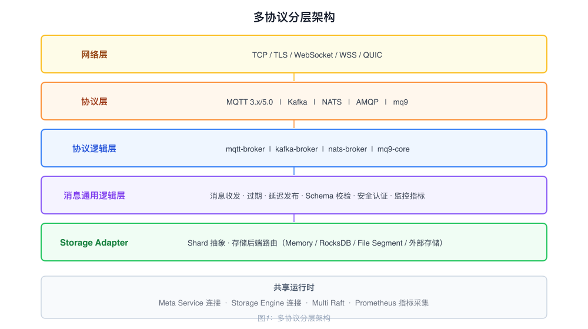

# Multi-Protocol Architecture

RobustMQ supports five protocols — MQTT, Kafka, NATS, AMQP, and mq9 — within a single Broker process. All protocols share the same runtime, storage layer, and cluster coordination components.

---

## Layered Structure

---

## Layer Responsibilities

### Network Layer

Listens on per-protocol ports, handles connection establishment and TLS handshake, and delivers byte streams to the protocol layer for parsing. Five transport modes are supported: TCP, TLS, WebSocket, WebSocket Secure, and QUIC.

### Protocol Layer

Protocol-specific encoding and decoding logic. Parses byte streams into protocol frames and serializes protocol frames back into byte streams. Contains no business logic.

| Protocol | Status |
|----------|--------|
| MQTT 3.1 / 3.1.1 / 5.0 | Production-ready |
| Kafka | In development |
| NATS | In development |
| AMQP | Planned |
| mq9 | In development |

### Protocol Logic Layer

Protocol-specific business modules that handle session management, subscriptions, consumer groups, and other protocol-defined behaviors. Crates for different protocols have no dependencies on each other.

### Common Message Logic Layer

Business capabilities shared across all protocols, called by each protocol logic layer:

| Capability | Description |
|------------|-------------|
| Message expiry | Cleans up messages according to per-Topic TTL configuration |
| Delayed publish | Delivers messages at a specified future time |
| Authentication | Username/password, TLS certificate, and token verification |
| ACL | Read/write access control at the resource level |
| Schema validation | Validates message payload format |
| Metrics | Prometheus metrics collection |

### Storage Adapter

Abstracts each protocol's storage concepts (Topic / Partition / Queue) into a unified Shard, and routes operations to the appropriate storage backend. The Broker has no awareness of the underlying storage type or distribution. See [StorageAdapter-Architecture.md](./StorageAdapter-Architecture.md).

---

## Shared Runtime

All protocols share:

- **Meta Service connection**: Cluster coordination and metadata reads/writes use a shared gRPC connection pool
- **Storage Engine connection**: Message reads and writes share a single storage layer; data is written once
- **Raft state machine**: Cluster consistency is provided by the same Multi-Raft implementation
- **Metrics collection**: Prometheus metrics are exposed on a single shared port

---

## Protocol Isolation Principle

Protocol logic layers have no crate-level dependencies on each other and evolve independently. Protocol-specific concepts (MQTT QoS, Kafka Consumer Group, NATS Subject) do not leak into other layers. Shared capabilities (authentication, Schema validation, metrics) are provided as separate crates and imported on demand by each protocol.

As a result, adding a new protocol does not touch existing protocol code, and changes to one protocol do not affect others.

## Cross-Protocol Message Routing

Each protocol currently stores messages in its own Shards; there is no automatic routing between protocols. Cross-protocol message sharing is implemented at the Shard level through the Storage Adapter: consumers from different protocols can subscribe to the same Shard (i.e., the same Topic/Partition mapping) to consume the same data.

---

## Scope of Adding a New Protocol

Adding a new protocol requires implementing:

1. **Protocol layer**: Encoding/decoding logic to parse protocol frames
2. **Protocol logic layer**: Protocol-specific session, subscription, and consume business logic
3. **Network layer registration**: Register the protocol handler on the corresponding port

The following do not need to be modified: Storage Adapter, Storage Engine, Meta Service, or the common logic layer.
