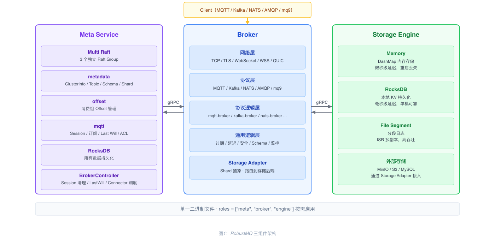
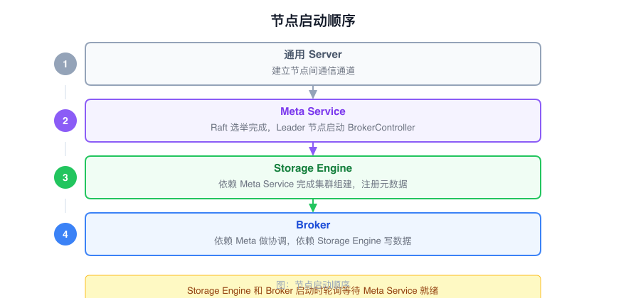
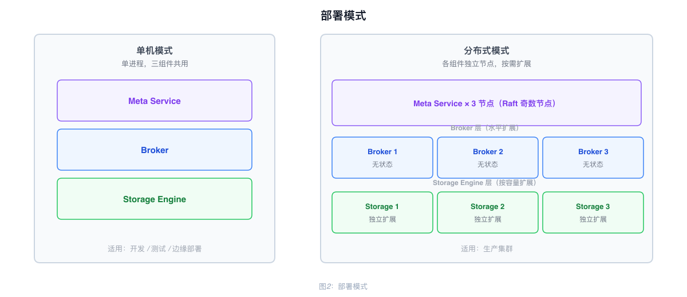

# RobustMQ Overall Architecture

## Components

RobustMQ consists of three core components, delivered as a single binary. The `roles` field in the configuration determines which components are enabled:

```toml
roles = ["meta", "broker", "engine"]
```

| Component | Responsibility |
|-----------|----------------|
| **Meta Service** | Cluster metadata management, node coordination, cluster controller |
| **Broker** | Multi-protocol parsing and message processing (MQTT, Kafka, NATS, AMQP, mq9) |
| **Storage Engine** | Built-in storage engine with Memory, RocksDB, and File Segment backends |

All three components can run together on a single machine, or each can be deployed independently on separate nodes.



---

## Broker Layered Structure

The Broker is a stateless protocol processing layer, organized into the following layers:

| Layer | Description |
|-------|-------------|
| Network Layer | TCP / TLS / WebSocket / WSS / QUIC |
| Protocol Layer | MQTT / Kafka / NATS / AMQP / mq9 protocol parsing |
| Protocol Logic Layer | Per-protocol business modules (mqtt-broker, kafka-broker, etc.) |
| Common Message Logic Layer | Message send/receive, expiration, delayed publishing, authentication, Schema validation, metrics |
| Storage Adapter | Shard abstraction layer that routes write operations to the appropriate storage backend |

The Broker does not persist any data. All state is stored in the Meta Service or the Storage Engine.

---

## Inter-Node Communication

Each node starts three server types at startup:

| Server | Protocol | Purpose |
|--------|----------|---------|
| Inner gRPC Server | gRPC | Internal inter-node communication (Meta ↔ Broker ↔ Storage Engine) |
| Admin HTTP Server | HTTP | External operations interface (REST API) |
| Prometheus Server | HTTP | Metrics scrape endpoint |

---

## Startup Order

Modules within a node initialize in a fixed sequence:

1. **Configuration loading**: Read `config.toml` and parse the `roles` field to determine which components to enable
2. **Logging system**: Initialize the tracing subscriber; all subsequent logging depends on this step
3. **gRPC server startup**: Inner gRPC Server, Admin HTTP Server, and Prometheus Server bind their ports in sequence
4. **Meta Service initialization** (if enabled): Initialize MultiRaftManager, create the three Raft Groups in order, and complete leader election
5. **Storage Engine initialization** (if enabled): Create the I/O Worker Pool, mount existing Segment files, and register the node with Meta Service
6. **Broker initialization** (if enabled): Connect to Meta Service, load Topic/Shard caches, and start protocol handlers
7. **Ready**: Begin accepting client connections



---

## Deployment Modes

**Standalone mode**: All three components run in a single process. Suitable for development, testing, and edge deployments.

**Distributed mode**: Each component is deployed on separate nodes and scaled independently. Typical configuration:

- Meta Service: 3 or 5 nodes (odd number for Raft quorum)
- Broker: horizontally scaled based on traffic, stateless
- Storage Engine: scaled based on storage capacity


