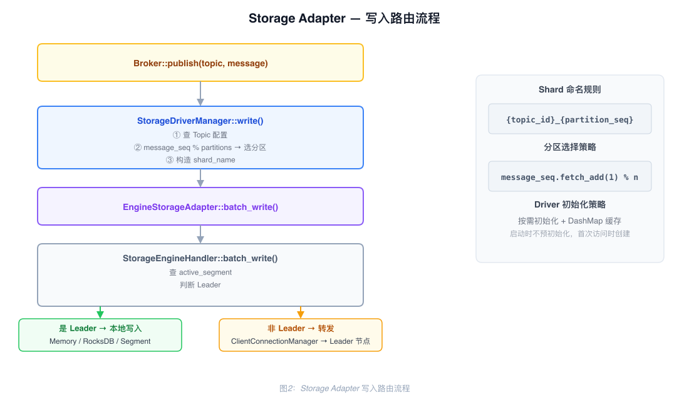
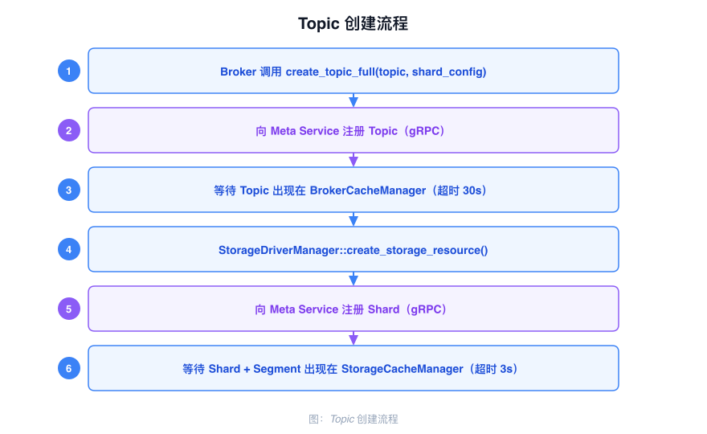
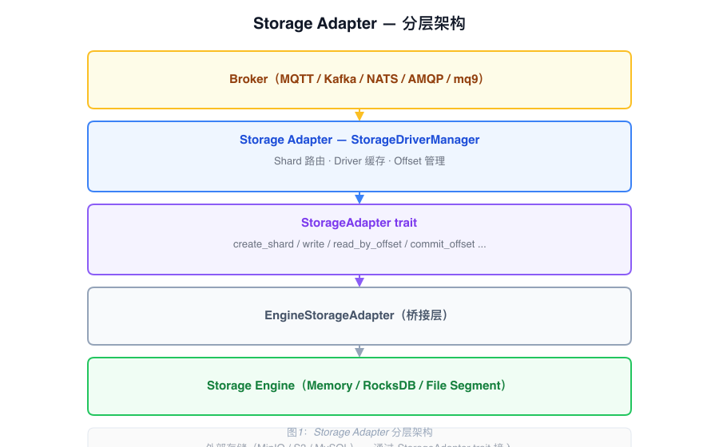

# Storage Adapter Architecture

The Storage Adapter sits between the Broker and the Storage Engine. It maps storage concepts from different protocols to a unified Shard abstraction and routes read/write operations to the appropriate storage backend.

---

## Shard Abstraction

Storage concepts from each protocol are mapped to Shard:

| Protocol | Original Concept | Mapped To |
|----------|-----------------|-----------|
| MQTT | Topic | Shard |
| Kafka | Partition | Shard |
| AMQP (planned) | Queue | Shard |

One Topic maps to a group of Shards (multiple partitions). Naming convention:

```
{topic_id}_{partition_seq}
```

Each Shard has its storage type configured independently (`EngineMemory` / `EngineRocksDB` / `EngineSegment`). Shard and Segment metadata are managed centrally by the Meta Service.

---

## Core Components

### StorageAdapter trait

The unified interface that all storage backends implement:

| Method | Description |
|--------|-------------|
| `create_shard` | Create a Shard |
| `delete_shard` | Delete a Shard |
| `write` | Write a single message, return Offset |
| `batch_write` | Write a batch of messages |
| `read_by_offset` | Read by Offset |
| `read_by_tag` | Read by Tag |
| `read_by_key` | Read by Key |
| `get_offset_by_timestamp` | Look up Offset by timestamp |
| `get_offset_by_group` | Query consumer group Offset |
| `commit_offset` | Commit consumer group Offset |

### StorageDriverManager

The entry point component called directly by the Broker:

| Field | Type | Description |
|-------|------|-------------|
| `driver_list` | `DashMap<String, ArcStorageAdapter>` | Caches initialized drivers by storage type |
| `engine_storage_handler` | `Arc<StorageEngineHandler>` | Underlying engine handler |
| `broker_cache` | `Arc<BrokerCacheManager>` | Topic metadata cache, queried during routing |
| `offset_manager` | `Arc<OffsetManager>` | Consumer group Offset management |
| `message_seq` | `AtomicU64` | Global write sequence number, used for round-robin partition selection |

Drivers are initialized on demand and cached to avoid repeated creation.

### EngineStorageAdapter

Implements the `StorageAdapter` trait and delegates calls to `StorageEngineHandler`. This is the bridge layer between the Storage Adapter and the Storage Engine.

---

## Write Path

When the Broker receives a message, it calls `StorageDriverManager::write`, which proceeds as follows:

1. Look up the Topic's partition count and storage type from `BrokerCacheManager`
2. Fetch-and-increment `message_seq`, then select the target Shard by modulo: `topic_id_{seq % partition_count}`
3. Look up the matching Driver in `driver_list`; if not found, initialize it on demand and cache it
4. Call the Driver's `write` method and return the resulting Offset

Batch writes (`batch_write`) follow the same logic: each message independently selects a Shard, then all writes are submitted together.



---

## Topic Creation Flow

When a Topic is created, the Broker requests Shard configuration from Meta Service. Meta Service allocates partition sequence numbers and Segment resources, then notifies the Storage Engine to initialize the backing storage structures:

1. The client requests Topic creation; the Broker validates parameters and calls the Meta Service gRPC interface
2. Meta Service writes the Topic and Shard configuration into the metadata Raft Group
3. Meta Service notifies the Broker via `UpdateCache` to refresh the local `BrokerCacheManager`
4. The Storage Engine receives the Shard creation directive and initializes the corresponding Active Segment



---

## Offset Management

`OffsetManager` supports two storage strategies:

| Strategy | Implementation | Description |
|----------|---------------|-------------|
| Cache storage (`enable_cache=true`) | `OffsetCacheManager` | Local RocksDB cache, low latency |
| Persistent storage | `OffsetStorageManager` | Written to Meta Service, strong consistency |

---

## Layer Relationships


