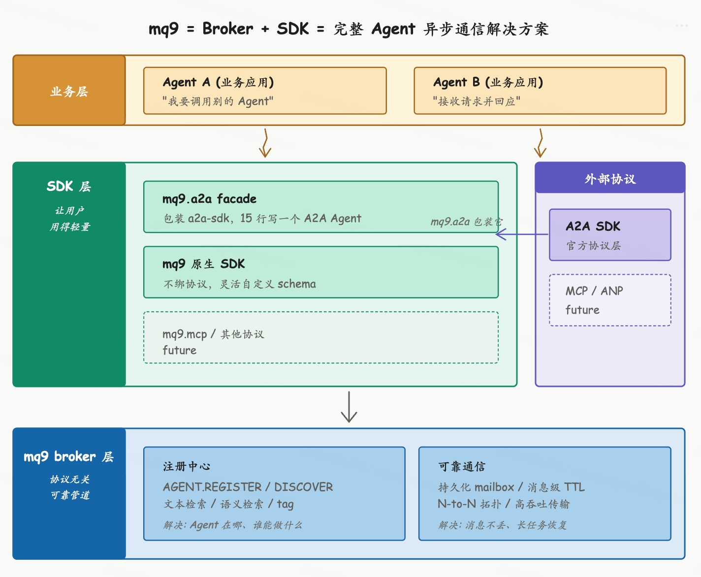

# Broker + SDK: A Complete Solution for Agent Async Communication

mq9 has been thinking through one question lately: how to integrate better with the A2A protocol so that async communication between Agents becomes more reliable and simpler.

Working through it, one thing became clear: once the SDK piece is added, mq9 is no longer just a message queue or transport pipe — it's a complete solution for Agent async communication.

This post walks through the reasoning behind that judgment.

## What mq9 Was Doing Before

mq9 is a messaging infrastructure component designed for Agent communication scenarios, and its positioning isn't bound to any specific protocol.

Agent communication has its own distinct requirements: long-running async tasks, both parties potentially offline, N-to-N collaboration, address-based semantic routing. Traditional message queues (Kafka, RabbitMQ) don't directly cover these, and HTTP as a communication channel doesn't fit either. What the mq9 broker does is build out exactly these capabilities: persistent mailboxes, a registry, N-to-N topology, message-level TTL, and key-based compaction.

The independence of that positioning means mq9 serves the Agent communication scenario itself — not as an appendage to any upper-layer protocol. A2A users get mq9 serving A2A. When MCP expands to Agent-Agent, mq9 serves MCP. Custom protocols work too. Get the foundation solid; which protocol sits on top is a separate question.

## The A2A Protocol and Ecosystem Left Room

Looking at the A2A protocol itself alongside the ecosystem landscape, it becomes clear that something like mq9 isn't operating in a vacuum.

**The A2A protocol itself is deliberately restrained.** It only defines data structures and RPC method semantics — Message, Task, AgentCard — and leaves nearly everything outside the protocol layer alone: discovery is explicitly marked "outside the scope," reliable transport only provides HTTP/SSE/webhook, long-task recovery is left to servers to replay themselves, and N-to-N has no protocol-layer support. This restraint is intentional. The A2A working group only does protocol; transport and infrastructure are left to the ecosystem. Version 1.0 even added dedicated extension points for multiple transports (`ClientFactory.register`, `AgentCard.supportedInterfaces`, etc.).

**The ecosystem itself has noticed the gaps.** Scanning the awesome-a2a repository, the landscape is clear: SDKs, framework integrations, and platform Runtimes are all extremely crowded, but Agent registries, reliable async transport, Monitoring/Tracing adapters, and protocol-agnostic communication pipes are all vacuums. The awesome-a2a README explicitly says "Community contributions welcome," actively recruiting work in several directions.

The positions the A2A protocol left for the ecosystem, and the gaps the ecosystem itself has acknowledged — these are exactly what mq9 is doing. mq9 and A2A aren't a dependency relationship or a replacement relationship. **mq9 is filling the positions that the A2A protocol working group intentionally left for the ecosystem.**

## But the Broker Alone Isn't Enough

Once the engineering depth of the broker exists, there's still a problem: users can't reach it.

What businesses face isn't "I need a broker" — it's "I need my Agents to communicate with each other." Between "having a broker" and "making Agents communicate" lies a long stretch of work: connecting to the broker, defining mailboxes, sending messages, integrating the A2A protocol, handling Task state, and getting interoperability with a2a-sdk. Making businesses do all of this themselves is effectively making them write middleware.

The engineering depth of the broker is real, but engineering depth doesn't transform itself into a product on its own. The SDK is needed to wrap the broker's capabilities into a form that businesses can actually use directly.

## Adding the SDK Completes the Solution

mq9 is composed of two parts — broker and SDK — each complementing the other.

| Dimension | broker | SDK |
|-----------|--------|-----|
| Problem solved | How Agents communicate reliably | How users use it better |
| Role | Source of communication capability | Release of communication capability |
| Limitation alone | Users can't reach it | Without the broker, just another wrapper |
| Combined effect | Business writes 15 lines of code for reliable Agent communication | |

The broker makes Agent communication solid; the SDK exposes the broker's capabilities to users with minimum code. The SDK wraps a2a-sdk to provide a lightweight facade — 15 lines of code to write an A2A Agent running on mq9.

Together, **mq9 solves both core pain points of Agent communication at once**:

**Agent registration and discovery**: Where is my Agent, where is the other party's Agent, who has the capability to do what I need? The mq9 broker has built-in `AGENT.REGISTER` and `AGENT.DISCOVER`, supporting text search, semantic search, and tag filtering — out of the box.

**Reliable communication between Agents**: How do messages not get lost, how are they processed by priority, how does N-to-N collaboration work, how do long tasks recover, what happens when both sides are offline? The mq9 mailbox model is designed for these scenarios. Combined with the SDK, businesses use all of this with 15 lines of code.

These two pain points aren't invented by mq9 — they're inherent to the Agent communication scenario. No single project in the current ecosystem solves both pain points to the level of "out of the box." Some only do registration (AWS Registry). Some only patch the transport (A2A default HTTP). Some build an all-in-one suite (Bindu/Aira/Inai) that buries the core pain points under a dozen features.

mq9 makes both of these solid and makes reliable Agent communication very simple. **This is the concrete meaning of "a complete solution for Agent async communication"**: what businesses see when they face mq9 is the answer to the complete question of "how do my Agents communicate with other Agents" — no need to stitch together low-level components.

## Comparison with Traditional Message Queues

A complete solution isn't just "a better message queue" — it's a fundamentally different product positioning.

| Dimension | Traditional MQ (Kafka/RabbitMQ) | mq9 |
|-----------|---------------------------------|-----|
| Abstraction unit | topic / queue | mailbox (Agent address semantics) |
| Who it serves | General message streams | Designed specifically for Agent communication |
| Discovery | None | Built-in registry + semantic search |
| Protocol neutrality | Generic byte stream | Generic byte stream + major Agent protocol wrappers |
| Integration complexity | Business writes glue code | Business writes 15 lines of code |
| Long-term direction | General throughput and retention | Security, audit, observability for Agent scenarios |

Kafka will never have built-in Agent address semantics like `agent.translator.inbox`, because its positioning is general-purpose message infrastructure. mq9's positioning is the Agent communication scenario; every design decision flows from that. The two are specialized tools for different scenarios — not replacements for each other. A company using Kafka in the data team and mq9 on the Agent platform is a reasonable coexistence.

## Things mq9 Might Do Further Down the Road

Looking ahead, mq9 may build out a set of capabilities — all specifically enhanced for the Agent communication scenario, not directions traditional message queues have ever cared about.

**Security**: Communication between Agents involves business systems, user data, and decision-making authority. An Agent that can call into a core trading system and a translation Agent can't use the same access control. mq9 can do Agent-level authentication and authorization — not just topic ACLs.

**Audit**: What decisions did an Agent make, which Agents did it call, what messages did it pass — these need to be auditable and traceable, especially in high-stakes domains like finance, healthcare, and law. The broker's message persistence is a natural foundation for auditing; adding trace collection at the SDK layer creates complete audit capability.

**Observability**: Agent collaboration often involves multiple Agents chained together. When something goes wrong — who was slow, who failed, where did the message get stuck? Messages on the broker can naturally carry OpenTelemetry trace context.

**Compliance**: Agent communication entering heavily regulated industries like finance and healthcare is highly likely. Message retention periods, data masking, cross-border transfer controls — these are all compliance requirements. Thinking about architecture ahead of time is far easier than retrofitting it later.

These are enhancements built specifically for the Agent communication scenario. Kafka's direction is taking "general-purpose reliable message delivery" to its limit. mq9's direction is going deep on "a complete solution for the Agent communication scenario." Focus on one thing and do it thoroughly.

## Summary

mq9 is a foundational component for Agent communication, composed of two parts: the broker provides a protocol-agnostic reliable message pipe (persistent mailboxes, a registry, N-to-N topology); the SDK provides a lightweight protocol wrapper layer (supporting A2A and other major protocols, as well as custom protocols). The broker solves reliable communication; the SDK solves how to use it better. Each complements the other.

Together, mq9 solves both core pain points of Agent communication at once: registration and discovery, and reliable communication. This is a complete solution for Agent async communication — not a single message queue or transport pipe. It's a specialized tool for a different scenario from traditional message queues, not a replacement.

Looking ahead, mq9 may go deep on capabilities unique to the Agent scenario: security, audit, observability, compliance. This is a direction message queues have never cared about — and one that Agent scenarios will inevitably need.
