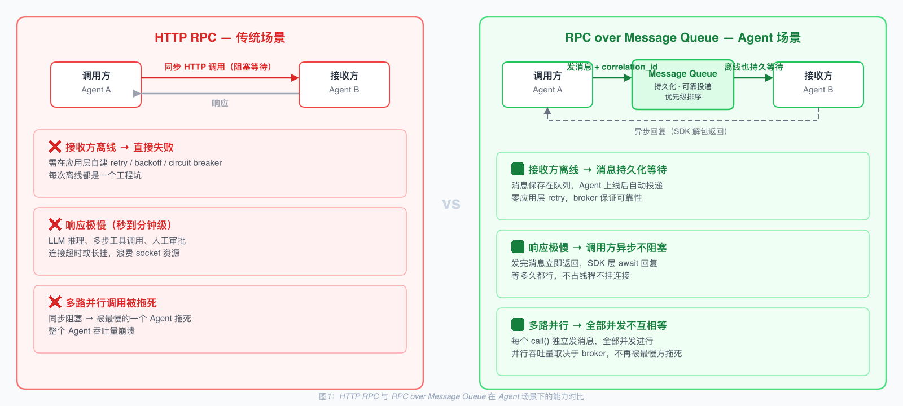
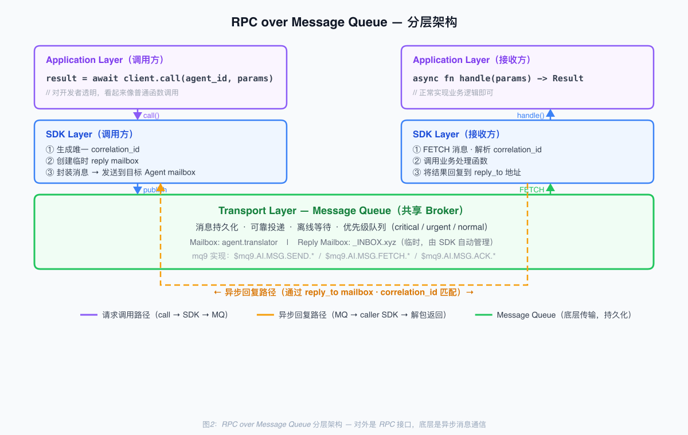

# RPC over Message Queue May Be the Best Communication Method for Agents

## Starting from NATS Request-Reply

NATS has supported request-reply from the very beginning. It takes just one line of code to run: a client sends a request to a subject, the server subscribes to that subject, processes it, and writes back a response. From an engineering perspective this is an elegant design — complete bidirectional communication, automatic management of inboxes, correlation, and timeouts, and far cleaner than assembling a full RPC implementation yourself out of raw publish/subscribe.

But in real-world engineering, almost no one uses NATS request-reply.

For service-to-service communication, engineers choose HTTP, gRPC, or REST — not NATS request-reply. The reason is simple: in traditional service communication scenarios, HTTP/gRPC are the de facto standard. The ecosystem is mature, tooling is complete, operations are well-understood, and every engineer knows them. Using NATS request-reply for RPC means introducing a message broker, requiring every client and server to connect to that broker, and then doing something engineers aren't familiar with for a job that HTTP could handle directly. This is classic over-engineering.

NATS's own documentation acknowledges this. In the NATS use-case list, request-reply usually comes after pub/sub, streaming, and JetStream — a capability that's "supported but not the main focus." Community examples lean heavily toward using NATS for IoT messaging, service orchestration, and data pipelines, with service-to-service RPC being rare. This isn't because NATS is poorly designed; it's because the request-reply over message queue pattern has no reason to exist in traditional scenarios.

But the Agent era is different. The same pattern shifts from over-engineering to an essential requirement in Agent communication scenarios.

## HTTP RPC Falls Short in Agent Scenarios

To understand this clearly, start with the essence of RPC. RPC is the "request-response" pattern — letting one process call another process's capabilities. Synchronous-blocking, looks like a local function call, communication details hidden underneath. HTTP, gRPC, and JSON-RPC are all implementations of this pattern.

Synchronous-blocking RPC makes strong assumptions about the receiver: the receiver must be online, must respond quickly, and the caller must wait. These three assumptions basically hold in traditional microservice scenarios. Services are always online, responses come in milliseconds, and waiting a few hundred milliseconds is acceptable. So "synchronous RPC over persistent connections" like HTTP/gRPC became the mainstream. NATS request-reply had no chance in that environment — HTTP already satisfies the need.

But in Agent scenarios, all three assumptions break down.

Agents are often offline. LLM Agents start on demand; edge Agents have intermittent connectivity; Agents deployed across regions may be under maintenance; local Agents may be on machines that are powered off. A synchronous HTTP call to an offline Agent fails immediately, and you have to implement retry, backoff, and circuit breaker at the application layer — each failure is an engineering headache.

Agent responses can be very slow. LLM inference taking seconds to minutes is normal; multi-step tool calls take even longer; waiting for human approval may take hours. Synchronous HTTP either times out (the default 30s or 120s is far from enough) or keeps a connection open, wasting sockets. Long-task scenarios are naturally incompatible with synchronous RPC.

Callers can't afford to wait. An LLM Agent often calls multiple other Agents in parallel to complete a task — find a translator, query data, do a calculation, generate an image. If every call blocks synchronously, the entire Agent is held hostage by the slowest one. In Agent architecture, asynchronous is the default mode, not an optimization.

## Message Queue Capabilities Align Exactly with Agent Requirements

When all three core assumptions of HTTP RPC fail, a new implementation approach is needed. This is where message queues as the underlying transport become reasonable. Message persistence naturally handles offline receivers; messages can wait in the queue indefinitely, naturally supporting slow responses; the caller sends and moves on, naturally supporting parallel calls. The core capabilities of message queues cover exactly the weaknesses of HTTP RPC in Agent scenarios.

But pure message queue mode — requiring application code to handle message sending and receiving, subscriptions, and correlation management directly — is too complex. What developers want is the interface `result = await call(agent_id, params)`, not a whole sequence of publish + subscribe + match correlation_id steps. This is why message queues were unpopular in traditional scenarios: the capability was right, but the interface wasn't developer-friendly enough.

## RPC Interface + Message Queue Underneath

The solution is actually natural: use message queues at the bottom to solve real engineering problems (async, reliability, persistence, load balancing), and use an RPC interface at the top to hide complexity from developers. This is RPC over Message Queue.

How does it work concretely? When the sender calls `result = await client.call(agent_id, params)`, the SDK does these things underneath: generates a unique correlation_id, creates a temporary reply mailbox, wraps params into a message with the correlation_id and reply address and sends it to the target Agent's mailbox, awaits the first message on that reply mailbox at the SDK layer, then unpacks and returns when the reply arrives. The caller sees a synchronous `await` interface; underneath, the communication is asynchronous message flow. The API layer is RPC; the transport layer is a message queue.

This pattern isn't new. NATS request-reply has been doing it this way all along; AMQP/RabbitMQ's RPC pattern and ZeroMQ's REQ/REP both follow this thinking. But in traditional scenarios people didn't use it, because HTTP direct calls were simpler. In Agent scenarios people will use it, because HTTP direct calls are simply not viable. Same technology, completely different value because the application scenario fundamentally changed — from ignored to essential.

## Looking Back at History

This kind of shift has happened before.

Early containerization was considered over-engineering — one VM per application works fine, why bother with containers? But as application scale, iteration speed, and resource utilization requirements changed, containerization went from over-engineering to the de facto standard, and Kubernetes became core infrastructure for the cloud-native era.

Service Mesh is similar. Traditional service communication worked fine with direct HTTP; adding a sidecar was unnecessary complexity. But when services numbered in the thousands, became polyglot, and required unified governance, service mesh went from over-engineering to essential.

RPC over Message Queue is following the same path in the Agent era. Unnecessary in traditional scenarios; an essential requirement in new ones.

The technology itself hasn't changed, but once the scenario changes, yesterday's over-engineering becomes today's de facto standard. NATS request-reply wasn't used in traditional scenarios not because it was poorly designed, but because the problem it solves didn't exist in that context. HTTP was enough; introducing a message broker for RPC was over-engineering. But the Agent era flipped the scenario. All of HTTP's core assumptions fail; all of message queue's core capabilities become essential requirements. Same technical pattern, completely different value when the scenario changes.

The story of RPC over Message Queue is just beginning in the Agent era. Looking back in 3–5 years, the service communication paradigm for the Agent era should no longer be HTTP/gRPC, but RPC over Message Queue. Whether this prediction holds, time will answer.
