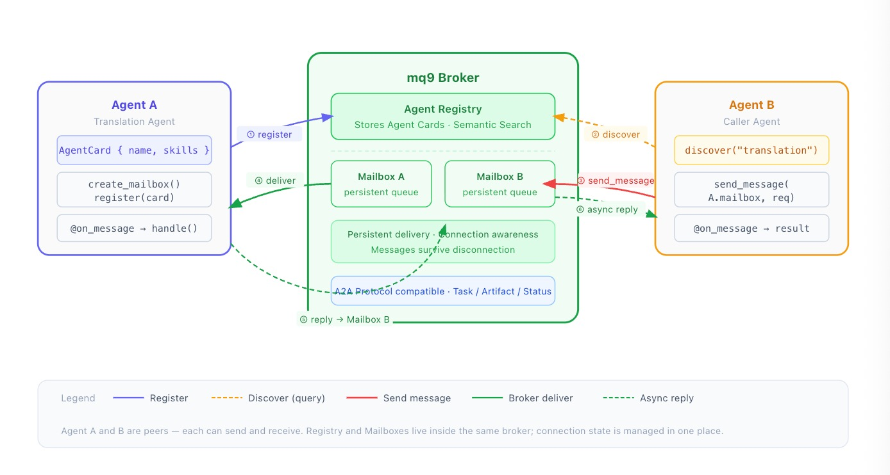

# Agent Communication: Why Registration and Communication Can Coexist

AI Agents are moving from monolithic applications to multi-Agent collaboration. A complex task is divided among multiple Agents: a translation Agent, a search Agent, a code execution Agent — each responsible for a piece, calling each other as needed.

The first engineering problem encountered when implementing this pattern in practice isn't the capabilities of the Agents themselves — it's communication.

Agent-to-Agent communication is different from traditional microservice communication. Microservices are homogeneous, deployed on known infrastructure with relatively fixed IPs and ports, and service discovery is an internal problem. Agents are different: they can run anywhere, capabilities are declared dynamically, and callers don't care where an Agent is deployed — only what it can do.

Two Agents might come from different organizations, different frameworks, different runtimes, and need to collaborate without shared infrastructure. Traditional service discovery tools like Nacos and Consul solve "find the address of this service" — they can't solve "find an Agent that can do this thing."

A2A (Agent-to-Agent) is an open standard led by Google with participation from multiple vendors. Its goal is to solve the interoperability problem between heterogeneous Agents. It defines how Agents describe their identity and capabilities (Agent Card), how they are discovered (Agent Registry), and the task protocol between Agents (Task, Message, Artifact).

A2A handles registration and transport in layers: Agent Card handles description, Registry handles storage and retrieval, and how the transport layer is implemented is left to each party to decide. This layering means the registry can be an independent service, or it can be integrated with the message transport — both approaches are compliant at the protocol level.

The benefit of an independent registry is decoupling: the registration and messaging systems evolve independently and either can be swapped. The cost is that users need to maintain two systems simultaneously and handle state synchronization between them.

A typical problem: when an Agent disconnects, the registry doesn't necessarily detect it promptly, potentially leaving a record in the Registry even though the Agent is no longer online. Messages already in flight in the message queue also require additional mechanisms to handle. Embedding the registry in the broker lets the broker handle these state synchronization issues itself. When an Agent connection drops, the broker detects it directly and synchronously updates both registration state and message state — no coordination required between two separate systems.

As shown in the diagram below, mq9 chooses to place the registry inside the broker.



The intended experience is: a user connects to a broker, uses a single SDK, and accomplishes everything needed for Agent communication — registering themselves, discovering others, sending messages reliably — without deploying a separate registry and without maintaining two sets of configuration. From a code perspective, the flow looks like this:

```python
agent = Mq9A2AAgent()
await agent.connect()

# Create mailbox, register self, start receiving messages
mailbox = await agent.create_mailbox(card.name)
await agent.register(card)

# Discover other Agents, supports natural language semantic search
results = await agent.discover("translation agent")

# Reliably send messages; broker guarantees delivery
msg_id = await agent.send_message(results[0]["mailbox"], request, reply_to=mailbox)
```

- `create_mailbox` creates a dedicated mailbox for this Agent in the broker. Messages are persistently stored; after the Agent restarts it can continue consuming unprocessed messages.
- `register` publishes the Agent Card to the broker's built-in Registry, making the Agent discoverable by others.
- `discover` supports natural language semantic search — no need to know the other party's exact name; describe the capability and find it.
- Messages sent via `send_message` are delivery-guaranteed by the broker. Once the sender has the msg_id, the message is in the queue and won't be lost even if the recipient is temporarily offline. Agents are peers — each can both send and receive messages, with no fixed client/server roles. Task results are returned asynchronously via the mailbox specified in reply_to; the sender doesn't need to block and wait.

mq9's A2A implementation follows the A2A protocol standard. Agent Card field definitions, task state transitions (WORKING → Artifact → COMPLETED), and event types (TaskStatusUpdateEvent, TaskArtifactUpdateEvent) all align with the A2A specification. Agents written with mq9 can interoperate with other A2A-compliant implementations. Embedding the registry in the broker is an implementation choice that doesn't affect protocol-level compatibility.

The A2A protocol defines registration and transport separately, giving implementations sufficient flexibility. Both an independent registry and embedding it in the broker are valid choices.

mq9 chose the embedded approach with the goal of keeping the onboarding cost for Agent communication as low as possible. One broker, one SDK, `create_mailbox`, `discover`, `send_message` — Agent registration, discovery, and reliable communication are all up and running.
