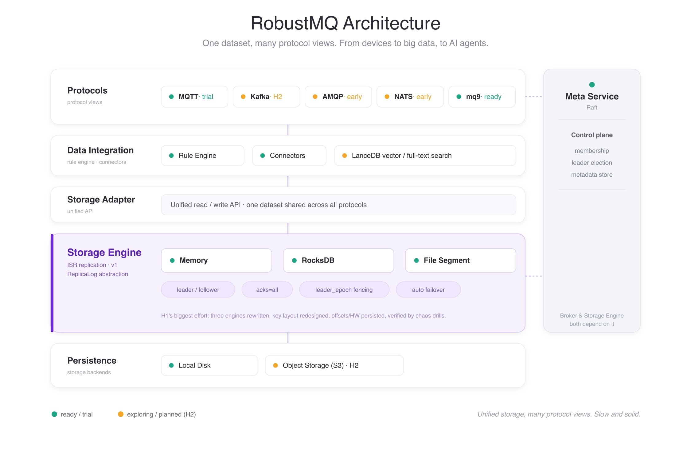

# RobustMQ 2026 H1: Refactoring, Slow, AI

We officially released RobustMQ 0.4.0 on May 5th. MQTT entered the trial stage; the four-protocol pipeline (MQTT/Kafka/AMQP/NATS) was connected end-to-end; the first version of the mq9 kernel was born; and the rules engine was completed. That release we called "core capabilities starting to stabilize."

0.4.0 was a milestone for the first half of the year. From that 0.4.0 release in early May, we kept pushing forward with a series of 0.4.x minor releases, now up to 0.4.7. This post is the H1 2026 retrospective. Since 0.4.0 itself was covered in its own release post, this one focuses on one thing: what we did after 0.4.0.

The first half of the year, put plainly, was two things: solidifying what we had already built, and exploring directions we hadn't yet seen clearly. No single breakthrough moment stood out, but foundation, quality, and direction all moved meaningfully forward. Looking back, the pace exceeded our own expectations.

## What We Did Between 0.4.0 and Now

From 0.4.0 to 0.4.7, eight things stand out.

**First, the Storage Engine completed the first version of the ISR multi-replica mechanism.** This was the biggest investment of the first half — and the first time RobustMQ had a genuine high-availability storage foundation. The storage layer now supports Memory, RocksDB, and File Segment engines, with built-in high-availability failover across all three:

- A three-replica Shard places replicas on three actual nodes. Followers continuously pull logs from the leader via a unified `ReplicaLog` abstraction; LEO converges and HW advances. `log start offset`, `HW`, and `LEO` are all persisted, surviving restarts without losing position.
- When a leader crashes or a node exits gracefully, the leader switches automatically. `leader_epoch` increases monotonically as a fencing mechanism, paired with OffsetsForLeaderEpoch to truncate diverged tails — committed data is never lost.
- Killed nodes self-heal on restart via reconcile, rejoin ISR as followers, and automatically catch up. A segment leader rebalancing loop runs on the meta leader to keep replica leader distribution balanced over time.
- `acks=all` writes commit correctly under both full three-replica and degraded two-replica ISR.

We also surfaced segment details to the API and dashboard — every replica's leader, epoch, ISR, LEO, HW, and fetch state are directly visible. This is version one, far from mature. But "the storage layer can automatically switch leaders on node failure without data loss" is true for the first time.

**Second, the kernel added vector search and full-text search powered by LanceDB.** This looks unrelated to a message queue, but it lays the groundwork for semantic Agent discovery down the road. Once many Agents are running, "find the right Agent by capability, by semantics" will become an essential requirement — the kernel is building in the search capability now.

**Third, mq9 was repositioned as the registration and communication infrastructure for Agents.** At 0.4.0, mq9 was still just "a protocol designed for Agent async communication." In the first half we clarified its positioning more precisely: beyond serving as Agents' async mailbox, it should also handle Agent registration and discovery. This version added Agent registration and discovery, and explored a2a over mq9 — running the Agent collaboration protocol directly on mq9. One more step toward "becoming the communication infrastructure AI Agents actually need."

**Fourth, the Hermes Agent-based chaos test suite robustmq-chaos was brought up and running.** This was our new attempt at "how do we ensure quality long-term": use LLM and Hermes Agent to automatically orchestrate chaos tests, observe system behavior, generate reports — build a harness that brings the human effort of chaos testing down. The first version is running. Supporting it, we crystallized the ISR rolling restart drill and Raft cluster exercises into repeatable drills: kill a node, observe, restart, verify — ten rounds per drill, rotating which node gets killed. A batch of ISR bugs were found and fixed through this process: heartbeats must be reported to every meta node (otherwise a meta leader change would expire all nodes and cause perpetual ISR churn); ISR contraction must use fetch recency, not LEO; offsets of existing data must not be reset on a leader switch; a restarted follower must rely on reconcile to self-heal and resume replication. Each of these bugs plugged in turn is what makes the system's behavior in failure scenarios predictably correct.

**Fifth, all three storage engines underwent major refactoring and rewrites.** The commitlog read, write, expiry, index, and replica paths were largely rewritten. We redesigned the RocksDB key layout so that all keys for a Shard converge under a single prefix, and keys for each segment converge under its sub-prefix. This turned "delete a Shard, delete a segment" from manually enumerating seven or eight prefixes (and still risking misses) into a single prefix delete — future key type additions won't be forgotten either. Several hazards in the read path were fixed (a single oversized record could stall consumption; retention could deadlock on small data volumes), along with some performance optimizations. None of this produces new features, but it moves the storage layer from "works" to "solid."

**Sixth, with AI's help, a large wave of unit and integration tests was added — the RobustMQ harness was established.** This half-year saw extensive unit and integration tests added, covering the storage engines, ISR, and core paths of each protocol. We also solidified a reusable test harness around cluster startup, running test cases one by one, and chaos drills: clean environment, start three-node cluster, run cases, locate and fix failures on the spot. Quality isn't built in a sprint — it's built on a system that can keep running and surface problems on its own. This half we were building that foundation.

**Seventh, MQTT stabilized and we have early trial users.** MQTT added almost no new features in the first half; the focus was entirely on stability — getting QoS 2 cross-node semantics right, smoothing out concurrency and consistency edge cases. We now have a few trial users. For foundational software, having people willing to actually use it and give feedback is worth more than adding another feature. That's encouraging.

**Eighth, the HTTP interface and Dashboard went through another round of refactoring.** Cluster info, the Meta Service Raft state machine view, node and configuration details, Shard/Segment details — as features grew, the interface and dashboard needed a new pass at layering, unified naming, and error handling. This kind of work doesn't appear in the prominent part of a release note, but it determines whether the system is maintainable and whether users' first impression is good.

Overall, the first half was productive and paced ahead of expectations. But we're clear-eyed: most of these are "first versions," still far from mature.

## H2 2026 Plans

H1 solidified the foundation; H2 keeps moving forward.

**First, continue refining the storage layer — make all three engines more stable, and explore an object storage (S3) implementation.** The stability of all three engines will be continuously refined. At the same time, one step further: sink data to object storage like S3, preparing for low-cost, high-volume, tiered hot/cold storage.

**Second, thicken mq9's capabilities as registration and communication infrastructure.** Add semantic interception, auditing, and tighter integration with a2a. The goal: make mq9 the infrastructure layer that Agent collaboration should default to having.

**Third, start supporting the Kafka protocol.** The storage layer's ISR multi-replica is largely ready; the supporting ecosystem is filling in. The foundation for Kafka support is there. Building Kafka out closes the loop on RobustMQ's positioning around MQTT, Kafka, and mq9 as the core: bridging the full chain from IoT devices to big data platforms to AI Agents.

**Fourth, keep fixing bugs, refactoring code, building out the peripheral test infrastructure, and expanding the AI-powered harness.** Quality is continuous investment, not a one-time effort. We'll keep using AI to deepen the test harness, preserving the margin needed to guarantee RobustMQ's quality going forward.

**Fifth, keep refining the peripherals.** MQTT, Dashboard, CLI, and HTTP interfaces continue to be polished. The user experience of foundational software is built up piece by piece through these "peripherals."

## On AI

AI is in the title, so it deserves more than a mention — it means two things for RobustMQ.

One is direction. We're betting that as the AI Agent wave develops, async communication, registration, and discovery between Agents will require a new infrastructure layer. mq9 is aimed at exactly that. In the first half it evolved from a protocol toward Agent registration and communication infrastructure; adding vector and full-text search to the kernel prepares for Agents finding each other by semantics; a2a over mq9 is a probe at whether the Agent collaboration protocol can grow natively on mq9. This thread is still early, but we've thought through the direction.

The other is method. A large share of the work this half was done with AI's help. The storage layer's refactoring and rewrites, the batch of tests added, the ISR bugs dug out one by one, even the harness that automatically runs chaos drills — AI was involved in all of it. Honestly: without AI, a small team's headcount couldn't have produced this pace of progress in the first half.

But one thing has become increasingly clear: AI makes you fast; it doesn't do your thinking. Where to go, which tradeoff is right, whether this code should be changed this way — in the end you have to decide yourself. The faster AI writes, the more important it becomes to have someone who stays grounded, who reviews, who judges, who takes responsibility for what's right and wrong. The speed is AI's gift; staying solid is your job.

This is also the other side of "slow": when your tools are ten times faster, your pace of decision-making needs to be that much more steady.

## Closing

Looking further out, what we want to build is actually simple: a unified messaging infrastructure that connects IoT, big data, and AI — three pipelines that have each gone their own way — into one. One piece of data written in; MQTT sees device QoS and retain, Kafka sees offset and partition, mq9 sees Agent mailbox. One copy of storage underneath, no data migration, no bridge conversion. Device data can feed directly into the big data platform and directly into AI Agents. That's the shape RobustMQ is growing into.

How to get there — we haven't set a timeline, and we don't give ourselves oversized goals. Over the years, a few operating principles have gotten clearer:

- **Slow is fast.** Foundational software has no shortcuts; every step must be walked firmly. Better to be slower and make one direction deep and stable before moving to the next.
- **Stable first, then broad.** Making real users confident enough to run it in production matters more than supporting another protocol or adding another feature.
- **Quality comes from systems, not supervision.** Use AI to turn testing and chaos drills into a harness that runs automatically long-term, so problems surface even when no one is watching.
- **Use AI, but make your own decisions.** AI has made us much faster, but direction, tradeoffs, and right vs. wrong still need to be thought through yourself. The faster you go, the steadier you need to be.
- **Open source, long-term thinking.** Don't chase trends; build it piece by piece, together with the community.

Foundational software is a slow game. There's no rushing it, and no need to rush. Do each thing solidly, and keep moving forward one step at a time.

See you in H2.

---

Project: https://github.com/robustmq/robustmq

Trial use and feedback welcome.
