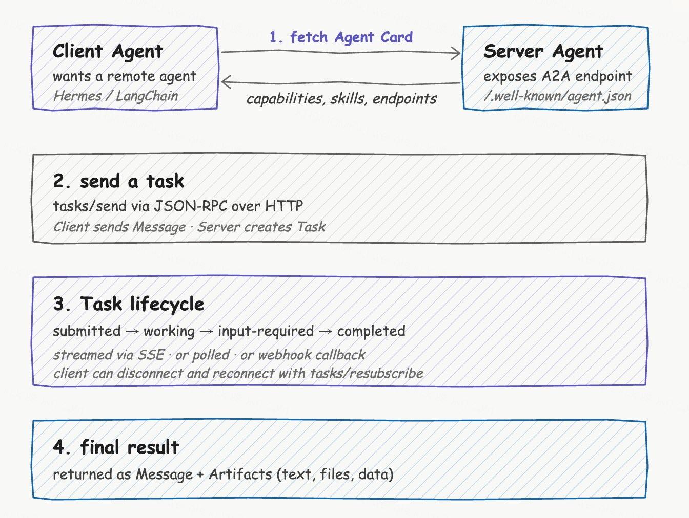
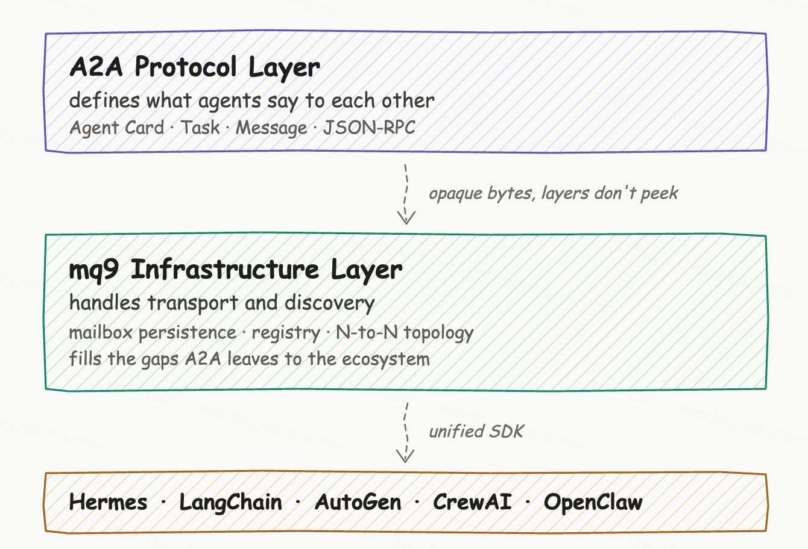

# mq9 and A2A: A Few Rounds of Thinking

I've been mulling over what the relationship between mq9 and A2A should be.

mq9's own protocol design has been in progress for a while. The mailbox abstraction, persistence, TTL, key-based compaction, full-push on subscribe, and lightweight registry — these capabilities all work internally within mq9. But mq9 can't survive in isolation; to be useful in practice, it needs concrete application scenarios.

A2A is the most active protocol in the Agent communication space right now — Linux Foundation standard, IBM ACP has been merged in, and there are currently over 100 adopters. If mq9 can find a place in the A2A ecosystem, it avoids having to start from scratch and build a competing protocol.

So what should the relationship between mq9 and A2A be? I've gone back and forth on this quite a few times. This post tries to lay out that thinking.

## A2A First

The A2A protocol itself isn't complicated. You can get through the spec in a day or two. Agent Card describes capabilities, Task state machine manages tasks, Message and Artifact carry content, and JSON-RPC over HTTP handles transport. A single engineer can write an A2A server in a few hundred lines of Python.

But when you actually try to run A2A in an enterprise, you find that the spec leaves a few gaps. These aren't design mistakes on A2A's part — A2A deliberately left them for the ecosystem. It defines the protocol layer (what Agents say to each other) and leaves the transport and discovery layer (how messages actually get there) to underlying infrastructure.

The first gap is that discovery is incomplete. The A2A spec requires Agents to expose an Agent Card at `/.well-known/agent.json`, but this only solves "how to read an Agent Card once you know the domain" — it doesn't solve "how to find the domain in the first place." The spec itself says: "The mechanism for this registration is outside the scope of the A2A protocol itself." — explicitly leaving the registry as an open problem for the ecosystem to experiment with. GitHub Discussion #741 has been going for months without converging. Current practices include hardcoded URLs, internal wikis, using MCP as an agent registry (a clear hack), and custom KV mappings. None of them are complete.

The second gap is that async communication is unreliable. A2A currently has three async mechanisms: SSE streaming, webhook, and polling. SSE streaming works when the client is online waiting for results — if the network drops, it's gone. Webhook is fire-and-forget, requires the client to have a publicly reachable endpoint, and the spec doesn't define failure handling. Polling is the simplest but the most wasteful. None of the three is "purpose-built async infrastructure."

The third gap is state recovery for long-running tasks. A Task can run for hours or even days. What happens when a client goes offline and comes back — how does it get the state updates it missed? A2A provides `tasks/resubscribe` to let the server replay history. But this requires the server to maintain a complete Task state history, and replaying from history on every resubscribe is a non-trivial implementation burden.

The fourth gap is N-to-N collaboration. A2A is an asymmetric client-server model, but real multi-Agent collaboration is often N-to-N — a primary Agent coordinating multiple sub-Agents, with sub-Agents possibly communicating with each other too. In this kind of topology, every Agent has to know every other Agent's URL, maintain connection pools, and handle retries. As complexity grows, nobody wants to write that code.

The fifth gap is that every framework has to implement everything from scratch. Any Agent framework that wants full A2A support has to write its own client, server, Agent Card generation, SSE stream handling, Task state machine, INPUT_REQUIRED multi-turn interactions, registry, capability matching, authentication, TLS, and observability. The NousResearch Hermes team listed out all the work in issue #514, and just reading the list gives you a sense of the weight. Even one team doing this is slow — LangChain, AutoGen, and CrewAI each doing it independently means enormous duplicated effort.

Looking at these five gaps together, there's a shared pattern — none of them are problems with the protocol itself. They're problems with missing infrastructure. The A2A protocol design is sound; it defines protocol content and leaves transport and discovery to the underlying layer. But that underlying infrastructure hasn't matured, so everyone deploying A2A ends up rebuilding it themselves.

To use an analogy: HTTP is a simple protocol, but HTTP in production requires DNS, CDN, load balancing, HTTPS certificates, connection pools, and retry libraries. None of that is part of the HTTP protocol, but without it HTTP doesn't work in production. What A2A is missing right now is exactly that layer — the transport and discovery infrastructure that A2A deployment needs.

## That's When I Looked Back at mq9

The design mq9 already did for general Agent communication, when viewed through the specific lens of "transport and discovery infrastructure for A2A deployment," maps directly onto each of those gaps.

A2A lacks a discovery mechanism — mq9 has a built-in Agent registry with tag-based and semantic search. A2A lacks reliable async communication — mq9 has mailbox persistence and reliable delivery. A2A lacks long-running task state recovery — mq9 has full-push on subscribe combined with key-based compaction. A2A lacks a simple way to do N-to-N collaboration — mq9's mailbox model composes flexibly and naturally supports any topology. A2A makes every framework reimplement everything — mq9's SDK lets frameworks share a single implementation.

mq9 didn't do anything special to accommodate A2A. The capabilities mq9 built for general Agent communication turn out to apply, point for point, to the specific problem of A2A deployment. Two independent design paths that ended up at the same place.

This made me rethink how mq9 should position itself. Previously, mq9's design was derived from "what does Agent communication need?" But looking at it in the current ecosystem, mq9's capabilities happen to be exactly what A2A needs as transport and discovery infrastructure. That's not a coincidence — A2A left transport and discovery to the underlying layer, and what the underlying layer needs overlaps heavily with what general Agent communication needs.

So should mq9 explicitly target the A2A transport and discovery layer? After thinking through it a few times, the answer is: yes, but the boundaries need to be clear.

## A Few Principles That Don't Conflict

If mq9 is actually going to be the transport and discovery layer for A2A, there are a few traps to avoid.

Don't redo what the A2A protocol layer already does. Task, Message, Artifact, state machine — those are A2A's domain. The mq9 protocol layer doesn't parse any of that. mq9 mailboxes carry byte streams; what format an A2A packet is in is not mq9's concern — it passes through as-is. That way, when A2A evolves, mq9 doesn't need to change.

Don't try to capture the A2A working group's standardization role. The A2A working group is working on registry standards, PKI trust models, cross-enterprise discovery, and similar problems. Those are protocol-layer concerns. mq9 doesn't try to produce formal standards in that space.

Don't bind to A2A. mq9's design should make A2A the primary protocol it carries today, but not the only one. If MCP later extends to Agent-Agent communication, new Agent protocols emerge, or enterprises have custom protocols, mq9 should carry those too. This matters for the long run — the Agent protocol space is still evolving, and projects that bet on a single protocol are fragile.

Use the extension space the A2A spec already provides. A2A's `pushNotification.url` field accepts any URL compliant with RFC 3986. mq9 uses the `mq9://` URL scheme; A2A SDKs dispatch based on URL scheme — `https://` goes via webhook, `mq9://` goes via mailbox. The A2A spec needs zero changes, and the A2A working group doesn't have to do anything.

This is the difference between "using extension space the spec already allows" and "modifying the spec." The former doesn't conflict; the latter would.

## Hermes as a Concrete Example

With the abstract relationship worked out, a concrete scenario makes it more intuitive.

Hermes is NousResearch's AI Agent framework. Their issue #514 is an A2A integration proposal divided into three phases — client, server, and multi-agent orchestration. The proposal was opened in March 2026 and is still open. Each phase has a detailed implementation checklist.

If Hermes integrates with mq9 instead of implementing A2A from scratch, what does that look like?

The first phase is making Hermes an A2A client that can call remote Agents. Hermes's own approach is to implement two tools — `a2a_discover` and `a2a_call` — integrate a2a-sdk, and handle HTTP client, Agent Card caching, and SSE streaming.

With mq9: discover an Agent with `mq9.discover(query="Agent that can write Python code")`, send a message to the Agent with `mq9.send(target.mailbox, message)`, and subscribe to your own callback mailbox to receive responses. The framework doesn't need a2a-sdk, doesn't need an HTTP client, doesn't need SSE stream handling, and doesn't need Agent Card caching.

The second phase is exposing Hermes as an A2A server. Hermes's own approach is to implement an AgentExecutor wrapping the Hermes AIAgent, auto-generate Agent Cards from toolsets, start an HTTP server, and handle the well-known URL and A2A endpoints.

With mq9: call `mq9.register()` once on startup to register the AgentCard, then subscribe to your own mailbox in the background to receive tasks. The framework doesn't need to start an HTTP server, doesn't need to manage ports, and doesn't need to expose a well-known URL.

The third phase is multi-Agent orchestration. Hermes's own approach is to maintain an agent registry, auto-select agents based on task description, and build fan-out workflows. With mq9: the registry already lives in the mq9 broker, semantic search is a built-in registry capability, and multi-Agent orchestration at the application layer uses mailboxes composed flexibly.

This comparison made me realize that mq9 + A2A isn't "building another wheel" — it's building the wheel that every Agent framework would otherwise build separately, built once and shared. Once a framework integrates mq9, it only needs to care about its Agent's business logic. The transport and discovery work of getting A2A deployed is mq9's problem.

## Not Just Hermes

Generalizing from the Hermes example, every major Agent framework can do a similar integration — LangChain, AutoGen, CrewAI, OpenClaw, all of them. The core of each adapter is wrapping mq9's mailbox operations in framework-native APIs. Different frameworks have different shapes (Hermes is a drop-in directory, LangChain is a pip package, AutoGen is a config entry), but the underlying interface is consistent — register, discover, send, subscribe. This means the mq9 SDK is a thin core, and each framework adapter is a thin wrapper.

Worth noting: Hermes and OpenClaw are compatible — Hermes can migrate from OpenClaw. So once the mq9 Hermes plugin is done, the OpenClaw adapter is nearly the same code. One implementation covering two frameworks.

## Questions Still Not Fully Worked Out

With the above thinking laid out, there are still a few open questions.

How does A2A SDK evolution affect mq9? The A2A SDK is currently pre-1.0 (v0.3.24); the spec may have breaking changes. My assessment: minimal impact. The mq9 protocol layer doesn't parse A2A messages — mq9 mailboxes carry byte streams, and what format an A2A packet is in is irrelevant to mq9. When the A2A spec changes, mq9 doesn't change. Framework A2A integration code may need to update, but the mq9 transport layer doesn't move.

What happens if the A2A working group defines a registry standard? If that happens, what does it mean for the mq9 registry? A few possibilities: the mq9 registry becomes compatible with the A2A standard; the mq9 registry and the A2A standard interoperate; or the mq9 registry continues targeting enterprise-internal scenarios while the A2A standard handles cross-enterprise scenarios. Which path to take depends on what the A2A working group ends up deciding. What can be done now is to keep the mq9 registry's interface flexible — AgentCard stored and retrieved as-is (not bound to a specific format), API simple (easy to extend). Don't presuppose how the A2A working group will standardize things, but make sure mq9 has the flexibility to adapt.

How does streaming map to mailboxes? A2A supports SSE streaming responses, and Hermes also supports token-by-token streaming. How do these streams pass through the mq9 mailbox? Possible approaches: one message per token, with key compaction by task_id keeping only the latest accumulated content; or keep all messages and let the client reassemble. The former saves storage but loses semantic fidelity; the latter is complete but produces high message volume. Needs real-world testing.

How do you implement INPUT_REQUIRED on the mailbox model? A2A's INPUT_REQUIRED state requires the server Agent to pause, wait for the client to provide input, and then continue. One approach: use two mailboxes — one for the server to push state, one for the client to provide input, linked by task_id. When the server pauses, it subscribes to the input mailbox and waits; on receiving input it resumes execution. This approach is viable but requires good SDK-layer encapsulation so the application layer doesn't have to think about mailbox switching.

What's the relationship to existing messaging gateways? Agent frameworks like Hermes already have messaging gateways letting people talk to agents via Telegram, Slack, and similar platforms. The mq9 Hermes plugin enables Agent-to-Agent communication. Are these independent or do they intersect? A scenario worth thinking through: a person sends a message to Agent A via Telegram; Agent A uses mq9 to find and collaborate with Agent B; Agent B's response flows back via mq9 to Agent A; Agent A responds to the person via Telegram. How should the plugin support that chain? This probably requires carrying the original messaging gateway context in the mq9 message (which platform, which user). The exact approach still needs thought.

## Current Assessment

Working through all of the above, here's where I land on mq9 and A2A.

The A2A protocol layer is mature but deployment is incomplete. The protocol itself is simple, but the spec left several gaps — discovery, async reliability, state recovery, N-to-N collaboration, and per-framework reimplementation. mq9's existing capabilities map directly onto those gaps — not because mq9 did anything special to accommodate A2A, but because the capabilities mq9 built for general Agent communication all turn out to be useful for the specific problem of A2A deployment.

mq9 and A2A are in a layered relationship, not a competing one. A2A handles protocol content; mq9 handles transport and discovery infrastructure. When the two are combined, the A2A protocol doesn't need a single line changed.

This path still needs validation. The logic holds together in my head, but whether it actually works depends on a few things — how easy the mq9 SDK is to use, what feedback the first integrating frameworks give, and where the A2A working group's evolution goes. What can be done now is to get the mq9 broker and SDK solid first, build a Hermes plugin as a PoC to validate the end-to-end flow, and then go from real usage feedback.

This post is a thinking process, not a conclusion. The specific shape of how mq9 and A2A work together may still change — A2A spec evolution, the direction of registry standardization, and feedback from different Agent framework integrations will all influence the next steps. In the near term, the priority is to lay a solid foundation: a stable broker, multi-language SDK coverage, and the first framework integration working end-to-end. With that foundation solid, mq9 will have the room to adapt however A2A evolves.

The rest we figure out as we go.
