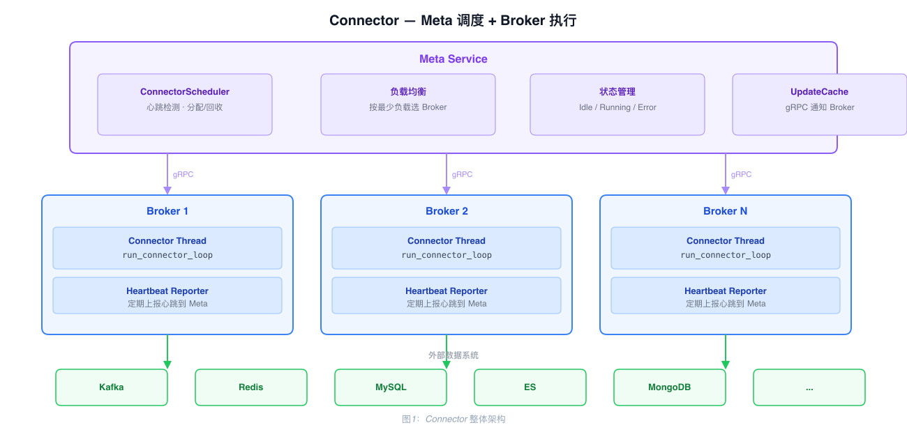
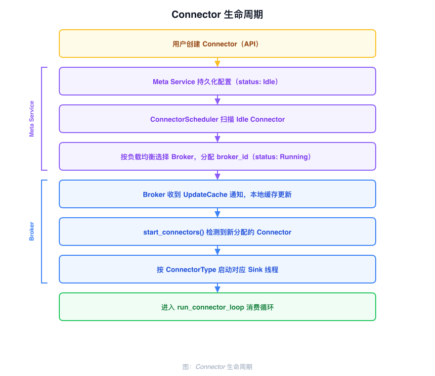
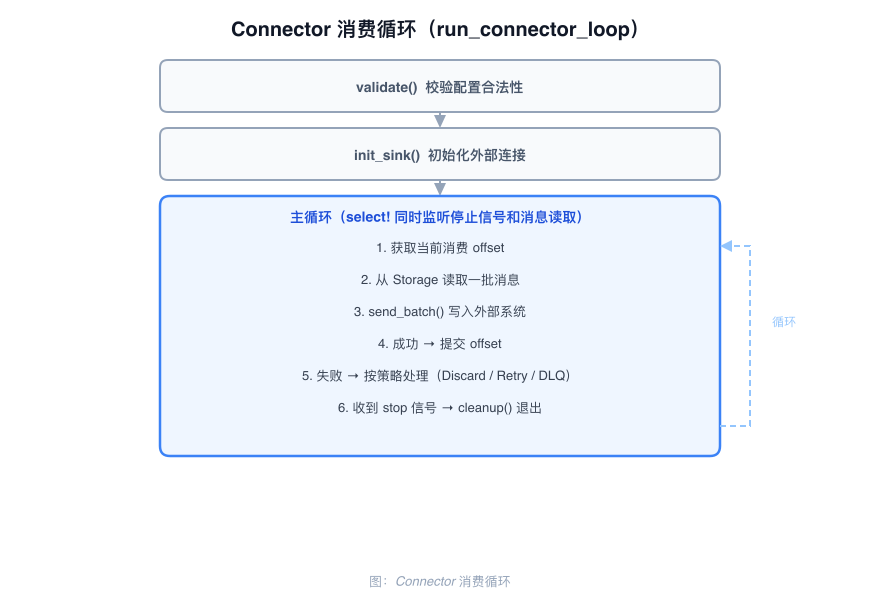

# Connector 架构

Connector 将 Broker 中的消息实时同步到外部数据系统，运行在 Broker 节点上，由 Meta Service 统一调度。

---

## 整体结构

采用 Meta 调度 + Broker 执行的分布式架构：

- Meta Service 中的 `ConnectorScheduler` 负责 Connector 的分配、回收和状态管理
- Broker 节点负责执行具体的消费和写入逻辑
- 两者通过 gRPC（UpdateCache）同步状态



---

## 生命周期

Connector 有四个状态，由 Meta Service 统一维护：

| 状态 | 含义 |
|------|------|
| `Idle` | 未分配，等待调度器分配到某个 Broker |
| `Running` | 已分配到 Broker，Broker 侧线程正在运行 |
| `Stopped` | 用户手动停止，不参与调度 |
| `Error` | 运行出错，等待重试或人工介入 |

状态流转：创建时为 `Idle` → 调度器分配后为 `Running` → 心跳超时或 Broker 下线后重置为 `Idle` → 重新参与调度。



---

## Meta 调度（ConnectorScheduler）

每秒执行两项任务：

**心跳检测（check_heartbeat）**：遍历所有 Connector 的心跳时间。超时则将该 Connector 标记为 Idle，清除 broker_id 分配，等待重新调度。

**分配与回收（start_stop_connector_thread）**：
- 收集所有 Idle 状态的 Connector
- 计算每个 Broker 的负载（已分配 Connector 数）
- 按最少负载原则分配
- 更新状态为 Running，通过 UpdateCache 通知 Broker

---

## Broker 侧调度

Broker 的 `start_connector_thread` 每秒执行两项检查：

**启动检查（start_connectors）**：遍历缓存中所有 Connector，若分配给当前 Broker 且线程未运行，按 `ConnectorType` 启动对应 Sink 线程。

**回收检查（gc_connectors）**：遍历所有运行中的线程，若对应 Connector 已不再分配给当前 Broker，发送停止信号，更新状态为 Idle。

---

## 消费循环（run_connector_loop）

每个 Connector 线程的执行流程：

1. 检查停止信号，收到则退出循环
2. 调用 `read_by_offset` 从 Storage Adapter 批量拉取消息
3. 若无消息，sleep 后重试
4. 调用 `ConnectorSink::send_batch` 将消息写入外部系统
5. 写入成功：提交 Offset，更新心跳时间
6. 写入失败：按 `failure_action` 策略决定丢弃、重试或写死信队列



---

## ConnectorSink trait

所有外部系统 Connector 实现此接口：

| 方法 | 说明 |
|------|------|
| `validate()` | 校验连接配置 |
| `init_sink()` | 初始化外部连接资源 |
| `send_batch()` | 批量发送消息到外部系统 |
| `cleanup_sink()` | 释放连接资源 |

新增 Connector 类型：实现 `ConnectorSink`，在 `ConnectorType` 枚举中添加类型，在 `start_thread` 中添加分发逻辑。

---

## 失败处理策略

`send_batch` 失败时按配置策略处理：

| 策略 | 行为 |
|------|------|
| `Discard` | 直接丢弃，继续消费下一批 |
| `DiscardAfterRetry` | 重试指定次数后丢弃 |
| `DeadMessageQueue` | 重试指定次数后发到死信队列 |

---

## 心跳机制

**Broker 侧**：每次成功读取消息时更新本地心跳时间，由心跳上报线程定期批量上报给 Meta Service。

**Meta 侧**：`ConnectorScheduler` 周期性检查心跳，超时的 Connector 重置为 Idle，等待重新调度到健康的 Broker。

---

## Offset 管理

每个 Connector 以 `connector_name` 作为消费组名，独立维护消费进度：

- 每次读取时按 Shard 记录最大 offset
- `send_batch` 成功后提交 offset（at-least-once 语义）
- 失败时不提交
- Connector 迁移到其他 Broker 后，从上次提交的 offset 继续

---

## 支持的外部系统

| 类型 | 说明 |
|------|------|
| Kafka | 写入 Kafka Topic |
| Elasticsearch | 写入 ES Index |
| Redis | 执行 Redis 命令模板 |
| MongoDB | 写入 MongoDB Collection |
| MySQL | 写入 MySQL 表 |
| PostgreSQL | 写入 PostgreSQL 表 |
| RabbitMQ | 发布到 RabbitMQ Exchange |
| Pulsar | 发布到 Pulsar Topic |
| GreptimeDB | 写入 GreptimeDB |
| LocalFile | 写入本地文件 |

---

## 代码结构

```
src/connector/src/
├── traits.rs       ConnectorSink trait
├── loops.rs        消费循环、offset 管理
├── core.rs         Broker 侧调度、类型分发
├── manager.rs      运行时状态管理
├── heartbeat.rs    心跳上报线程
├── failure.rs      失败处理策略
├── storage/        Meta Service 存储交互
├── kafka/
├── elasticsearch/
├── redis/
├── mongodb/
├── mysql/
├── postgres/
├── rabbitmq/
├── pulsar/
├── greptimedb/
└── file/
```
