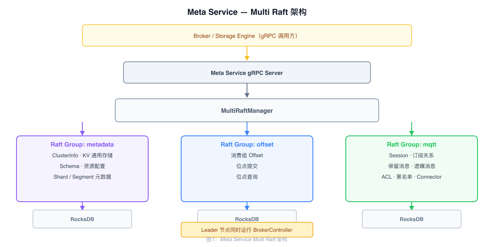
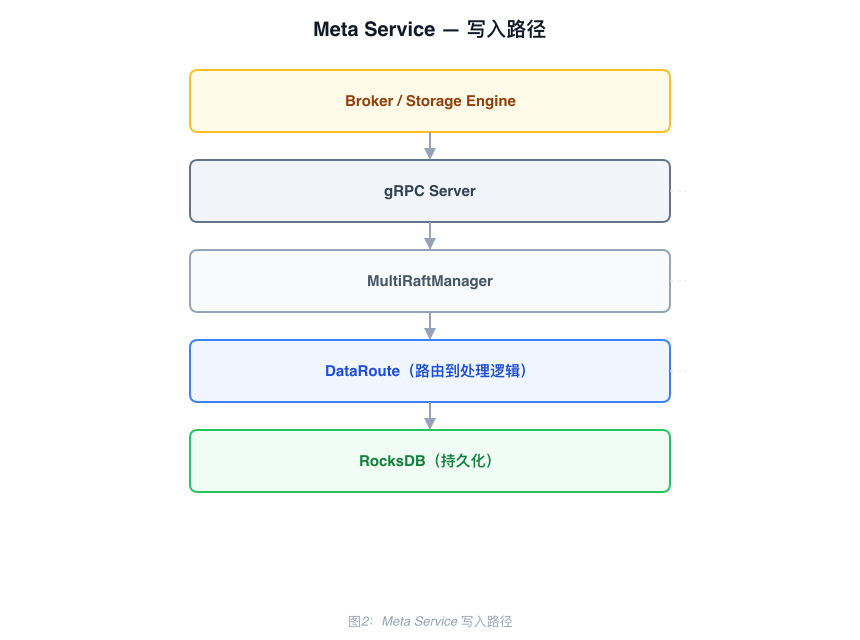

# Meta Service 架构

## 技术栈

gRPC + Multi Raft（openraft）+ RocksDB

- 节点间及对外均通过 gRPC 通信
- 基于 openraft 实现 Multi Raft，多节点数据一致性
- RocksDB 持久化所有数据，包括 Raft 日志和快照

---

## 职责

| 职责 | 说明 |
|------|------|
| 集群协调 | 节点发现、上下线管理、节点间数据分发 |
| 元数据存储 | Broker 节点信息、Topic 配置、Schema、Connector 配置、Storage Engine 分片元数据 |
| KV 业务数据 | MQTT Session、保留消息、遗嘱消息、订阅关系、ACL、黑名单等运行时数据 |
| 消费位点 | 消费组 Offset 提交与管理 |
| 控制器 | Session 过期清理、Last Will 延迟发送、Storage Engine GC、Connector 任务调度 |

---

## Multi Raft 架构

Meta Service 运行三个独立的 Raft Group，每个 Group 有独立的 Leader 和存储，并行工作互不阻塞：

| Raft Group | 存储内容 |
|-----------|---------|
| **metadata** | 集群节点信息、KV 通用存储、Schema、资源配置、Storage Engine Shard / Segment 元数据 |
| **offset** | 消费组 Offset 提交与管理 |
| **mqtt** | 用户、Topic、Session、保留消息、遗嘱消息、订阅关系、ACL、黑名单、Connector、共享订阅组 Leader |

**Raft 参数：**

| 参数 | 值 |
|------|-----|
| heartbeat_interval | 250ms |
| election_timeout_min | 299ms |
| write_timeout | 30s（可配置） |
| 慢写告警阈值 | 1000ms |

---

## 写入路径

写入超过 `write_timeout`（默认 30s）返回错误；超过 1000ms 记录 warn 日志。

---

## 数据存储

- **Raft 日志**：存储在 RocksDB，节点重启后完整恢复
- **Raft 快照**：定期生成，压缩日志，加快节点恢复
- **业务数据**：通过 DataRoute 写入对应的 RocksDB Column Family
- **内存缓存**：CacheManager 维护热数据缓存，降低 RocksDB 读压力；冷数据直接读写 RocksDB

---

## 控制器（BrokerController）

Leader 节点启动后运行 BrokerController，负责后台调度：

| 后台任务 | 说明 |
|---------|------|
| Session 过期清理 | 定期扫描过期 Session，清理相关数据 |
| Last Will 延迟发送 | 检测到期遗嘱消息，触发发送到 Broker |
| Storage Engine GC | 清理已删除 Shard / Segment 的残留数据 |
| Connector 调度 | Connector 任务的创建、分配和状态跟踪 |

---

## 启动流程

1. 读取配置中的 `meta_addrs`，获取所有 Meta Node 地址
2. 初始化 MultiRaftManager，依次创建 metadata、offset、mqtt 三个 Raft Group
3. 通过 gRPC 与所有节点建立连接，完成集群初始化和 Leader 选举
4. Leader 节点启动 BrokerController
5. Meta Service 就绪，对 Broker 和 Storage Engine 提供 gRPC 服务

---

## 与 ZooKeeper / etcd 对比

| 维度 | ZooKeeper | etcd | Meta Service |
|------|-----------|------|--------------|
| 一致性协议 | ZAB（单 Leader） | 单 Raft | Multi Raft |
| 存储 | 全内存 | BoltDB | RocksDB |
| 扩展性 | 受内存限制 | 受单 Raft 限制 | 各 Raft Group 独立扩展 |
| 功能范围 | 元数据协调 | 元数据协调 | 元数据 + KV 存储 + 控制器 |
| 外部依赖 | 是 | 是 | 否（内置） |
