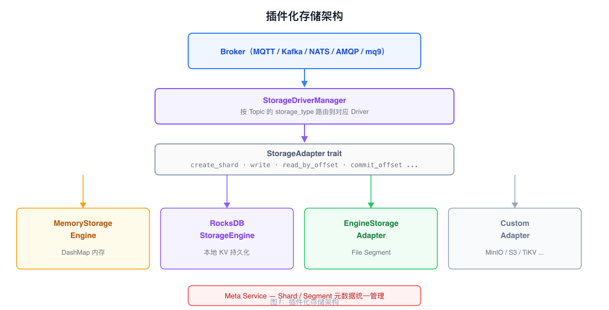
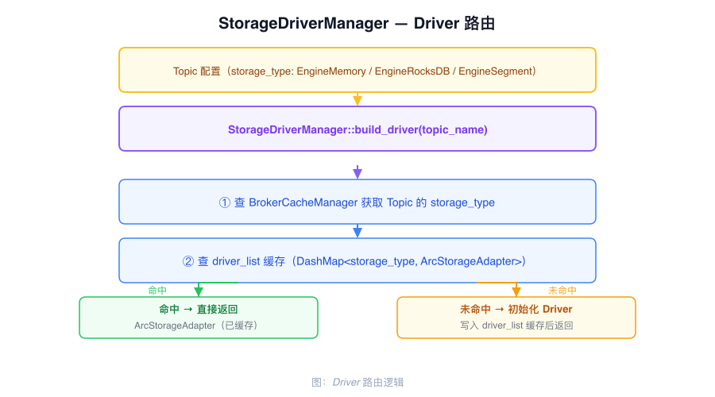

# 插件化存储架构

RobustMQ 通过 `StorageAdapter` trait 将 Broker 与存储后端解耦。Broker 只调用 trait 接口，不感知底层是 Memory、RocksDB、File Segment 还是外部存储系统。

---

## StorageAdapter trait

```rust
#[async_trait]
pub trait StorageAdapter {
    async fn create_shard(&self, shard: ShardConfig) -> Result<(), StorageError>;
    async fn delete_shard(&self, shard_name: String) -> Result<(), StorageError>;
    async fn list_shard(&self, filter: ShardFilter) -> Result<Vec<ShardInfo>, StorageError>;

    async fn write(&self, shard_name: String, record: Record) -> Result<u64, StorageError>;
    async fn batch_write(&self, shard_name: String, records: Vec<Record>) -> Result<Vec<u64>, StorageError>;

    async fn read_by_offset(&self, shard_name: String, offset: u64, limit: u64) -> Result<Vec<Record>, StorageError>;
    async fn read_by_tag(&self, shard_name: String, tag: String, offset: u64, limit: u64) -> Result<Vec<Record>, StorageError>;
    async fn read_by_key(&self, shard_name: String, key: String) -> Result<Option<Record>, StorageError>;

    async fn delete_by_offset(&self, shard_name: String, offset: u64) -> Result<(), StorageError>;
    async fn delete_by_key(&self, shard_name: String, key: String) -> Result<(), StorageError>;

    async fn get_offset_by_timestamp(&self, shard_name: String, timestamp: u64) -> Result<Option<u64>, StorageError>;
    async fn get_offset_by_group(&self, group_name: String, shard_name: String) -> Result<Option<u64>, StorageError>;
    async fn commit_offset(&self, group_name: String, shard_name: String, offset: u64) -> Result<(), StorageError>;
}
```

---

## 三种内置实现



| 实现 | struct | 说明 |
|------|--------|------|
| 内存存储 | `MemoryStorageEngine` | DashMap，进程重启丢失 |
| RocksDB 存储 | `RocksDBStorageEngine` | 本地 KV，单节点持久化 |
| File Segment 存储 | `EngineStorageAdapter` → `StorageEngineHandler` | 分段日志，集群多副本 |

---

## 路由机制

`StorageDriverManager` 按 Topic 配置的 `storage_type` 选择对应实现：



路由逻辑：Broker 写入消息时，先从 `BrokerCacheManager` 读取目标 Topic 的 `storage_type` 字段，再从 `driver_list`（`DashMap<String, ArcStorageAdapter>`）查找已初始化的 Driver 实例。未命中则调用 `init_driver` 按类型创建实例，写入缓存后返回。Driver 实例是 `Arc<dyn StorageAdapter>` 类型，可在多个请求之间共享，不会重复初始化。

同一集群内不同 Topic 可以使用不同存储后端（混合存储），切换存储类型只需修改 Topic 配置，不需要改 Broker 代码。

---

## 接入外部存储

实现 `StorageAdapter` trait 即可接入外部存储系统（如 MinIO、S3、TiKV、MySQL）：

1. 创建新的 struct，实现 `StorageAdapter` 所有方法
2. 在 `StorageDriverManager::init_driver` 中添加对应的 `storage_type` 分支
3. 在 Topic 配置中指定新的 `storage_type`

---

## Shard 与 Segment 元数据

所有存储后端的 Shard 和 Segment 元数据统一由 Meta Service 管理：

- Shard 的创建、删除、分区配置存储在 Meta Service 的 metadata Raft Group
- File Segment 的 active_segment、Leader 信息、ISR 列表存储在 Meta Service
- Broker 通过本地 `StorageCacheManager` 缓存热数据，减少对 Meta Service 的访问
