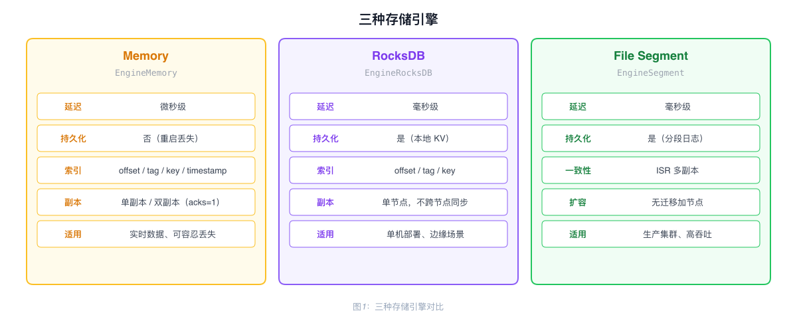
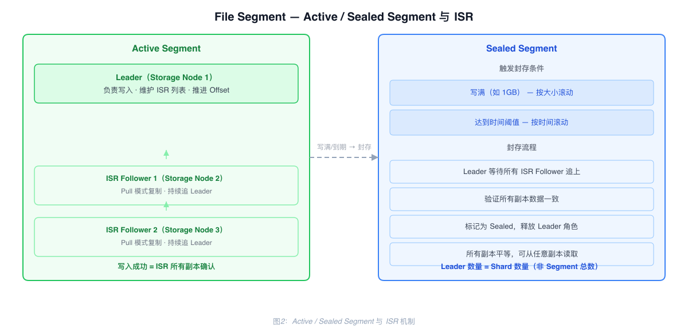
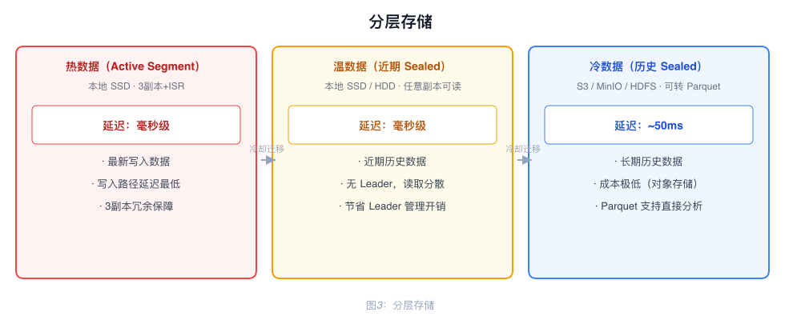

# Storage Engine 架构

RobustMQ 提供三种存储引擎，通过 Storage Adapter 对上层 Broker 屏蔽差异，按 Topic 粒度独立配置。

---

## 三种存储引擎

| 引擎 | 配置值 | 延迟 | 持久化 | 适用场景 |
|------|--------|------|--------|---------|
| Memory | `EngineMemory` | 微秒级 | 否 | 实时数据、允许丢失 |
| RocksDB | `EngineRocksDB` | 毫秒级 | 是 | 单机持久化、边缘部署 |
| File Segment | `EngineSegment` | 毫秒级 | 是 | 生产集群、高吞吐 |

---

## Memory 引擎

基于 `DashMap` 的纯内存存储，支持四种索引：

| 索引 | 结构 | 用途 |
|------|------|------|
| 主数据 | `DashMap<shard, DashMap<offset, Record>>` | 按 Offset 读取 |
| Tag 索引 | `DashMap<shard, DashMap<tag, Vec<offset>>>` | 按 Tag 查询 |
| Key 索引 | `DashMap<shard, DashMap<key, offset>>` | 按 Key 查询（Key 唯一） |
| 时间戳索引 | `DashMap<shard, DashMap<timestamp, offset>>` | 按时间查 Offset |

进程重启后数据丢失。支持双副本配置（acks=1），Leader 写入后异步复制到第二副本。

---

## RocksDB 引擎

使用专用 Column Family（`DB_COLUMN_FAMILY_BROKER`）存储消息，内存中维护写锁避免并发冲突。

数据不在节点间同步，集群模式下不同 Broker 节点无法共享数据，不适合生产集群。

---

## File Segment 引擎

生产级存储引擎，集群化部署，支持多副本、高吞吐、分层存储。

### I/O Pool

用固定数量的 I/O Worker（默认 16 个）管理所有 Partition，通过 `partition_id % worker_count` 固定映射，同一 Partition 的请求总是路由到同一个 Worker，保证写入顺序。

Worker 批量处理：阻塞等待第一个请求，然后非阻塞收集后续请求，一次批量处理可聚合数百至数千条消息，同一次 fsync 持久化。

消息从网络接收到磁盘写入使用 `Bytes`（Arc 引用计数）实现零拷贝，数据只有一份，不同地方持有引用。

### 索引

使用 RocksDB 存储四种索引：offset 索引、时间索引、key 索引、tag 索引。

索引与数据同步构建：Worker 批量处理 N 条记录时，同时构建这 N 条的所有索引，通过 RocksDB WriteBatch 一次性写入。数据文件一次 I/O，索引一次 I/O。

offset 索引采用稀疏索引策略：每 1000 条建一个索引点，记录该 Offset 对应的文件位置。查询时定位最近索引点，再顺序扫描最多 1000 条。1000 万条记录约占 240KB 索引空间，查询延迟约 2ms。

### 一致性协议：ISR

每个 Active Segment 有一个 Leader，维护 ISR（In-Sync Replicas）列表。写入成功意味着数据已复制到 ISR 所有副本，无数据空洞，读取 100% 成功。

Follower 通过 Pull 模式主动批量拉取，高 QPS 场景下网络请求从百万级降到百级。

acks 配置：

| acks | 语义 |
|------|------|
| `all` | 等待所有 ISR 副本确认 |
| `quorum` | 等待多数派确认 |
| `1` | 只等 Leader 确认 |

### Active Segment 与 Sealed Segment

**Active Segment**：正在写入的活跃段，有 Leader 和 ISR 机制，Follower 持续 Pull 复制。

**Sealed Segment**：写满（如 1GB）或达到时间阈值后封存。Leader 等待所有 ISR Follower 完全追上并验证一致性，确认所有副本完整后标记为 Sealed，释放 Leader 角色。Sealed Segment 没有 Leader，所有副本平等，可从任意副本读取。

结果：Leader 数量 = Shard 数量（而非 Segment 总数），1000 个 Shard 只需 1000 个 Leader。历史数据读取压力分散到所有 Storage Node。

### 扩容

新增 Storage Node 时不迁移任何历史数据。当前 Active Segment 写满后，新 Segment 自动分配到新节点。

### 分层存储

Sealed Segment 不可变，可直接从任意副本上传 S3，更新元数据即完成迁移。

| 数据层级 | 存储位置 | 延迟 |
|---------|---------|------|
| 热数据（Active Segment）| 本地 SSD | 毫秒级 |
| 温数据（近期 Sealed）| 本地 SSD/HDD | 毫秒级 |
| 冷数据（历史 Sealed）| S3 / MinIO / HDFS | ~50ms |

冷数据迁移到 S3 时可转换为 Parquet 格式，Spark、Hive 等分析工具可直接查询。

---

## 两种文件模型

| 模型 | 描述 | 适用场景 |
|------|------|---------|
| Partition 独立文件 | 每个 Partition 独占文件，类似 Kafka | 低延迟高吞吐，Topic 数量不多 |
| Partition 共享文件 | 多个 Partition 共享文件，类似 RocketMQ | 海量 Topic/Partition |
