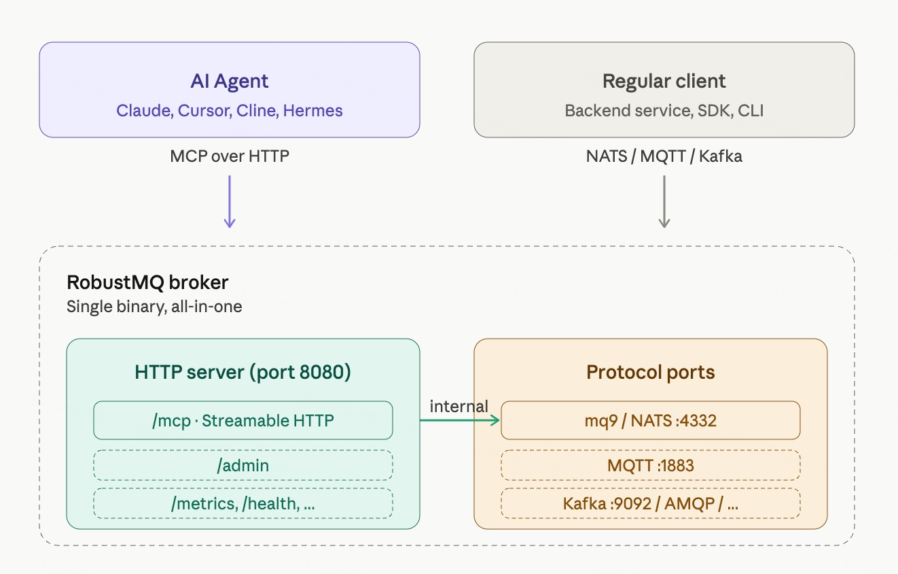

# mq9 MCP Server 技术方案

## 背景

mq9 协议（`$mq9.AI.*`）已经设计完成，提供了 Agent 异步通信的核心能力——mailbox 管理、消息收发（SEND/FETCH/ACK）、查询（QUERY）、Agent 注册和发现（REGISTER/DISCOVER）。

但当前协议是 NATS 风格的 request/reply。要用 mq9，应用方需要：

- 集成 NATS 客户端
- 理解 `$mq9.AI.MSG.SEND.{mail_address}` 这样的 subject 结构
- 自己处理 group_name、deliver、force_deliver 等参数语义
- 自己组装 JSON 请求体

对工程师来说这不算难，写过几行就熟悉。但 **AI Agent 不是工程师**——LLM 不天然懂 NATS、不天然懂 subject 命名规则、不天然懂 deliver 策略。让 LLM 直接调 mq9 协议，需要在 prompt 里塞大量协议说明，效果还不一定好。

MCP（Model Context Protocol）就是为这件事设计的——把工具能力以 LLM 友好的方式暴露给 AI Agent。MCP 已经成为 AI 工具集成的事实标准（Claude、Cursor、Cline 等主流 Agent 工具都支持）。

mq9 MCP 要做的事就是：**把 mq9 协议封装成 MCP 工具，让 AI Agent 能直接通过 MCP 协议使用 mq9 的通信能力，不需要理解底层协议**。

## 在 RobustMQ MCP 体系中的位置

mq9 MCP 不是孤立的项目，是 RobustMQ MCP 体系下的一个具体协议实现。

RobustMQ 是多协议消息基础设施——支持 MQTT、Kafka、AMQP、NATS、mq9 五种协议。每种协议都有自己的语义和典型用户：

- MQTT：IoT 设备、传感器、低带宽连接场景
- Kafka：流式数据、事件溯源、日志聚合场景
- AMQP：企业业务消息、订单流转场景
- NATS：实时通知、微服务间通信
- mq9：Agent 之间的异步通信

随着 AI Agent 的普及，每种协议都可能遇到"想被 LLM 直接使用"的需求。比如：

- IoT 工程师让 LLM 通过 MQTT 控制设备
- 数据工程师让 LLM 查询 Kafka topic 状态
- 业务工程师让 LLM 处理 AMQP 队列消息
- Agent 开发者让 LLM 通过 mq9 发送消息

每个场景都需要对应的 MCP 工具集。**RobustMQ 的设计是把所有协议的 MCP 工具集都内置到 broker 的 HTTP 端点里，AI Agent 通过同一个 MCP 端点访问所有协议的工具**。

mq9 是当前阶段优先做的协议。其他几个的 MCP 工具集是后续话题，不在这次讨论范围。

## 为什么先做 mq9 MCP

具体的几个驱动因素：

**第一，mq9 的目标用户是 AI Agent，不是普通后端服务。**

mq9 的设计目标是 Agent 之间的异步通信。Agent 大多基于 LLM 构建，而 LLM 调用工具的标准方式正是 MCP。如果 mq9 没有 MCP 接入，Agent 用 mq9 就要绕路（自己写 NATS 集成代码或者通过 Tool 转发），失去了 mq9 服务 Agent 的初衷。

**第二，MCP 已经是事实标准。**

Claude、ChatGPT、Cursor、Cline、Hermes、OpenClaw 等主流 Agent 工具都原生支持 MCP。提供 MCP 接入等于让 mq9 一次接入所有这些生态。

**第三，让 mq9 的能力被 LLM 自然使用。**

LLM 不需要懂 NATS 协议、不需要懂 subject 命名，只需要看到几个工具描述（"send_message: 发送消息给某个 Agent"、"discover_agents: 查找具有某种能力的 Agent"），就能根据任务需要调用。这是 MCP 的核心价值。

**第四，配合 mq9-hermes-plugin、mq9-langchain 这些适配器形成完整生态。**

之前讨论过的几个框架适配器（mq9-hermes、mq9-langchain 等）都是把 mq9 包装成各框架原生的 Tool 形态。MCP 是更通用的入口——任何支持 MCP 的工具都能用 mq9，不需要每个框架单独写适配器。

## 设计原则

在动手之前，几个原则要先想清楚：

**原则一：MCP 是 broker 现有 HTTP 端点的一部分，不是独立项目。**

RobustMQ broker 已经在 8080 端口暴露 HTTP 服务（admin、management 等）。MCP 端点挂在这个 HTTP server 下的某个路径（如 `/mcp`），不开新端口、不做独立进程、不做独立项目。用户启动 broker 就有 MCP，零配置。

**原则二：只支持远程 MCP（Streamable HTTP）。**

MCP 协议有两种 transport——stdio 和 Streamable HTTP。RobustMQ 只支持后者。

理由：

- broker 是服务进程，不适合被 AI 工具拉起作为子进程（stdio 模式的工作方式）
- HTTP 模式天然支持远程访问、多 Agent 共享同一 broker
- 想要 stdio 兼容的用户可以用社区工具 `mcp-remote` 自己桥接

不做多 transport 选择，不做 stdio 桥接命令。RobustMQ 只暴露 HTTP 端点。

**原则三：MCP 工具是 thin wrapper，不是新协议。**

mq9 协议是核心。MCP 工具只是 mq9 协议的 LLM 友好封装。MCP 工具的语义和 mq9 协议命令一一对应，不引入新概念、不做协议层的抽象。

如果 mq9 协议里没有的能力，MCP 工具也不提供。如果 mq9 协议演进了新能力，MCP 工具跟着加。**MCP 工具不是 mq9 的替代接入方式，是 mq9 的 LLM 友好视图**。

**原则四：工具粒度匹配 LLM 的认知方式。**

LLM 不擅长处理过多参数、不擅长理解隐式语义。所以：

- 每个工具职责单一（不要一个工具做多件事）
- 参数设计直白（不要"如果 X 为 true 则 Y 字段生效"这种隐式依赖）
- 错误返回明确（让 LLM 知道下一步怎么做）

mq9 协议里有些字段对工程师友好但对 LLM 不友好（比如 `force_deliver` 这种隐式行为开关），MCP 工具暴露时要考虑怎么让 LLM 用对。

**原则五：默认值合理，必填项最少。**

LLM 调工具时，能省略的参数它会省略。所以默认值要选最常用、最安全的。比如：

- FETCH 的 deliver 策略默认 `latest`（只拉新消息，不会重复处理历史）
- num_msgs 默认 100（够用、不会一次拉太多）
- TTL 默认值要根据场景选

**原则六：错误信息对 LLM 友好。**

LLM 看到 `"mailbox xxx does not exist"` 知道怎么办（先创建 mailbox）。看到 `"err code 4001"` 就懵了。MCP 返回的错误要是自然语言描述，能帮 LLM 决策下一步动作。

**原则七：工具数量克制。**

MCP 工具太多会污染 LLM 的上下文（每个工具的描述都要进 system prompt）。mq9 的 MCP 工具应该精简——能合并的合并、能去掉的去掉。目标是核心工具不超过 10 个。

## MCP 工具设计

工具一览，按 mq9 协议的能力分组：

| 工具名 | 对应 mq9 协议 | 用途 | 是否暴露给 LLM |
|-------|-------------|------|--------------|
| `create_mailbox` | `MAILBOX.CREATE` | 创建 mailbox | 是 |
| `send_message` | `MSG.SEND.{addr}` | 发送消息给某 mailbox | 是 |
| `fetch_messages` | `MSG.FETCH.{addr}` | 从 mailbox 拉取消息 | 是 |
| `ack_message` | `MSG.ACK.{addr}` | 确认消息已处理 | 是 |
| `query_mailbox` | `MSG.QUERY.{addr}` | 查询 mailbox 状态（不消费） | 是 |
| `delete_message` | `MSG.DELETE.{addr}.{id}` | 删除指定消息 | 否（避免误删） |
| `register_agent` | `AGENT.REGISTER` | 注册 Agent 到注册中心 | 是 |
| `discover_agents` | `AGENT.DISCOVER` | 查找具有某能力的 Agent | 是 |
| `unregister_agent` | `AGENT.UNREGISTER` | 注销 Agent | 是 |
| `report_status` | `AGENT.REPORT` | 上报 Agent 状态 | 否（内部心跳调用） |

总数 10 个工具，其中 8 个暴露给 LLM。下面分组展开每个工具的设计考虑。

### Mailbox 管理工具

**`create_mailbox`**

- 参数：`name`（mailbox 名字）、`ttl`（可选，秒）
- 用途：让 Agent 创建自己的 inbox 或临时通信 mailbox
- 默认行为：幂等创建（已存在不报错）

设计考虑：mailbox 名字格式严格（小写、点分隔），文档要在 description 里说清楚，让 LLM 生成合法名字。

### 消息收发工具

**`send_message`**

- 参数：`mail_address`（目标 mailbox）、`payload`（消息内容）、`priority`（可选 normal/urgent/critical，默认 normal）、`message_key`（可选，用于 key 压缩）
- 用途：给某个 Agent 发消息

设计考虑：MCP 工具内部把 priority 转成 subject 后缀，LLM 不感知 subject 结构。

**`fetch_messages`**

- 参数：`mail_address`、`group_name`（默认用 caller 的 agent_id）、`max_messages`（默认 100）、`reset_to`（可选，覆盖默认续拉行为）
- 用途：从自己的 inbox 拉取消息

设计考虑：原协议里有 deliver、from_time、from_id、force_deliver 四个字段，参数太多对 LLM 不友好。MCP 工具简化成一个 `reset_to` 字段：

- 不传：续拉（默认行为）
- 传 `"earliest"`：从头开始
- 传 `"latest"`：只拉新消息
- 传 `"time:<unix秒>"`：从该时间戳开始，如 `"time:1746000000"`
- 传 `"id:<msg_id>"`：从该 msg_id 开始，如 `"id:42"`

把"force_deliver + deliver + from_xxx"四个字段合并成一个 `reset_to`，LLM 用起来直观。

**`ack_message`**

- 参数：`mail_address`、`msg_id`、`group_name`（默认值同 fetch_messages）
- 用途：确认消息已处理

设计考虑：让 LLM 在处理完每条消息后明确调用 ack。或者在 `fetch_messages` 加一个 `auto_ack` 参数（默认 false），让 LLM 选择。

**`query_mailbox`**

- 参数：`mail_address`、`key`（可选）、`limit`（可选）、`since`（可选）
- 用途：查看 mailbox 当前状态，不影响消费位点

设计考虑：QUERY 和 FETCH 语义不同（QUERY 不推进位点，FETCH 推进位点）。description 里要明确——"看一眼用 query_mailbox，要消费用 fetch_messages"。

### Agent 注册和发现工具

**`register_agent`**

- 参数：`name`（Agent 唯一名称）、`payload`（能力描述，纯文本或 A2A AgentCard JSON 序列化成字符串）
- 用途：把自己注册到 mq9 注册中心

设计考虑：AgentCard 是上层协议（A2A）的概念，MCP Server 不解析其内容，LLM 把 AgentCard 序列化成字符串后作为 `payload` 传入即可。

**`discover_agents`**

- 参数：`query`（自然语言或 tag，格式：`tag:xxx` 或自然语言）、`limit`（可选）
- 用途：查找具有某种能力的 Agent

设计考虑：原协议里有 `tag` 和 `semantic` 两个字段。MCP 工具简化为一个 `query` 字段——MCP 内部判断是 tag 检索还是语义检索（比如 `tag:translation` 是 tag 检索，自然语言是语义检索）。简化参数对 LLM 友好。

**`unregister_agent`**

- 参数：`name`（注册时使用的 Agent 名称）
- 用途：注销自己

## 技术架构

mq9 MCP 是 RobustMQ broker 的 HTTP 端点（8080 端口）下的一个路径。整体结构：

broker 启动时已经在 8080 端口跑了 HTTP 服务（admin、metrics、health 等）。MCP 端点（`/mcp`）作为这个 HTTP 服务的一个路径暴露出来，复用同一个 HTTP 端口。

AI Agent 通过 `http://broker:8080/mcp` 连接。普通客户端通过原生协议端口连接（mq9 走 4332、MQTT 走 1883 等）。两条路径并行。

**几个具体的实现细节：**

**Streamable HTTP transport。** RobustMQ MCP 端点用 MCP 当前主流的 Streamable HTTP transport（2025 年 3 月引入，取代旧的 HTTP+SSE 双端点设计）。单一 HTTP 端点支持 POST 和 GET，POST 用于客户端请求，GET 用于服务端流式响应（可选）。

**只支持 HTTP，不支持 stdio。** broker 是服务进程，不适合被 AI 工具拉起作为子进程。stdio 是给本地命令行工具用的模式，不适合 broker。如果用户的 AI 工具只支持 stdio（比较少见，大多数都支持 HTTP），可以用社区工具 `mcp-remote` 桥接。这是用户侧的事，RobustMQ 不提供桥接能力。

**零配置。** MCP 端点是 broker 内置的，不需要任何配置。启动 broker 就有，端口跟着 8080 HTTP 服务。

**会话状态。** broker 内部为每个 MCP 连接维护会话状态：

- 该连接绑定的 agent_id（用于默认 group_name 等）
- 已知 mailbox 列表（便于错误提示）
- 心跳定时器

会话状态在 broker 进程内管理，连接断开自动清理。

**自动行为。** 几个让用户体验更顺的自动行为：

- 启动时为该会话自动创建 default_inbox（如果客户端在初始化时声明）
- 定期发 report_status（保活）
- 关闭时自动 unregister_agent
- send_message 时如果 mailbox 不存在，可选自动创建

这些行为由客户端在 MCP 连接的初始化阶段声明，不需要 broker 端配置。

**错误处理。** broker MCP 层把内部错误转成 LLM 友好的错误描述。例如：

- 内部错误 `mailbox_not_found` → MCP 返回 `"Error: The mailbox 'xxx' does not exist. You need to create it first using create_mailbox."`
- 内部错误 `connection_failed` → MCP 返回 `"Error: Internal broker error. Please retry or check broker status."`

错误信息直接写下一步该做什么，让 LLM 自动恢复。

## 实现选型

MCP 能力是 RobustMQ broker 的内置模块，自然用 **Rust 实现**。直接复用 broker 的内部 API，不需要跨进程通信。

Rust 的 MCP SDK 当前主要候选：

- `rmcp`（rust-mcp-stack 出的）
- `mcp-sdk-rs`（社区维护）

选哪个根据 SDK 成熟度和 RobustMQ 的依赖偏好定。MCP 协议本身不复杂（JSON-RPC over HTTP），如果 SDK 不合适，自己实现也是可接受的——MCP 协议层的工作量不大。

## 边界

最后讲清楚 mq9 MCP 不做什么：

**不做协议增强。** MCP 工具只是 mq9 协议的 LLM 友好封装。如果某个能力 mq9 协议里没有，MCP 工具也不补——补能力应该回到 mq9 协议层去做，而不是在 MCP 这一层引入新概念。

**不做业务逻辑。** MCP 工具不替 Agent 做决策（"该不该发消息"、"该不该 ack"）。这些决策由 Agent 自己（LLM）做。MCP 只提供能力，不替用户思考。

**不做协议适配。** MCP 工具不解析 A2A、不解析 MCP 之外的协议、不识别消息内容格式。消息是 byte 数组，进出 MCP 工具都是 byte 数组。

**不做认证授权。** MCP 工具自身不做权限管理。如果 broker 启用了认证，MCP 工具透传。但 MCP 不实现自己的权限层。

**不替代 mq9 协议本身。** 工程师和后端服务还是直接用 mq9 协议（NATS 客户端）。MCP 是给 LLM 用的，不是 mq9 的唯一接入方式。

**不做 stdio。** RobustMQ 只支持远程 MCP（Streamable HTTP）。stdio 模式让用户用社区桥接工具自己处理。

**不做独立项目。** MCP 是 broker HTTP 端点的一部分，不做独立的 pip 包、独立的 sidecar 进程、独立的安装步骤。用户安装 RobustMQ 就有了 MCP 能力。

## 一些还没想清楚的问题

诚实说，几个问题还没完全想透：

**问题一：长轮询场景 fetch_messages 怎么处理。**

LLM 调 fetch_messages 拿不到消息时，是立即返回空（让 LLM 决定要不要再调）还是阻塞等待（broker 端 long poll）？

立即返回简单但 LLM 可能反复调用浪费资源。阻塞等待对 MCP 协议不友好（MCP 工具调用一般预期快速返回）。

可能的方案是默认立即返回，加 `wait_seconds` 参数让 LLM 选择最长等待时间。

**问题二：streaming 响应。**

A2A 任务可能产生流式响应（SSE）。LLM 调 fetch_messages 拿到的是积累好的全部消息还是流式片段？

Streamable HTTP 支持服务端流式推送（GET 请求），可以用来传递流式响应。但具体怎么映射 mq9 的拉模式到 MCP 的流式还要想清楚。

**问题三：MCP 会话和 Agent 身份的对应。**

理论上每个 AI Agent 会话对应一个 mq9 Agent 身份（独立的 inbox、group_name）。HTTP 模式下多个连接共享同一个端口，需要在协议层加 session 概念区分调用方。

具体怎么做还要想。可能用 MCP 协议自带的 session 机制，或者在配置里给每个 API token 绑定一个 agent_id。

**问题四：工具描述的措辞。**

每个工具的 description 直接进 LLM 的 context，措辞影响 LLM 用得对不对。这个需要大量测试和迭代——和不同模型（Claude、GPT、Llama）反复试，找到效果最好的描述。

短期可以先用直白的描述，长期通过用户反馈优化。

## 总结

mq9 MCP 的几个核心判断：

**1. 它是 RobustMQ broker HTTP 端点的一部分，不是独立项目。** 不做独立 pip 包、不做独立 sidecar 进程、不做独立端口。挂在 broker 已有的 8080 HTTP 端口下的 `/mcp` 路径。

**2. 只支持远程 MCP（Streamable HTTP），不支持 stdio。** broker 是服务进程，不适合 stdio。stdio 用户可以用社区工具 `mcp-remote` 自己桥接。

**3. 零配置。** broker 启动就有 MCP 端点，不需要在配置文件里写任何 [mcp] 节。

**4. 它是 RobustMQ MCP 体系的第一个协议实现。** 未来 mqtt、kafka、amqp、nats 也可以加自己的 MCP 工具集，都在同一个 `/mcp` 端点下。

**5. 它是 mq9 进入 AI Agent 生态的入口。** MCP 是事实标准，没有 MCP 接入 mq9 在 LLM 时代是孤岛。

**6. 它是 thin wrapper，不是新协议。** mq9 协议是核心，MCP 工具只做 LLM 友好封装。

**7. 工具设计要符合 LLM 的认知方式。** 单一职责、直白参数、合理默认值、自然语言错误。

**8. 工具数量克制（10 个，其中 8 个暴露给 LLM）。** 不污染 LLM 上下文，让 Agent 用得对。

**9. Rust 实现，broker 内置。** 和 broker 同语言，直接复用内部 API，零外部依赖。

**10. 边界清晰。** 不增强协议、不做业务逻辑、不替代直接接入方式、不替代其他协议、不做 stdio、不做独立项目。

具体落地建议从核心工具的 PoC 开始——5 个最关键的工具（create_mailbox、send_message、fetch_messages、ack_message、discover_agents）跑通，配合任意支持 HTTP MCP 的 AI 工具接入，验证 multi-agent demo 端到端流程。这件事跑通后，mq9 在 AI Agent 生态的位置就有了具体抓手。剩下的功能补齐和体验打磨是水到渠成的事。