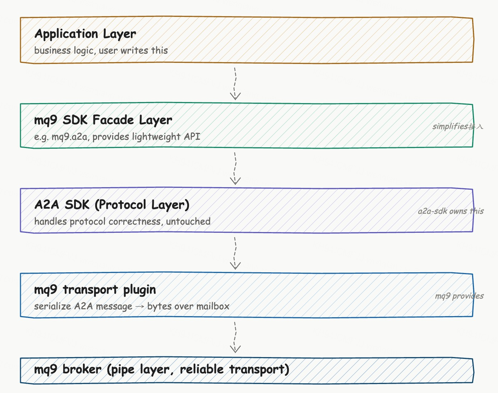
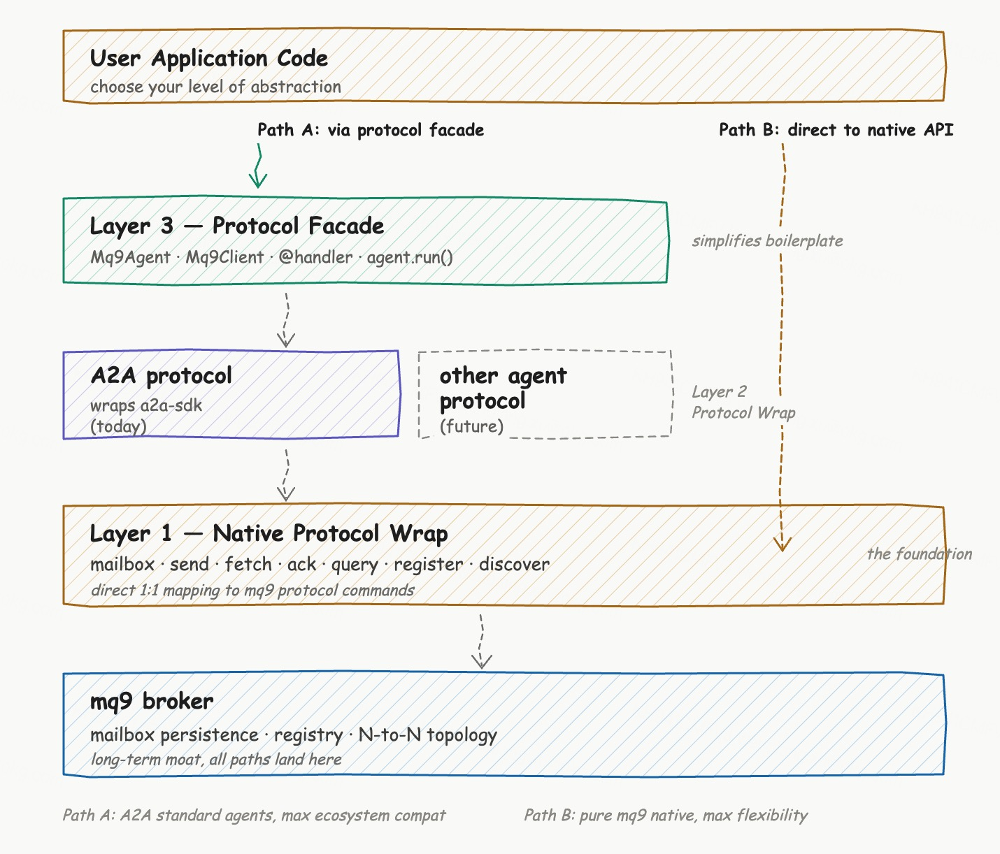

# mq9 SDK 想做什么

最近我们把 mq9 SDK 的设计想清楚了。这篇文章把过程讲一遍：它要解决什么、定位在哪、怎么实现、怎么用。

## 从一个开发者的视角说起

假设你是个 Agent 开发者。你想写一个翻译 Agent，让别的 Agent 能调用它。

按当前 A2A 协议的官方实现，你的代码大概是这样：

```python
from a2a.server.agent_execution import AgentExecutor, RequestContext
from a2a.server.events import EventQueue
from a2a.server.apps import A2AStarletteApplication
from a2a.server.request_handlers import DefaultRequestHandler
from a2a.server.tasks import InMemoryTaskStore
from a2a.types import (
    AgentCard, AgentSkill, AgentCapabilities, AgentAuthentication
)
from a2a.utils import new_agent_text_message
import uvicorn

class TranslatorAgent(AgentExecutor):
    async def execute(self, context, event_queue):
        text = context.message.parts[0].text
        result = await llm.translate(text)
        await event_queue.enqueue_event(
            new_agent_text_message(result)
        )
    
    async def cancel(self, context, event_queue):
        pass

skill = AgentSkill(
    id="translate",
    name="Translation",
    description="Translate between Chinese and English",
    tags=["translation"],
    examples=["translate to Chinese", "翻译成英文"]
)

agent_card = AgentCard(
    name="Translator",
    description="A translator agent",
    url="http://localhost:9999",
    version="1.0",
    defaultInputModes=["text"],
    defaultOutputModes=["text"],
    capabilities=AgentCapabilities(streaming=True),
    authentication=AgentAuthentication(schemes=["public"]),
    skills=[skill]
)

handler = DefaultRequestHandler(
    agent_executor=TranslatorAgent(),
    task_store=InMemoryTaskStore()
)
app_builder = A2AStarletteApplication(
    agent_card=agent_card,
    http_handler=handler
)

uvicorn.run(app_builder.build(), host="0.0.0.0", port=9999)
```

这段代码有 60 多行。它做的所有事情里，**只有 `llm.translate(text)` 那一行是业务逻辑**，其他全是协议层和传输层的胶水代码。

而且这只是同步的、单机的场景。如果业务方调用你这个 Agent 时网络抖了一下，或者你的 Agent 进程刚好在重启，这次调用就失败了。A2A 默认的 HTTP transport 要求双方同时在线。

mq9 SDK 想做的事很简单：把上面这 60 行变成 15 行，让 Agent 通信不再需要双方同时在线。

## 目标定义

mq9 SDK 的目标是把自己做成 **Agent 通信的很好用的基础组件**。

"很好用"不是形容词，是工程师拿起 SDK 时具体的体验。我们把它收敛到三件事。

**轻**：用最少的代码完成接入。 一个 A2A Agent 60 行变 15 行，业务方只写业务逻辑，剩下的 SDK 管。装一个 SDK、起一个 broker、跑一个示例，半小时之内完整闭环。

**稳**：基础组件不能在出问题时拖业务下水。 broker 不丢消息，SDK 不阻塞主流程，协议升级向后兼容，错误信息让人能自己排查。基础组件的工程师对稳定性的要求远高于应用层。一次崩盘就够让人放弃。

**开**：好用不能以封闭为代价。 mq9 上写的 A2A Agent 必须能被纯 a2a-sdk 写的 client 调用，mq9 注册中心要和 A2A 标准能互转，mq9 broker 要能和现有 Kafka/RabbitMQ 共存。封闭的好用是假的好用。

这三件事合起来叫**轻、稳、开**，就是我们对"很好用的基础组件"的具体定义。和它对应的反面也清楚：重而封闭的"全家桶"不是我们要做的，能跑但不稳的"原型"也不是。

这个目标比"成为事实标准"更可控。事实标准是结果，由市场用出来；好用的基础组件是因，由 mq9 团队每天的工作质量决定。把"好用"做扎实，"标准"自然来；只盯着"标准"，"好用"反而做不好。

## 定位在哪

定位之前先看一下 A2A 生态当前在做什么。把 awesome-a2a 收录的几十个项目扫一遍，格局是这样：

| 区域 | 项目数量 | 拥挤度 |
|------|---------|--------|
| 官方 SDK（5 种语言）+ 社区 SDK | 数十个 | 极度拥挤 |
| 框架集成（LangGraph、CrewAI、AG2 等） | 主流框架都接入了 | 拥挤 |
| 平台 / Runtime（Bindu、Aira、Inai 等）| 5-6 个并行 | 拥挤但都在做"全家桶" |
| Agent Discovery / 注册中心 | 几个不完整尝试 | 真空 |
| 可靠异步传输基础设施 | 无人做 | 真空 |
| Monitoring / Tracing 适配 | 无人做 | 真空 |
| 协议无关通信管道 | 无人做 | 真空 |

awesome-a2a 的 README 自己在 "Tools & Utilities" 章节明确写 "Community contributions welcome"，主动招募注册中心、tracing 适配等几个方向。这意味着生态本身也意识到这些基础设施空白没人填。

mq9 不进入 SDK、框架、平台 Runtime 这三个拥挤区。它瞄准的是真空区：传输基础设施、注册中心、协议中立管道这三件事。

具体怎么定位？mq9 SDK 不是要替代 A2A SDK，也不是要替代任何现有协议的 SDK。

它的角色是**协议封装 + 传输管道**。具体说就是：

**协议封装层**。mq9 SDK 包装现有的 Agent 协议 SDK，让用户用最少的代码完成接入。比如 `mq9.a2a` 包装 a2a-sdk，未来 `mq9.mcp` 包装 mcp-sdk。

**传输管道层**。所有协议的消息都通过 mq9 broker 这条管道传输。这条管道有持久化、有注册中心、有按 key 压缩、有 N-to-N 拓扑能力。Agent 之间通信不再需要双方同时在线，也不需要自己维护连接。

这两层的关系是这样：



mq9 SDK 和 A2A SDK 不是并列关系，是层次关系。**A2A SDK 始终是协议层入口，mq9 SDK 是它上面的一层 wrapper**。

这个定位有几个值得说清楚的判断。

**判断一：协议层不要重新发明**。

A2A 协议怎么定义 Message、Task、AgentCard，mq9 不重新发明。a2a-sdk 已经做完了协议层的所有事（类型定义、状态机、序列化、AgentCard 签名等），这些是 Google 工程团队多年投入的产物，mq9 重写一遍既没必要也做不好。

mq9 SDK 直接依赖 a2a-sdk，用 a2a-sdk 的原生类型。用户拿到的 `Message` 是 `a2a.types.Message`，写的 handler 收发的也是标准对象。这意味着用 mq9 SDK 写的 Agent，能被任何符合 A2A 标准的 client 调用。互操作性不丢。

**判断二：封装层只做工程简化，不做协议扩展**。

这是个严格的纪律。封装层可以让 API 更简单（装饰器、合理默认值、自动注册），但不能添加 A2A spec 之外的字段，不能改 Task 状态机的行为，不能修改 Message 的序列化格式。

一旦在封装层里加了 A2A spec 之外的东西，mq9 就和标准 A2A 形成事实分叉，用 mq9 写的 Agent 用纯 a2a-sdk 调用不工作了。这种"封装"会让生态分裂，绝对不能做。

**判断三：broker 是主体，SDK 是补齐最后一环**。

mq9 这个项目里 SDK 和 broker 不是对等的。

mq9 broker 是过去几年通过 RobustMQ 项目积累出来的产物。它解决的事情是工程深度：broker 的稳定性、mailbox 的持久化、注册中心的语义检索、N-to-N 拓扑的工程能力。这些是几年时间堆出来的，不是开源一份代码就能复制走的。

mq9 SDK 不一样。SDK 本质是个 wrapper，工程量大概 2000 行 Python 代码 4-6 周能做出来。任何懂 a2a-sdk 的工程师都能写一个类似的。

| 维度 | mq9 broker | mq9 SDK |
|------|-----------|---------|
| 工程量 | 数年积累 | 几周可写 |
| 复杂度 | 分布式系统、存储引擎、协议设计 | 主要是装饰器和封装 |
| 替代难度 | 极难 | 容易 |
| 在 mq9 项目里的时间占比 | 3+ 年 | 计划中 |
| 角色 | 主体 | 配套 |

但 broker 自己作为产品，用户用起来门槛太高。业务方想让 Agent 之间通信，不应该先理解 mq9 协议、再调用 broker API、再处理消息序列化、再集成 A2A。这些都是 SDK 该解决的。

**SDK 补齐了 broker 的最后一环：从"产品能力"到"用户能用"的那一段**。让业务方 15 行代码完成接入，让 a2a-sdk 标准的 agent 自然跑在 mq9 上，让 broker 的能力真正落到用户手里。

broker 是产品价值的来源，SDK 是产品价值的释放。两者一起，mq9 才是一个完整可用的产品。这不是"对等协同"，是"主体 + 最后一环"的关系。broker 是真正的护城河，SDK 是让护城河价值能被取用的钥匙。

**判断四：未来包多个协议，结构相同**。

按这个模式，mq9 SDK 后面可以包装任意 Agent 协议：

- `mq9.a2a`（A2A 协议封装，先做）
- `mq9.mcp`（MCP 扩展到 Agent-Agent 时做）
- `mq9.anp`（ANP 协议封装，按需）
- `mq9.custom`（用户自定义协议，提供 base class）

每个协议命名空间下结构相同，都有 Agent / Client / Server 类，都通过 mq9 transport 走 mq9 broker。用户切换协议时学习成本很低。

这种设计让 mq9 不需要押注任何单一协议。A2A 长期赢，mq9 跟着 A2A 一起赢；MCP 扩展到 Agent-Agent 替代了 A2A，mq9 加一个 `mq9.mcp` 包装就转向。**协议变化不构成 mq9 的生存威胁**。这是 mq9 在协议生态尚未定型的当下，最重要的战略安全垫。

## 思路落地

把目标和定位讲清楚之后，看落地的核心思路。

mq9 SDK 在功能上分四层。这四层不是简单的"上下叠加"，它同时回答了两个问题：SDK 内部怎么分模块（垂直分层）、用户怎么接入（横向选择）。

**第一层：mq9 原生协议封装。** 直接对应 mq9 broker 的协议命令(`MAILBOX.CREATE`、`MSG.SEND`、`MSG.FETCH`、`MSG.ACK`、`MSG.QUERY`、`AGENT.REGISTER`、`AGENT.DISCOVER` 等)。每个 API 一一对应协议层的一个 subject。这一层暴露 mq9 自有的全部能力：mailbox、按 key 压缩、消息级 TTL、N-to-N 拓扑、注册中心语义检索。它是其他所有层的基础。

**第二层：A2A 协议封装。** 包装 a2a-sdk，让符合 A2A 协议的 Agent 能跑在 mq9 这条管道上。底层组合 a2a-sdk 的 `AgentExecutor`、`DefaultRequestHandler`、`ClientFactory` 等标准组件，加上一个 mq9 transport plugin 把 A2A 消息通过 mq9 broker 传输。用户拿到的是 A2A 标准对象，写的是 A2A 标准业务逻辑，但底层传输从 HTTP 切换到 mq9 mailbox。

**第三层：其他协议封装（未来）。** 按和 mq9.a2a 完全相同的模式包装 MCP、ANP 等其他 Agent 协议。每个协议命名空间下提供结构一致的 API。day 1 不做，但 day 1 的工程结构要为它留位置：mq9.a2a 的实现不能 hardcode "只能包 A2A"，要抽出可复用的基础设施。

**第四层：用户基于原生 API 直接用。** 这是和前面三层并列的一条独立路径。用户不一定要用 mq9.a2a 或 mq9.mcp，可以直接拿第一层的原生 API，自己定义 Agent 之间怎么通信。把 mq9 当成"Agent 友好的消息基础组件"用，不绑定任何上层协议。

前三层是"垂直层级"，第四层是"横向选择"。整体形态是这样：



走左边那条路（Path A）是"协议合规接入"：业务方写的 Agent 符合 A2A 等标准协议，能被任何符合该协议的 client 调用。

走右边那条路（Path B）是"自定义接入"：业务方完全控制 Agent 之间的通信 schema，只把 mq9 当传输基础设施。

两条路对 mq9 SDK 的实现是同一件事：都依赖第一层的原生协议封装。第二、三层是在第一层基础上额外加的"协议适配层"，可选不必选。

这种设计的好处是 mq9 SDK 的价值不依附于任何特定协议。即使未来 A2A、MCP 这些协议都消失了，第四层路径让 mq9 SDK 仍然是个独立可用的产品：Agent 友好的消息基础组件。这才是 mq9 SDK 真正的护城河，不依附于谁存活。

跨这几层还有一条横切的能力，叫 **mq9 transport plugin**。它实现 a2a-sdk 定义的 transport 接口（client 侧是 `BaseTransport`，server 侧是自定义 server runner），把 A2A 消息通过 mq9 broker 传输。这个 plugin 让 a2a-sdk 的 client 端能用 `ClientFactory.register('MQ9', ...)` 注册 mq9 transport。它是第二层包装 A2A 协议时的核心机制，未来包装其他协议时会有相应的 transport plugin（mcp transport plugin 等）。

具体的实现思路有几个关键点。

**Mq9Agent 的 `run()` 方法做什么**

用户写完 Agent 调一行 `await agent.run()`，背后自动做的事：

```
1. 连接 mq9 broker（用第一层的原生 API）
2. 创建自己的 mailbox
3. 把 AgentCard 注册到 mq9 注册中心
4. 启动 mq9 transport 的 server runner
5. server runner 持续 fetch 自己的 mailbox 拉消息
6. 每条消息反序列化为 a2a.types.Message
7. 用 a2a-sdk 的 DefaultRequestHandler 处理
8. handler 调用用户注册的 @handler 函数
9. 把返回值序列化后发回 callback mailbox
10. ack 消息推进消费位点
```

用户只看到第 8 步：自己的业务逻辑。其他 9 步都是 SDK 帮忙做的。这就是"很好用"的具体含义，不是把这些步骤简化掉，而是把它们藏到 SDK 内部，用户不需要每次都重写一遍。

**Mq9Client 的 `send_message()` 方法做什么**

用户调 `await client.send_message(target_agent, msg)`，背后做的事：

```
1. 从 target_agent 的 AgentCard 提取 mq9 mailbox 地址
2. 序列化 Message 为字节流（用 a2a-sdk 的标准序列化）
3. 通过 mq9 broker 发到对方 mailbox（用第一层原生 API）
4. 同时在请求 header 里携带回调 mailbox 地址
5. 从自己的 callback mailbox 长轮询拉响应
6. 反序列化响应为 a2a.types.Message
7. 返回给用户
```

整个过程对用户透明。用户调用方式和用 a2a-sdk 的 HTTP transport 一模一样，只是 URL scheme 从 `https://` 变成 `mq9://`。

**直接用第一层的样子**

走 Path B 的用户跳过协议封装层，直接调用 mq9 原生 API：

```python
from mq9 import Mq9NativeClient

client = Mq9NativeClient(broker="mq9://broker.company.internal")

# 创建自己的 mailbox
await client.create_mailbox(name="my.team.inbox")

# 发消息给对方（payload 是任意字节流，业务方自己定义 schema）
await client.send(
    mail_address="other.team.inbox",
    payload=json.dumps({"task": "do_something"}).encode()
)

# 拉自己 mailbox 的消息
messages = await client.fetch(
    mail_address="my.team.inbox",
    group_name="my-team-group"
)
for msg in messages:
    handle(msg.payload)
    await client.ack(
        mail_address="my.team.inbox",
        msg_id=msg.msg_id,
        group_name="my-team-group"
    )
```

这种用法下，mq9 提供的是可靠传输 + mailbox 抽象 + 注册中心，不强加任何 Agent 协议规范。业务方爱用什么 schema 都行，mq9 不解析消息内容。

适用场景比如团队内部 Agent 通信（没必要符合外部协议）、协议演进中的过渡期（A2A 还在 1.x 时业务想灵活定义自己的 schema）、为 mq9 写测试或运维工具（不需要走完整 A2A 协议）。

**注册中心的语义**

mq9 broker 内置注册中心是个比 A2A 标准更强的能力。A2A 的 well-known URL 机制只解决"知道域名后怎么拿 AgentCard"，不解决"怎么知道域名"。mq9 通过 `AGENT.REGISTER` + `AGENT.DISCOVER` 提供完整的发现能力，支持 tag 检索、文本检索、语义检索。

发现接口在第一层就直接暴露，第二/三层（mq9.a2a / mq9.mcp）只是把这个能力穿透出去。用户写：

```python
agents = await client.discover(query="数据异常检测")
```

mq9 broker 内部通过向量检索找出最匹配的 Agent，返回它们的注册内容。用户不需要知道域名、不需要维护 Agent 列表、不需要自己做匹配。

这是 mq9 相对纯 A2A 方案的关键差异化。A2A 留给生态做的"注册中心"那个空白，mq9 内置填上了，而且不管走 Path A 还是 Path B 都能用。

## 怎么用

讲完目标、定位、思路，看实际代码。

**Server 端：用 mq9.a2a 写一个 A2A Agent**

```python
from mq9.a2a import Mq9Agent
from a2a.types import AgentSkill
from a2a.utils import new_agent_text_message

agent = Mq9Agent(
    name="Translator",
    description="A translator agent",
    mailbox="agent.translator.001.inbox",
    skills=[
        AgentSkill(
            id="translate",
            tags=["translation"],
            examples=["translate to Chinese"]
        )
    ]
)

@agent.handler
async def handle(message, context):
    text = message.parts[0].text
    result = await llm.translate(text)
    return new_agent_text_message(result)

await agent.run()
```

这就是开头那 60 行代码的 mq9 等价版本，15 行，功能完全相同。

底下做的事一模一样：AgentCard 还是 AgentCard，Message 还是标准 Message，AgentExecutor 还是 AgentExecutor。区别在于 mq9 把启动 server、暴露 well-known、管理端口、构造 AgentCard、注册到注册中心这些工程胶水代码全包了。用户只写业务逻辑。

**Client 端：用 mq9.a2a 调用别的 Agent**

```python
from mq9.a2a import Mq9Client
from a2a.utils import new_user_text_message

client = Mq9Client(broker="mq9://broker.company.internal")

# 通过 mq9 注册中心发现具备能力的 Agent
agents = await client.discover(query="中英翻译")

# 发消息(底层走 mq9 mailbox)
response = await client.send_message(
    agents[0],
    new_user_text_message("Hello world")
)

# response 是 a2a.types.Message,标准 A2A 对象
print(response.parts[0].text)  # 你好,世界
```

注意几个点：

- `discover` 是 mq9 自有能力，用一句自然语言找到能干这件事的 Agent
- `send_message` 接收的 message 类型是 a2a-sdk 原生 `Message`,返回的也是原生 `Message`
- 调用方代码不感知底层是 HTTP 还是 mq9，这就是和 a2a-sdk 直接调用的兼容性

**另一种用法：直接用 mq9 原生 API**

不是所有场景都需要走 A2A 标准协议。如果你只是想让团队内部的 Agent 互相通信，或者业务侧已经定义了自己的消息 schema，可以直接用 mq9 原生 API，不走任何协议封装：

```python
from mq9 import Mq9NativeClient

client = Mq9NativeClient(broker="mq9://broker.company.internal")

# 创建自己的 mailbox
await client.create_mailbox(name="team.fraud.detector.inbox")

# 注册到 mq9 注册中心（用任意 schema 描述自己的能力）
await client.register_agent({
    "mailbox": "mq9://broker/team.fraud.detector.inbox",
    "name": "Fraud Detector",
    "tags": ["fraud", "risk"],
    "internal_version": "v2.3"  # 任意业务自定义字段
})

# 发消息给对方（payload 是任意字节流）
await client.send(
    mail_address="team.alert.handler.inbox",
    payload=json.dumps({"event": "fraud_detected", "score": 0.92}).encode()
)

# 拉自己 mailbox 的消息处理
messages = await client.fetch(
    mail_address="team.fraud.detector.inbox",
    group_name="fraud-detector-workers"
)
for msg in messages:
    handle(msg.payload)
    await client.ack(
        mail_address="team.fraud.detector.inbox",
        msg_id=msg.msg_id,
        group_name="fraud-detector-workers"
    )
```

这种用法下，用户完全控制消息内容和通信模式。mq9 提供的是可靠传输 + mailbox 抽象 + 注册中心，不解析消息内容，不强加协议规范。

**和 a2a-sdk 也能并存**

mq9 SDK 不强行隐藏 a2a-sdk。需要高级控制时，可以直接访问 a2a-sdk 底层：

```python
agent = Mq9Agent(...)

# 一般用 mq9 facade
@agent.handler
async def simple_handle(message, context):
    return new_agent_text_message("...")

# 但需要更底层控制时，能拿到 a2a-sdk 的 EventQueue 做流式响应
@agent.handler
async def stream_handle(message, context):
    queue = context.event_queue  # a2a-sdk 的 EventQueue
    async for token in llm.stream(message.parts[0].text):
        await queue.enqueue_event(new_agent_text_message(token))

# 或者完全自定义 AgentExecutor
from a2a.server.agent_execution import AgentExecutor

class MyCustomExecutor(AgentExecutor):
    async def execute(self, context, event_queue):
        # 完全自定义协议处理逻辑
        ...

agent.with_executor(MyCustomExecutor())
```

简单场景用 mq9 facade，复杂场景挖到 a2a-sdk 底层，特殊场景直接用 mq9 原生 API。三种方式按需选择，没有强制。

这就是 mq9 SDK 设计上的关键判断：**给一个友好的门面，但门面不挡路**。

## SDK 在 mq9 项目里的角色

写到这里有必要回头说一下 SDK 在 mq9 整个项目里到底是什么角色。

mq9 这个项目核心是 broker，是过去几年通过 RobustMQ 积累的工程深度。broker 解决的是 Agent 通信的真实痛点：双方不同时在线时怎么办、长任务怎么恢复、多 Agent 怎么协作、消息怎么不丢。这些事在 A2A 整个生态里没人专门做，是真正的真空区。

但 broker 单独作为产品有个问题：用户用起来门槛太高。业务方面对的是"我要让 Agent 之间通信"，不是"我要个 broker"。让他们自己写代码连 broker、定义 mailbox、序列化消息、集成 A2A 协议，相当于让业务方自己写一遍中间件。

| 单独看 broker | 单独看 SDK | broker + SDK 共同 |
|--------------|----------|------------------|
| 工程深度有，但用户摸不到 | 只是又一个 a2a-sdk wrapper | 15 行代码完成可靠 Agent 通信 |
| 像有个金矿但没修路 | 像修了条路但路那头没东西 | 业务方真的能用上 |

SDK 补齐了这一环。让业务方写 15 行代码就能用上 broker 的所有能力，让 a2a-sdk 标准的 agent 自然跑在 mq9 上。**没有 SDK，broker 的工程深度用户体会不到；有了 SDK，broker 的价值才真正落到用户手里**。

这个判断对 mq9 项目的资源分配有直接影响。broker 始终是核心，工程精力优先投在 broker。SDK 跟着 broker 节奏走。broker 没做扎实之前 SDK 怎么轻都没用，broker 做扎实了 SDK 做出来用户立刻能感受到价值。SDK 工程量本来也不大，4-6 周一个工程师就能做出 Python 版本。

理解了这个非对等关系，mq9 SDK 的位置就清楚了：**不是 mq9 项目的本体，是让 mq9 这个产品对用户可用的最后一环**。

## 一句话定位

如果只能用一句话讲清楚 mq9 SDK 是什么：

**mq9 SDK 是 Agent 通信的基础组件。要标准协议，就用我们的 A2A 封装；要灵活，就直接用 mq9 原生 API。底层都走 mq9 broker 这条持久化的可靠管道。**

它不和 A2A SDK 抢位置，是在 a2a-sdk 之上的一层 facade。它不和 LangGraph 抢位置，是它们底下的通信基础设施。它不和 Kafka 抢位置，Kafka 解决通用消息流，mq9 解决 Agent 通信。**今天用 mq9 的工程师，是不是比昨天用得更顺了？**